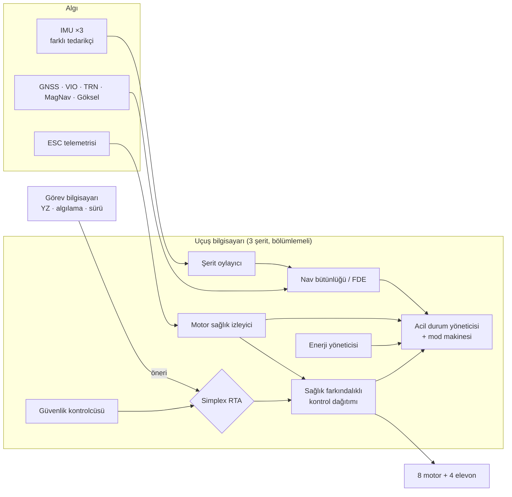

# SİMURG — Kutu Kanatlı, Hidrojen-Hibrit, Kuyruk Üstü Kalkışlı İHA Mimarisi

> **SİMURG**; Prandtl kutu kanadını, kuyruk üstü (tail-sitter) dikey
> kalkışı, 8 motorlu dağıtık elektrik itkiyi, hidrojen yakıt hücresi +
> batarya + süperkapasitör + güneş enerjisini, farklı mimarili üçlü uçuş
> bilgisayarını, GNSS'e muhtaç olmayan navigasyonu ve yapay zekâyı
> güvenli bir "kafes" içinde kullanan çalışma zamanı güvencesini tek bir
> 25 kg sınıfı **sivil** İHA'da birleştiren bir referans mimaridir.

Hedef görevler: arama-kurtarma, afet sonrası hasar tespiti, orman yangını
erken uyarı, altyapı denetimi, çevre izleme, afet bölgesinde haberleşme
rölesi.

## Klasik İHA'lardan 10 temel fark

| # | Klasik yaklaşım | SİMURG |
|---|---|---|
| 1 | Quadplane: seyirde ölü ağırlık olan ayrı dikey motorlar | **Tail-sitter:** aynı 8 motor hem askı hem seyir; ölü ağırlık yok |
| 2 | Tek kanat + kuyruk | **Kutu kanat:** ~%31 daha az indüklenmiş sürükleme, kuyruksuz, uç levhaları = iniş takımı |
| 3 | Seyirde tüm pervaneler sürükleme yapar | **İç 4 pervane katlanır**, dış 4'ü verimli noktada çalışır |
| 4 | Tek enerji kaynağı | **H₂ PEM + Li-ion + süperkap + güneş**, frekans ayrıştırmalı enerji yönetimi |
| 5 | Askıda motor arızası = düşüş | **Herhangi tek motor arızası askıda tolere** (T/W 1,61 → ≥ 1,20), sağlık farkındalıklı kontrol dağıtımı |
| 6 | Aynı 3 bilgisayar (ortak mod hatası) | **Farklı mimarili üçlü:** ARM + C, RISC-V + Rust, FPGA monitör |
| 7 | GNSS = gerçek | **GNSS + VIO + TRN + MagNav + göksel**, RAIM benzeri hata dışlama, koruma seviyesi |
| 8 | YZ ya hiç yok ya doğrudan kontrolde | **Simplex RTA:** YZ önerir, kanıtlanabilir çekirdek 3 s ileriyi denetler |
| 9 | Sabit görev yükü | **Sıcak değiştirilebilir, imzalı kendini tanıtan** görev bölmesi |
| 10 | Tek araç | **Zaman indirgemeli CBBA** ile sürü görev paylaşımı + kendini onaran mesh röle |

## Ana performans değerleri

| Parametre | Değer |
|---|---|
| MTOW | 24,9 kg (3 kg görev yükü dahil) |
| Kanat açıklığı / kanatlar arası | 3,20 m / 0,60 m |
| Seyir / stall / azami hız | 28 / 15,4 / 38 m/s |
| Seyir L/D | ≈ 18,5 |
| Seyir / askı bara gücü | ≈ 590 W / ≈ 3,8 kW |
| Dayanım (güneşsiz, yalnız H₂) | ≈ 3,3 sa + ≈ 24 dk batarya |
| Dayanım (gündüz, güneş katkılı) | ≈ 4 sa + ≈ 24 dk batarya |
| Askıda tek motor arızası sonrası T/W | 1,20 (dış motor) / 1,32 (iç motor) |

Bu değerler `simurg/` altındaki referans modellerden ve `tests/` altındaki
testlerden gelir; dokümanlarla kod tutarlıdır.

## Mimari genel görünüm



## Depo yapısı

```
docs/                      Ayrıntılı mimari dokümanları (14 bölüm)
simurg/                    Çalıştırılabilir referans ("altın") modeller
  config.py                Geometri, 8 motor + 4 elevon, hover etkinlik matrisi
  control/allocation.py    Arıza toleranslı kontrol dağıtımı (RPI)
  power/energy_manager.py  H2 PEM + Li-ion + süperkap + güneş enerji yönetimi
  safety/rta.py            Simplex çalışma zamanı güvencesi
  fdir/monitor.py          Motor sağlık izleme (CUSUM) + üçlü şerit oylama
  modes/flight_modes.py    Uçuş modu durum makinesi + acil durum yöneticisi
  nav/integrity.py         Çok kaynaklı konum füzyonu + RAIM benzeri FDE
  swarm/auction.py         Zaman indirgemeli CBBA görev dağıtımı
tests/                     Gereksinimlere izlenen birim testleri
examples/senaryo_demo.py   Üst üste arızalı uçtan uca görev senaryosu
```

## Çalıştırma

Gereksinim: Python ≥ 3.10, NumPy.

```bash
pip install numpy
python3 -m unittest discover -s tests -v   # 33 test
python3 examples/senaryo_demo.py
```

Örnek demo çıktısı:

```
== Uçuş ==
  mod: MISSION  hover marjı: 1.61
  t=  607s  FDIR: M2U DEGRADED, sağlık=0.94, hover marjı=1.59
  t=  900s  NAV: dışlanan=['GNSS'], PL=36.2 m, hata=0.2 m
  t= 1200s  RTA: güvenlik kontrolcüsü devrede, neden=['asiri_yatis']
  t= 1500s  FDIR: M2U FAILED, sağlık=0.00, hover marjı=1.32
  t= 1731s  ACİL DURUM: RETURN
```

## Dokümanlar

| # | Bölüm |
|---|---|
| 00 | [Konsept ve klasik İHA'lardan farklar](docs/00-konsept-ve-farklar.md) |
| 01 | [Sistem gereksinimleri (izlenebilir)](docs/01-gereksinimler.md) |
| 02 | [Hava aracı yapısı ve aerodinamik](docs/02-hava-araci-ve-aerodinamik.md) |
| 03 | [Güç ve itki sistemi](docs/03-guc-ve-itki.md) |
| 04 | [Aviyonik donanım](docs/04-aviyonik-donanim.md) |
| 05 | [Yazılım mimarisi](docs/05-yazilim-mimarisi.md) |
| 06 | [Uçuş kontrol](docs/06-ucus-kontrol.md) |
| 07 | [GNSS'ten bağımsız navigasyon](docs/07-navigasyon.md) |
| 08 | [Otonomi, RTA ve FDIR](docs/08-otonomi-ve-guvenlik.md) |
| 09 | [Sürü ve iş birliği](docs/09-suru-ve-isbirligi.md) |
| 10 | [Haberleşme ve siber güvenlik](docs/10-haberlesme-ve-siber-guvenlik.md) |
| 11 | [Yer segmenti ve dijital ikiz](docs/11-yer-segmenti-ve-dijital-ikiz.md) |
| 12 | [Doğrulama ve sertifikasyon](docs/12-dogrulama-ve-sertifikasyon.md) |
| 13 | [Riskler ve yol haritası](docs/13-riskler-ve-yol-haritasi.md) |

## Kapsam notu

Bu depo bir **mimari tasarım ve algoritma referansıdır**; uçuşa hazır
yazılım değildir. Sayısal değerler kavramsal tasarım düzeyindeki
hesaplardır ve rüzgâr tüneli, tezgâh ve uçuş testleriyle doğrulanmalıdır.
Platform sivil görevler için tasarlanmıştır.

## Lisans

Apache-2.0 — bkz. [LICENSE](LICENSE).
