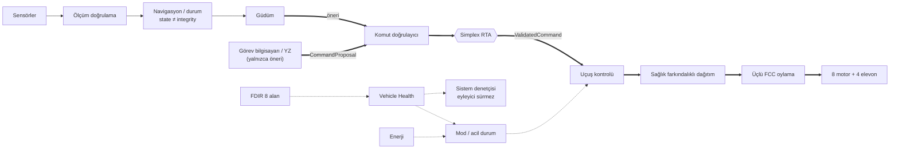
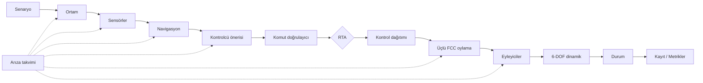

# SİMURG — Kutu Kanatlı, Hidrojen-Hibrit, Kuyruk Üstü Kalkışlı İHA Mimarisi

> **SİMURG**; Prandtl kutu kanadını, kuyruk üstü (tail-sitter) dikey
> kalkışı, 8 motorlu dağıtık elektrik itkiyi, hidrojen yakıt hücresi +
> batarya + süperkapasitör + güneş enerjisini, farklı mimarili üçlü uçuş
> bilgisayarını, GNSS'e muhtaç olmayan navigasyonu ve yapay zekâyı
> güvenli bir "kafes" içinde kullanan çalışma zamanı güvencesini tek bir
> 25 kg sınıfı **sivil** İHA kavramında birleştiren bir referans mimari ve
> **araştırma / dijital ikiz simülasyon platformudur**.

**Kapsam:** sivil araştırma, arama-kurtarma, afet gözlemi, çevre izleme,
altyapı denetimi, uçuş güvenliği araştırması, yazılım doğrulaması ve
arıza toleransı. Bu depo **uçuşa hazır yazılım değildir**: gerçek araç
için kontrol kazancı, motor/ESC kalibrasyonu, hidrojen sistemi kurulumu ya
da uçuş prosedürü içermez. Silahlandırma, hedef takibi, yük bırakma veya
zarar verici kullanım amacı yoktur.

## Uygulama durumu

| Bileşen | Durum | Kod |
|---|---|---|
| 6-DOF simülasyon çekirdeği (sabit 14 adımlı tick, deterministik) | **var** | `simurg/sim/engine.py` |
| Aerodinamik arayüz: analitik (±180°) ve tablo tabanlı | **var** (sentetik katsayılar) | `simurg/aero/` |
| Rejime bağlı kontrol etkinliği B(V, σ) + arıza toleranslı dağıtım | **var** | `simurg/control/effectiveness.py`, `allocation.py` |
| Tail-sitter geçiş koordinatörü (iptal mantığı dahil) | **var** | `simurg/control/transition.py` |
| Eyleyici, sensör, ortam modelleri | **var** | `simurg/sim/actuators.py`, `sensors.py`, `environment.py` |
| Sensör ölçüm hattı (driver → timestamp → validation → plausibility → health → measurement bus; meta verili ölçüm) | **var** (navigasyon henüz ham ölçüm tüketir) | `simurg/sensing/` |
| Zaman tabanlı arıza enjeksiyonu | **var** | `simurg/sim/faults.py` |
| Simplex RTA (açıklanabilir kararlar, mühürlü `ValidatedCommand`) | **var** | `simurg/safety/rta.py` |
| Aşamalı komut doğrulayıcı (şema → tazelik → mod uyumu → sınır → yetki; invalid/stale/incompatible/unknown red) | **var** | `simurg/safety/command_validator.py` |
| YZ yetki sınırı ve güvenlik değişmezleri (kodla zorlanır, test edilir) | **var** | `docs/08` §6, `tests/test_safety_invariants.py` |
| Fail-safe: bilinmeyen ≠ sağlıklı | **var** | `docs/08` §6.1, `tests/test_failsafe.py` |
| FDIR: 8 alan, standart rapor (tespit/yalıtım/sınıf/güven/sağlık/önerilen bozulma) | **var** | `simurg/fdir/reports.py`, `monitor.py` |
| Vehicle Health Manager (NOMINAL/DEGRADED/CONTINGENCY/CRITICAL/UNKNOWN + reasons) | **var** (termal ve IMU yedekliliği modellenmez) | `simurg/fdir/vehicle_health.py` |
| Üçlü FCC şerit yönetimi (karşılaştırıcı, oylayıcı, bekçi, yalıtım; NOMINAL/DEGRADED/ISOLATED/FAILED/UNKNOWN) | **kısmi** (şeritler aynı hesabın kopyası; farklı mimarili uygulama planlanan) | `simurg/fdir/lanes.py`, `simurg/sim/triplex.py` |
| Uçuş öncesi denetçi (11 kontrol: FCC şerit, RTA öz-testi, kayıt cihazı dahil; kritik hata varken ARMED yok) | **var** | `simurg/sim/preflight.py` |
| Sistem denetçisi (NORMAL/DEGRADED/CONTINGENCY/EMERGENCY; eyleyici sürmez) | **var** | `simurg/sim/supervisor.py` |
| Çok kaynaklı navigasyon bütünlüğü → `NavigationSolution` | **var** | `simurg/nav/` |
| Hibrit enerji yönetimi → `EnergyState` | **var** | `simurg/power/energy_manager.py` |
| Mod makinesi + tek kaynak acil durum kural tablosu | **var** | `simurg/modes/flight_modes.py` |
| Olay yolu, JSON kayıt (mantıksal kayıt kanalları), tekrar oynatma + `why_*` açıklamaları, metrikler | **var** | `simurg/core/events.py`, `simurg/sim/` |
| Monte Carlo altyapısı (tohumla yeniden üretim) | **var** (sıralı) | `simurg/sim/montecarlo.py` |
| Sürü görev dağıtımı (CBBA referansı) | **prototip** (simülasyona bağlı değil) | `simurg/swarm/auction.py` |
| INDI iç döngü, tutum kestiricisi, blown-wing aero | **planlanan** | — |
| IMU A/B/C + tutum kestiricisi, mesaj doğrulama/failover, TSN ağı, kriptografi, GCS arayüzü | **planlanan** (yalnızca mimari doküman) | `docs/04`, `docs/10`, `docs/11`, `docs/mimari/` |
| Mimari kayıt + mimari-kod denetimi (236 blok, üretilmiş diyagram/matris/arıza zinciri, yetki yolu ve SPOF denetimi) | **var** | `simurg/architecture/`, `docs/15`, `docs/mimari/` |

## Ayrıntılı sistem mimarisi

SİMURG mimarisi "system-of-systems" düzeyinde **26 alt sistem, 236 blok ve
346 bağlantı** olarak makine-okunur bir kayıtta tanımlıdır
(`simurg/architecture/registry.py`). Her blokta sorumluluk, girdi/çıktı,
sağlık durumu, **arıza davranışı**, kod konumu ve dürüst uygulama durumu
vardır: **166 IMPLEMENTED, 33 PARTIAL, 1 UNVALIDATED, 36 PLANNED**.

* [docs/15 — Master System Architecture](docs/15-sistem-mimarisi.md):
  95 bloklu ana diyagram, durum özeti, arıza akışı, güvenlik değişmezleri,
  mimari-kod denetimi ve SPOF analizi.
* [docs/mimari/](docs/mimari/): Sensor + Navigation, GNC + RTA, Triplex FCC,
  FDIR + Vehicle Health, Power, Actuator / Allocation, Communication,
  Failure / Contingency (10 arıza zinciri), Time / Bus / Recorder,
  Digital Twin, Mission Computer.



Diyagramlar ve tablolar elle çizilmez
(`python -m simurg.architecture --update-all`). `tests/test_architecture.py`
şunları doğrular: kod referansları gerçek, kritik kod sınıfları kayıtta,
öneri katmanından eyleyicilere RTA'yı atlayan yol yok, her SPOF adayı
belgelenmiş, her arıza zincirinin olayları kendi senaryosunda gözleniyor,
belgeler kayıtla senkron.

## Simulation & Digital Twin



```python
from simurg.sim import SimulationEngine, get_scenario, ReplaySession

result = SimulationEngine(get_scenario("transition_abort", seed=3)).run()
print(result.passed, result.metrics.final_mode, result.metrics.transitions_aborted)
ReplaySession.from_source(result).rta_history()
```

Komut satırı:

```bash
python -m simurg.sim list                                   # hazır senaryolar
python -m simurg.sim run nominal --seed 1 --json kayit.json # tek koşu + JSON kayıt
python -m simurg.sim replay kayit.json                      # zaman çizelgesi
python -m simurg.sim montecarlo combined_degraded --runs 20 --seed 0 --wind 6
python -m simurg.sim montecarlo combined_degraded --wind 6 --reproduce <TOHUM>
```

Hazır senaryolar: `nominal`, `nav_source_loss`, `nav_integrity_loss`,
`single_actuator_degradation`, `communication_loss`,
`energy_reserve_warning`, `rta_intervention`, `transition_abort`,
`combined_degraded`, `hover_capability_loss`, `loss_of_control`,
`fcc_lane_divergence`, `fcc_lane_loss`, `mission_computer_failure`. Her biri beklenen güvenlik sonuçlarını tanımlar ve
testlerde doğrulanır.

### YZ yetki sınırı

```
YZ / gelişmiş kontrolcü --CommandProposal--> CommandValidator --> RuntimeAssurance
    --ValidatedCommand--> VehicleController (kontrol soyutlaması) --> kontrol dağıtımı
    --> üçlü FCC oylama --> eyleyiciler
```

Kontrol katmanı ham öneri kabul etmez; `ValidatedCommand` yalnızca RTA
tarafından üretilebilir. `CommandValidator` şema hatalı, bayat, mod ile
uyumsuz, fiziksel sınır dışı ya da bilinmeyen kaynaklı öneriyi **kırpmadan
reddeder**; bu durumda RTA
güvenlik kontrolcüsünü seçer (`gecersiz_oneri`). YZ katmanının eyleyicilere içe aktarma yolu
yoktur. Bunlar testlerle zorlanan değişmezlerdir (docs/08 §6).

### Kanonik API

| Kavram | Kanonik yer | Geriye dönük uyumluluk |
|---|---|---|
| Merkezi durum | `simurg.core.types.VehicleState` | — |
| RTA durum görünümü | `simurg.safety.rta.EnvelopeState` | `simurg.safety.rta.VehicleState` (takma ad) |
| RTA kararı | `RuntimeAssurance.decide()` -> `SafetyDecision` | `RuntimeAssurance.select()` |
| Mod geçişi | `FlightModeMachine.request_detailed()` | `FlightModeMachine.request()` |
| Acil durum kararı | `ContingencyManager.evaluate_detailed()` | `ContingencyManager.evaluate()` |
| Kontrol etkinliği | `simurg.control.effectiveness` | `simurg.config.hover_effectiveness()` |

Ayrıntılar (tick sırası, durum modeli, kayıt şeması, determinizm,
sınırlamalar, simülasyon bulguları):
[docs/14-simulasyon-ve-dijital-ikiz.md](docs/14-simulasyon-ve-dijital-ikiz.md).

## Klasik İHA'lardan 10 temel fark (mimari)

| # | Klasik yaklaşım | SİMURG |
|---|---|---|
| 1 | Quadplane: seyirde ölü ağırlık olan ayrı dikey motorlar | **Tail-sitter:** aynı 8 motor hem askı hem seyir |
| 2 | Tek kanat + kuyruk | **Kutu kanat:** daha az indüklenmiş sürükleme (el hesabı ~%31), kuyruksuz, uç levhaları = iniş takımı |
| 3 | Seyirde tüm pervaneler sürükleme yapar | **İç 4 pervane katlanır**, dış 4'ü çalışır |
| 4 | Tek enerji kaynağı | **H₂ PEM + Li-ion + süperkap + güneş**, frekans ayrıştırmalı yönetim |
| 5 | Askıda motor arızası = düşüş | **Herhangi tek motor arızası askıda tolere** (testle doğrulanır) |
| 6 | Aynı 3 bilgisayar (ortak mod hatası) | **Farklı mimarili üçlü:** ARM + C, RISC-V + Rust, FPGA monitör (planlanan) |
| 7 | GNSS = gerçek | **Çok kaynaklı navigasyon**, hata dışlama, koruma seviyesi |
| 8 | YZ ya hiç yok ya doğrudan kontrolde | **Simplex RTA:** gelişmiş kontrolcü önerir, güvenlik çekirdeği denetler |
| 9 | Sabit görev yükü | **Sıcak değiştirilebilir, imzalı kendini tanıtan** görev bölmesi (planlanan) |
| 10 | Tek araç | **CBBA** ile sürü görev paylaşımı (prototip) |

## Sayısal değerler: nereden geliyor?

| Parametre | Değer | Kaynak |
|---|---|---|
| MTOW | 24,9 kg | Tasarım bütçesi (`docs/02`) |
| Askıda T/W (nominal / tek motor arızası) | 1,61 / ≥ 1,20 | **Testle doğrulanır** (`test_allocation`) |
| Seyir L/D, stall hızı | ≈ 18,5 / 15,4 m/s | Tasarım hedefi; sentetik aero modelinde stall ≈ 18 m/s (**açık**, `docs/01` SYS-PER-003) |
| Askı bara gücü | El hesabı ≈ 3,8 kW; 6-DOF simülasyonu ≈ 4,3 kW | Simülasyon ölçümü (`docs/14` §11) |
| Geçiş tepe bara gücü | ≈ 9 kW | Simülasyon ölçümü (sentetik model) |
| Dayanım (yalnız H₂, güneşsiz) | > 3,2 sa hedefi | Yalnızca enerji modeliyle (`test_energy`); uçuşla doğrulanmadı |

Fiziksel katsayıların tümü sentetiktir; CFD, rüzgâr tüneli, tezgâh ya da
uçuş testiyle doğrulanmamıştır.

## Depo yapısı

```
docs/                       Mimari dokümanları (00–15) + docs/mimari/ (alt sistem mimarileri)
simurg/
  config.py                 v0.1 sabitleri ve askı geometrisi (geriye dönük uyumlu)
  core/                     Ortak tipler, olay yolu, hatalar, yapılandırma, eksen takımları
  aero/                     Aerodinamik model arayüzü, analitik + tablo modelleri
  control/                  Kontrol dağıtımı, etkinlik B(V,σ), geçiş, iç döngü, güdüm
  power/                    Hibrit enerji yönetimi
  safety/                   Simplex RTA, aşamalı komut doğrulayıcı
  sensing/                  Sensör ölçüm hattı (meta verili ölçüm, kanal sağlığı)
  fdir/                     Motor/yüzey izleme, üçlü şerit oylayıcı, 8 alan FDIR raporu, Vehicle Health Manager
  modes/                    Uçuş modu durum makinesi, acil durum kuralları
  nav/                      Bütünlük izleme, navigasyon sağlayıcıları
  swarm/                    Sürü görev dağıtımı (prototip)
  sim/                      6-DOF motor, senaryolar, arıza, kayıt, replay, Monte Carlo, CLI,
                            uçuş öncesi denetçi, sistem denetçisi
  architecture/             Mimari bileşen kaydı + Mermaid/matris üretici (docs/15)
tests/                      Gereksinimlere izlenen testler (+ izlenebilirlik denetimi)
examples/                   simulation_demo, fault_injection_demo, replay_demo, senaryo_demo (v0.1)
```

## Çalıştırma

Gereksinim: Python ≥ 3.10, NumPy. Başka çalışma zamanı bağımlılığı yoktur
(SciPy, Pandas, ROS vb. bilinçli olarak kullanılmaz). Tamamen çevrimdışı
çalışır; dış servis, ağ erişimi ya da gizli bilgi gerektirmez.

```bash
pip install -e .                              # ya da yalnızca: pip install numpy
python3 -m unittest discover -s tests -v     # ~245 test, ~5 dk (senaryo koşuları dahil)
simurg-sim list                               # = python -m simurg.sim list
python3 examples/simulation_demo.py nominal
python3 examples/fault_injection_demo.py
python3 examples/replay_demo.py
```

CI (`.github/workflows/tests.yml`): Python 3.10 / 3.11 / 3.12 üzerinde
kurulum, tüm testler ve örnek/CLI duman testi. Dağıtım, donanım ya da
gizli bilgi içermez.

Kütüphane varsayılan olarak terminale yazmaz (`logging` + `NullHandler`);
ayrıntılı çıktı için `python -m simurg.sim -v run ...`.

## Gereksinim izlenebilirliği

[docs/01-gereksinimler.md](docs/01-gereksinimler.md) her gereksinimi
test(ler)e, `SYS-SIM-*` gereksinimlerini ayrıca uygulama dosyasına bağlar.
`tests/test_traceability.py` bu bağlantıların gerçekten var olduğunu
otomatik denetler.

## Dokümanlar

| # | Bölüm |
|---|---|
| 00 | [Konsept ve klasik İHA'lardan farklar](docs/00-konsept-ve-farklar.md) |
| 01 | [Sistem gereksinimleri (izlenebilir)](docs/01-gereksinimler.md) |
| 02 | [Hava aracı yapısı ve aerodinamik](docs/02-hava-araci-ve-aerodinamik.md) |
| 03 | [Güç ve itki sistemi](docs/03-guc-ve-itki.md) |
| 04 | [Aviyonik donanım](docs/04-aviyonik-donanim.md) |
| 05 | [Yazılım mimarisi](docs/05-yazilim-mimarisi.md) |
| 06 | [Uçuş kontrol](docs/06-ucus-kontrol.md) |
| 07 | [GNSS'ten bağımsız navigasyon](docs/07-navigasyon.md) |
| 08 | [Otonomi, RTA ve FDIR](docs/08-otonomi-ve-guvenlik.md) |
| 09 | [Sürü ve iş birliği](docs/09-suru-ve-isbirligi.md) |
| 10 | [Haberleşme ve siber güvenlik](docs/10-haberlesme-ve-siber-guvenlik.md) |
| 11 | [Yer segmenti ve dijital ikiz](docs/11-yer-segmenti-ve-dijital-ikiz.md) |
| 12 | [Doğrulama ve sertifikasyon](docs/12-dogrulama-ve-sertifikasyon.md) |
| 13 | [Riskler ve yol haritası](docs/13-riskler-ve-yol-haritasi.md) |
| 14 | [Simülasyon ve dijital ikiz çekirdeği](docs/14-simulasyon-ve-dijital-ikiz.md) |
| 15 | [Ayrıntılı sistem mimarisi (Detailed System Architecture)](docs/15-sistem-mimarisi.md) |

## Lisans

Apache-2.0 — bkz. [LICENSE](LICENSE).
