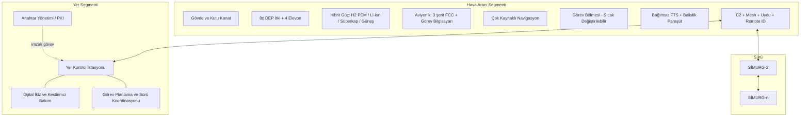

# 00 — Konsept ve Klasik İHA'lardan Farkları

## 1. Tek cümlede SİMURG

**SİMURG**; kutu kanatlı (Prandtl "en iyi kanat sistemi"), kuyruk üstü kalkan
(tail-sitter), 8 motorlu dağıtık elektrik itkili, hidrojen yakıt hücresi +
batarya + süperkapasitör + güneş hibrit enerjili, GNSS'e muhtaç olmayan,
yapay zekâyı "çalışma zamanı güvencesi" kafesi içinde kullanan, sürü halinde
iş birliği yapabilen **25 kg sınıfı sivil** bir insansız hava aracı
mimarisidir.

Hedef görevler: arama-kurtarma, afet sonrası hasar tespiti, orman yangını
erken uyarı, boru hattı / enerji hattı denetimi, deniz kirliliği izleme ve
afet bölgesinde geçici haberleşme rölesi.

## 2. Klasik mimarilerle karşılaştırma

| Başlık | Klasik çok rotorlu | Klasik VTOL "quadplane" | Klasik sabit kanat | **SİMURG** |
|---|---|---|---|---|
| Kalkış/iniş | Dikey | Dikey | Pist / katapult / ağ | **Dikey (tüm gövde döner)** |
| Seyirde ölü ağırlık | — | 4 dikey motor + kollar (~%15–20 MTOW) | Yok | **Yok** — aynı motorlar hem askı hem seyir |
| Kanat | Yok | Tek kanat + kuyruk | Tek kanat + kuyruk | **Kutu kanat**: ~%31 daha az indüklenmiş sürükleme, kuyruksuz |
| Enerji | Li-Po | Li-Po veya benzin | Benzin / Li-Po | **H₂ PEM + Li-ion + süperkap + güneş**, frekans ayrıştırmalı yönetim |
| Dayanım | 20–40 dk | 1–3 sa | 2–10 sa | **Hedef:** ~3,3 sa (H₂) + ~0,4 sa batarya; gündüz güneşle ~4 sa+ (yalnız enerji modeliyle hesaplandı) |
| Motor arızası | Okto hariç genelde düşüş | Seyirde tolere, askıda kritik | Tek motor → süzülme | **Askıda herhangi tek motor arızası tolere** (hover marjı ≥ 1,2) |
| Uçuş bilgisayarı | Tek | Tek / çift (aynı) | Tek / çift | **Üçlü, farklı mimarili (dissimilar)**: ARM+C, RISC-V+Rust, FPGA monitör |
| Navigasyon | GNSS + IMU | GNSS + IMU | GNSS + IMU | **GNSS + VIO + TRN + MagNav + göksel**; RAIM benzeri hata dışlama |
| Yapay zekâ | Yok / doğrudan kontrol | Yok | Yok | **Simplex RTA**: YZ öner, doğrulanmış çekirdek denetle |
| Görev yükü | Sabit montaj | Sabit | Sabit | **Sıcak değiştirilebilir, kendini tanıtan görev bölmesi** |
| Sürü | Yok / gösteri | Yok | Yok | **CBBA tabanlı görev paylaşımı, ağ rölesi, uzlaşı** |
| Son çare | Yok | Bazen paraşüt | Paraşüt | **Bağımsız FTS + balistik paraşüt**, ayrı güç ve işlemci |

## 3. Neden bu kombinasyon? (Tasarım gerekçeleri)

### 3.1 Kuyruk üstü + kutu kanat
Quadplane'de dikey motorlar seyirde hem kütle hem sürükleme cezasıdır.
Tail-sitter bu cezayı ortadan kaldırır ama klasik tail-sitter'ların iki
zayıflığı vardır: (a) askıda rüzgâra çok duyarlı büyük kanat alanı,
(b) zayıf sapma (yaw) otoritesi. Kutu kanat burada iki işe yarar:

1. **Geometrik:** İki kanat arasındaki 0,6 m açıklık, askıda motorları
   iki sıra halinde dizerek klasik bir "okto" gibi pitch momenti kolu sağlar.
   Tek kanatlı tail-sitter'da pitch kontrolü yalnızca elevonlarla yapılır.
2. **Yapısal:** Uç levhaları (tip fins) iki kanadı birbirine bağlar; bu
   kapalı çerçeve burulma rijitliğini artırır, kanatlar daha ince ve yüksek
   açıklık oranlı yapılabilir. Uç levhaları aynı zamanda iniş takımıdır.

Sapma otoritesi için elevonlar pervane akımı içine konumlandırılır; askıda
diferansiyel elevon sapması, motor tork farkından ~6 kat daha fazla yaw
momenti üretir (bkz. `simurg/config.py`, [06-ucus-kontrol.md](06-ucus-kontrol.md)).

### 3.2 Dağıtık elektrik itki, katlanır iç pervaneler
Askıda 8 motor gerekir; seyirde 4'ü yeter. İç dört motorun pervaneleri
katlanır (folding) ve durdurulur; bu, seyir sürüklemesini düşürür ve dış
motorları verimli çalışma noktalarına iter. Kanat açıklığı boyunca dağıtılan
itki, kanat üzerindeki akımı hızlandırarak geçiş (transition) sırasında
stall'ı geciktirir ("blown wing" etkisi).

### 3.3 Üç kaynaklı enerji
Hidrojen özgül enerjide Li-ion'un ~3–4 katıdır (sistem seviyesinde), ancak
PEM yakıt hücresi yavaş tepki verir ve hızlı yük değişimiyle yıpranır.
Askıda 3,8 kW tepe güç, seyirde ~0,6 kW gerekir. Çözüm: yakıt hücresi
sadece "ortalama"yı, batarya "orta frekansı", süperkapasitör "anlık tepeyi"
karşılar. Bu, PEM'i küçük (800 W) ve uzun ömürlü tutar.

### 3.4 Farklı mimarili üçlü artıklık
Aynı yazılımın üç kopyası aynı hatayı aynı anda yapar (ortak mod hatası).
SİMURG'da şeritler farklı işlemci mimarisi, farklı RTOS ve farklı programlama
dilleriyle, farklı ekiplerce aynı gereksinimden geliştirilir.

### 3.5 Yapay zekâ ama kafeste
Algılama, görev planlama ve rüzgâra uyarlanan kontrol için öğrenen
algoritmalar değerlidir ama sertifikalandırılamaz. Simplex mimarisinde
YZ'nin her komutu, küçük ve biçimsel doğrulanabilir bir güvenlik çekirdeği
tarafından "3 saniye sonra güvenli kurtarılabilir küme içinde miyiz?"
sorusuyla süzülür (bkz. `simurg/safety/rta.py`).

### 3.6 GNSS'e koşulsuz güvenmemek
Karıştırma (jamming) ve sahtecilik (spoofing) sivil İHA'lar için de gerçek
bir risktir (havalimanı çevreleri, sınır bölgeleri, afet sonrası bozuk
altyapı). SİMURG GNSS'i "bir kaynak" olarak görür; hiçbir kaynağa koşulsuz
güvenilmez (bkz. [07-navigasyon.md](07-navigasyon.md)).

## 4. Üst seviye sistem ayrıştırması

## 5. Doküman haritası

| # | Doküman | İçerik |
|---|---|---|
| 01 | [Gereksinimler](01-gereksinimler.md) | İzlenebilir sistem gereksinimleri |
| 02 | [Hava aracı ve aerodinamik](02-hava-araci-ve-aerodinamik.md) | Geometri, kütle bütçesi, performans |
| 03 | [Güç ve itki](03-guc-ve-itki.md) | Hibrit güç, motorlar, enerji yönetimi |
| 04 | [Aviyonik donanım](04-aviyonik-donanim.md) | FCC şeritleri, ağ, sensörler |
| 05 | [Yazılım mimarisi](05-yazilim-mimarisi.md) | Bölümleme, katmanlar, ara katman |
| 06 | [Uçuş kontrol](06-ucus-kontrol.md) | Kontrol yasaları, dağıtım, geçiş |
| 07 | [Navigasyon](07-navigasyon.md) | GNSS'ten bağımsız füzyon, bütünlük |
| 08 | [Otonomi ve güvenlik](08-otonomi-ve-guvenlik.md) | RTA, acil durum, FDIR |
| 09 | [Sürü ve iş birliği](09-suru-ve-isbirligi.md) | Görev dağıtımı, röle, uzlaşı |
| 10 | [Haberleşme ve siber güvenlik](10-haberlesme-ve-siber-guvenlik.md) | Linkler, kriptografi, sıfır güven |
| 11 | [Yer segmenti ve dijital ikiz](11-yer-segmenti-ve-dijital-ikiz.md) | GCS, ikiz, bakım |
| 12 | [Doğrulama ve sertifikasyon](12-dogrulama-ve-sertifikasyon.md) | Test piramidi, SORA, DO-178C |
| 13 | [Riskler ve yol haritası](13-riskler-ve-yol-haritasi.md) | Teknik riskler, fazlar |
| 14 | [Simülasyon ve dijital ikiz](14-simulasyon-ve-dijital-ikiz.md) | 6-DOF çekirdek, senaryolar, arıza enjeksiyonu, kayıt, Monte Carlo |
| 15 | [Ayrıntılı sistem mimarisi](15-sistem-mimarisi.md) | Master system architecture: 26 alt sistem / 236 blok, IMPLEMENTED·PARTIAL·UNVALIDATED·PLANNED, arıza akışı, mimari-kod denetimi |
| 15.x | [Alt sistem mimarileri](mimari/) | Sensor+Nav, GNC+RTA, Triplex FCC, FDIR+Health, Power, Allocation, Comm, Failure/Contingency, Time/Bus/Recorder, Digital Twin, Mission Computer |
