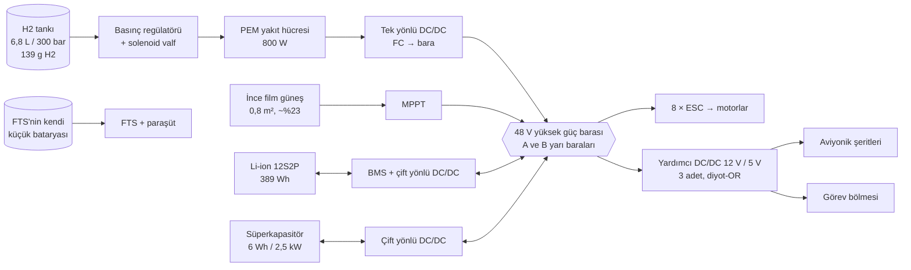

# 03 — Güç ve İtki Sistemi

Referans model: [`simurg/power/energy_manager.py`](../simurg/power/energy_manager.py)

## 1. Güç mimarisi



### 1.1 Bölünmüş bara (split bus)
48 V bara, bir bağlayıcı kontaktör ile **A** ve **B** yarı baralarına
ayrılabilir. Motorlar çapraz dağıtılmıştır: A barası M1U, M3U, M2L, M4L;
B barası M2U, M4U, M1L, M3L. Bir yarı barada kısa devre olursa kontaktör
açılır ve araç, köşegen 4 motorla hover'ı sürdüremese bile seyirde uçmaya
devam eder, VTOL yerine **paraşütle iniş** veya **göbek üstü (belly)
kaymayla acil iniş** yapar. Bu karar ContingencyManager'a
`hover_feasible=False` olarak yansır.

### 1.2 Aviyonik gücü
Her FCC şeridi üç bağımsız kaynaktan diyot-OR ile beslenir: A barası,
B barası ve şeride ait küçük bir tampon süperkap (≥ 10 s ride-through).
FTS ve paraşüt **tamamen bağımsız** kendi LiFePO₄ hücreleriyle çalışır.

## 2. Kaynaklar

| Kaynak | Değer | Görev |
|---|---|---|
| PEM yakıt hücresi | 800 W sürekli, hava soğutmalı, ~1,3 kg (BoP dahil) | Ortalama yük + batarya şarjı |
| H₂ depolama | 6,8 L Tip-IV kompozit, 300 bar, 139 g H₂ = 4,63 kWh kimyasal | Ana enerji |
| Li-ion batarya | 12S2P 21700 (yüksek güç), 44,4 V, 389 Wh, 6 kW tepe deşarj (ilk taslakta 3,6 kW; bkz. not) | Askı/geçiş tepe yükü, orta frekans, son rezerv |
| Süperkapasitör | 6 Wh, 2,5 kW | Rüzgâr hamlesi, motor arızası sonrası itki sıçraması |
| Güneş | ~0,8 m² ince film (kanat üst yüzeyleri), gündüz ort. ~70–90 W | Aviyonik yükünün büyük kısmı |

PEM verimi yükle değişir (modelde %55 → %40 doğrusal). Bu yüzden yakıt
hücresinin düşük-orta yükte, yavaş değişen bir güç seviyesinde çalışması
hem verim hem membran ömrü açısından en iyisidir.

## 3. Enerji yönetim stratejisi (frekans ayrıştırma)

```
              ┌──────── alçak geçiren (τ = 20 s) ───────┐
 talep ──┬──► │  + K·(SoC_hedef − SoC)  → eğim ≤ 60 W/s │──► Yakıt hücresi
         │    └─────────────────────────────────────────┘
         │               kalan = talep − güneş − FC
         ├──────────────► eğim ≤ 4 kW/s, sınırlı ─────────► Batarya
         └──────────────► kalan − batarya ────────────────► Süperkapasitör
                          (sakinken bataryadan 150 W ile geri dolar)
```

Kurallar:
1. Güneş her zaman önce kullanılır.
2. Yakıt hücresi hiçbir zaman hızlı talebi izlemez (≤ 60 W/s).
3. SoC düzeltme terimi bataryayı %80'de tutar; bu, beklenmedik
   askı/geri dönüş için her an ~230 Wh hazır enerji demektir.
4. %20'nin altındaki batarya kapasitesi **rezervdir**; yalnızca
   `emergency=True` iken (acil iniş, paraşüt öncesi) kullanılır.
5. Her şey doyduysa (`unmet_w > 0`) bu bir **brownout** öncüsüdür ve
   FDIR'e alarm olarak gider; yük atma (load shedding) sırası:
   görev yükü → mesh radyo → güneş MPPT ısıtıcıları → … (uçuş-kritik asla).

### 3.1 Simülasyon sonuçları (referans model)

| Senaryo | Sonuç |
|---|---|
| 45 s askı (3,8 kW) + 15 s geçiş + seyir (590 W), güneşsiz | H₂ ~3,35 sa'te biter, batarya SoC hâlâ ~%80 |
| Aynısı + 80 W güneş (ilk 4 sa) | H₂ ~4,0 sa'te biter |
| H₂ bittikten sonra batarya (%80 → %20) | +~24 dk seyir |
| 900 W'lık 2 s rüzgâr hamlesi | İlk çevrim süperkap, sonra batarya; FC etkilenmez |

Bu sonuçlar `tests/test_energy.py` ile sürekli doğrulanır.

### 3.2 Eve dönüş fizibilitesi
Her saniye:

```
E_gerekli = (P_seyir · d / V_yer + E_iniş) · 1,3
E_kullanılabilir = (SoC − 0,20)·C_bat·η_bat + E_H2·η_FC(%70 yük)
dönebilir = E_kullanılabilir ≥ E_gerekli
```

`V_yer` rüzgâr kestirimiyle güncellenir (karşı rüzgârda düşer). Bu
bayrak düştüğü an ContingencyManager uygun aksiyonu seçer.

> **Simülasyon notu (v0.2):** 6-DOF dijital ikiz ([14](14-simulasyon-ve-dijital-ikiz.md)
> §11) kararlı askıda ~4,3 kW, ileri geçişte ~9 kW tepe bara yükü ölçtü.
> 3,6 kW batarya sınırı yakıt hücresi olmadan geçişi karşılayamadığı için
> referans modelde batarya tepe deşarjı 6 kW'a çıkarıldı (sentetik değer;
> hücre seçimi tezgâh testi gerektirir).

## 4. İtki

| Bileşen | Seçim |
|---|---|
| Motor | 8 × dış rotorlu BLDC, ~600 W sürekli, KV ≈ 380 (48 V) |
| ESC | FOC, CAN-FD (DroneCAN) + yedek PWM, faz akımı + devir + sıcaklık telemetrisi 400 Hz |
| Pervane (dış) | 16×7", sabit, karbon |
| Pervane (iç) | 16×7", **katlanır**; motor durduğunda hava akımıyla geriye katlanır |
| İç motor kilidi | Pervanenin akım hizasında durması için ESC "konum tutma" modu |

### 4.1 Motor telemetrisinin kullanımı
ESC'den gelen komut ve ölçülen devir, `MotorHealthMonitor` (bkz.
[08](08-otonomi-ve-guvenlik.md)) tarafından sürekli karşılaştırılır.
Sonuç, kontrol dağıtıcısına **sağlık vektörü** olarak girer. Böylece kırık
bir pervane ucu (~%8 devir kaybı → ~%15 itki kaybı) dağıtıcı tarafından
otomatik telafi edilir; operatör yalnızca bilgilendirilir.

## 5. Hidrojen güvenliği

- Tank: Tip-IV, ısıl basınç tahliye cihazı (TPRD); gövdede yukarı açılan
  tahliye kanalı.
- Bölmede 2 adet H₂ sensörü; %1 (LEL'in %25'i) konsantrasyonda
  solenoid kapanır, FC durur, araç batarya ile eve döner.
- Hidrojen sisteminin fiziksel kurulumu, basınçlandırılması ve dolumu
  bu deponun **kapsamı dışındadır**; ilgili standart ve yetkili kuruluş
  prosedürlerine tabidir. Depo yalnızca enerji davranışının simülasyon
  modelini içerir.
- Paraşüt açılımı veya kaza algısında (≥ 8 g) solenoid otomatik kapanır.
