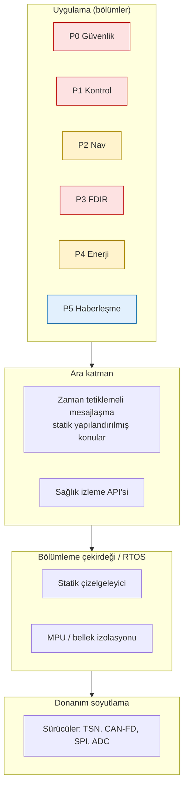
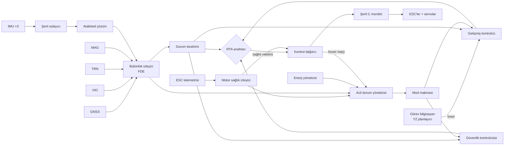

# 05 — Yazılım Mimarisi

## 1. Karışık kritiklik (mixed-criticality) ve bölümleme

FCC şeritleri ARINC 653 benzeri **zaman ve alan bölümlemesi** kullanır:
her bölümün kendi bellek alanı ve sabit zaman dilimi vardır; bir bölümün
çökmesi veya sonsuz döngüye girmesi diğerlerini etkilemez.

| Bölüm | Kritiklik (DO-178C DAL) | Periyot | İçerik |
|---|---|---|---|
| P0 — Güvenlik çekirdeği | B | 4 ms | RTA anahtarı, zarf denetimi, mod makinesi, acil durum yöneticisi |
| P1 — Uçuş kontrol | B | 4 ms | İç döngüler, kontrol dağıtımı, geçiş planlayıcısı |
| P2 — Navigasyon | C | 4 / 20 ms | Ataletsel çözüm, füzyon, bütünlük izleme |
| P3 — FDIR | B | 4 ms | Motor sağlığı, şerit oylama, sensör tutarlılık |
| P4 — Enerji | C | 100 ms | Güç dağıtımı, eve dönüş fizibilitesi |
| P5 — Haberleşme | D | 20 ms | C2 protokolü, Remote ID, kayıt |
| (Görev bilgisayarı) | E | — | YZ, algılama, planlama — FCC dışında |

```
  4 ms ana çerçeve (Şerit A)
  ├─P3 FDIR─┤├──P2 NAV──┤├─────P1 KONTROL─────┤├─P0 GÜV─┤├P5┤├─ boşluk ─┤
  0        400        1000                  2200     2800  3100        4000 µs
  P4 her 25 çerçevede bir, boşluk diliminde çalışır.
```

## 2. Katmanlar



### 2.1 Ara katman kuralları
- **Statik yapılandırma:** Uçuş-kritik bölümler arasındaki tüm konular,
  boyutları ve periyotları derleme zamanında sabittir. Çalışma zamanında
  dinamik keşif, dinamik bellek tahsisi yoktur.
- **Tek yazar ilkesi:** Her konu tek bir bölüm tarafından yazılır.
- **Tazelik etiketi:** Her mesaj üretim zaman damgası ve sıra numarası
  taşır; tüketici bayat (stale) veriyi reddeder.
- **Görev bilgisayarı köprüsü:** Görev bilgisayarı ile FCC arasında,
  yalnızca beyaz listedeki mesaj tiplerine izin veren, değer aralığı
  denetleyen bir **veri diyotu / ağ geçidi** vardır.

## 3. Veri akışı



## 4. Referans model ↔ uçuş yazılımı eşlemesi

Bu depodaki Python paketi bir **altın modeldir** (golden model). Uçuş
yazılımının (C ve Rust) her sürümü, aynı test vektörleriyle altın modelle
**sonuç-sonuç karşılaştırılır** (back-to-back test). Böylece:

1. Algoritma hataları Python'da hızlıca yakalanır.
2. Şerit A ve B'nin uygulamaları, birbirinden bağımsız olarak, aynı
   referansa göre doğrulanır.
3. Dijital ikiz aynı modeli kullanır.

| Python modülü | Uçuş bölümü | Şerit A dosyası (plan) | Şerit B crate (plan) |
|---|---|---|---|
| `control/allocation.py` | P1 | `ctl_alloc.c` | `simurg-alloc` |
| `safety/rta.py` | P0 | `saf_rta.c` | `simurg-rta` |
| `modes/flight_modes.py` | P0 | `saf_modes.c` | `simurg-modes` |
| `fdir/monitor.py` | P3 | `fdir_motor.c`, `fdir_vote.c` | `simurg-fdir` |
| `nav/integrity.py` | P2 | `nav_raim.c` | `simurg-nav` |
| `power/energy_manager.py` | P4 | `pwr_ems.c` | `simurg-ems` |
| `swarm/auction.py` | Görev bilgisayarı | — | — |

### 4.1 Uçuş kodu için kodlama kuralları
- Dinamik bellek yok (başlangıç sonrası), özyineleme yok, sınırlı döngüler.
- Sözde-ters (pinv) yerine, sabit boyutlu (4×≤12) matris için önceden
  hesaplanmış **ön-faktörize QR**; sağlık maskesi değiştiğinde yeniden
  faktörize edilir (en kötü durum yürütme süresi analiz edilir).
- Kayan nokta: IEEE-754 tek duyarlık, NaN/Inf denetimi her bölüm
  çıkışında; NaN tespiti → bölüm sağlık hatası.
- WCET: statik analiz + ölçüm; her bölüm diliminin ≤ %70'i.

## 5. Yazılım güncelleme ve yapılandırma

- A/B imaj bölümleri; yeni imaj imza + sürüm geri alma koruması
  (anti-rollback sayacı) ile doğrulanır, ilk açılışta öz-test başarısızsa
  eski imaja döner.
- **Parametreler** (kazançlar, zarf sınırları) imzalı bir yapılandırma
  paketidir; uçuşta değiştirilemez, yalnızca "ayar modunda" ve yerdeyken.
- Her uçuşun sonunda tam kayıt (4 ms çözünürlük, tüm bölüm çıkışları)
  şifreli olarak saklanır ve dijital ikize aktarılır.
