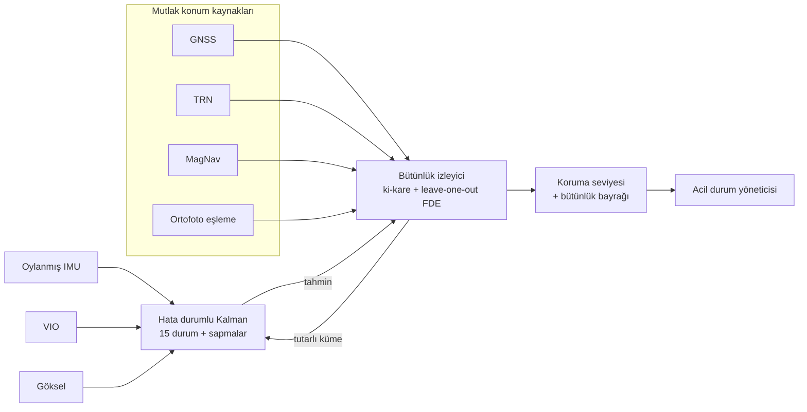

# 07 — GNSS'ten Bağımsız Navigasyon ve Bütünlük

Referans model: [`simurg/nav/integrity.py`](../simurg/nav/integrity.py)

## 1. İlke: "Hiçbir kaynağa koşulsuz güvenme"

Klasik İHA'larda GNSS, navigasyonun "doğrusu" kabul edilir; IMU yalnızca
aradaki boşlukları doldurur. GNSS karıştırıldığında araç kayar; sahte
sinyal verildiğinde araç **kendinden emin biçimde yanlış yere** gider.

SİMURG'da her konum kaynağı eşit derecede şüphelidir. Kaynaklar birbirini
çapraz denetler; tutarsız olan dışlanır, geriye kalan kümenin güvenilirliği
**koruma seviyesi** (protection level, PL) ile sayısallaştırılır.

## 2. Kaynaklar

| Kaynak | Tipik 1σ | Güçlü yanı | Zayıf yanı |
|---|---|---|---|
| GNSS (çok bantlı, CRPA anten, OSNMA) | 3 m | Mutlak, küresel | Karıştırma, sahtecilik |
| Görsel-ataletsel odometri (VIO) | %0,5–1 kat edilen mesafe | Pasif, karıştırılamaz | Göreli; kayar; gece/deniz üstü zayıf |
| Arazi referanslı nav (TRN) — LiDAR/radar altimetre + sayısal yükseklik modeli | 10–30 m | Mutlak, pasife yakın | Düz arazide/deniz üstünde zayıf |
| Görsel harita eşleme (ortofoto ↔ kamera) | 5–15 m | Mutlak | Mevsim/afet sonrası değişen arazi |
| **Manyetik anomali nav (MagNav)** — 4'lü manyetometre dizisi + yer kabuğu anomali haritası | 20–50 m | Mutlak, karıştırılamaz, deniz üstünde de çalışır | Gövde manyetik gürültüsünün kalibrasyonu gerekir |
| Göksel (gündüz güneş, gece yıldız kamerası) | Yön: < 0,1° | IMU sapmasını (heading) sınırlar | Bulut |

### 2.1 MagNav ayrıntısı
Yer kabuğunun manyetik alanı yerel anomaliler içerir (onlarca–yüzlerce nT).
Bu anomaliler haritalanmıştır ve zamanla değişmez. Araç, ölçtüğü toplam
alan profilini harita ile eşleyerek konumunu bulur.

Zorluk, motorların ve akım taşıyan kabloların ürettiği **gövde alanıdır**.
SİMURG'da:
- Manyetometreler gövde burnunda, motorlardan > 0,8 m uzakta;
- 48 V bara kabloları bükümlü çift, gidiş-dönüş yan yana;
- Tolles-Lawson modeli + motor akımlarını girdi alan küçük bir doğrusal
  regresör ile gövde alanı uçuşta gerçek zamanlı çıkarılır;
- Kalibrasyon için her kalkış sonrası 20 s'lik "kare dans" (roll/pitch/yaw
  salınımları) yapılır.

## 3. Füzyon mimarisi

## 4. Bütünlük algoritması (referans model)

1. **Füzyon:** Ters kovaryans ağırlıklı ortalama: `P = (Σ Rᵢ⁻¹)⁻¹`,
   `x = P · Σ Rᵢ⁻¹ zᵢ`.
2. **Tutarlılık testi:** `T = Σ (zᵢ − x)ᵀ Rᵢ⁻¹ (zᵢ − x)`;
   serbestlik derecesi `(m − 1)·d`. Eşik, yanlış alarm olasılığı
   `P_fa = 1e−5` için ki-kare dağılımından (Wilson–Hilferty yaklaşımı;
   uçuş kodunda tablo).
3. **Hata tespit ve dışlama (FDE):** T eşiği aşarsa her kaynak için
   "o olmadan" T hesaplanır; normalize T'yi en çok düşüren dışlama kabul
   edilir. Tutarlı küme bulunana veya 2 kaynak kalana dek tekrar.
4. **Koruma seviyesi:** `PL = k_md · √λ_max(P)`, `k_md`, kaçırılmış
   tespit olasılığı `1e−7`'ye karşılık gelen normal dağılım çarpanı.
5. **Bütünlük bayrağı:** tutarlı **ve** `PL ≤ alarm limiti (50 m)`.

> **Neden leave-one-out?** En büyük normalize artığa sahip kaynağı
> dışlamak, hatalı kaynak füzyonu kendine doğru çektiğinde yanlış kaynağı
> suçlayabilir. Alt küme tutarlılığı bu "maskelenme" etkisine karşı daha
> sağlamdır.

### 4.1 Sahtecilik senaryosu (test)
`test_nav.test_gnss_spoof_excluded`: GNSS'e (180, −120) m kaydırma
eklenir. GNSS'in küçük kovaryansı (3 m) nedeniyle naif füzyon sonucu
GNSS'e çekilir ve test istatistiği büyük çıkar. FDE GNSS'i dışlar;
kalan VIO + TRN + MagNav ile hata < 30 m, PL ≈ 36 m < 50 m → bütünlük
korunur, görev sürer, operatöre "GNSS dışlandı" bildirilir.

## 5. Bütünlük kaybında davranış

| Durum | Aksiyon |
|---|---|
| Bir kaynak dışlandı, PL < alarm limiti | Görev devam; uyarı |
| PL > alarm limiti | LOITER_HOLD (yerinde tutma: VIO + göksel yön ile) |
| LOITER_HOLD'da 5 dk düzelme yok | Ölü hesap (dead reckoning) ile eve dönüş, irtifa artırılarak (TRN/MagNav geri kazanımı için) |
| C2 bağlantısı da yok | Önceden yüklenmiş "güvenli bölge" haritasına göre en yakın güvenli alana acil iniş |

## 6. Zaman

Tüm sensörler PPS ile senkronize; GNSS kaybında FCC'nin sıcaklık
kompanzasyonlu kristali (TCXO) ±1 ppm ile 4 saat boyunca < 15 ms sapma
sağlar; bu, sürü içi zaman bölmeli erişim için yeterlidir.
