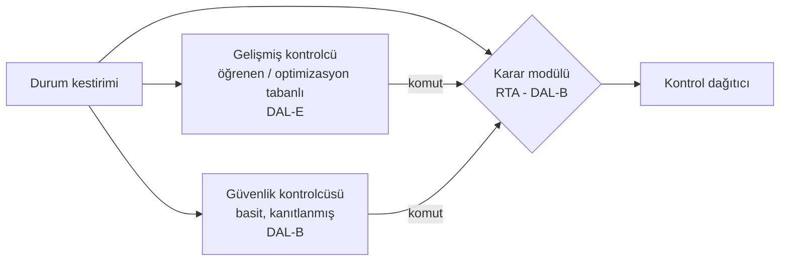
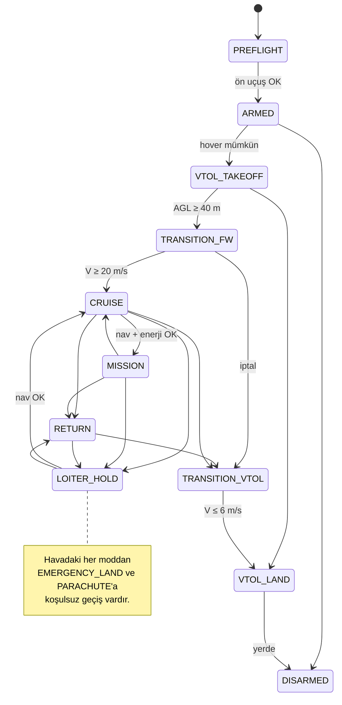

# 08 — Otonomi, Çalışma Zamanı Güvencesi ve FDIR

Referans modeller:
[`safety/rta.py`](../simurg/safety/rta.py),
[`modes/flight_modes.py`](../simurg/modes/flight_modes.py),
[`fdir/monitor.py`](../simurg/fdir/monitor.py)

## 1. Simplex mimarisi: YZ'yi güvenle kullanmak



- **Gelişmiş kontrolcü (AC):** Rüzgâra uyarlanan pekiştirmeli öğrenme
  politikası, model öngörülü kontrol (MPC) tabanlı agresif yörünge
  izleme, YZ görev planlayıcısının setpoint'leri. Sertifikalandırılmaz.
- **Güvenlik kontrolcüsü (SC):** Kanatları düzleyen, hızı en iyi
  süzülme hızına getiren, geofence'ten uzaklaşan basit bir PID/LQR.
  Kurtarılabilir kümesi analitik olarak hesaplanmıştır.
- **Karar modülü (RTA):** Her çevrimde AC komutunu 3 s ileriye "kaba ama
  muhafazakâr" bir modelle yansıtır; yumuşak zarf ihlal edilecekse SC'ye
  geçer.

### 1.1 Zarflar

| Değişken | Yumuşak (önleyici) | Sert (kilitleyici) |
|---|---|---|
| İrtifa AGL | ≥ 30 m | ≥ 15 m |
| Hava hızı | 17 – 38 m/s | 15 – 42 m/s |
| Yatış | ≤ 50° | ≤ 65° |
| Yunuslama | ≤ 25° | ≤ 35° |
| Geofence mesafesi | ≥ 50 m | ≥ 10 m |

### 1.2 Histerezis ve kilitleme
- SC'den AC'ye dönüş için durum, yumuşak zarfın **%20 daraltılmış**
  hâlinin içinde ve AC'nin tahmini de güvenli olarak **1 s (50 çevrim)**
  ardışık kalmalıdır. Bu, iki kontrolcü arasında titreşimli geçişi
  (chattering) önler.
- Sert zarf bir kez ihlal edildiyse RTA **kilitlenir**; AC o uçuş boyunca
  bir daha komuta geçemez. Kilit yalnızca yerde operatör onayıyla açılır.
- Her anahtarlama nedeni kaydedilir; bu kayıtlar AC'nin yeniden eğitimi
  için en değerli veridir ("YZ nerede güvenlik sınırına dayandı?").

## 2. Uçuş modları



Tablo dışı her geçiş reddedilir (`FlightModeMachine.request` → False).
Bu, örneğin askıdayken yanlışlıkla "MISSION" komutu verilmesini imkânsız
kılar.

## 3. Acil durum yöneticisi

Öncelik sırası (yüksekten düşüğe):

| # | Koşul | Aksiyon | Gerekçe |
|---|---|---|---|
| 1 | Araç kontrol edilemiyor (dağıtıcı roll/pitch'i karşılayamıyor, tüm FCC kaybı) | **PARACHUTE** | Yerdeki insanları koru |
| 2 | Hover mümkün değil **veya** iniş enerjisi yok | **EMERGENCY_LAND** (sabit kanatla, güvenli alana süzülerek / göbek üstü) | Dikey iniş denenirse kontrol kaybı |
| 3 | Eve dönüş enerjisi yok | **EMERGENCY_LAND** (en yakın önceden onaylı alan) | |
| 4 | Navigasyon bütünlüğü kaybı | **LOITER_HOLD** | Yanlış konuma dönmek yerine dur ve düşün |
| 5 | C2 bağlantısı > 30 s yok | **RETURN** | Standart kayıp-link prosedürü |

Not: 4 ve 5 aynı anda olursa araç **önce durur** (LOITER_HOLD); bütünlük
geri gelmeden eve dönmeye çalışmaz. Bu, GNSS sahteciliği + karıştırma
kombinasyonuna karşı bilinçli bir tercihtir (yanlış "ev"e gitmemek).

## 4. FDIR

### 4.1 Motor ve pervane sağlığı
```
r_i = 1 − devir_ölçülen / devir_komut
g_i ← min(max(0, g_i + |r_i| − drift), g_max)        (CUSUM, tespit)
η_i ← η_i + α·(min(oran,1)² − η_i)                   (itki verimi kestirimi)

durum = FAILED    eğer (komut > %30·maks ve oran < 0,15)  ← anında
        FAILED    eğer η_i < 0,30
        DEGRADED  eğer g_i > 0,5
        OK        diğer
sağlık_i = 0 (FAILED) | η_i (DEGRADED) | 1 (OK)
```

**Tespit ile şiddet ayrımı:** CUSUM yalnızca "bir şeyler değişti"yi
söyler; ne kadar kötü olduğunu verim kestirimi söyler. Böylece %8 devir
kaybı olan bir pervane (itki ≈ %85) sonsuza dek DEGRADED kalır ve
dağıtıcıya 0,85 sağlıkla girer; zamanla yanlışlıkla FAILED'a tırmanmaz
(bu hata, ilk prototip modelde demo senaryosu sayesinde bulundu ve
düzeltildi — bkz. `test_degraded_prop_detected_with_partial_health`).
Yavaş bozulan bir rulman ise verim 0,30'un altına düştüğünde FAILED olur
(`test_gradual_loss_escalates_to_failed`).

### 4.2 Sensör şeritleri
`TripleLaneVoter`: üç şeritten orta değer; bir şerit orta değerden
toleransın ötesinde **ardışık 5 çevrim** ayrılırsa yalıtılır. İki şerit
kaldığında ortalama kullanılır ve aralarındaki uyuşmazlık (`disagree`)
izlenir; uyuşmazlık durumunda üçüncü bir hakem (ör. IMU için GNSS/VIO
türevli açısal hız) devreye girer.

### 4.3 Yeniden yapılandırma zinciri

```
ESC telemetrisi → MotorHealthMonitor → sağlık vektörü
   ├─► ControlAllocator.allocate(…, health)   (aynı çevrimde)
   ├─► ControlAllocator.hover_margin(…)       (≤ 100 ms)
   │      └─► Context.hover_feasible
   └─► operatör bildirimi + dijital ikiz kaydı
```

## 5. Algıla ve kaçın (DAA)

- **İşbirlikçi:** ADS-B In, FLARM → çarpışma geometrisi (CPA) hesaplanır.
- **İşbirlikçi olmayan:** Akustik dizi (yön), ileri kamera (görsel
  doğrulama). Helikopter ve paramotor gibi transponder'sız araçlar için.
- Kaçınma manevrası **sağa dönüş + alçalma** (hava yolu kurallarıyla
  uyumlu) ve RTA zarfının içinde kalacak şekilde SC tarafından uygulanır.
- İnsanlı hava aracı her zaman önceliklidir; DAA kararı görev
  planlayıcısını ezer.
