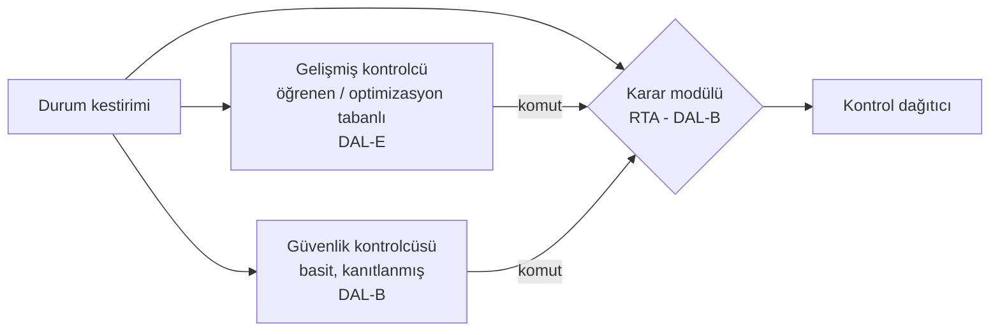
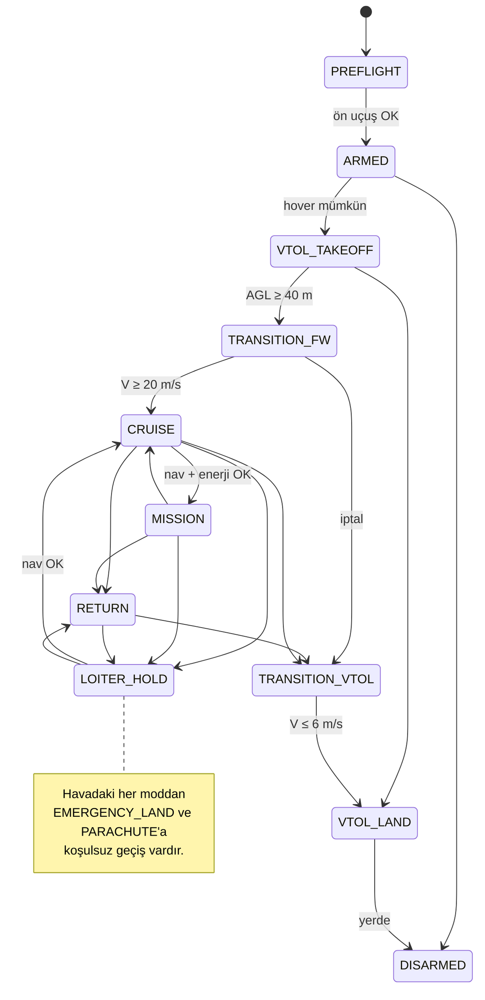

# 08 — Otonomi, Çalışma Zamanı Güvencesi ve FDIR

Referans modeller:
[`safety/rta.py`](../simurg/safety/rta.py),
[`modes/flight_modes.py`](../simurg/modes/flight_modes.py),
[`fdir/monitor.py`](../simurg/fdir/monitor.py)

## 1. Simplex mimarisi: YZ'yi güvenle kullanmak



- **Gelişmiş kontrolcü (AC):** Rüzgâra uyarlanan pekiştirmeli öğrenme
  politikası, model öngörülü kontrol (MPC) tabanlı agresif yörünge
  izleme, YZ görev planlayıcısının setpoint'leri. Sertifikalandırılmaz.
- **Güvenlik kontrolcüsü (SC):** Kanatları düzleyen, hızı en iyi
  süzülme hızına getiren, geofence'ten uzaklaşan basit bir PID/LQR.
  Kurtarılabilir kümesi analitik olarak hesaplanmıştır.
- **Karar modülü (RTA):** Her çevrimde AC komutunu 3 s ileriye "kaba ama
  muhafazakâr" bir modelle yansıtır; yumuşak zarf ihlal edilecekse SC'ye
  geçer.

### 1.1 Zarflar

| Değişken | Yumuşak (önleyici) | Sert (kilitleyici) |
|---|---|---|
| İrtifa AGL | ≥ 30 m | ≥ 15 m |
| Hava hızı | 17 – 38 m/s | 15 – 42 m/s |
| Yatış | ≤ 50° | ≤ 65° |
| Yunuslama | ≤ 25° | ≤ 35° |
| Geofence mesafesi | ≥ 50 m | ≥ 10 m |

### 1.2 Histerezis ve kilitleme
- SC'den AC'ye dönüş için durum, yumuşak zarfın **%20 daraltılmış**
  hâlinin içinde ve AC'nin tahmini de güvenli olarak **1 s (50 çevrim)**
  ardışık kalmalıdır. Bu, iki kontrolcü arasında titreşimli geçişi
  (chattering) önler.
- Sert zarf bir kez ihlal edildiyse RTA **kilitlenir**; AC o uçuş boyunca
  bir daha komuta geçemez. Kilit yalnızca yerde operatör onayıyla açılır.
- Her anahtarlama nedeni kaydedilir; bu kayıtlar AC'nin yeniden eğitimi
  için en değerli veridir ("YZ nerede güvenlik sınırına dayandı?").

## 2. Uçuş modları



Tablo dışı her geçiş reddedilir (`FlightModeMachine.request` → False).
Bu, örneğin askıdayken yanlışlıkla "MISSION" komutu verilmesini imkânsız
kılar.

## 3. Acil durum yöneticisi

Kural tablosu kodda **tek doğruluk kaynağıdır**:
`simurg/modes/flight_modes.py::CONTINGENCY_RULES`. Aşağıdaki tablo bu
listeyle `tests/test_mode_integration.py::test_docs_table_matches_code`
tarafından otomatik karşılaştırılır; sıra veya tetikleyici kimliği
değişirse test başarısız olur.

Öncelik sırası (yüksekten düşüğe; ilk eşleşen kural karardır):

| # | Tetikleyici | Koşul | Aksiyon | Gerekçe |
|---|---|---|---|---|
| 1 | `kontrol_kaybi` | Araç kontrol edilemiyor (2 s boyunca tutum hatası > 60° ya da dağıtıcının tutum momentlerini karşılayamaması; tüm FCC kaybı) | **PARACHUTE** | Yerdeki insanları koru |
| 2 | `enerji_veya_hover_yok` | Hover mümkün değil **veya** iniş enerjisi yok | **EMERGENCY_LAND** (hover varsa dikey, yoksa sabit kanatla alçalarak) | Dikey iniş denenirse kontrol kaybı |
| 3 | `eve_donus_enerjisi_yok` | Eve dönüş enerjisi yok | **EMERGENCY_LAND** (en yakın güvenli alan) | |
| 4 | `nav_butunluk_kaybi` | Navigasyon bütünlüğü kaybı (seyir/görev/dönüşte) | **LOITER_HOLD** | Yanlış konuma dönmek yerine dur ve düşün |
| 5 | `baglanti_kaybi_nav_yok` | LOITER_HOLD'da bağlantı > 30 s yok **ve** nav bütünlüğü yok | bekle (mod değişmez) | Bütünlük olmadan "ev" yönü güvenilmez |
| 6 | `baglanti_kaybi` | C2 bağlantısı > 30 s yok | **RETURN** | Standart kayıp-link prosedürü |

Not: 4 ve 6 aynı anda olursa araç **önce durur** (LOITER_HOLD); bütünlük
geri gelmeden eve dönmeye çalışmaz (kural 5). Bu, kaynak bozulması ve
bağlantı kaybının birlikte görüldüğü durumlara karşı bilinçli bir tercihtir.

Her karar `ContingencyDecision` nesnesi olarak üretilir (istenen mod,
gerekçe, öncelik, tetikleyici, kabul edildi mi) ve simülasyonda
`contingency` olayı olarak kaydedilir.

## 4. FDIR

### 4.1 Motor ve pervane sağlığı
```
r_i = 1 − devir_ölçülen / devir_komut
g_i ← min(max(0, g_i + |r_i| − drift), g_max)        (CUSUM, tespit)
η_i ← η_i + α·(min(oran,1)² − η_i)                   (itki verimi kestirimi)

durum = FAILED    eğer (komut > %30·maks ve oran < 0,15)  ← anında
        FAILED    eğer η_i < 0,30
        DEGRADED  eğer g_i > 0,5
        OK        diğer
sağlık_i = 0 (FAILED) | η_i (DEGRADED) | 1 (OK)
```

**Tespit ile şiddet ayrımı:** CUSUM yalnızca "bir şeyler değişti"yi
söyler; ne kadar kötü olduğunu verim kestirimi söyler. Böylece %8 devir
kaybı olan bir pervane (itki ≈ %85) sonsuza dek DEGRADED kalır ve
dağıtıcıya 0,85 sağlıkla girer; zamanla yanlışlıkla FAILED'a tırmanmaz
(bu hata, ilk prototip modelde demo senaryosu sayesinde bulundu ve
düzeltildi — bkz. `test_degraded_prop_detected_with_partial_health`).
Yavaş bozulan bir rulman ise verim 0,30'un altına düştüğünde FAILED olur
(`test_gradual_loss_escalates_to_failed`).

### 4.2 Sensör şeritleri
`TripleLaneVoter`: üç şeritten orta değer; bir şerit orta değerden
toleransın ötesinde **ardışık 5 çevrim** ayrılırsa yalıtılır. İki şerit
kaldığında ortalama kullanılır ve aralarındaki uyuşmazlık (`disagree`)
izlenir; uyuşmazlık durumunda üçüncü bir hakem (ör. IMU için GNSS/VIO
türevli açısal hız) devreye girer.

### 4.3 Yeniden yapılandırma zinciri

```
ESC telemetrisi → MotorHealthMonitor → sağlık vektörü
   ├─► ControlAllocator.allocate(…, health)   (aynı çevrimde)
   ├─► ControlAllocator.hover_margin(…)       (≤ 100 ms)
   │      └─► Context.hover_feasible
   └─► operatör bildirimi + dijital ikiz kaydı
```

## 5. Algıla ve kaçın (DAA)

- **İşbirlikçi:** ADS-B In, FLARM → çarpışma geometrisi (CPA) hesaplanır.
- **İşbirlikçi olmayan:** Akustik dizi (yön), ileri kamera (görsel
  doğrulama). Helikopter ve paramotor gibi transponder'sız araçlar için.
- Kaçınma manevrası **sağa dönüş + alçalma** (hava yolu kurallarıyla
  uyumlu) ve RTA zarfının içinde kalacak şekilde SC tarafından uygulanır.
- İnsanlı hava aracı her zaman önceliklidir; DAA kararı görev
  planlayıcısını ezer.

## 6. Güvenlik değişmezleri (kodla zorlanır)

> **v0.3:** Öneri artık RTA'dan önce aşamalı **Command Validator**'dan geçer
> (şema → tazelik → mod uyumu → sınır → yetki); FDIR sekiz alanda standart
> rapor üretir ve **Vehicle Health Manager** NOMINAL / DEGRADED /
> CONTINGENCY / CRITICAL / UNKNOWN seviyesine birleştirir; üçlü FCC şerit
> oylaması simülasyona bağlıdır. Mimari düzeydeki değişmez → test eşlemesi ve
> mimari-kod denetimi: [15 §8–§9](15-sistem-mimarisi.md), arıza zincirleri:
> [mimari/08](mimari/08-ariza-acil-durum.md).

Aşağıdaki kurallar yalnızca doküman değildir; her biri
`tests/test_safety_invariants.py` (ve belirtilen diğer testler) içinde
adıyla doğrulanır.

| Değişmez | Kod düzeyindeki mekanizma | Test |
|---|---|---|
| YZ / gelişmiş kontrolcü nihai uçuş yetkisi olamaz | Kontrol katmanı (`sim/vehicle_control.py`) yalnızca `ValidatedCommand` kabul eder; bu tip yalnızca `RuntimeAssurance` tarafından üretilebilir (mühür) | `test_validated_command_cannot_be_forged`, `test_controller_rejects_unvalidated_command` |
| YZ katmanının eyleyicilere içe aktarma (import) yolu yoktur | `control/guidance.py` ve `swarm/` dağıtım/eyleyici/itki modüllerini içe aktarmaz | `test_ai_layer_has_no_import_path_to_actuation` |
| Hatalı YZ önerisi aracı sert zarf dışına çıkaramaz | Simplex RTA + güvenlik kontrolcüsü | `test_ai_cannot_drive_vehicle_outside_hard_envelope` |
| RTA kilitliyken gelişmiş çıktı seçilemez | `RuntimeAssurance.latched` | `test_rta_latched_never_selects_advanced` |
| Sert zarf ihlalinde gelişmiş kontrolcü yetki alamaz | Sert ihlal -> kilit | `test_hard_envelope_violation_denies_advanced_authority` |
| Bilinmeyen (NaN/Inf) durum güvenli sayılmaz | `Envelope.violations` -> `gecersiz_durum` | `test_nonfinite_state_is_not_treated_as_safe` |
| PARACHUTE havada terminaldir | Geçiş tablosu: yalnızca `PARACHUTE -> DISARMED` (yerde) | `test_parachute_mode_is_terminal_in_air` |
| Havadaki araç DISARMED olamaz | Tüm `* -> DISARMED` korumaları `landed` ister | `test_airborne_vehicle_cannot_disarm` |
| Mod değişimi yalnızca geçiş tablosu üzerinden | `FlightModeMachine.request_detailed` | `test_mode_changes_only_through_transition_table` |
| FAILED eyleyici nominal gibi dağıtıma katılmaz | Sağlık 0 -> sütun 0, komut 0 | `test_failed_actuator_not_treated_as_nominal` |
| Simülasyon aynı tohumla yeniden üretilebilir | `SeedSequence` alt üreteçleri | `test_simulation_is_deterministic_for_same_seed` |
| Geçersiz senaryo sessizce çalıştırılmaz | `Scenario.validate` -> `InvalidScenarioError` | `test_invalid_scenario_is_never_run_silently` |
| Arıza takvimi deterministik uygulanır | İlk adım >= başlangıç | `test_fault_schedule_applied_deterministically` |
| Olay zamanları geriye gitmez; simülasyon zamanı monoton | Olay yolu `seq`, motor saati | `test_event_timestamps_and_simulation_time_never_go_backwards` |
| Tekrar oynatma olay sırasını değiştirmez | `ReplaySession` `seq` sıralı | `test_replay_does_not_reorder_events` |

### 6.1 Fail-safe ilkesi: bilinmeyen ≠ sağlıklı

| Durum | Davranış | Test |
|---|---|---|
| Hiç gözlenmemiş motor (UNKNOWN) | Havada askı fizibilitesinde çalışmıyor sayılır | `test_failsafe.test_unobserved_motors_are_not_counted_for_hover_when_airborne` |
| Henüz navigasyon çözümü yok | `integrity_ok = False`, PL = ∞ | `test_failsafe.test_navigation_without_solution_never_reports_integrity` |
| Sonlu olmayan ölçüm | Kaynak "kullanılamaz" | `test_failsafe.test_nonfinite_measurement_is_treated_as_unavailable` |
| Kritik ölçüm yok (pitot/baro) | Açık geri dönüş kaynağı + `sensor_degraded` olayı (uyarı, bozulmuş durum) | `test_failsafe.test_airspeed_loss_uses_explicit_fallback_and_is_reported` |
| Enerji kestirimi yok | Uyarı; eve dönüş/iniş enerjisi yeterli sayılmaz | `test_failsafe.test_unknown_energy_estimate_raises_warning` |
| Geçersiz yapılandırma | `ConfigurationError` (başlamadan) | `test_failsafe.test_invalid_configuration_is_rejected` |
| Durum bozulması (NaN) | `sim_failed` olayı + `SimulationError` (sessiz devam yok) | `test_failsafe.test_state_corruption_is_a_simulation_error_not_silent` |
