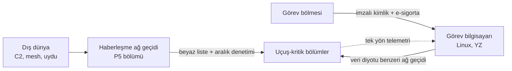

# 10 — Haberleşme ve Siber Güvenlik

## 1. Bağlantı katmanları

| Bağlantı | Teknoloji | Menzil | Kullanım |
|---|---|---|---|
| C2 birincil | Lisanslı C2 bandında (5030–5091 MHz) dar bant veri bağlantısı | 50 km görüş hattı | Komuta-kontrol, telemetri |
| C2 ikincil | 4G/5G hücresel (çift SIM, iki operatör) | Kapsama alanı | C2 yedeği, video |
| C2 üçüncül | Düşük yörünge uydu (kısa mesaj/düşük hız) | Küresel | Konum + durum + "eve dön" komutu |
| Sürü mesh | Alt-GHz + 2,4/5 GHz | 5–15 km araç-araç | Bkz. [09](09-suru-ve-isbirligi.md) |
| Remote ID | Bluetooth 5 LR + Wi-Fi NaN yayını (ASTM F3411) | ~1 km | Yasal kimlik yayını |
| FTS | Ayrı alıcı, ayrı frekans | 50 km | Yalnızca sonlandırma |

**Bağlantı yöneticisi** her bağlantının gecikme/kayıp/sinyal kalitesini
ölçer ve C2 trafiğini **eş zamanlı birden fazla yoldan** gönderebilir
(paket çoğaltma); alıcı sıra numarasıyla kopyaları atar. "Bağlantı kaybı"
tanımı, **tüm** C2 yollarının kaybıdır.

## 2. Protokol

- Mesaj şeması: sürümlü, ikili, sabit alanlı (FCC tarafında ayrıştırma
  için dinamik bellek gerekmez).
- Her çerçeve: `sürüm | oturum kimliği | sıra no (64 bit) | tip | yük | etiket`.
- Komutlar **idempotent** ve **onaylıdır** (ACK); kritik komutlar (ARM,
  mod değişimi, FTS) iki aşamalı: "hazırla" + "uygula" (operatör iki ayrı
  eylemle onaylar).

## 3. Kriptografi

| Amaç | Mekanizma |
|---|---|
| Kimlik doğrulamalı şifreleme | AES-256-GCM (veya ChaCha20-Poly1305), her yön ayrı anahtar |
| Anahtar anlaşması | ECDH (P-384) **+ ML-KEM-768 hibrit** (kuantum sonrası geçiş) |
| İmza (görev planı, yazılım, parametre, görev bölmesi veri sayfası) | Ed25519 + ML-DSA hibrit |
| Tekrar saldırısı | 64 bit monoton sayaç + kayan pencere |
| Anahtar saklama | Her FCC şeridinde ve görev bilgisayarında donanım güvenlik modülü (HSM / güvenli eleman) |
| Oturum anahtarı ömrü | 1 saat veya 2³² çerçeve, hangisi önce |

## 4. Sıfır güven (zero trust) iç mimari

Aracın içi de "güvenilir bölge" kabul edilmez:



- Görev bilgisayarı (en geniş saldırı yüzeyi: Linux, ağ yığını, YZ
  kütüphaneleri) uçuş-kritik bölümlere yalnızca sınırlı bir mesaj kümesi
  gönderebilir; her alan aralık denetiminden geçer, sonra RTA'dan geçer.
  **Görev bilgisayarı ele geçirilse bile** araç zarf dışına çıkamaz.
- TSN anahtarları yalnızca statik yapılandırılmış akışlara izin verir;
  bilinmeyen MAC/akış düşürülür ve sağlık olayı üretir.
- Görev bölmesi imzalı değilse güç almaz; imzalıysa yalnızca görev ağına
  bağlanır.

## 5. Güvenli önyükleme zinciri

```
ROM güven kökü ─► 1. aşama yükleyici (imzalı) ─► bölümleme çekirdeği (imzalı)
               ─► bölüm imajları (imzalı, anti-rollback) ─► parametre paketi (imzalı)
```

Her aşama bir sonrakinin imzasını doğrular ve ölçümünü (hash) donanım
kaydına yazar; yer istasyonu uçuş öncesi bu ölçümleri **uzaktan doğrular**
(remote attestation). Ölçüm uyuşmazsa ön uçuş kontrolü başarısız olur
(`Context.preflight_ok = False`).

## 6. GNSS ve RF saldırılarına dayanıklılık

| Tehdit | Önlem |
|---|---|
| GNSS karıştırma | CRPA (kontrollü radyasyon desenli) anten, sıfır yönlendirme; GNSS'siz navigasyon |
| GNSS sahteciliği | OSNMA kimlik doğrulama + çok kaynaklı FDE ([07](07-navigasyon.md)) |
| C2 karıştırma | Frekans çeşitliliği (3 farklı bant), kayıp-link prosedürü |
| Sahte komut | AEAD + sayaç; kritik komutlarda iki aşama |
| Sahte Remote ID / ADS-B | ADS-B mesajları DAA'da "zayıf kanıt"; görsel/akustik doğrulama |

## 7. Güvenlik operasyonları

- Her uçuşun güvenlik olay kaydı (başarısız kimlik doğrulama, düşürülen
  paketler, sayaç atlamaları) dijital ikize aktarılır; filo genelinde
  anomali analizi yapılır.
- Anahtar iptali: yer PKI'ı, iptal edilen operatör/araç sertifikalarını
  bir sonraki uçuş öncesi araca yükler.
- Sızma testleri ve tehdit modellemesi (STRIDE) her ana sürümde tekrarlanır.
