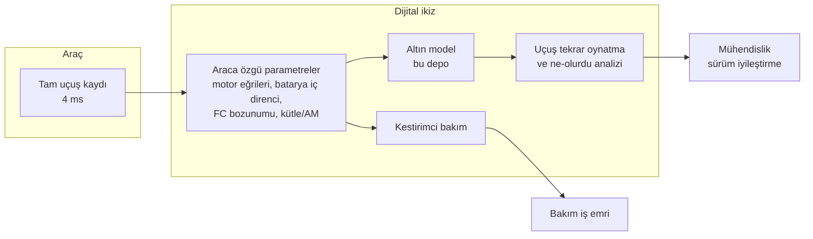

# 11 — Yer Segmenti ve Dijital İkiz

## 1. Yer kontrol istasyonu (GCS)

| Bileşen | Açıklama |
|---|---|
| Operatör arayüzü | Harita, sürü görünümü, görev zaman çizelgesi, uyarı paneli |
| Görev planlama | Arama alanı çizimi → otomatik hücreleme → sürüye açık artırma |
| Onay akışı | Görev planı operatör HSM anahtarıyla imzalanır; ikinci kişi onayı (yüksek riskli operasyonlarda) |
| Taşınabilir anten direği | C2 + mesh; 6 m teleskopik |
| Güç | Araç aküsü + jeneratör, ≥ 8 saat |

### 1.1 Arayüz ilkeleri
- **Uyarı yorgunluğuna karşı:** Uyarılar üç sınıfta (BİLGİ / DİKKAT /
  UYARI); her UYARI bir **önerilen aksiyon** ile gelir ("M2U pervane
  hasarı: hover marjı 1,32 → görev sürdürülebilir, iniş sonrası
  değiştirin").
- **Otonomi şeffaflığı:** RTA her devreye girdiğinde nedeni sade dille
  gösterilir ("YZ dik dönüş istedi, geofence'e 3 s içinde 50 m'den fazla
  yaklaşılacaktı").
- Bir operatör en fazla 8 aracı yönetir; araç başına dikkat gerektiren
  olay sıklığı izlenir, eşik aşılırsa sistem sürüyü küçültmeyi önerir.

## 2. Dijital ikiz

Her fiziksel SİMURG'un, seri numarasıyla eşleşen bir dijital ikizi vardır.

### 2.1 Ne öğrenir?

| Bileşen | İzlenen gösterge | Model |
|---|---|---|
| Motor/rulman | Aynı itki için gereken akım artışı, titreşim spektrumu | Eğilim + eşik; kalan ömür tahmini |
| Pervane | Devir/itki oranı (`MotorHealthMonitor.eff`) | Uçuşlar arası trend |
| Batarya | İç direnç, kapasite solması, hücre dengesizliği | Eşdeğer devre modeli parametre kestirimi |
| Yakıt hücresi | Aynı akımda gerilim düşüşü (polarizasyon eğrisi kayması) | Bozunum hızı; membran değişim tahmini |
| Gövde | Elevon trim değerlerinde kayma (yapısal deformasyon / hasar) | İstatistiksel süreç kontrolü |
| Navigasyon | MagNav gövde alanı katsayıları | Tolles-Lawson yeniden kalibrasyonu |

### 2.2 Uçuş öncesi "sanal prova"
Her görev planı uçuş öncesi dijital ikizde, **o aracın** güncel
parametreleri ve tahmini rüzgâr alanıyla koşturulur:
- Enerji yeterliliği (%30 pay ile),
- Tek motor arızasında görev sürdürülebilirliği,
- Bağlantı gölgesi haritası (röle gerekiyor mu?),
- Geofence ve yasak bölge uyumu.

Herhangi biri başarısızsa plan imzalanamaz.

### 2.3 Uçuş sonrası tekrar oynatma
Kayıt, altın modele girdi olarak verilir; uçuş yazılımının çıktılarıyla
altın modelin çıktıları karşılaştırılır. Fark → yazılım hatası veya model
hatası; her iki durumda da mühendislik kaydı açılır. Bu, sahada çalışan
**sürekli back-to-back testtir**.

### 2.4 Uygulama durumu (v0.2)

| Yetenek | Durum | Kod |
|---|---|---|
| 6-DOF dijital ikiz çekirdeği | **var** (sentetik katsayılar) | `simurg/sim/engine.py` |
| Yapılandırılmış uçuş kaydı (JSON şeması) | **var** | `simurg/sim/recorder.py` |
| Uçuş tekrar oynatma ve ne-olurdu analizi | **prototip** (Python API, görsel arayüz yok) | `simurg/sim/replay.py` |
| Senaryo + arıza takvimi ile "sanal prova" | **prototip** | `simurg/sim/scenario.py`, `simurg/sim/scenarios.py` |
| Araca özgü parametre öğrenimi | **planlanan** | — |
| Kestirimci bakım | **planlanan** | — |
| GCS arayüzü | **planlanan** | — |

Ayrıntı: [14-simulasyon-ve-dijital-ikiz.md](14-simulasyon-ve-dijital-ikiz.md).

## 3. Lojistik

| Konu | Değer |
|---|---|
| Kurulum (kutudan uçuşa) | 2 kişi, ≤ 15 dk |
| Sortiler arası dönüş | H₂ tank değişimi (hızlı bağlantı) + batarya kontrolü: ≤ 5 dk |
| H₂ tedariki | Kapsam dışı (lojistik ve dolum, yetkili tedarikçi prosedürlerine tabidir); konsept olarak dolu tank değişimi varsayılır |
| Bakım aralığı | Kestirimci; asgari her 100 uçuş saatinde görsel + yapısal kontrol |
