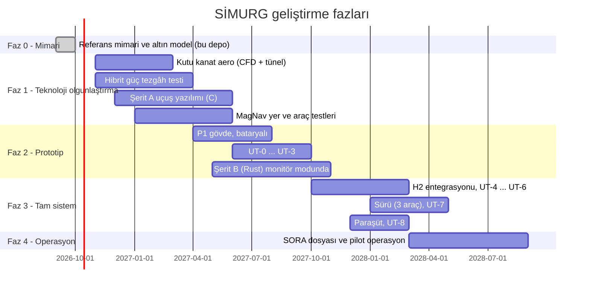

# 13 — Teknik Riskler ve Yol Haritası

## 1. Risk kaydı

Olasılık (O) ve Etki (E): 1 (düşük) – 5 (yüksek). Skor = O × E.

| # | Risk | O | E | Skor | Azaltma | Erken gösterge |
|---|---|---|---|---|---|---|
| R1 | Tail-sitter askıda yan rüzgâr hassasiyeti beklenenden yüksek | 4 | 4 | 16 | Weathervaning yaw stratejisi, kanat düzlemini rüzgâra hizalama; rüzgâr limitini veriye göre ayarlama; UT-1'de rüzgâr tünelinde (veya fan duvarında) test | Hover'da elevon doyma oranı |
| R2 | Geçiş koridorunda aerodinamik belirsizlik (yüksek hücum açısı, blown wing) | 3 | 5 | 15 | INDI (model bağımlılığı düşük), CFD + rüzgâr tüneli, geçiş iptal mantığı | Geçişte INDI artık ivme hatası |
| R3 | MagNav gövde manyetik gürültüsü (8 motor, 48 V akımlar) | 4 | 3 | 12 | Manyetometreleri uzaklaştırma, akım-girdili kompanzasyon, erken yer testleri | Kalibrasyon sonrası artık nT |
| R4 | PEM yakıt hücresinin soğuk havada (−20 °C) başlatılması | 3 | 3 | 9 | Batarya ile önceden ısıtma, yerde başlatma; soğukta görev profili kısıtı | Başlatma süresi |
| R5 | Farklı mimarili şeritlerin geliştirme maliyeti/süresi | 4 | 3 | 12 | Altın model ve ortak test vektörleri; B şeridini kademeli devreye alma (önce monitör modu) | İki şerit arasındaki uyuşmazlık sayısı |
| R6 | Kutu kanatta çarpıntı (flutter) — kapalı çerçeve karmaşık modlar | 2 | 5 | 10 | Sonlu eleman modal analizi, yer titreşim testi (GVT), zarfta %20 flutter payı | GVT frekansları |
| R7 | Hidrojen lojistiği sahada (afet bölgesi) | 3 | 3 | 9 | Tank değişim modeli; H₂ modülü yerine ikinci batarya paketi takılan kısaltılmış görev profili (≈ 50 dk) yedek konsept | — |
| R8 | Düzenleyici onay süresi (BVLOS + sürü) | 4 | 4 | 16 | Erken SORA ön görüşmeleri, test sahası izinleri, kademeli operasyon onayı | — |
| R9 | YZ görev planlayıcısının RTA'yı sık tetiklemesi → verim kaybı | 3 | 2 | 6 | RTA kayıtlarıyla YZ'yi yeniden eğitme; AC'ye zarf bilgisini kısıt olarak verme | RTA anahtarlama oranı / saat |
| R10 | Katlanır pervanelerin seyirde tam katlanmaması (titreşim, sürükleme) | 2 | 2 | 4 | ESC konum tutma modu, pervane hizalama sensörü | İç motor rölanti akımı |

## 2. Yol haritası

## 3. Teknoloji hazırlık seviyesi (THS) hedefleri

| Teknoloji | Bugün (tahmini) | Faz 2 sonu | Faz 4 sonu |
|---|---|---|---|
| Kutu kanat tail-sitter | 3 | 5 | 7 |
| 3 kaynaklı hibrit güç | 4 | 5 | 7 |
| Farklı mimarili 3 şeritli FCC | 4 | 5 | 6 |
| Simplex RTA | 4 | 6 | 7 |
| MagNav (küçük İHA'da) | 3 | 4 | 6 |
| CBBA sürü + röle | 5 | 6 | 7 |

## 4. Yazılım yol haritası

**v0.2'de tamamlananlar** (bkz. [14](14-simulasyon-ve-dijital-ikiz.md)):

- [x] 6-DOF dinamik, değiştirilebilir integratör, analitik + tablo aero arayüzü
- [x] Rejime bağlı etkinlik `B(V, σ)` ve geçiş koordinatörü (iptal mantığıyla)
- [x] Eyleyici, sensör, ortam modelleri; zaman tabanlı arıza enjeksiyonu
- [x] Açıklanabilir RTA kararları, standart FDIR raporları, `NavigationSolution`,
      `EnergyState`, tek kaynak acil durum kural tablosu
- [x] Olay yolu, JSON kayıt şeması, tekrar oynatma, metrikler, Monte Carlo, CLI
- [x] Enerji modeline bozunum kancası (yaşlanma/sıcaklık modelleri için)

**v0.3'te tamamlananlar** (bkz. [15](15-sistem-mimarisi.md), [mimari/](mimari/)):

- [x] Sensör ölçüm hattı (zaman damgası, doğrulama, akla yatkınlık, kanal sağlığı, ölçüm yolu)
- [x] Aşamalı komut doğrulayıcı (şema, tazelik, mod uyumu, sınır, yetki)
- [x] Üçlü FCC şerit oylaması ve yalıtımı (simülasyon soyutlaması; şerit arızası enjeksiyonu)
- [x] 8 alan FDIR raporu + Vehicle Health Manager seviyeleri; 11 kontrollü uçuş öncesi denetçi
- [x] Uçuş veri kaydedici kanalları ve `why_*` açıklamaları; 10 arıza zinciri ve mimari-kod denetimi

**Sıradaki adımlar:**

1. RTA'nın kaba kinematik kestiricisini 6-DOF modeliyle karşılaştırıp
   muhafazakârlığını ölçmek (kaçırılan/yanlış müdahale oranı).
2. Geçiş programını tepe gücü (~9 kW) düşürecek şekilde optimize etmek.
3. İç döngüye INDI; pervane akımının kanat üzerindeki etkisi; hücum açısına
   bağlı `B(V, α)`.
4. Tutum kestiricisi (şu an kusursuz varsayılıyor) ve model uyumsuzluğu
   senaryoları.
5. Sürü (CBBA) ve mesh ağının simülasyon çekirdeğine bağlanması; dağıtık
   uzlaşının ağ gecikmeli testi.
6. Monte Carlo'nun `multiprocessing` ile paralelleştirilmesi.
7. Mod makinesinin TLA+ modelini `TRANSITIONS` tablosundan otomatik üretmek.
