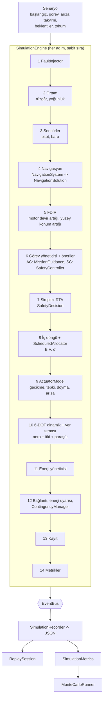

# 14 — Simülasyon Çekirdeği ve Dijital İkiz

> **Kapsam:** Bu katman bir **araştırma ve yazılım doğrulama simülasyonudur**.
> Uçuşa hazır yazılım, gerçek araç için kontrol kazancı, motor/ESC
> kalibrasyonu ya da uçuş prosedürü değildir. Tüm fiziksel katsayılar
> sentetiktir ve doğrulanmamıştır (bkz. §11 Sınırlamalar).

Kod: [`simurg/sim/`](../simurg/sim), [`simurg/aero/`](../simurg/aero),
[`simurg/core/`](../simurg/core), [`simurg/control/`](../simurg/control)

## 1. Mimari



Veri akışı (kavramsal):

```
Senaryo -> Ortam -> Sensörler -> Navigasyon -> Kontrolcü önerisi -> RTA
        -> Kontrol dağıtımı -> Eyleyiciler -> Dinamik -> Durum -> Kayıt / Metrikler
```

### 1.1 Katmanlar ve bağımlılık yönü

```
core (tipler, olaylar, hatalar, yapılandırma, eksen takımları)   <- hiçbir şeye bağlı değil
  ^
aero, control, power, nav, fdir, safety, modes                    <- yalnızca core'a
  ^
sim (motor, senaryo, arıza, kayıt, tekrar, Monte Carlo, CLI)      <- hepsine
```

Döngüsel bağımlılık yoktur. Alt sistemler birbirini doğrudan çağırmaz;
motor onları sırayla çalıştırır ve sonuçları **olay yolu** (`EventBus`)
üzerinden yayınlar.

## 2. Adım (tick) sırası

`simurg.sim.engine.TICK_ORDER` sabittir ve testle korunur:

| # | Adım | Ne yapar |
|---|---|---|
| 1 | `scenario_events` | Zamanı gelen arızaları uygular / süresi dolanları temizler |
| 2 | `environment` | Rüzgâr (+ isteğe bağlı türbülans), yoğunluk |
| 3 | `sensors` | Pitot ve barometre ölçümü (gürültülü) |
| 4 | `navigation` | 5 Hz: konum kaynakları -> bütünlük -> `NavigationSolution` |
| 5 | `health` | FDIR: beklenen (nominal model) ve ölçülen devir/konum artığı |
| 6 | `proposals` | Görev yöneticisi nominal mod ilerleyişini ister; AC ve SC komut önerir |
| 7 | `rta` | Yalnız sabit kanat modlarında: Simplex karar |
| 8 | `allocation` | Tutum + itki isteği -> rejime bağlı RPI dağıtımı |
| 9 | `actuators` | Gecikme, birinci derece tepki, doyma, arıza modları |
| 10 | `dynamics` | RK4 (varsayılan) ile 6-DOF integrasyon, yer teması; **zaman burada ilerler** |
| 11 | `power` | Momentum teorisi ile elektrik yükü -> `EnergyManager` |
| 12 | `contingency` | Bağlantı süresi, enerji uyarısı, `ContingencyManager` |
| 13 | `logging` | Periyodik anlık görüntü |
| 14 | `metrics` | Sayaçlar (doyma, tutum hatası, ...) |

Varsayılan adım: 0,02 s (50 Hz), navigasyon 0,2 s.

## 3. Durum modeli

* **`core.types.VehicleState`** — merkezi, zengin durum: konum, hız,
  kuaterniyon, açısal hız, hava/yer hızı, irtifa, `EnergyState`, nav
  bütünlüğü, bağlantı, eyleyici sağlığı, mod, zaman. RTA'nın gördüğü
  `EnvelopeState` bundan türetilir (`EnvelopeState.from_vehicle_state`).
* **`sim.state.RigidBodyState`** — integratörün gördüğü 13 elemanlı ham
  vektör.
* Ortak sözleşmeler: `EnergyState`, `NavigationSolution`,
  `ComponentHealth` (`HealthState`: NOMINAL/DEGRADED/FAILED/UNKNOWN),
  `SensorMeasurement`.

**Eksen takımları** (`core/frames.py`): dünya NED; gövde b_x = burun/itki,
b_y = sağ kanat, b_z = b_x × b_y. Tail-sitter için `bank`, kanat açıklığı
ekseninin ufka eğimidir (asin(cos θ · sin φ)); `heading` askıda da
süreklidir.

## 4. Fizik modelleri

| Model | Arayüz | Uygulamalar |
|---|---|---|
| Dinamik | `DynamicsModel.derivative(x, Wrench)` | `RigidBodyDynamics` |
| İntegratör | `Integrator.step(f, x, dt)` | `RK4Integrator`, `EulerIntegrator` |
| Aerodinamik | `AerodynamicModel.evaluate(AeroInputs)` | `AnalyticAeroModel` (±180°, düz levha harmanı), `TableAeroModel` (CFD/tünel tabloları için) |
| İtki | `PropulsionModel` | Hızla itki düşümü, pervane akımı elevon kuvveti, momentum teorisi gücü |
| Ortam | `EnvironmentModel.update(t, dt, pos)` | `ConstantEnvironment`, `ScriptedEnvironment` (+ Gauss-Markov türbülans) |
| Etkinlik | `EffectivenessProvider.regime(cond)` | `HoverEffectiveness` (v0.1 ile aynı), `ScheduledEffectiveness` (B(V, σ), katlanır iç motorlar) |

Her model bağımsız olarak değiştirilebilir: ör. `Scenario(aero_factory=...)`
ile CFD tablosundan kurulan bir `TableAeroModel` verilebilir.

### 4.1 Geçiş katmanı

```
FlightModeMachine  (ne zaman: mod tablosu + koruma koşulları)
        │ mod girişinde
TransitionCoordinator  (nasıl: yunuslama programı, σ, iptal ölçütleri)
        │ TransitionStatus
FlightController / ScheduledAllocator / Dinamik
```

İzlenenler: yunuslama ilerleyişi, hava hızı, σ (kontrol otoritesi
harmanı), eyleyici doyması, irtifa kaybı, geçen süre. İptal ölçütleri:
irtifa kaybı > 10 m, süre > 20 s, doyma > %50 (1,5 s), yunuslama hatası
> 25° (1 s). İptalde araç TRANSITION_VTOL ile askıya döner ve iner.

## 5. Senaryo sistemi

`Scenario` değişmez (frozen) bir tanımdır: başlangıç enerjisi, süre, ortam,
görev profili, arıza takvimi, beklenen güvenlik sonuçları
(`Expectations`), tohum, araç/simülasyon/güvenlik yapılandırması.

Hazır senaryolar (`python -m simurg.sim list`):

| Senaryo | Amaç | Beklenen sonuç |
|---|---|---|
| `nominal` | Kalkış, geçiş, iki ara nokta, dönüş, dikey iniş | Görev tamam, RTA müdahalesi yok |
| `nav_source_loss` | GNSS ölçümü kesilir | Kaynak "kullanılamaz", bütünlük korunur, görev tamam |
| `nav_integrity_loss` | GNSS + VIO 40 s yok | Bütünlük kaybı -> LOITER_HOLD -> geri gelince devam |
| `single_actuator_degradation` | M2U %30 itki kaybı | < 1 s'de FDIR uyarısı, dağıtıcı telafi eder, görev tamam |
| `communication_loss` | C2 kalıcı kayıp | 30 s sonra RETURN, eve iniş |
| `energy_reserve_warning` | Yakıt hücresi yok + kapasite kaybı | Enerji uyarısı -> görev iptali -> dönüş |
| `rta_intervention` | AC 4 s zarf dışı yatış önerir | RTA müdahalesi, histerezisle geri dönüş, kilit yok |
| `transition_abort` | Geçişte DC bara güç sınırı | Geçiş iptali, askıya dönüş, güvenli iniş |
| `combined_degraded` | Rüzgâr+türbülans, motor kaybı, GNSS sapması, kısa C2 kesintisi | Hepsi tespit edilir, güvenli iniş |
| `hover_capability_loss` | Aynı uçtaki iki motor seyirde devre dışı | Kural 2: hover yok -> sabit kanatla süzülerek acil iniş |
| `loss_of_control` | Dört dış motor + tüm elevonlar devre dışı | Önce acil iniş denenir; kontrol kaybında kural 1: paraşüt |

## 6. Arıza enjeksiyonu

`Fault(id, kind, target, start_time_s, duration_s, severity, description, params)`

| Tür | Hedef | Etki |
|---|---|---|
| `sensor_dropout` / `sensor_bias` / `sensor_noise` | `sensor:GNSS`, `sensor:VIO`, `sensor:TRN`, `sensor:MAGNAV`, `sensor:BARO`, `sensor:AIRSPEED`, `sensor:RPM` | Ölçüm yok / sabit sapma / gürültü artışı |
| `actuator_degraded` / `actuator_stuck` / `actuator_offline` | `actuator:M1U` … `actuator:E2L` | Verim kaybı / takılı / devre dışı |
| `link_loss` | `link:c2` | C2 bağlantısı yok |
| `energy_fc_degraded` / `energy_battery_fade` / `energy_power_limit` | `energy:*` | Yakıt hücresi gücü / kapasite (kalıcı) / bara güç sınırı |
| `controller_fault` | `controller:advanced` | Gelişmiş kontrolcü zarf dışı öneri üretir (RTA testi) |

Arıza, zamanı `start_time_s`'e eşit ya da onu geçen **ilk adımda**
etkinleşir; aynı senaryo + dt her koşuda aynı adımı seçer. Her
etkinleşme/temizleme `fault_injected` / `fault_cleared` olayı üretir.

## 7. Olay yolu ve kayıt

`EventBus` senkron ve deterministiktir; her olay artan bir `seq` alır.
Yayınlanan olaylar: `mode_transition`, `mode_rejected`, `contingency`,
`rta_intervention`, `rta_recovery`, `rta_latched`, `fdir_warning`,
`fdir_failure`, `nav_source_rejected`, `nav_source_unavailable`,
`nav_integrity_lost/restored`, `link_lost/restored`, `energy_warning`,
`transition_started/completed/aborted`, `mission_abort`,
`mission_complete`, `touchdown`, `impact`, `fault_injected/cleared`,
`sim_started/finished`.

Kayıt şeması (`simurg.sim-log`, sürüm 1):

```json
{
  "schema": "simurg.sim-log", "schema_version": 1,
  "meta":      {"name": "...", "seed": 0, "dt_s": 0.02, "faults": [...], "aero_provenance": "...", "tick_order": [...]},
  "events":    [{"seq": 0, "time_s": 0.0, "type": "sim_started", "source": "engine", "message": "", "data": {}}],
  "snapshots": [{"t": 0.5, "pos": [...], "vel": [...], "att_deg": [...], "alt": 1.2, "mode": "VTOL_TAKEOFF", "rta": "advanced", "...": "..."}],
  "metrics":   {"duration_s": 163.4, "rta_interventions": 0, "...": "..."}
}
```

Olaylar kayıpsız; anlık görüntüler `snapshot_period_s` (0,5 s) aralıkla.
RTA olaylarının `data` alanı tam `SafetyDecision`'ı içerir; böylece
"RTA neden müdahale etti?" sorusu tekrar oynatmada yanıtlanır.

## 8. Tekrar oynatma

```python
from simurg.sim import ReplaySession
s = ReplaySession.from_source("kayit.json")      # ya da SimulationResult / dict
s.timeline(); s.mode_history(); s.rta_history(); s.health_history()
s.fault_timeline(); s.state_at(42.0); s.series("alt"); s.ordering_is_consistent()
```

CLI: `python -m simurg.sim replay kayit.json`

## 9. Metrikler

`SimulationMetrics`: süre, son mod, görev tamamlandı mı, çarpma, RTA
müdahaleleri / kilit, mod geçişleri, acil durum kararları, arıza sayısı,
tespit edilen arıza, tespit gecikmeleri (arıza başına), en küçük güvenlik
payı (normalize RTA yumuşak zarf payı), tüketilen enerji, kalan
kullanılabilir/rezerv enerji, nav bütünlük kayıpları, dışlanan kaynak,
eyleyici doyma yüzdesi, geçiş sayıları ve azami geçiş irtifa kaybı,
azami tutum hatası.

## 10. Determinizm ve Monte Carlo

* Tüm rastgelelik `numpy.random.SeedSequence(seed).spawn(...)` ile türetilen
  alt üreteçlerden gelir (ortam, her sensör ayrı). Küresel rastgele durum
  kullanılmaz. Sensör dropout'u bile RNG akışını değiştirmez.
* Aynı senaryo + yapılandırma + tohum -> aynı son durum, olay dizisi,
  metrikler ve JSON kaydı (`test_sim_engine.test_same_seed_same_result`).
* `MonteCarloRunner(factory, runs, base_seed, distributions)`: her koşunun
  tohumu kaydedilir; koşuya özgü parametreler yalnızca o tohumdan
  örneklenir. Başarısız koşu `runner.reproduce(seed)` ya da
  `python -m simurg.sim montecarlo <senaryo> --reproduce <tohum>` ile
  birebir yeniden üretilir. `run_one` saf olduğundan ileride
  `multiprocessing` ile paralelleştirmeye uygundur (ilk sürüm sıralıdır).

```bash
python -m simurg.sim montecarlo combined_degraded --runs 20 --seed 0 --wind 6
```

## 11. Bulgular (simülasyonun tasarıma geri bildirimi)

1. **Geçiş tepe gücü.** `nominal` senaryosunda ölçülen tepe bara yükü:
   kalkışta ~6,3 kW, ileri geçişte ~9,1 kW, geçiş sonrası tırmanışta
   ~7,5 kW; kararlı askı ~4,3 kW (docs/02'deki el hesabı 3,7–3,8 kW idi).
   İlk tasarımdaki 3,6 kW batarya deşarj sınırı, yakıt hücresi olmadan
   bunu karşılayamadı: güç açlığındaki araç geçişi düşük hızda bitirdi ve
   ardından tırmanma komutuyla stall'a girdi. Yapılanlar: batarya tepe
   deşarjı (sentetik) 6 kW'a çıkarıldı (batarya 6 + yakıt hücresi 0,8 +
   süperkap 2,5 = 9,3 kW, ölçülen tepeyi ancak karşılıyor); güdüme düşük
   hızda burun-yukarı komutu sınırlayan stall koruması eklendi. Geçiş
   programının güç tepesini düşürecek şekilde optimize edilmesi açık bir
   araştırma konusudur; hücre seçimi tezgâh testiyle doğrulanmalıdır.
2. **Düşük devirde FDIR gürültüsü.** Seyirde düşük itkide çalışan dış
   motorlarda devir ölçüm gürültüsü göreli olarak büyüyor ve CUSUM yanlış
   alarm üretiyordu. Mutlak gözlenebilirlik eşiği (`min_observable_abs`)
   eklendi; nominal uçuşta yanlış alarm yok (testle korunur).
3. **Geçiş tamamlanma eşiği RTA zarfının sınırındaydı.** Geçiş
   "yunuslama ≤ 25°" ile tamamlanıyordu; bu, RTA yumuşak zarfının
   (25°) tam sınırı demek ve nominal uçuşta en küçük güvenlik payı ≈ 0,006
   çıkıyordu. Eşik 20°'ye çekildi; pay ≈ 0,21 oldu (testle korunur).
4. **Kontrol kaybı tespiti.** Yalnız tutum hatasına bakan ölçüt, tüm yüzeyler
   ve dış motorlar kaybedildiğinde paraşütü tetiklemedi (araç süzülerek
   çarptı). Dağıtıcının tutum momentlerini sürekli karşılayamaması da
   kontrol kaybı sayıldı; acil süzülüşte sağlam iç motorlar kullanılmaya
   başlandı (`loss_of_control`, `hover_capability_loss` senaryoları).
5. **Stall hızı.** Sentetik aero modelinde C_L,max ≈ 1,0 -> stall ≈ 18 m/s;
   doküman hedefi (15,4 m/s) flaperon varsayımına dayanıyor. Simülasyon
   seyri 24 m/s ile yapılır; SYS-PER-003 açık olarak işaretlendi.

## 12. Sınırlamalar

* Aero katsayıları sentetik; pervane akımının kanat üzerindeki etkisi
  (blown wing), yer etkisi, kanatlar arası girişim, kararsız aerodinamik yok.
* İç döngü basit kuaterniyon PD + kademeli yasa; docs/06'daki INDI
  **planlanan** bir özelliktir.
* Tutum ve açısal hızlar kusursuz kestirici varsayımıyla gerçek değerden
  alınır; gömülü aero kestirimi gerçek modelle aynıdır (model uyumsuzluğu
  yok). Yatay konum navigasyon çözümünden, irtifa ve hava hızı gürültülü
  sensörden gelir.
* Yüzey verim kaybı yalnız konumdan gözlenemez (SurfaceMonitor yalnız
  takılı/devre dışı yüzeyi bulur).
* Düz arazi (AGL = irtifa), dönmeyen düz Dünya, sabit kütle.
* Sürü (CBBA) ve haberleşme ağı bu simülasyona henüz bağlı değildir
  (**planlanan**).
* Performans: tek çekirdekte gerçek zamanın ~15–20 katı hız
  (≈ 1,2 ms/adım). Monte Carlo ilk sürümde sıralıdır.
