# 15 — Sistem Mimarisi (System-of-Systems)

> **Kapsam:** Bu belge SİMURG'un yüksek doğruluklu bir **sivil araştırma /
> dijital ikiz / yazılım mimarisi** temsilidir. Gerçek bir aracı uçuşa hazır
> hâle getirecek kablolama, sürücü protokolü, motor/ESC ayarı, kontrol
> kazancı ya da saha kullanım talimatı içermez.

Bu belgedeki diyagramlar ve bileşen matrisi **elle çizilmez**; tek doğruluk
kaynağı olan makine-okunur kayıttan (`simurg/architecture/registry.py`)
üretilir:

```bash
python -m simurg.architecture --update docs/15-sistem-mimarisi.md   # üret
python -m simurg.architecture --check  docs/15-sistem-mimarisi.md   # senkron mu?
```

`tests/test_architecture.py` şunları doğrular: belge kayıtla birebir aynı,
her `IMPLEMENTED`/`PARTIAL` bileşenin kod referansı gerçekten var, her
`PLANNED` bileşenin kod referansı yok, ve **öneri katmanından eyleyicilere
yetki geçitlerini atlayan bir yol yok**.

## 1. Tasarım prensipleri

**Öncelik sırası:** Safety > Correctness > Determinism > Testability > Explainability > Performance

1. Görev bilgisayarı güvenlik-kritik yetkiye sahip değildir.
2. YZ yalnızca öneri (proposal) üretir; eyleyicilere doğrudan yolu yoktur.
3. Simplex RTA nihai güvenlik kapısıdır; çıktısı mühürlü `ValidatedCommand`'dır.
4. FDIR tüm önemli alt sistemlerin sağlık bilgisini Vehicle Health Model'de toplar.
5. Contingency Manager sistem çapındaki arızalara karar verir (önerilen güvenli mod).
6. Flight Mode Machine yalnızca izin verilen geçişleri kabul eder.
7. UNKNOWN hiçbir zaman otomatik NOMINAL kabul edilmez.
8. Her önemli karar loglanır ve sonradan açıklanabilir (docs/14 §8).

## 2. Okuma kılavuzu

| Gösterim | Anlam |
|---|---|
| Yeşil kutu | **IMPLEMENTED** — kodda var, simülasyona bağlı, testli |
| Sarı kutu | **PARTIAL** — basitleştirilmiş, tek şeritli ya da simülasyona henüz bağlı değil |
| Gri kesikli kutu | **PLANNED** — yalnızca mimaride |
| Kırmızı kalın kutu | **Yetki geçidi** (RTA Command Selector, şerit Safety Monitor'leri, Flight Mode Machine) |
| `-->` | Veri akışı |
| `==>` | Komut / öneri akışı |
| `-.->` | Gözetim akışı (sağlık, mod, karar, izleme) |
| *(öneri)* | Matriste: yalnızca öneri üreten, eyleyici yetkisi olmayan bileşen |

## 3. Seviye 0 — genel bakış

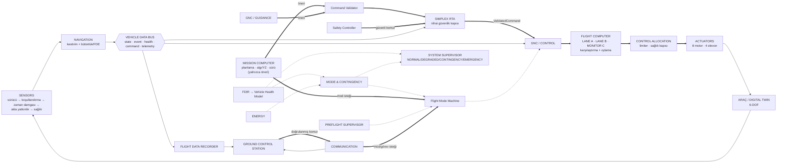

**Ana veri akışı (soldan sağa):** Sensörler / Görev → Durum + Navigasyon +
Sağlık → GNC / Gelişmiş otonomi (öneri) → RTA → Kontrol dağıtımı →
Eyleyici soyutlaması → Araç. Güvenlik, FDIR, enerji ve acil durum
**çapraz gözetim** bağlantılarıdır.

## 4. Ayrıntılı sistem mimarisi

Kayıttaki **tüm bileşenler** kendi alt grafiklerinde ve **grup içi tüm
bağlantılarıyla** çizilir. Okunabilirlik için gruplar arası bağlantılar
grup düzeyinde toplanır ve yalnızca iki tür omurga gösterilir:

* **Ana akış (soldan sağa):** GCS → Comm → Mission Computer, Sensors →
  Navigation → GNC → RTA → GNC/Control → Flight Computer şeritleri →
  Allocation → Actuators → (araç) → Sensors.
* **Çapraz gözetim (`-.->`):** RTA, FDIR, Energy, Mode & Contingency,
  Preflight ve System Supervisor kaynaklı bağlantılar.

Vehicle Data Bus bir merkez (hub) olduğundan bu görünümde **indirgenir**:
`X → BUS_k → Y` zinciri `X → Y` olarak çizilir. Veri yolu, zaman,
yapılandırma, uçuş kayıt cihazı ve dijital ikiz alt grafikleri alt sırada
yer alır; bunların tüm bağlantıları ve **her bağlantının etiketi** §5
yakınlaştırmalarında, aynı kayıttan üretilmiş olarak gösterilir.

<!-- BEGIN GENERATED: full -->
```mermaid
flowchart LR
  classDef implemented fill:#d7f5dd,stroke:#1a7f37,color:#0b3d1a;
  classDef partial fill:#fff4c2,stroke:#9a6700,color:#3d2e00;
  classDef planned fill:#eef0f3,stroke:#8c959f,color:#57606a,stroke-dasharray: 4 3;
  classDef gate fill:#ffd8d8,stroke:#cf222e,color:#5c0a0a,stroke-width:3px;
  classDef ext fill:#ffffff,stroke:#8c959f,color:#57606a;
  subgraph SEN["SENSORS"]
    direction TB
    subgraph SEN_INS["INERTIAL"]
      SEN_IMU_A["IMU A"]:::planned
      SEN_IMU_B["IMU B"]:::planned
      SEN_IMU_C["IMU C"]:::planned
      SEN_ACCEL_PROC["Accelerometer Processing"]:::planned
      SEN_GYRO_PROC["Gyro Processing"]:::planned
      SEN_BIAS_EST["IMU Bias Estimator"]:::planned
      SEN_VIB_MON["Vibration Monitor"]:::planned
    end
    subgraph SEN_AIR["AIR DATA"]
      SEN_BARO["Barometric Altitude"]:::implemented
      SEN_AIRSPEED["Airspeed Estimate"]:::implemented
      SEN_TEMP["Air Temperature"]:::partial
      SEN_PRESS_VALID["Pressure Validation"]:::implemented
    end
    subgraph SEN_POS["POSITION / NAVIGATION SOURCES"]
      SEN_GNSS["GNSS"]:::implemented
      SEN_VIO["VIO"]:::implemented
      SEN_TRN["TRN"]:::implemented
      SEN_MAGNAV["MagNav"]:::implemented
      SEN_CELESTIAL["Celestial Navigation"]:::planned
      SEN_INERTIAL_PROP["Inertial Propagation"]:::implemented
    end
    subgraph SEN_VH["VEHICLE HEALTH SENSORS"]
      SEN_ESC_TLM["ESC Telemetry"]:::partial
      SEN_RPM["Motor RPM"]:::implemented
      SEN_MOTOR_CURRENT["Motor Current"]:::planned
      SEN_MOTOR_TEMP["Motor Temperature"]:::planned
      SEN_ACT_POS["Actuator Position Feedback"]:::implemented
    end
    subgraph SEN_EN["ENERGY SENSORS"]
      SEN_BATT["Battery State"]:::partial
      SEN_FC["Fuel-Cell State"]:::partial
      SEN_SC["Supercapacitor State"]:::partial
      SEN_SOLAR["Solar Input Estimate"]:::partial
      SEN_BUS_VI["Bus Voltage/Current Monitor"]:::partial
    end
    subgraph SEN_PIPE["SENSOR PIPELINE"]
      SEN_DRIVER["Sensor Driver"]:::implemented
      SEN_COND["Signal Conditioning"]:::planned
      SEN_PLAUS["Plausibility Check"]:::implemented
      SEN_HEALTH["Sensor Health Status"]:::implemented
    end
  end
  subgraph MC["MISSION COMPUTER (yalnızca öneri, uçuş yetkisi yok)"]
    direction TB
    subgraph MC_PLAN["Görev planlama"]
      MC_MISSION_MGR["Mission Manager"]:::implemented
      MC_TASK_PLANNER["Task Planner"]:::planned
      MC_ROUTE_PLANNER["Route Planner"]:::partial
      MC_SEARCH_PATTERN["Search Pattern Generator"]:::planned
      MC_MISSION_DB["Mission Database"]:::partial
      MC_RULES["Mission Rules Engine"]:::planned
      MC_RTA_IF["RTA Proposal Interface"]:::implemented
      MC_HEALTH["Mission Health Monitor"]:::planned
    end
    subgraph MC_PERC["Algılama ve YZ"]
      MC_PERCEPTION_MGR["Perception Manager"]:::planned
      MC_AI_RUNTIME["AI Inference Runtime"]:::planned
      MC_SCENE["Object/Scene Understanding"]:::planned
      MC_TERRAIN["Terrain Analysis"]:::planned
      MC_MAPPING["Mapping"]:::planned
      MC_PAYLOAD_MGR["Payload Manager"]:::planned
    end
    subgraph MC_SWARM["Sürü"]
      MC_SWARM_COORD["Swarm Coordinator"]:::partial
      MC_CBBA["CBBA Task Allocator"]:::partial
      MC_MESH_COORD["Mesh Coordination"]:::planned
    end
  end
  subgraph NAV["NAVIGATION"]
    direction TB
    subgraph NAV_PIPE["Navigasyon hattı"]
      NAV_SRC_MGR["Navigation Source Manager"]:::implemented
      NAV_TIME_ALIGN["Measurement Time Alignment"]:::planned
      NAV_MEAS_VALID["Measurement Validation"]:::implemented
      NAV_ESTIMATOR["State Estimator"]:::partial
      NAV_SOLUTION["Navigation Solution"]:::implemented
      NAV_INTEGRITY["Integrity Monitor"]:::implemented
      NAV_PL["Protection Level Calculator"]:::implemented
      NAV_FD["Fault Detection"]:::implemented
      NAV_FE["Fault Exclusion"]:::implemented
      NAV_CONFIDENCE["Navigation Confidence"]:::implemented
      NAV_SUPERVISOR["Navigation Supervisor"]:::partial
    end
    subgraph NAV_MON["Kaynak izleyicileri"]
      NAV_MON_GNSS["GNSS Monitor"]:::planned
      NAV_MON_VIO["VIO Monitor"]:::planned
      NAV_MON_TRN["TRN Monitor"]:::planned
      NAV_MON_MAGNAV["MagNav Monitor"]:::planned
      NAV_MON_INERTIAL["Inertial Monitor"]:::partial
    end
  end
  subgraph GNC["GNC"]
    direction TB
    subgraph GNC_G["GUIDANCE"]
      G_MISSION["Mission Guidance"]:::implemented
      G_PATH["Path Manager"]:::partial
      G_WAYPOINT["Waypoint Manager"]:::implemented
      G_TRANSITION["Transition Guidance"]:::implemented
      G_RETURN["Return Guidance"]:::implemented
      G_LOITER["Loiter Guidance"]:::implemented
    end
    subgraph GNC_C["CONTROL"]
      C_ATT["Attitude Controller"]:::implemented
      C_VEL["Velocity Controller"]:::partial
      C_POS["Position Controller"]:::partial
      C_TRANS["Transition Controller"]:::implemented
      C_SAFETY["Safety Controller"]:::implemented
    end
  end
  subgraph RTA["SIMPLEX RTA"]
    direction TB
    subgraph RTA_PATH["Karar hattı"]
      RTA_VALIDATOR["Command Validator / Sanitizer"]:::implemented
      RTA_PREDICTOR["State Predictor"]:::implemented
      RTA_ENVELOPE["Safety Envelope Monitor"]:::implemented
      RTA_CONSTRAINT["Constraint Evaluator"]:::implemented
      RTA_FUTURE["Future State Checker"]:::implemented
      RTA_DECISION["Decision Logic"]:::implemented
      RTA_SELECTOR["RTA Command Selector"]:::gate
    end
    subgraph RTA_SUPPORT["Destek"]
      RTA_LOGGER["Intervention Logger"]:::implemented
      RTA_REASON["Reason Generator"]:::implemented
      RTA_LATCH["Latch Manager"]:::implemented
      RTA_HYST["Recovery Hysteresis"]:::implemented
      RTA_HEALTH["RTA Runtime Health"]:::planned
    end
  end
  subgraph LANEA["FLIGHT COMPUTER LANE A"]
    direction TB
    LA_INPUT["Input Manager"]:::partial
    LA_EST["State Estimation"]:::partial
    LA_GUID["Guidance"]:::partial
    LA_CTRL["Control"]:::partial
    LA_SAFETY["Safety Monitor"]:::gate
    LA_OUT["Output Proposal"]:::partial
  end
  subgraph LANEB["FLIGHT COMPUTER LANE B"]
    direction TB
    LB_INPUT["Input Manager"]:::planned
    LB_EST["State Estimation"]:::planned
    LB_GUID["Guidance"]:::planned
    LB_CTRL["Control"]:::planned
    LB_SAFETY["Safety Monitor"]:::gate
    LB_OUT["Output Proposal"]:::planned
  end
  subgraph LANEC["INDEPENDENT MONITOR (LANE C)"]
    direction TB
    LC_SENSORS["Independent Sensor Observation"]:::planned
    LC_CROSS["Cross-Lane Output Monitor"]:::planned
    LC_CMD_MON["Command Monitor"]:::planned
    LC_WATCHDOG["Watchdog"]:::planned
    LC_INTEGRITY["Integrity Checking"]:::planned
  end
  subgraph LANEM["LANE MANAGEMENT"]
    direction TB
    LANE_COMPARATOR["Lane Comparator"]:::partial
    LANE_VOTER["Lane Voter"]:::partial
    LANE_XDATA["Cross-Lane Data Monitor"]:::planned
    LANE_HEARTBEAT["Heartbeat Monitor"]:::planned
    LANE_TIMING["Timing Monitor"]:::planned
    LANE_DIVERGENCE["Divergence Detector"]:::partial
    LANE_ISOLATION["Lane Isolation Manager"]:::partial
  end
  subgraph ALLOC["CONTROL ALLOCATION"]
    direction TB
    AL_EFFECTIVENESS["Effectiveness Provider B(V, σ)"]:::implemented
    AL_ALLOCATOR["Control Mixer / Allocator"]:::implemented
    AL_HOVER_MARGIN["Control Authority Estimator"]:::implemented
    AL_LIMITER["Command Limiter"]:::implemented
    AL_CMD_MGR["Actuator Command Manager"]:::partial
    AL_HEALTH_GATE["Actuator Health Gate"]:::implemented
  end
  subgraph ACT["ACTUATORS (simülasyon soyutlaması)"]
    direction TB
    subgraph ACT_M["Motor Group"]
      ACT_M1U["Motor M1U"]:::implemented
      ACT_M2U["Motor M2U"]:::implemented
      ACT_M3U["Motor M3U"]:::implemented
      ACT_M4U["Motor M4U"]:::implemented
      ACT_M1L["Motor M1L"]:::implemented
      ACT_M2L["Motor M2L"]:::implemented
      ACT_M3L["Motor M3L"]:::implemented
      ACT_M4L["Motor M4L"]:::implemented
    end
    subgraph ACT_E["Elevon Group"]
      ACT_E1U["Elevon E1U"]:::implemented
      ACT_E2U["Elevon E2U"]:::implemented
      ACT_E1L["Elevon E1L"]:::implemented
      ACT_E2L["Elevon E2L"]:::implemented
    end
  end
  subgraph FDIR["FDIR"]
    direction TB
    subgraph FDIR_DOM["Alan FDIR"]
      FDIR_SENSOR["Sensor FDIR"]:::partial
      FDIR_MOTOR["Motor FDIR"]:::implemented
      FDIR_ACTUATOR["Actuator FDIR"]:::partial
      FDIR_NAV["Navigation FDIR"]:::implemented
      FDIR_POWER["Power FDIR"]:::partial
      FDIR_COMM["Communication FDIR"]:::partial
      FDIR_LANE["Computer/Lane FDIR"]:::partial
    end
    subgraph FDIR_PIPE["Ortak FDIR hattı"]
      FDIR_DETECT["Detection"]:::implemented
      FDIR_ISOLATE["Isolation"]:::implemented
      FDIR_CLASSIFY["Classification"]:::implemented
      FDIR_SCORE["Health Score"]:::implemented
      FDIR_RECOVERY["Recovery Recommendation"]:::partial
    end
    FDIR_SUP["FDIR Supervisor"]:::partial
    FDIR_VHM["Vehicle Health Model"]:::implemented
  end
  subgraph EN["ENERGY"]
    direction TB
    subgraph EN_SRC["Kaynak modelleri"]
      EN_FC_MODEL["Hydrogen Fuel Cell Model"]:::implemented
      EN_BATT_MODEL["Battery Model"]:::implemented
      EN_SC_MODEL["Supercapacitor Model"]:::implemented
      EN_SOLAR_MODEL["Solar Model"]:::partial
    end
    subgraph EN_MGMT["Güç yönetimi"]
      EN_SRC_MON["Energy Source Monitor"]:::implemented
      EN_AVAIL["Power Availability Estimator"]:::partial
      EN_DEMAND["Power Demand Predictor"]:::partial
      EN_ARBITRATION["Power Arbitration"]:::implemented
      EN_MANAGER["Energy Manager"]:::implemented
      EN_RESERVE["Reserve Estimator"]:::implemented
    end
    subgraph EN_SUPV["Enerji gözetimi"]
      EN_THERMAL["Thermal State"]:::planned
      EN_SRC_HEALTH["Source Health"]:::implemented
      EN_BUS_HEALTH["Bus Health"]:::partial
      EN_FAULT_DET["Energy Fault Detection"]:::partial
      EN_EMERGENCY_POLICY["Emergency Energy Policy"]:::implemented
    end
  end
  subgraph COMM["COMMUNICATION"]
    direction TB
    CO_GROUND["Ground Link Interface"]:::partial
    CO_MESH["Mesh Link Interface"]:::planned
    CO_V2V["Vehicle-to-Vehicle Interface"]:::planned
    CO_TLM_ROUTER["Telemetry Router"]:::planned
    CO_CMD_ROUTER["Command Router"]:::planned
    CO_MSG_VALID["Message Validation"]:::planned
    CO_AUTH["Authentication (abstraction)"]:::planned
    CO_SEQ["Sequence Checker"]:::planned
    CO_LINK_QUALITY["Link Quality Monitor"]:::planned
    CO_HEARTBEAT["Heartbeat"]:::partial
    CO_FAILOVER["Link Failover Manager"]:::planned
    CO_HEALTH["Communication Health"]:::partial
  end
  subgraph MODE["MODE & CONTINGENCY"]
    direction TB
    MD_FSM["Flight Mode Machine"]:::gate
    MD_TABLE["Transition Table"]:::implemented
    MD_CONTINGENCY["Contingency Manager"]:::implemented
    MD_RULES["Contingency Rule Table"]:::implemented
  end
  subgraph PRE["PREFLIGHT SUPERVISOR"]
    direction TB
    PRE_SUPERVISOR["Preflight Supervisor"]:::implemented
    PF_CONFIG["Configuration Check"]:::implemented
    PF_SENSOR["Sensor Health Check"]:::implemented
    PF_NAV["Navigation Check"]:::implemented
    PF_ENERGY["Energy Check"]:::implemented
    PF_CONTROL["Control Availability Check"]:::implemented
    PF_COMM["Communication Check"]:::implemented
    PF_MISSION["Mission Validation"]:::implemented
    PF_SAFETY["Safety Configuration Check"]:::implemented
  end
  subgraph SUP["SYSTEM SUPERVISOR"]
    direction TB
    SUP_SYSTEM["System Supervisor"]:::implemented
  end
  subgraph BUS["VEHICLE DATA BUS"]
    direction TB
    BUS_STATE["State Bus"]:::partial
    BUS_EVENT["Event Bus"]:::implemented
    BUS_HEALTH["Health Bus"]:::partial
    BUS_COMMAND["Command Bus"]:::partial
    BUS_TELEMETRY["Telemetry Bus"]:::partial
  end
  subgraph TIME["TIME & SYNCHRONIZATION"]
    direction TB
    TM_SIM_CLOCK["Simulation Clock"]:::implemented
    TM_SYSTEM_TIME["System Time"]:::planned
    TM_SENSOR_TS["Sensor Timestamp Manager"]:::partial
    TM_CONSISTENCY["Clock Consistency Monitor"]:::planned
    TM_SCHED["Scheduling Monitor"]:::partial
  end
  subgraph CFG["CONFIGURATION MANAGER"]
    direction TB
    CFG_MANAGER["Configuration Manager"]:::partial
    CFG_VEHICLE["Vehicle Configuration"]:::implemented
    CFG_MISSION["Mission Configuration"]:::implemented
    CFG_SAFETY["Safety Configuration"]:::implemented
    CFG_NAV["Navigation Configuration"]:::partial
    CFG_ENERGY["Energy Configuration"]:::partial
    CFG_SIM["Simulation Configuration"]:::implemented
  end
  subgraph FDR["FLIGHT DATA RECORDER"]
    direction TB
    FDR_STATE["State Recorder"]:::implemented
    FDR_EVENT["Event Recorder"]:::implemented
    FDR_HEALTH["Health Recorder"]:::implemented
    FDR_RTA["RTA Recorder"]:::implemented
    FDR_MODE["Mode Recorder"]:::implemented
    FDR_NAV["Navigation Recorder"]:::implemented
    FDR_ENERGY["Energy Recorder"]:::partial
    FDR_REPLAY_IF["Replay Interface"]:::implemented
    FDR_DIAG["Diagnostics"]:::implemented
    FDR_POSTFLIGHT["Post-flight Analysis"]:::implemented
  end
  subgraph DT["DIGITAL TWIN"]
    direction TB
    DT_VEHICLE["Vehicle Model"]:::implemented
    DT_6DOF["6-DOF Dynamics"]:::implemented
    DT_AERO["Aerodynamic Model"]:::implemented
    DT_PROP["Propulsion Model"]:::implemented
    DT_ACTUATOR["Actuator Model"]:::implemented
    DT_SENSOR["Sensor Model"]:::implemented
    DT_ENV["Environment Model"]:::implemented
    DT_ENERGY["Energy Model"]:::implemented
    DT_FAULT["Fault Injection"]:::implemented
    DT_SCENARIO["Scenario Engine"]:::implemented
    DT_ENGINE["Simulation Engine"]:::implemented
    DT_MC["Monte Carlo Runner"]:::implemented
    DT_REPLAY["Replay Engine"]:::implemented
    DT_METRICS["Metrics Engine"]:::implemented
  end
  subgraph GCS["GROUND CONTROL STATION"]
    direction TB
    GCS_OVERVIEW["Vehicle Overview"]:::planned
    GCS_MAP["Map"]:::planned
    GCS_MISSION_PLANNER["Mission Planner"]:::planned
    GCS_HEALTH["Health Panel"]:::planned
    GCS_NAV["Navigation Integrity Panel"]:::planned
    GCS_ENERGY["Energy Panel"]:::planned
    GCS_RTA["RTA Intervention Panel"]:::planned
    GCS_ALERTS["Alert Manager"]:::planned
    GCS_FLEET["Fleet/Swarm View"]:::planned
    GCS_REPLAY["Simulation Replay"]:::partial
    GCS_LOGS["Log Viewer"]:::partial
  end
  SEN_INS --> SEN_DRIVER
  SEN_AIR --> SEN_DRIVER
  SEN_POS --> SEN_DRIVER
  SEN_VH --> SEN_DRIVER
  SEN_EN --> SEN_DRIVER
  SEN_DRIVER --> SEN_COND
  SEN_COND --> SEN_ACCEL_PROC
  SEN_COND --> SEN_GYRO_PROC
  SEN_ACCEL_PROC --> SEN_BIAS_EST
  SEN_GYRO_PROC --> SEN_BIAS_EST
  SEN_ACCEL_PROC --> SEN_VIB_MON
  SEN_COND --> SEN_PRESS_VALID
  SEN_PLAUS --> SEN_HEALTH
  SEN_VIB_MON -.-> SEN_HEALTH
  NAV_SRC_MGR --> NAV_TIME_ALIGN
  NAV_TIME_ALIGN --> NAV_MEAS_VALID
  NAV_MEAS_VALID --> NAV_ESTIMATOR
  NAV_ESTIMATOR --> NAV_SOLUTION
  NAV_SOLUTION --> NAV_INTEGRITY
  NAV_INTEGRITY --> NAV_PL
  NAV_PL --> NAV_FD
  NAV_FD --> NAV_FE
  NAV_FE --> NAV_CONFIDENCE
  NAV_CONFIDENCE --> NAV_SUPERVISOR
  NAV_FE -.-> NAV_SRC_MGR
  NAV_MON_GNSS -.-> NAV_FD
  NAV_MON_VIO -.-> NAV_FD
  NAV_MON_TRN -.-> NAV_FD
  NAV_MON_MAGNAV -.-> NAV_FD
  NAV_MON_INERTIAL -.-> NAV_FD
  SEN_BIAS_EST --> SEN_INERTIAL_PROP
  MC_PERCEPTION_MGR --> MC_AI_RUNTIME
  MC_AI_RUNTIME --> MC_SCENE
  MC_SCENE --> MC_MAPPING
  MC_TERRAIN --> MC_MAPPING
  MC_MAPPING --> MC_TASK_PLANNER
  MC_PAYLOAD_MGR --> MC_PERCEPTION_MGR
  MC_MISSION_DB --> MC_MISSION_MGR
  MC_RULES -.-> MC_MISSION_MGR
  MC_MISSION_MGR --> MC_TASK_PLANNER
  MC_TASK_PLANNER --> MC_SEARCH_PATTERN
  MC_SEARCH_PATTERN --> MC_ROUTE_PLANNER
  MC_TASK_PLANNER --> MC_ROUTE_PLANNER
  MC_SWARM_COORD --> MC_CBBA
  MC_CBBA --> MC_TASK_PLANNER
  MC_MESH_COORD --> MC_SWARM_COORD
  MC_ROUTE_PLANNER ==> MC_RTA_IF
  G_WAYPOINT ==> G_PATH
  G_PATH ==> G_MISSION
  G_TRANSITION ==> C_TRANS
  RTA_VALIDATOR ==> RTA_PREDICTOR
  RTA_VALIDATOR ==> RTA_SELECTOR
  RTA_PREDICTOR --> RTA_FUTURE
  RTA_ENVELOPE --> RTA_CONSTRAINT
  RTA_FUTURE --> RTA_CONSTRAINT
  RTA_CONSTRAINT --> RTA_DECISION
  RTA_LATCH -.-> RTA_DECISION
  RTA_HYST -.-> RTA_DECISION
  RTA_DECISION -.-> RTA_SELECTOR
  RTA_DECISION --> RTA_REASON
  RTA_REASON --> RTA_LOGGER
  C_POS ==> C_ATT
  C_TRANS ==> C_ATT
  C_TRANS ==> C_VEL
  AL_EFFECTIVENESS --> AL_ALLOCATOR
  AL_EFFECTIVENESS --> AL_HOVER_MARGIN
  AL_ALLOCATOR ==> AL_LIMITER
  LA_INPUT --> LA_EST
  LA_EST --> LA_GUID
  LA_GUID ==> LA_CTRL
  LA_CTRL ==> LA_SAFETY
  LA_SAFETY ==> LA_OUT
  LB_INPUT --> LB_EST
  LB_EST --> LB_GUID
  LB_GUID ==> LB_CTRL
  LB_CTRL ==> LB_SAFETY
  LB_SAFETY ==> LB_OUT
  LC_SENSORS --> LC_CROSS
  LC_CROSS --> LC_CMD_MON
  LC_INTEGRITY -.-> LC_CMD_MON
  LANE_XDATA -.-> LANE_ISOLATION
  LANE_DIVERGENCE -.-> LANE_ISOLATION
  LANE_TIMING -.-> LANE_ISOLATION
  LANE_COMPARATOR ==> LANE_VOTER
  LANE_ISOLATION -.-> LANE_VOTER
  AL_CMD_MGR ==> AL_HEALTH_GATE
  FDIR_SENSOR -.-> FDIR_DETECT
  FDIR_MOTOR -.-> FDIR_DETECT
  FDIR_ACTUATOR -.-> FDIR_DETECT
  FDIR_NAV -.-> FDIR_DETECT
  FDIR_POWER -.-> FDIR_DETECT
  FDIR_COMM -.-> FDIR_DETECT
  FDIR_LANE -.-> FDIR_DETECT
  FDIR_DETECT -.-> FDIR_ISOLATE
  FDIR_ISOLATE -.-> FDIR_CLASSIFY
  FDIR_CLASSIFY -.-> FDIR_SCORE
  FDIR_SCORE -.-> FDIR_SUP
  FDIR_SUP -.-> FDIR_RECOVERY
  FDIR_SUP -.-> FDIR_VHM
  EN_FC_MODEL --> EN_SRC_MON
  EN_BATT_MODEL --> EN_SRC_MON
  EN_SC_MODEL --> EN_SRC_MON
  EN_SOLAR_MODEL --> EN_SRC_MON
  EN_SRC_MON --> EN_AVAIL
  EN_AVAIL --> EN_ARBITRATION
  EN_DEMAND --> EN_ARBITRATION
  EN_ARBITRATION --> EN_MANAGER
  EN_MANAGER --> EN_RESERVE
  EN_THERMAL -.-> EN_SRC_HEALTH
  EN_SRC_MON -.-> EN_SRC_HEALTH
  EN_SRC_HEALTH -.-> EN_FAULT_DET
  EN_MANAGER -.-> EN_BUS_HEALTH
  EN_BUS_HEALTH -.-> EN_FAULT_DET
  EN_EMERGENCY_POLICY -.-> EN_ARBITRATION
  CO_GROUND --> CO_MSG_VALID
  CO_MSG_VALID --> CO_AUTH
  CO_AUTH --> CO_SEQ
  CO_SEQ --> CO_CMD_ROUTER
  CO_MESH --> CO_V2V
  CO_TLM_ROUTER --> CO_GROUND
  CO_TLM_ROUTER --> CO_MESH
  CO_GROUND -.-> CO_LINK_QUALITY
  CO_HEARTBEAT -.-> CO_HEALTH
  CO_LINK_QUALITY -.-> CO_HEALTH
  CO_HEALTH -.-> CO_FAILOVER
  CO_FAILOVER -.-> CO_GROUND
  MD_TABLE -.-> MD_FSM
  MD_RULES -.-> MD_CONTINGENCY
  MD_CONTINGENCY -.-> MD_FSM
  PF_CONFIG -.-> PRE_SUPERVISOR
  PF_SENSOR -.-> PRE_SUPERVISOR
  PF_NAV -.-> PRE_SUPERVISOR
  PF_ENERGY -.-> PRE_SUPERVISOR
  PF_CONTROL -.-> PRE_SUPERVISOR
  PF_COMM -.-> PRE_SUPERVISOR
  PF_MISSION -.-> PRE_SUPERVISOR
  PF_SAFETY -.-> PRE_SUPERVISOR
  TM_SIM_CLOCK --> TM_SYSTEM_TIME
  TM_SYSTEM_TIME --> TM_SENSOR_TS
  TM_SENSOR_TS -.-> TM_CONSISTENCY
  CFG_VEHICLE --> CFG_MANAGER
  CFG_MISSION --> CFG_MANAGER
  CFG_SAFETY --> CFG_MANAGER
  CFG_NAV --> CFG_MANAGER
  CFG_ENERGY --> CFG_MANAGER
  CFG_SIM --> CFG_MANAGER
  FDR_STATE --> FDR_REPLAY_IF
  FDR_EVENT --> FDR_REPLAY_IF
  FDR_HEALTH --> FDR_REPLAY_IF
  FDR_RTA --> FDR_REPLAY_IF
  FDR_MODE --> FDR_REPLAY_IF
  FDR_NAV --> FDR_REPLAY_IF
  FDR_ENERGY --> FDR_REPLAY_IF
  FDR_REPLAY_IF --> FDR_DIAG
  FDR_DIAG --> FDR_POSTFLIGHT
  DT_SCENARIO --> DT_ENGINE
  DT_FAULT -.-> DT_ENGINE
  DT_MC --> DT_ENGINE
  DT_VEHICLE --> DT_6DOF
  DT_ENV --> DT_AERO
  DT_AERO --> DT_6DOF
  DT_ACTUATOR --> DT_PROP
  DT_PROP --> DT_6DOF
  DT_ENGINE --> DT_6DOF
  DT_6DOF --> DT_SENSOR
  DT_PROP --> DT_ENERGY
  DT_ENGINE --> DT_METRICS
  DT_REPLAY --> DT_METRICS
  GCS_ALERTS --> GCS_OVERVIEW
  SEN --> NAV
  SEN --> LANEC
  MC ==> GNC
  MC ==> RTA
  MC --> COMM
  NAV --> MC
  NAV --> GNC
  NAV --> RTA
  NAV --> LANEA
  NAV --> LANEB
  GNC ==> RTA
  GNC ==> ALLOC
  RTA ==> GNC
  RTA -.-> ALLOC
  RTA -.-> MODE
  RTA -.-> SUP
  LANEA ==> LANEM
  LANEB ==> LANEM
  LANEM ==> ALLOC
  ALLOC ==> LANEA
  ALLOC ==> LANEB
  ALLOC ==> ACT
  ACT --> SEN
  FDIR -.-> ALLOC
  FDIR -.-> MODE
  FDIR -.-> SUP
  EN -.-> MC
  EN -.-> GNC
  EN -.-> FDIR
  EN -.-> MODE
  EN -.-> PRE
  EN -.-> SUP
  COMM ==> MC
  COMM --> GCS
  MODE -.-> GNC
  MODE -.-> EN
  MODE -.-> SUP
  PRE -.-> MODE
  GCS ==> COMM
  BUS ~~~ TIME ~~~ CFG ~~~ FDR ~~~ DT
```
<!-- END GENERATED: full -->

## 5. Alt sistem yakınlaştırmaları

Her yakınlaştırma, grubun tüm bileşenlerini ve gruba giren/çıkan bağlantıları (dış uçlar beyaz kutu, grup adı italik) gösterir.

### 5.1 SENSORS — Algılama katmanı

Hiçbir sensör doğrudan uçuş kontrolcüsüne bağlanmaz. Her ölçüm
**Sensor Driver → Signal Conditioning → Timestamp → Plausibility Check →
Sensor Health → Fusion** zincirinden geçer. Ataletsel alt grup kendi işleme
basamaklarına (ivme/jiroskop işleme, sapma kestirimi, titreşim izleme) sahiptir;
konum kaynakları kaynak izleyicilerine ve navigasyon hattına, araç sağlık
sensörleri FDIR'e, enerji sensörleri enerji kaynak izleyicisine akar.
Simülasyonda sensör verisi dijital ikizin sensör modelinden gelir.

<!-- BEGIN GENERATED: zoom-SEN -->
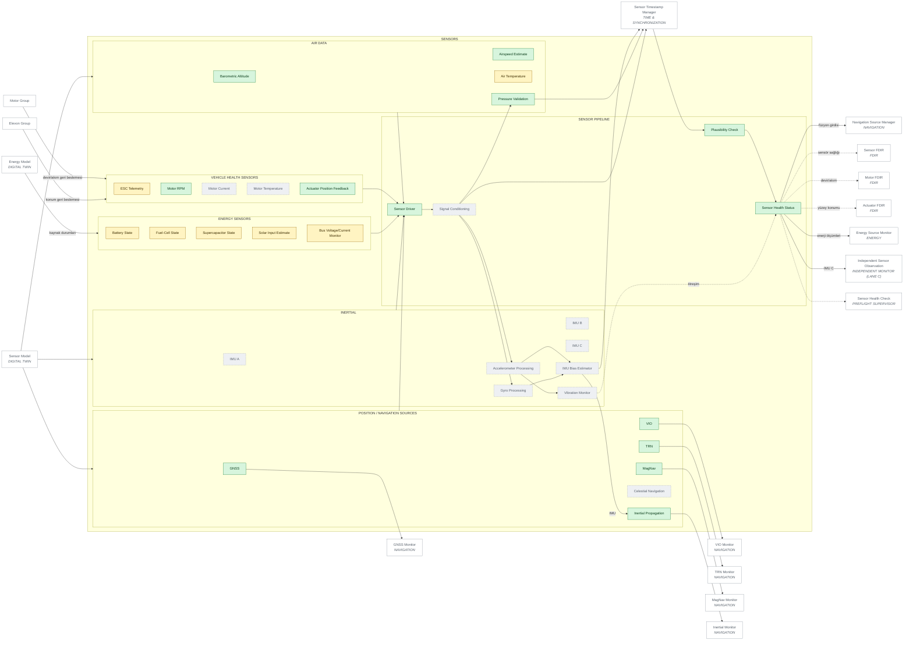
<!-- END GENERATED: zoom-SEN -->

### 5.2 NAVIGATION — Navigasyon hattı

**Source Manager → Time Alignment → Measurement Validation → State
Estimator → Navigation Solution → Integrity Monitor → Protection Level →
Fault Detection → Fault Exclusion → Confidence → Navigation Supervisor.**
Kaynağa özgü izleyiciler (GNSS/VIO/TRN/MagNav/Inertial) arıza tespitine
gözetim girdisi verir. Navigation Supervisor çıktısı: konum, hız, tutum,
güven, koruma seviyesi, aktif/dışlanan kaynaklar ve bütünlük durumu.
Bütünlük için en az iki bağımsız kaynak gerekir; çözüm yokken bütünlük asla
varsayılmaz.

<!-- BEGIN GENERATED: zoom-NAV -->
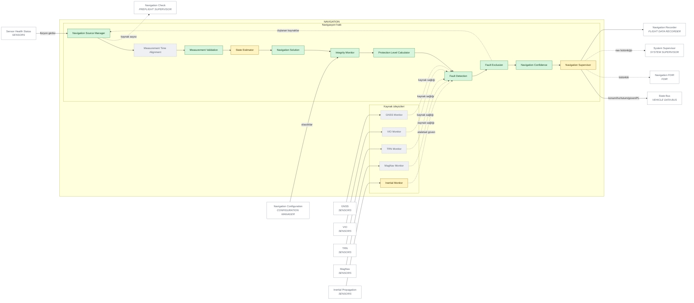
<!-- END GENERATED: zoom-NAV -->

### 5.3 MISSION COMPUTER (yalnızca öneri, uçuş yetkisi yok) — Görev bilgisayarı (öneri katmanı)

Görev bilgisayarı **güvenlik-kritik yetkiye sahip değildir**. Görev
planlama, algılama/YZ ve sürü alt grupları yalnızca iki çıktı üretir:
(1) **RTA Proposal Interface** üzerinden `Command` önerisi → Command Validator
→ Simplex RTA; (2) **Flight Mode Machine**'e nominal mod isteği (yalnızca
tablodaki geçişler kabul edilir). Hiçbir görev bilgisayarı bloğunun kontrol,
dağıtım ya da eyleyici bloklarına bağlantısı yoktur; bu, kayıttaki kenarlar
üzerinde graf analiziyle test edilir. Algılama sınıfları sivil görevlerle
sınırlıdır (termal anomali, duman, yapısal hasar).

<!-- BEGIN GENERATED: zoom-MC -->
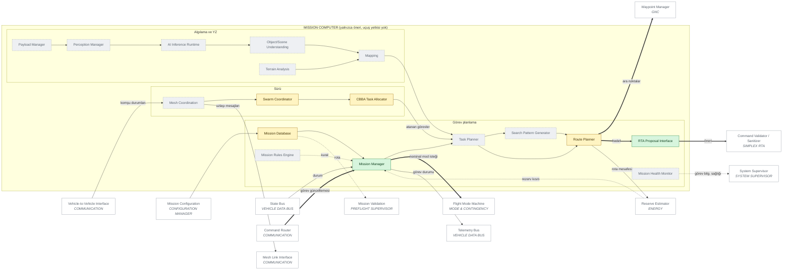
<!-- END GENERATED: zoom-MC -->

### 5.4 GNC — Güdüm ve kontrol

Klasik GNC ayrımı: **Guidance** (görev, yol, ara nokta, geçiş, dönüş,
bekleme) ve **Control** (tutum, hız, konum, geçiş kontrolcüleri, güvenlik
kontrolcüsü). Navigasyon ayrı gruptadır (State Estimator, Integrity
Monitor). Görev/dönüş/bekleme güdümü *öneri* üretir ve RTA'dan geçer; geçiş
güdümü deterministik, uçuş-kritik bir programdır ve doğrudan geçiş
kontrolcüsünü besler. Kontrolcüler simülasyon amaçlıdır, gerçek araç kazancı
değildir.

<!-- BEGIN GENERATED: zoom-GNC -->
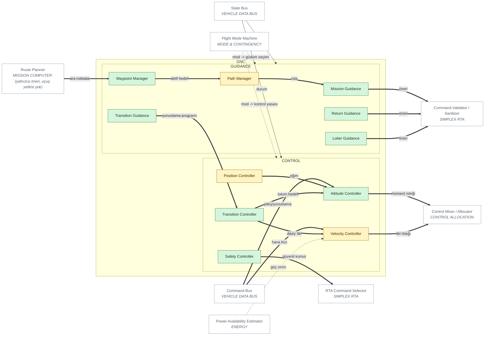
<!-- END GENERATED: zoom-GNC -->

### 5.5 SIMPLEX RTA — Simplex RTA iç mimarisi

Gelişmiş komut: **Command Validator → State Predictor → Future State
Checker / Safety Envelope Monitor → Constraint Evaluator → Decision Logic →
RTA Command Selector.** Diğer kolda **Safety Controller → güvenli komut**.
Seçici, kontrol katmanının kabul ettiği tek komut tipi olan mühürlü
`ValidatedCommand`'ı üretir. Destek blokları: Intervention Logger, Reason
Generator, Latch Manager, Recovery Hysteresis, Runtime Health.

<!-- BEGIN GENERATED: zoom-RTA -->
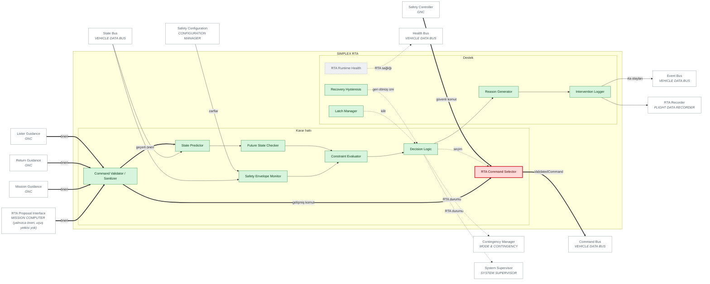
<!-- END GENERATED: zoom-RTA -->

### 5.6 FLIGHT COMPUTER LANE A — Uçuş bilgisayarı şerit A

Şerit A; Input Manager → State Estimation → Guidance → Control →
Safety Monitor → Output Proposal bölümlemesine sahiptir. Bölümler,
navigasyon, GNC, RTA ve dağıtım işlevlerini **barındırır** (kayıtta bu
ilişki çoğaltılmış blok olarak değil, şerit bölümü olarak gösterilir).
Simülasyon bugün tek şerit koşturur; şerit A bu yüzden PARTIAL'dır.

<!-- BEGIN GENERATED: zoom-LANEA -->
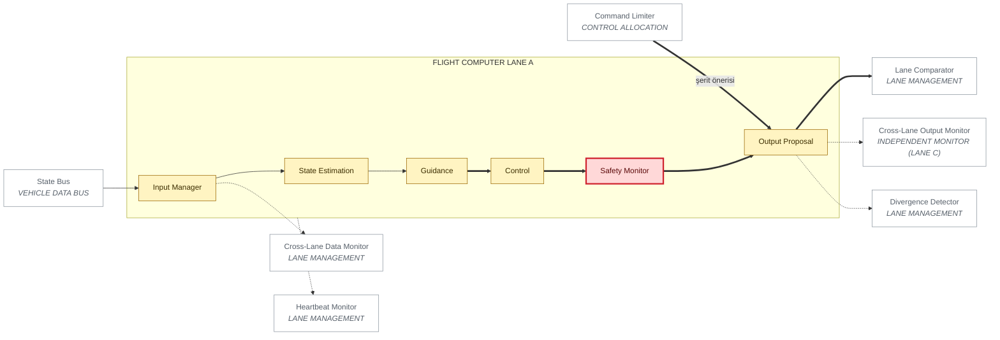
<!-- END GENERATED: zoom-LANEA -->

### 5.7 FLIGHT COMPUTER LANE B — Uçuş bilgisayarı şerit B

Şerit A ile aynı bölümleme; farklı işlemci mimarisi ve farklı dilde
bağımsız uygulama hedeflenir (docs/04). Tamamı PLANNED.

<!-- BEGIN GENERATED: zoom-LANEB -->
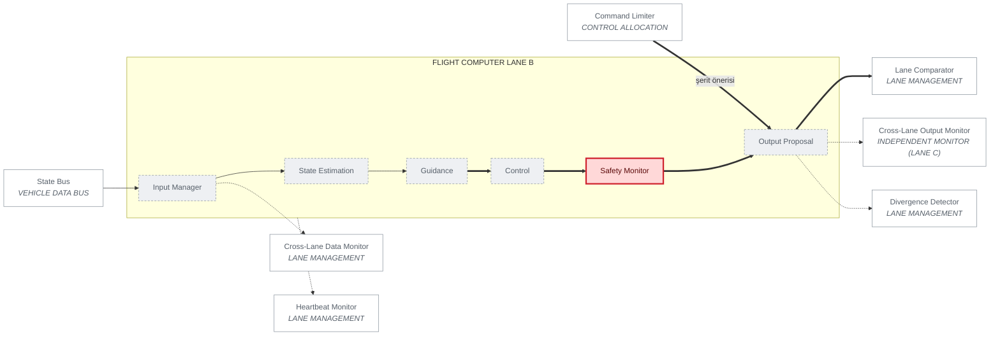
<!-- END GENERATED: zoom-LANEB -->

### 5.8 INDEPENDENT MONITOR (LANE C) — Bağımsız monitör (şerit C)

Komuta yetkisi yoktur: bağımsız sensör gözlemi, şeritler arası çıktı
izleme, komut izleme, watchdog ve bütünlük denetimi yapar; sonuçlarını
şerit yalıtım yöneticisine verir.

<!-- BEGIN GENERATED: zoom-LANEC -->
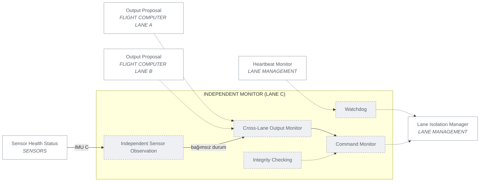
<!-- END GENERATED: zoom-LANEC -->

### 5.9 LANE MANAGEMENT — Şerit yönetimi

**Lane A / Lane B → Lane Comparator → Lane Voter.** Cross-Lane Data
Monitor, Heartbeat Monitor, Timing Monitor ve Divergence Detector, Lane
Isolation Manager'ı besler. Şerit durumları: NOMINAL → DEGRADED → ISOLATED
→ FAILED (aşağıdaki durum diyagramı). Bugün `TripleLaneVoter` orta değer
oylaması ve kalıcı ayrışmada yalıtımı uygular; simülasyona bağlı değildir.

<!-- BEGIN GENERATED: zoom-LANEM -->
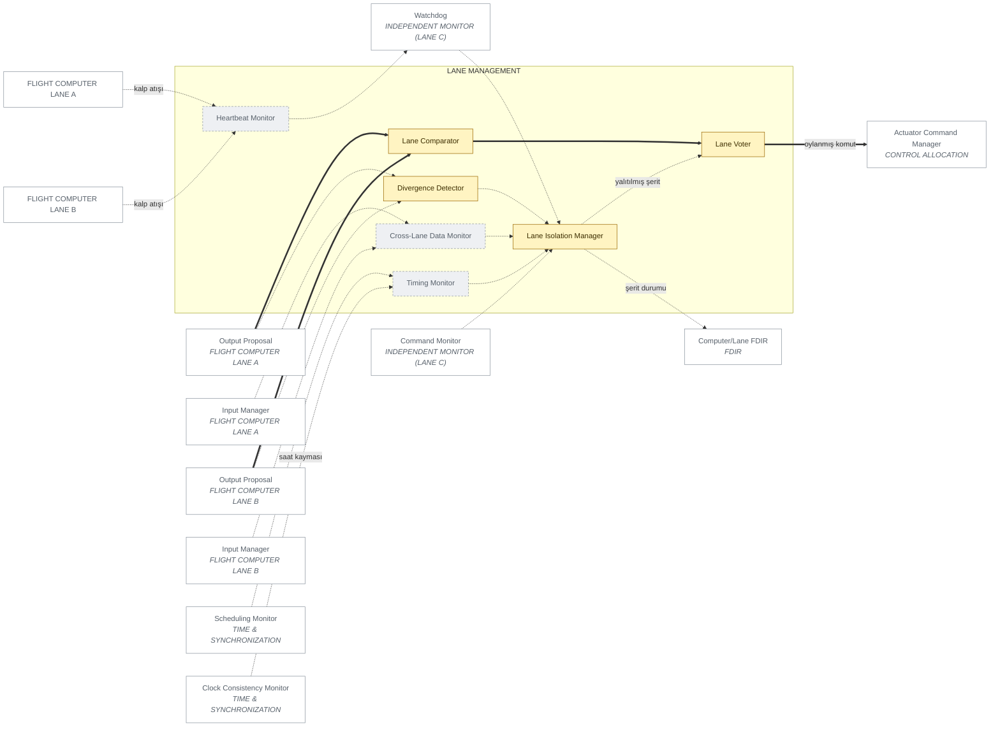
<!-- END GENERATED: zoom-LANEM -->

Şerit durum makinesi (hedef; bugün yalnızca ISOLATED uygulanır):

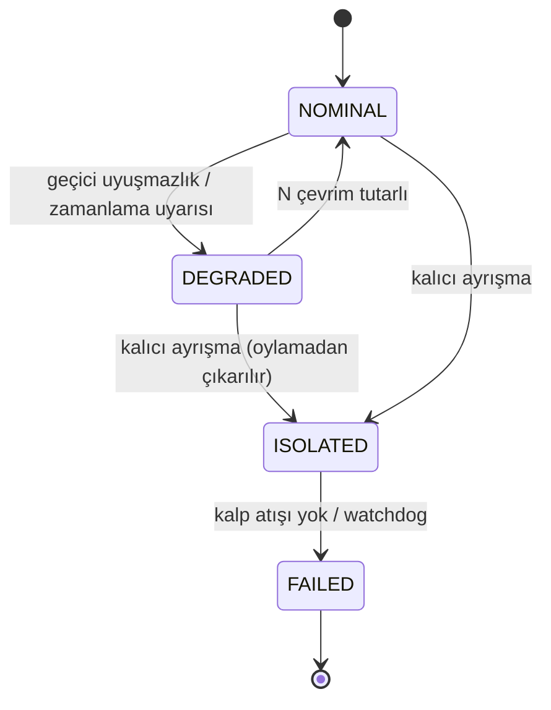

### 5.10 CONTROL ALLOCATION — Kontrol dağıtımı

**Control Allocation → Command Limiter → (şerit çıktıları ve oylama) →
Actuator Command Manager → Actuator Health Gate.** Etkinlik matrisi uçuş
rejimine bağlıdır (B(V, σ)); FAILED eyleyici dağıtım dışında kalır (komut 0).
Control Authority Estimator askı marjını acil durum yöneticisine ve araç
sağlık modeline verir.

<!-- BEGIN GENERATED: zoom-ALLOC -->
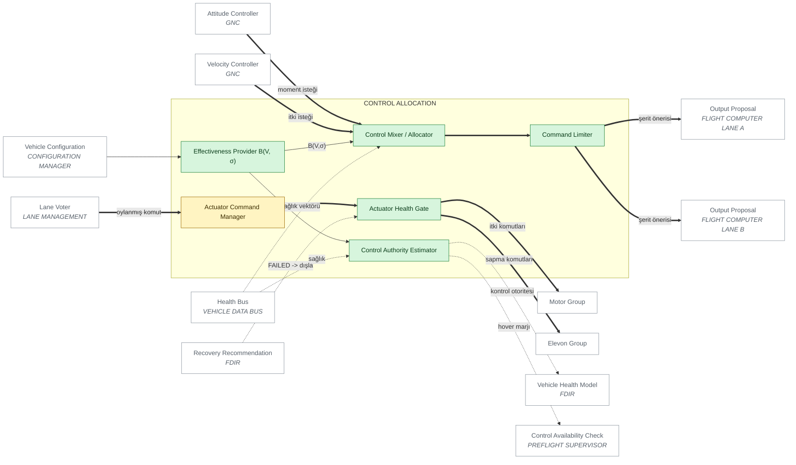
<!-- END GENERATED: zoom-ALLOC -->

### 5.11 ACTUATORS (simülasyon soyutlaması) — Eyleyiciler

Sekiz motor (M1U–M4U, M1L–M4L) ve dört elevon (E1U, E2U, E1L, E2L).
Bunlar **simülasyon soyutlamasıdır** (gecikme, birinci derece tepki, doyma,
DEGRADED/STUCK/OFFLINE arıza modları); sürücü protokolü, ESC ayarı ya da
uçuşa hazır eyleyici ayarı içermez.

<!-- BEGIN GENERATED: zoom-ACT -->
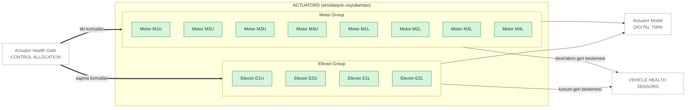
<!-- END GENERATED: zoom-ACT -->

### 5.12 FDIR — FDIR omurgası

FDIR Supervisor altında yedi alan FDIR'i (sensör, motor, eyleyici,
navigasyon, güç, haberleşme, bilgisayar/şerit) ortak **Detection →
Isolation → Classification → Health Score → Recovery Recommendation**
hattını kullanır. Sonuçlar **Vehicle Health Model**'de birleşir
(NOMINAL / DEGRADED / FAILED / UNKNOWN; UNKNOWN asla NOMINAL sayılmaz).
Modellenmeyen alanlar (bilgisayar şeritleri) açıkça `not_modeled` olarak
raporlanır.

<!-- BEGIN GENERATED: zoom-FDIR -->
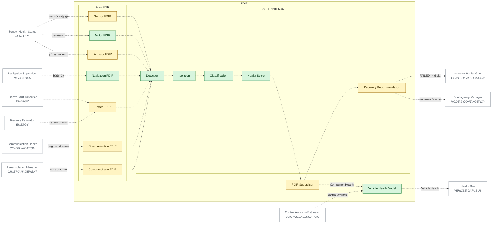
<!-- END GENERATED: zoom-FDIR -->

### 5.13 ENERGY — Enerji mimarisi

**Kaynak modelleri (H2 yakıt hücresi, batarya, süperkap, güneş) → Energy
Source Monitor → Power Availability → (Power Demand) → Power Arbitration →
Energy Manager → Reserve Estimator.** Gözetim: Thermal State, Source Health,
Bus Health, Energy Fault Detection, Emergency Energy Policy. Enerji;
görev yöneticisi (rezerv kısıtı), acil durum yöneticisi (eve dönüş/iniş
enerjisi), kontrol (güç sınırı) ve araç sağlık modeli ile bağlantılıdır.
Hidrojen sisteminin fiziksel kurulumu/dolumu kapsam dışıdır.

<!-- BEGIN GENERATED: zoom-EN -->
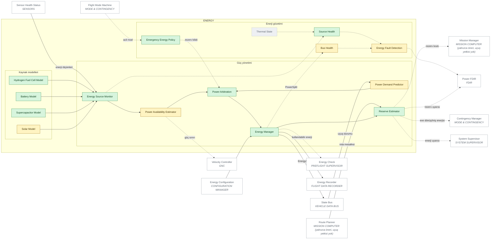
<!-- END GENERATED: zoom-EN -->

### 5.14 COMMUNICATION — Haberleşme

Yer, mesh ve araçlar arası arayüzler; telemetri ve komut yönlendirme;
mesaj doğrulama, kimlik doğrulama soyutlaması, sıra denetimi, bağlantı
kalitesi, kalp atışı, yedek bağlantıya geçiş ve haberleşme sağlığı.
Yer komutları yalnızca doğrulama zincirinden geçip **mod makinesine** ya
da **görev yöneticisine** yönlenir; kontrol katmanına doğrudan yol yoktur.
Radyo frekansı ya da bozma/atlatma teknikleri kapsam dışıdır.

<!-- BEGIN GENERATED: zoom-COMM -->
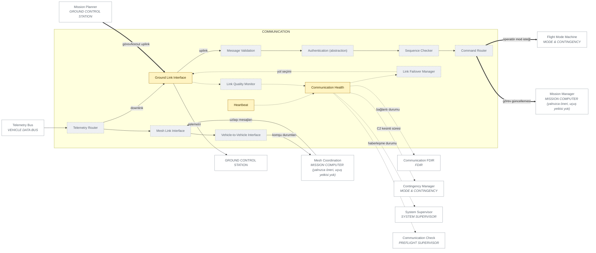
<!-- END GENERATED: zoom-COMM -->

### 5.15 MODE & CONTINGENCY — Mod ve acil durum

Flight Mode Machine 13 modu yalnızca geçiş tablosundaki geçişlerle
değiştirir. Contingency Manager; navigasyon sağlığı, enerji durumu, araç
sağlığı, kontrol otoritesi, haberleşme durumu ve RTA durumunu girdi alır
ve **önerilen güvenli modu** üretir (öncelik tablosu docs/08 §3).

<!-- BEGIN GENERATED: zoom-MODE -->
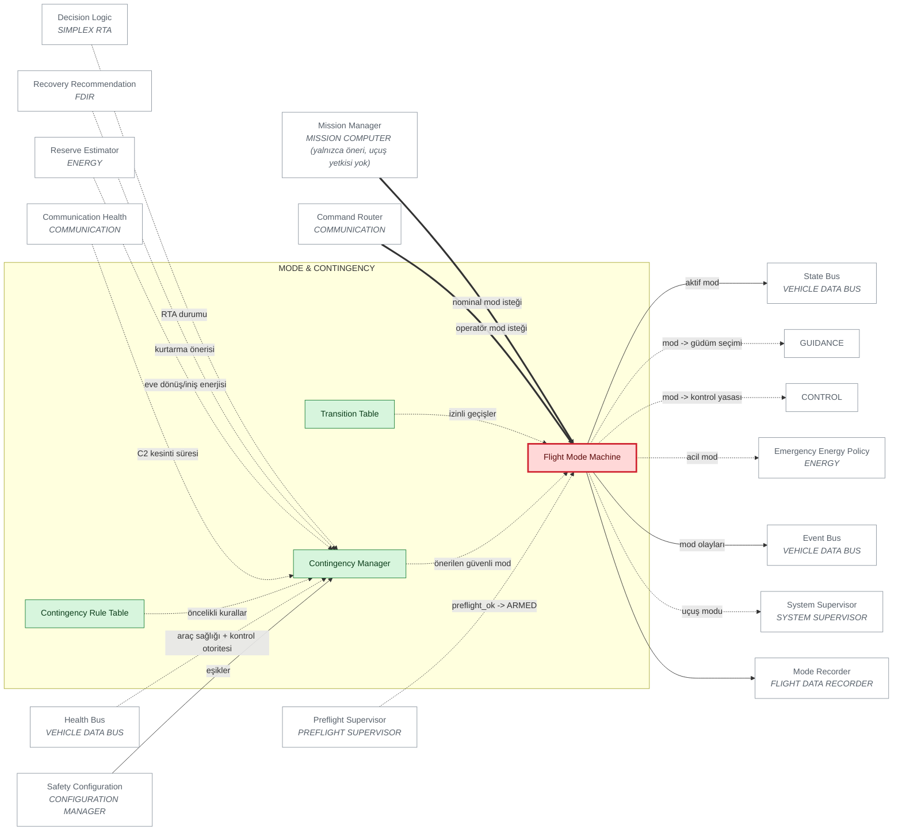
<!-- END GENERATED: zoom-MODE -->

### 5.16 PREFLIGHT SUPERVISOR — Uçuş öncesi denetçi

Sekiz kontrol (yapılandırma, sensör sağlığı, navigasyon, enerji, kontrol
otoritesi, haberleşme, görev doğrulama, güvenlik yapılandırması) geçmeden
`preflight_ok` açılmaz ve **ARMED durumuna izin verilmez**.

<!-- BEGIN GENERATED: zoom-PRE -->
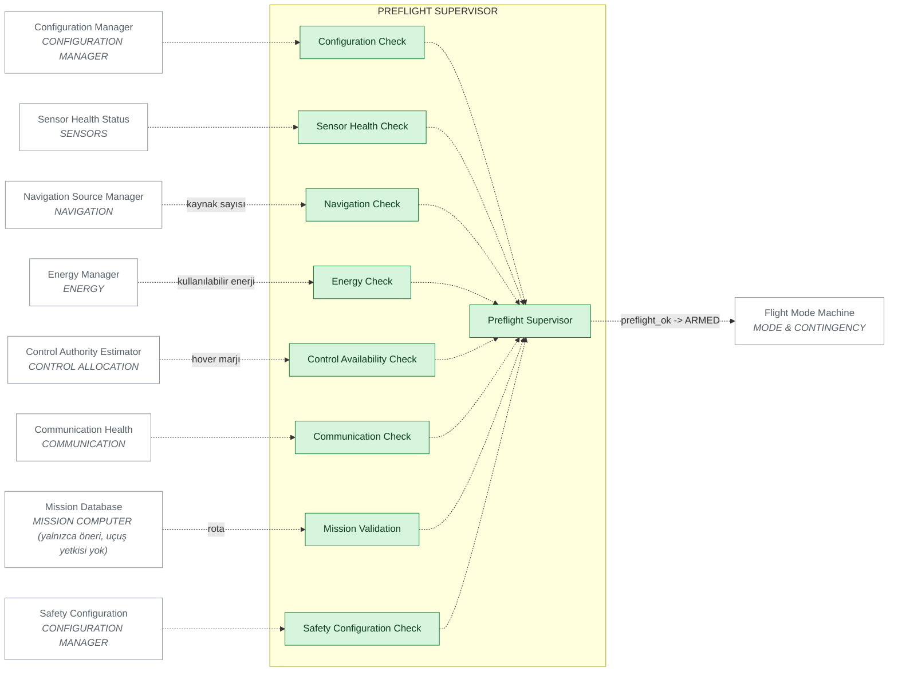
<!-- END GENERATED: zoom-PRE -->

### 5.17 SYSTEM SUPERVISOR — Sistem denetçisi

En üst seviye denetçi motor sürmez ve mod değiştirmez; uçuş modu, araç
sağlığı, navigasyon bütünlüğü, enerji, RTA ve haberleşme bilgisini
birleştirip **NORMAL / DEGRADED / CONTINGENCY / EMERGENCY** durumunu üretir.

<!-- BEGIN GENERATED: zoom-SUP -->
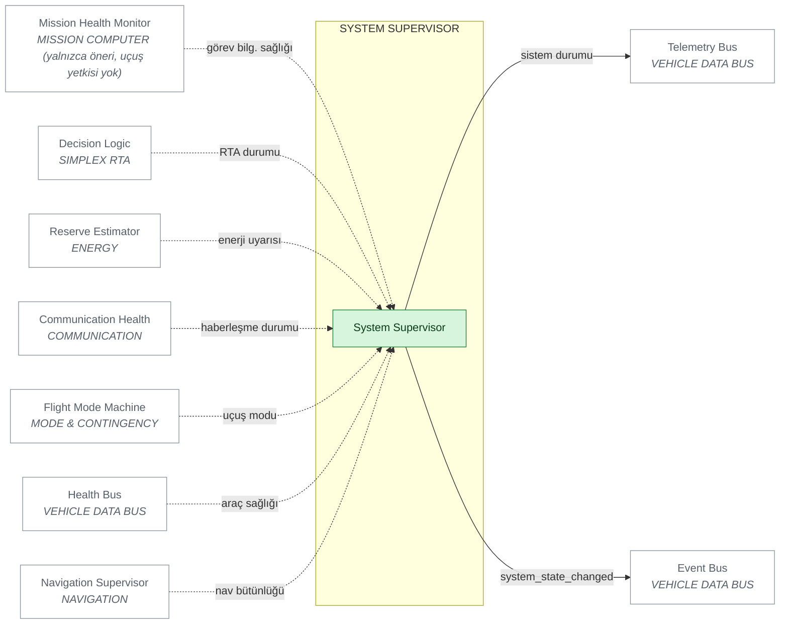
<!-- END GENERATED: zoom-SUP -->

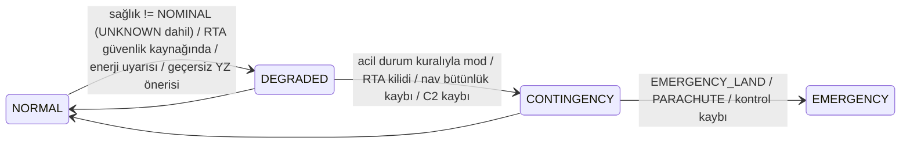

### 5.18 VEHICLE DATA BUS — Araç veri yolu

Modüller birbirine doğrudan değil, mantıksal kanallar üzerinden bağlanır:
State Bus, Event Bus, Health Bus, Command Bus, Telemetry Bus. Bugün Event
Bus gerçek bir yayın/abone yapısıdır; diğerleri süreç içi tipli nesnelerdir
(fiziksel veri yolu implementasyonu değildir).

<!-- BEGIN GENERATED: zoom-BUS -->
```mermaid
flowchart LR
  classDef implemented fill:#d7f5dd,stroke:#1a7f37,color:#0b3d1a;
  classDef partial fill:#fff4c2,stroke:#9a6700,color:#3d2e00;
  classDef planned fill:#eef0f3,stroke:#8c959f,color:#57606a,stroke-dasharray: 4 3;
  classDef gate fill:#ffd8d8,stroke:#cf222e,color:#5c0a0a,stroke-width:3px;
  classDef ext fill:#ffffff,stroke:#8c959f,color:#57606a;
  subgraph BUS["VEHICLE DATA BUS"]
    direction TB
    BUS_STATE["State Bus"]:::partial
    BUS_EVENT["Event Bus"]:::implemented
    BUS_HEALTH["Health Bus"]:::partial
    BUS_COMMAND["Command Bus"]:::partial
    BUS_TELEMETRY["Telemetry Bus"]:::partial
  end
  NAV_SUPERVISOR["Navigation Supervisor<br/><i>NAVIGATION</i>"]:::ext
  EN_MANAGER["Energy Manager<br/><i>ENERGY</i>"]:::ext
  MD_FSM["Flight Mode Machine<br/><i>MODE & CONTINGENCY</i>"]:::ext
  LA_INPUT["Input Manager<br/><i>FLIGHT COMPUTER LANE A</i>"]:::ext
  LB_INPUT["Input Manager<br/><i>FLIGHT COMPUTER LANE B</i>"]:::ext
  GNC_G["GUIDANCE"]:::ext
  GNC_C["CONTROL"]:::ext
  RTA_PREDICTOR["State Predictor<br/><i>SIMPLEX RTA</i>"]:::ext
  RTA_ENVELOPE["Safety Envelope Monitor<br/><i>SIMPLEX RTA</i>"]:::ext
  MC_MISSION_MGR["Mission Manager<br/><i>MISSION COMPUTER (yalnızca öneri, uçuş yetkisi yok)</i>"]:::ext
  EN_DEMAND["Power Demand Predictor<br/><i>ENERGY</i>"]:::ext
  RTA_LOGGER["Intervention Logger<br/><i>SIMPLEX RTA</i>"]:::ext
  RTA_HEALTH["RTA Runtime Health<br/><i>SIMPLEX RTA</i>"]:::ext
  RTA_SELECTOR["RTA Command Selector<br/><i>SIMPLEX RTA</i>"]:::ext
  C_ATT["Attitude Controller<br/><i>GNC</i>"]:::ext
  C_VEL["Velocity Controller<br/><i>GNC</i>"]:::ext
  AL_ALLOCATOR["Control Mixer / Allocator<br/><i>CONTROL ALLOCATION</i>"]:::ext
  AL_HOVER_MARGIN["Control Authority Estimator<br/><i>CONTROL ALLOCATION</i>"]:::ext
  FDIR_VHM["Vehicle Health Model<br/><i>FDIR</i>"]:::ext
  CO_TLM_ROUTER["Telemetry Router<br/><i>COMMUNICATION</i>"]:::ext
  MD_CONTINGENCY["Contingency Manager<br/><i>MODE & CONTINGENCY</i>"]:::ext
  SUP_SYSTEM["System Supervisor<br/><i>SYSTEM SUPERVISOR</i>"]:::ext
  FDR_STATE["State Recorder<br/><i>FLIGHT DATA RECORDER</i>"]:::ext
  FDR_EVENT["Event Recorder<br/><i>FLIGHT DATA RECORDER</i>"]:::ext
  FDR_HEALTH["Health Recorder<br/><i>FLIGHT DATA RECORDER</i>"]:::ext
  DT_VEHICLE["Vehicle Model<br/><i>DIGITAL TWIN</i>"]:::ext
  NAV_SUPERVISOR -->|"konum/hız/tutum/güven/PL"| BUS_STATE
  EN_MANAGER -->|"EnergyState"| BUS_STATE
  MD_FSM -->|"aktif mod"| BUS_STATE
  BUS_STATE --> LA_INPUT
  BUS_STATE --> LB_INPUT
  BUS_STATE -->|"durum"| GNC_G
  BUS_STATE -->|"durum"| GNC_C
  BUS_STATE --> RTA_PREDICTOR
  BUS_STATE --> RTA_ENVELOPE
  BUS_STATE -->|"durum"| MC_MISSION_MGR
  BUS_STATE -->|"uçuş durumu"| EN_DEMAND
  MC_MISSION_MGR -->|"görev durumu"| BUS_TELEMETRY
  RTA_LOGGER -->|"rta olayları"| BUS_EVENT
  RTA_HEALTH -.->|"RTA sağlığı"| BUS_HEALTH
  RTA_SELECTOR ==>|"ValidatedCommand"| BUS_COMMAND
  BUS_COMMAND ==>|"yatış/yunuslama"| C_ATT
  BUS_COMMAND ==>|"hava hızı"| C_VEL
  BUS_HEALTH -.->|"sağlık vektörü"| AL_ALLOCATOR
  BUS_HEALTH -.->|"sağlık"| AL_HOVER_MARGIN
  FDIR_VHM -.->|"VehicleHealth"| BUS_HEALTH
  BUS_TELEMETRY --> CO_TLM_ROUTER
  BUS_HEALTH -.->|"araç sağlığı + kontrol otoritesi"| MD_CONTINGENCY
  MD_FSM -->|"mod olayları"| BUS_EVENT
  BUS_HEALTH -.->|"araç sağlığı"| SUP_SYSTEM
  SUP_SYSTEM -->|"sistem durumu"| BUS_TELEMETRY
  SUP_SYSTEM -->|"system_state_changed"| BUS_EVENT
  BUS_STATE --> FDR_STATE
  BUS_EVENT --> FDR_EVENT
  BUS_HEALTH --> FDR_HEALTH
  BUS_HEALTH -.->|"sağlık parametreleri"| DT_VEHICLE
```
<!-- END GENERATED: zoom-BUS -->

### 5.19 TIME & SYNCHRONIZATION — Zaman ve senkronizasyon

Simulation Clock (monoton, sabit adım), System Time, Sensor Timestamp
Manager, Clock Consistency Monitor ve Scheduling Monitor. Sensör füzyonu
ve üçlü şerit karşılaştırması zaman tutarlılığına dayanır.

<!-- BEGIN GENERATED: zoom-TIME -->
```mermaid
flowchart LR
  classDef implemented fill:#d7f5dd,stroke:#1a7f37,color:#0b3d1a;
  classDef partial fill:#fff4c2,stroke:#9a6700,color:#3d2e00;
  classDef planned fill:#eef0f3,stroke:#8c959f,color:#57606a,stroke-dasharray: 4 3;
  classDef gate fill:#ffd8d8,stroke:#cf222e,color:#5c0a0a,stroke-width:3px;
  classDef ext fill:#ffffff,stroke:#8c959f,color:#57606a;
  subgraph TIME["TIME & SYNCHRONIZATION"]
    direction TB
    TM_SIM_CLOCK["Simulation Clock"]:::implemented
    TM_SYSTEM_TIME["System Time"]:::planned
    TM_SENSOR_TS["Sensor Timestamp Manager"]:::partial
    TM_CONSISTENCY["Clock Consistency Monitor"]:::planned
    TM_SCHED["Scheduling Monitor"]:::partial
  end
  SEN_COND["Signal Conditioning<br/><i>SENSORS</i>"]:::ext
  SEN_BIAS_EST["IMU Bias Estimator<br/><i>SENSORS</i>"]:::ext
  SEN_PRESS_VALID["Pressure Validation<br/><i>SENSORS</i>"]:::ext
  SEN_PLAUS["Plausibility Check<br/><i>SENSORS</i>"]:::ext
  LANE_TIMING["Timing Monitor<br/><i>LANE MANAGEMENT</i>"]:::ext
  SEN_COND --> TM_SENSOR_TS
  SEN_BIAS_EST --> TM_SENSOR_TS
  SEN_PRESS_VALID --> TM_SENSOR_TS
  TM_SENSOR_TS --> SEN_PLAUS
  TM_SCHED -.-> LANE_TIMING
  TM_SIM_CLOCK --> TM_SYSTEM_TIME
  TM_SYSTEM_TIME --> TM_SENSOR_TS
  TM_SENSOR_TS -.-> TM_CONSISTENCY
  TM_CONSISTENCY -.->|"saat kayması"| LANE_TIMING
```
<!-- END GENERATED: zoom-TIME -->

### 5.20 CONFIGURATION MANAGER — Yapılandırma yönetimi

Araç, görev, güvenlik, navigasyon, enerji ve simülasyon yapılandırmaları.
Güvenlik açısından kritik olanlar değişmez (frozen) nesnelerdir; çalışma
sırasında değiştirilemez (testli). Navigasyon ve enerji yapılandırması
henüz değişebilir dataclass'tır (PARTIAL).

<!-- BEGIN GENERATED: zoom-CFG -->
```mermaid
flowchart LR
  classDef implemented fill:#d7f5dd,stroke:#1a7f37,color:#0b3d1a;
  classDef partial fill:#fff4c2,stroke:#9a6700,color:#3d2e00;
  classDef planned fill:#eef0f3,stroke:#8c959f,color:#57606a,stroke-dasharray: 4 3;
  classDef gate fill:#ffd8d8,stroke:#cf222e,color:#5c0a0a,stroke-width:3px;
  classDef ext fill:#ffffff,stroke:#8c959f,color:#57606a;
  subgraph CFG["CONFIGURATION MANAGER"]
    direction TB
    CFG_MANAGER["Configuration Manager"]:::partial
    CFG_VEHICLE["Vehicle Configuration"]:::implemented
    CFG_MISSION["Mission Configuration"]:::implemented
    CFG_SAFETY["Safety Configuration"]:::implemented
    CFG_NAV["Navigation Configuration"]:::partial
    CFG_ENERGY["Energy Configuration"]:::partial
    CFG_SIM["Simulation Configuration"]:::implemented
  end
  PF_CONFIG["Configuration Check<br/><i>PREFLIGHT SUPERVISOR</i>"]:::ext
  PF_SAFETY["Safety Configuration Check<br/><i>PREFLIGHT SUPERVISOR</i>"]:::ext
  AL_EFFECTIVENESS["Effectiveness Provider B(V, σ)<br/><i>CONTROL ALLOCATION</i>"]:::ext
  RTA_ENVELOPE["Safety Envelope Monitor<br/><i>SIMPLEX RTA</i>"]:::ext
  MD_CONTINGENCY["Contingency Manager<br/><i>MODE & CONTINGENCY</i>"]:::ext
  NAV_INTEGRITY["Integrity Monitor<br/><i>NAVIGATION</i>"]:::ext
  EN_MANAGER["Energy Manager<br/><i>ENERGY</i>"]:::ext
  MC_MISSION_DB["Mission Database<br/><i>MISSION COMPUTER (yalnızca öneri, uçuş yetkisi yok)</i>"]:::ext
  DT["DIGITAL TWIN"]:::ext
  CFG_MANAGER -.-> PF_CONFIG
  CFG_SAFETY -.-> PF_SAFETY
  CFG_VEHICLE --> CFG_MANAGER
  CFG_MISSION --> CFG_MANAGER
  CFG_SAFETY --> CFG_MANAGER
  CFG_NAV --> CFG_MANAGER
  CFG_ENERGY --> CFG_MANAGER
  CFG_SIM --> CFG_MANAGER
  CFG_VEHICLE --> AL_EFFECTIVENESS
  CFG_SAFETY -->|"zarflar"| RTA_ENVELOPE
  CFG_SAFETY -->|"eşikler"| MD_CONTINGENCY
  CFG_NAV -->|"olasılıklar"| NAV_INTEGRITY
  CFG_ENERGY --> EN_MANAGER
  CFG_MISSION --> MC_MISSION_DB
  CFG_MANAGER -->|"yapılandırma"| DT
```
<!-- END GENERATED: zoom-CFG -->

### 5.21 FLIGHT DATA RECORDER — Uçuş veri kaydedici

Durum, olay, sağlık, RTA, mod, navigasyon ve enerji kaydedicileri;
sürümlü JSON şemalı Replay Interface; Diagnostics (kararların açıklanması)
ve Post-flight Analysis (standart metrikler).

<!-- BEGIN GENERATED: zoom-FDR -->
```mermaid
flowchart LR
  classDef implemented fill:#d7f5dd,stroke:#1a7f37,color:#0b3d1a;
  classDef partial fill:#fff4c2,stroke:#9a6700,color:#3d2e00;
  classDef planned fill:#eef0f3,stroke:#8c959f,color:#57606a,stroke-dasharray: 4 3;
  classDef gate fill:#ffd8d8,stroke:#cf222e,color:#5c0a0a,stroke-width:3px;
  classDef ext fill:#ffffff,stroke:#8c959f,color:#57606a;
  subgraph FDR["FLIGHT DATA RECORDER"]
    direction TB
    FDR_STATE["State Recorder"]:::implemented
    FDR_EVENT["Event Recorder"]:::implemented
    FDR_HEALTH["Health Recorder"]:::implemented
    FDR_RTA["RTA Recorder"]:::implemented
    FDR_MODE["Mode Recorder"]:::implemented
    FDR_NAV["Navigation Recorder"]:::implemented
    FDR_ENERGY["Energy Recorder"]:::partial
    FDR_REPLAY_IF["Replay Interface"]:::implemented
    FDR_DIAG["Diagnostics"]:::implemented
    FDR_POSTFLIGHT["Post-flight Analysis"]:::implemented
  end
  BUS_STATE["State Bus<br/><i>VEHICLE DATA BUS</i>"]:::ext
  BUS_EVENT["Event Bus<br/><i>VEHICLE DATA BUS</i>"]:::ext
  BUS_HEALTH["Health Bus<br/><i>VEHICLE DATA BUS</i>"]:::ext
  RTA_LOGGER["Intervention Logger<br/><i>SIMPLEX RTA</i>"]:::ext
  MD_FSM["Flight Mode Machine<br/><i>MODE & CONTINGENCY</i>"]:::ext
  NAV_SUPERVISOR["Navigation Supervisor<br/><i>NAVIGATION</i>"]:::ext
  EN_MANAGER["Energy Manager<br/><i>ENERGY</i>"]:::ext
  DT_REPLAY["Replay Engine<br/><i>DIGITAL TWIN</i>"]:::ext
  GCS_LOGS["Log Viewer<br/><i>GROUND CONTROL STATION</i>"]:::ext
  GCS_REPLAY["Simulation Replay<br/><i>GROUND CONTROL STATION</i>"]:::ext
  BUS_STATE --> FDR_STATE
  BUS_EVENT --> FDR_EVENT
  BUS_HEALTH --> FDR_HEALTH
  RTA_LOGGER --> FDR_RTA
  MD_FSM --> FDR_MODE
  NAV_SUPERVISOR --> FDR_NAV
  EN_MANAGER --> FDR_ENERGY
  FDR_STATE --> FDR_REPLAY_IF
  FDR_EVENT --> FDR_REPLAY_IF
  FDR_HEALTH --> FDR_REPLAY_IF
  FDR_RTA --> FDR_REPLAY_IF
  FDR_MODE --> FDR_REPLAY_IF
  FDR_NAV --> FDR_REPLAY_IF
  FDR_ENERGY --> FDR_REPLAY_IF
  FDR_REPLAY_IF --> FDR_DIAG
  FDR_DIAG --> FDR_POSTFLIGHT
  FDR_REPLAY_IF -->|"kayıtlar"| DT_REPLAY
  FDR_POSTFLIGHT --> GCS_LOGS
  FDR_REPLAY_IF --> GCS_REPLAY
```
<!-- END GENERATED: zoom-FDR -->

### 5.22 DIGITAL TWIN — Dijital ikiz

Araç mimarisinin yanında ayrı alt sistem: araç, 6-DOF, aero, itki,
eyleyici, sensör, ortam ve enerji modelleri; arıza enjeksiyonu, senaryo,
simülasyon motoru, Monte Carlo, replay ve metrik motorları. Araç ile ikiz
arasında **yapılandırma, kayıtlar, sağlık parametreleri ve simülasyon
sonuçları** akar.

<!-- BEGIN GENERATED: zoom-DT -->
```mermaid
flowchart LR
  classDef implemented fill:#d7f5dd,stroke:#1a7f37,color:#0b3d1a;
  classDef partial fill:#fff4c2,stroke:#9a6700,color:#3d2e00;
  classDef planned fill:#eef0f3,stroke:#8c959f,color:#57606a,stroke-dasharray: 4 3;
  classDef gate fill:#ffd8d8,stroke:#cf222e,color:#5c0a0a,stroke-width:3px;
  classDef ext fill:#ffffff,stroke:#8c959f,color:#57606a;
  subgraph DT["DIGITAL TWIN"]
    direction TB
    DT_VEHICLE["Vehicle Model"]:::implemented
    DT_6DOF["6-DOF Dynamics"]:::implemented
    DT_AERO["Aerodynamic Model"]:::implemented
    DT_PROP["Propulsion Model"]:::implemented
    DT_ACTUATOR["Actuator Model"]:::implemented
    DT_SENSOR["Sensor Model"]:::implemented
    DT_ENV["Environment Model"]:::implemented
    DT_ENERGY["Energy Model"]:::implemented
    DT_FAULT["Fault Injection"]:::implemented
    DT_SCENARIO["Scenario Engine"]:::implemented
    DT_ENGINE["Simulation Engine"]:::implemented
    DT_MC["Monte Carlo Runner"]:::implemented
    DT_REPLAY["Replay Engine"]:::implemented
    DT_METRICS["Metrics Engine"]:::implemented
  end
  ACT_M["Motor Group"]:::ext
  ACT_E["Elevon Group"]:::ext
  SEN_EN["ENERGY SENSORS"]:::ext
  CFG_MANAGER["Configuration Manager<br/><i>CONFIGURATION MANAGER</i>"]:::ext
  FDR_REPLAY_IF["Replay Interface<br/><i>FLIGHT DATA RECORDER</i>"]:::ext
  BUS_HEALTH["Health Bus<br/><i>VEHICLE DATA BUS</i>"]:::ext
  SEN_INS["INERTIAL"]:::ext
  SEN_AIR["AIR DATA"]:::ext
  SEN_POS["POSITION / NAVIGATION SOURCES"]:::ext
  GCS["GROUND CONTROL STATION"]:::ext
  ACT_M --> DT_ACTUATOR
  ACT_E --> DT_ACTUATOR
  DT_ENERGY -->|"kaynak durumları"| SEN_EN
  CFG_MANAGER -->|"yapılandırma"| DT
  FDR_REPLAY_IF -->|"kayıtlar"| DT_REPLAY
  BUS_HEALTH -.->|"sağlık parametreleri"| DT_VEHICLE
  DT_SCENARIO --> DT_ENGINE
  DT_FAULT -.->|"arıza takvimi"| DT_ENGINE
  DT_MC -->|"tohumlar"| DT_ENGINE
  DT_VEHICLE --> DT_6DOF
  DT_ENV --> DT_AERO
  DT_AERO --> DT_6DOF
  DT_ACTUATOR --> DT_PROP
  DT_PROP --> DT_6DOF
  DT_ENGINE -->|"adım"| DT_6DOF
  DT_6DOF -->|"gerçek durum"| DT_SENSOR
  DT_SENSOR --> SEN_INS
  DT_SENSOR --> SEN_AIR
  DT_SENSOR --> SEN_POS
  DT_PROP -->|"elektrik yükü"| DT_ENERGY
  DT_ENGINE --> DT_METRICS
  DT_REPLAY --> DT_METRICS
  DT_METRICS -->|"simülasyon sonuçları"| GCS
```
<!-- END GENERATED: zoom-DT -->

### 5.23 GROUND CONTROL STATION — Yer kontrol istasyonu

Araç özeti, harita, görev planlayıcı, sağlık/nav bütünlüğü/enerji/RTA
panelleri, uyarı yöneticisi, filo görünümü, simülasyon replay ve kayıt
görüntüleyici. Bugün yalnızca CLI tabanlı replay/kayıt görüntüleme vardır.

<!-- BEGIN GENERATED: zoom-GCS -->
```mermaid
flowchart LR
  classDef implemented fill:#d7f5dd,stroke:#1a7f37,color:#0b3d1a;
  classDef partial fill:#fff4c2,stroke:#9a6700,color:#3d2e00;
  classDef planned fill:#eef0f3,stroke:#8c959f,color:#57606a,stroke-dasharray: 4 3;
  classDef gate fill:#ffd8d8,stroke:#cf222e,color:#5c0a0a,stroke-width:3px;
  classDef ext fill:#ffffff,stroke:#8c959f,color:#57606a;
  subgraph GCS["GROUND CONTROL STATION"]
    direction TB
    GCS_OVERVIEW["Vehicle Overview"]:::planned
    GCS_MAP["Map"]:::planned
    GCS_MISSION_PLANNER["Mission Planner"]:::planned
    GCS_HEALTH["Health Panel"]:::planned
    GCS_NAV["Navigation Integrity Panel"]:::planned
    GCS_ENERGY["Energy Panel"]:::planned
    GCS_RTA["RTA Intervention Panel"]:::planned
    GCS_ALERTS["Alert Manager"]:::planned
    GCS_FLEET["Fleet/Swarm View"]:::planned
    GCS_REPLAY["Simulation Replay"]:::partial
    GCS_LOGS["Log Viewer"]:::partial
  end
  DT_METRICS["Metrics Engine<br/><i>DIGITAL TWIN</i>"]:::ext
  CO_GROUND["Ground Link Interface<br/><i>COMMUNICATION</i>"]:::ext
  FDR_POSTFLIGHT["Post-flight Analysis<br/><i>FLIGHT DATA RECORDER</i>"]:::ext
  FDR_REPLAY_IF["Replay Interface<br/><i>FLIGHT DATA RECORDER</i>"]:::ext
  DT_METRICS -->|"simülasyon sonuçları"| GCS
  CO_GROUND -->|"telemetri"| GCS
  GCS_MISSION_PLANNER ==>|"görev/komut uplink"| CO_GROUND
  FDR_POSTFLIGHT --> GCS_LOGS
  FDR_REPLAY_IF --> GCS_REPLAY
  GCS_ALERTS --> GCS_OVERVIEW
```
<!-- END GENERATED: zoom-GCS -->

## 6. Uygulama durumu özeti

<!-- BEGIN GENERATED: status -->
| Grup | Bileşen | IMPLEMENTED | PARTIAL | PLANNED |
|---|---:|---:|---:|---:|
| SENSORS | 31 | 13 | 7 | 11 |
| MISSION COMPUTER (yalnızca öneri, uçuş yetkisi yok) | 17 | 2 | 4 | 11 |
| NAVIGATION | 16 | 8 | 3 | 5 |
| GNC | 11 | 8 | 3 | 0 |
| SIMPLEX RTA | 12 | 11 | 0 | 1 |
| FLIGHT COMPUTER LANE A | 6 | 0 | 6 | 0 |
| FLIGHT COMPUTER LANE B | 6 | 0 | 0 | 6 |
| INDEPENDENT MONITOR (LANE C) | 5 | 0 | 0 | 5 |
| LANE MANAGEMENT | 7 | 0 | 4 | 3 |
| CONTROL ALLOCATION | 6 | 5 | 1 | 0 |
| ACTUATORS (simülasyon soyutlaması) | 12 | 12 | 0 | 0 |
| FDIR | 14 | 7 | 7 | 0 |
| ENERGY | 15 | 9 | 5 | 1 |
| COMMUNICATION | 12 | 0 | 3 | 9 |
| MODE & CONTINGENCY | 4 | 4 | 0 | 0 |
| PREFLIGHT SUPERVISOR | 9 | 9 | 0 | 0 |
| SYSTEM SUPERVISOR | 1 | 1 | 0 | 0 |
| VEHICLE DATA BUS | 5 | 1 | 4 | 0 |
| TIME & SYNCHRONIZATION | 5 | 1 | 2 | 2 |
| CONFIGURATION MANAGER | 7 | 4 | 3 | 0 |
| FLIGHT DATA RECORDER | 10 | 9 | 1 | 0 |
| DIGITAL TWIN | 14 | 14 | 0 | 0 |
| GROUND CONTROL STATION | 11 | 0 | 2 | 9 |
| **Toplam** | **236** | **118** | **55** | **63** |
<!-- END GENERATED: status -->

## 7. Yetki zinciri ve doğrulanan mimari değişmezler

| Değişmez | Doğrulama |
|---|---|
| Öneri katmanından (görev bilgisayarı + görev/dönüş/bekleme güdümü) eyleyici, dağıtım, kontrol ya da şerit bloklarına komut/gözetim kenarları üzerinden **yetki geçidini atlayan yol yoktur** | `test_architecture.test_no_authority_path_bypasses_gates` (graf analizi) |
| Öneri katmanının dağıtım/eyleyici/şerit/kontrol bloklarına doğrudan kenarı yoktur | `test_architecture.test_proposal_layer_has_no_direct_edges_to_actuation` |
| RTA Command Selector'dan eyleyicilere komut yolu vardır (geçit gerçekten işlevseldir) | `test_architecture.test_gate_reaches_actuators` |
| Kod düzeyinde: kontrol katmanı yalnızca RTA'nın mühürlediği `ValidatedCommand`'ı kabul eder | `test_safety_invariants.test_controller_rejects_unvalidated_command` |
| Geçersiz YZ önerisi RTA'ya ulaşmaz | `test_system_supervision.test_invalid_ai_proposal_never_reaches_rta_in_simulation` |
| Preflight geçmeden ARMED olunmaz | `test_system_supervision.test_failed_preflight_never_arms_or_takes_off` |

## 8. Bileşen matrisi

Sütunlar: Component · Responsibility · Inputs · Outputs · Health/Fault State
· Code Location · Status. Kod konumları `yol::Sembol` biçimindedir ve testle
doğrulanır.

<!-- BEGIN GENERATED: matrix -->
#### SENSORS

| Component | Responsibility | Inputs | Outputs | Health/Fault State | Code Location | Status |
|---|---|---|---|---|---|---|
| **IMU A** `SEN_IMU_A` | Şerit A için bağımsız açısal hız/ivme ölçümü | araç hareketi | ham ivme + açısal hız | NOMINAL/DEGRADED/FAILED/UNKNOWN | — | PLANNED — Simülasyonda tutum kusursuz kestirici varsayımıyla gerçek durumdan alınır |
| **IMU B** `SEN_IMU_B` | Şerit B için bağımsız açısal hız/ivme ölçümü | araç hareketi | ham ivme + açısal hız | NOMINAL/DEGRADED/FAILED/UNKNOWN | — | PLANNED — Simülasyonda tutum kusursuz kestirici varsayımıyla gerçek durumdan alınır |
| **IMU C** `SEN_IMU_C` | Şerit C için bağımsız açısal hız/ivme ölçümü | araç hareketi | ham ivme + açısal hız | NOMINAL/DEGRADED/FAILED/UNKNOWN | — | PLANNED — Simülasyonda tutum kusursuz kestirici varsayımıyla gerçek durumdan alınır |
| **Accelerometer Processing** `SEN_ACCEL_PROC` | İvme ölçümünü filtreleme/ölçekleme | koşullandırılmış ivme | işlenmiş ivme | NOMINAL/DEGRADED/FAILED/UNKNOWN | — | PLANNED |
| **Gyro Processing** `SEN_GYRO_PROC` | Açısal hız ölçümünü filtreleme | koşullandırılmış açısal hız | işlenmiş açısal hız | NOMINAL/DEGRADED/FAILED/UNKNOWN | — | PLANNED |
| **IMU Bias Estimator** `SEN_BIAS_EST` | Jiroskop/ivmeölçer sapma kestirimi | işlenmiş IMU, nav çözümü | sapma düzeltmeli IMU | NOMINAL/DEGRADED/FAILED/UNKNOWN | — | PLANNED |
| **Vibration Monitor** `SEN_VIB_MON` | Titreşim spektrumu izleme (pervane/motor hasarı göstergesi) | işlenmiş ivme | titreşim sağlık göstergesi | NOMINAL/DEGRADED/FAILED/UNKNOWN | — | PLANNED |
| **Barometric Altitude** `SEN_BARO` | Barometrik irtifa ölçümü | statik basınç | irtifa (gürültülü) | dropout -> geçersiz ölçüm | `simurg/sim/sensors.py::SensorModel`<br/>`simurg/sim/airdata.py::AirDataSystem` | IMPLEMENTED |
| **Airspeed Estimate** `SEN_AIRSPEED` | Pitot tabanlı hava hızı | dinamik basınç | hava hızı (gürültülü) | dropout -> yer hızı geri dönüşü + olay | `simurg/sim/airdata.py::AirDataSystem` | IMPLEMENTED |
| **Air Temperature** `SEN_TEMP` | Dış hava sıcaklığı | sıcaklık sensörü | sıcaklık | NOMINAL/DEGRADED/FAILED/UNKNOWN | `simurg/sim/environment.py::EnvironmentState` | PARTIAL — Ortam modelinde sabit değer; sensör modeli yok |
| **Pressure Validation** `SEN_PRESS_VALID` | Basınç ölçümünün sonluluk/geçerlilik denetimi | baro + pitot ölçümü | geçerli/geçersiz bayrağı | geçersiz -> açık geri dönüş | `simurg/sim/airdata.py::AirDataSystem` | IMPLEMENTED |
| **GNSS** `SEN_GNSS` | Çok takımyıldızlı mutlak konum | ortam | konum + nominal kovaryans | dropout / bias / gürültü arızası | `simurg/sim/sensors.py::SimulatedPositionProvider` | IMPLEMENTED |
| **VIO** `SEN_VIO` | Görsel-ataletsel göreli konum | ortam | konum + nominal kovaryans | dropout / bias / gürültü arızası | `simurg/sim/sensors.py::SimulatedPositionProvider` | IMPLEMENTED |
| **TRN** `SEN_TRN` | Arazi referanslı konum | ortam | konum + nominal kovaryans | dropout / bias / gürültü arızası | `simurg/sim/sensors.py::SimulatedPositionProvider` | IMPLEMENTED |
| **MagNav** `SEN_MAGNAV` | Manyetik anomali haritası ile konum | ortam | konum + nominal kovaryans | dropout / bias / gürültü arızası | `simurg/sim/sensors.py::SimulatedPositionProvider` | IMPLEMENTED |
| **Celestial Navigation** `SEN_CELESTIAL` | Güneş/yıldız ile yön sınırlama | kamera | yön (heading) gözlemi | NOMINAL/DEGRADED/FAILED/UNKNOWN | — | PLANNED |
| **Inertial Propagation** `SEN_INERTIAL_PROP` | Kaynak yokken son çözümü hızla ilerletme | son güvenilir çözüm, hız | ilerletilmiş konum, büyüyen PL | integrity_ok=False (asla varsayılmaz) | `simurg/nav/providers.py::NavigationSystem` | IMPLEMENTED |
| **ESC Telemetry** `SEN_ESC_TLM` | Motor sürücü telemetrisinin toplanması (soyutlama) | motor durumu | devir/akım/sıcaklık paketi | NOMINAL/DEGRADED/FAILED/UNKNOWN | `simurg/sim/actuators.py::rpm_from_output` | PARTIAL — Yalnızca devir modellenir |
| **Motor RPM** `SEN_RPM` | Motor devir ölçümü | eyleyici çıkışı | devir (gürültülü) | dropout -> FDIR güncellenmez | `simurg/sim/sensors.py::SensorModel` | IMPLEMENTED |
| **Motor Current** `SEN_MOTOR_CURRENT` | Faz akımı ölçümü | motor | akım | NOMINAL/DEGRADED/FAILED/UNKNOWN | — | PLANNED |
| **Motor Temperature** `SEN_MOTOR_TEMP` | Sargı/mıknatıs sıcaklığı | motor | sıcaklık | NOMINAL/DEGRADED/FAILED/UNKNOWN | — | PLANNED |
| **Actuator Position Feedback** `SEN_ACT_POS` | Elevon konum geri beslemesi | yüzey konumu | ölçülen konum | takılı/devre dışı -> artık | `simurg/sim/actuators.py::ActuatorState` | IMPLEMENTED |
| **Battery State** `SEN_BATT` | Batarya SoC/güç ölçümü | batarya | SoC, güç | NOMINAL/DEGRADED/FAILED/UNKNOWN | `simurg/power/energy_manager.py::EnergyManager` | PARTIAL — Model durumu doğrudan okunur; ölçüm gürültüsü yok |
| **Fuel-Cell State** `SEN_FC` | Yakıt hücresi gücü/H2 kalan | yakıt hücresi | güç, H2 | NOMINAL/DEGRADED/FAILED/UNKNOWN | `simurg/power/energy_manager.py::EnergyManager` | PARTIAL |
| **Supercapacitor State** `SEN_SC` | Süperkap SoC | süperkap | SoC | NOMINAL/DEGRADED/FAILED/UNKNOWN | `simurg/power/energy_manager.py::EnergyManager` | PARTIAL |
| **Solar Input Estimate** `SEN_SOLAR` | Güneş girdisi kestirimi | panel | güç | NOMINAL/DEGRADED/FAILED/UNKNOWN | `simurg/power/energy_manager.py::PowerSplit` | PARTIAL — Girdi olarak verilir |
| **Bus Voltage/Current Monitor** `SEN_BUS_VI` | DC bara gerilim/akım ve karşılanamayan güç | bara | yük, karşılanamayan güç | NOMINAL/DEGRADED/FAILED/UNKNOWN | `simurg/power/energy_manager.py::PowerSplit` | PARTIAL — Güç dengesi düzeyinde; gerilim modellenmez |
| **Sensor Driver** `SEN_DRIVER` | Sensör okuma soyutlaması | sensör modelleri | ham ölçüm (SensorMeasurement) | NOMINAL/DEGRADED/FAILED/UNKNOWN | `simurg/sim/sensors.py::SensorModel` | IMPLEMENTED |
| **Signal Conditioning** `SEN_COND` | Ölçek, filtre, birim dönüşümü | ham ölçüm | koşullandırılmış ölçüm | NOMINAL/DEGRADED/FAILED/UNKNOWN | — | PLANNED |
| **Plausibility Check** `SEN_PLAUS` | Sonluluk/aralık/akla yatkınlık denetimi | zaman damgalı ölçüm | geçerli ölçüm + bayrak | geçersiz -> kullanılamaz | `simurg/nav/providers.py::NavigationSystem`<br/>`simurg/sim/airdata.py::AirDataSystem` | IMPLEMENTED |
| **Sensor Health Status** `SEN_HEALTH` | Sensör başına sağlık/kalite/dropout durumu | denetlenmiş ölçüm | sensör sağlık durumu | NOMINAL/DEGRADED/FAILED/UNKNOWN | `simurg/core/types.py::SensorMeasurement` | IMPLEMENTED |

#### MISSION COMPUTER (yalnızca öneri, uçuş yetkisi yok)

| Component | Responsibility | Inputs | Outputs | Health/Fault State | Code Location | Status |
|---|---|---|---|---|---|---|
| **Mission Manager** `MC_MISSION_MGR` *(öneri)* | Görev ilerleyişi, nominal mod isteği, iptal/tamamlanma | durum, enerji rezervi, operatör komutu | mod isteği (FSM'e), hedefler | görev sonucu gerekçesi | `simurg/sim/mission.py::MissionManager` | IMPLEMENTED |
| **Task Planner** `MC_TASK_PLANNER` *(öneri)* | Görev hedeflerini görevlere ayırma | görev tanımı | görev listesi | NOMINAL/DEGRADED/FAILED/UNKNOWN | — | PLANNED |
| **Route Planner** `MC_ROUTE_PLANNER` *(öneri)* | Görevlerden ara nokta rotası | görevler, harita | ara noktalar | NOMINAL/DEGRADED/FAILED/UNKNOWN | `simurg/sim/scenario.py::MissionProfile` | PARTIAL — Rota senaryoda sabit tanımlanır; planlayıcı yok |
| **Search Pattern Generator** `MC_SEARCH_PATTERN` *(öneri)* | Arama-tarama deseni (şerit/spiral) | arama alanı | ara noktalar | NOMINAL/DEGRADED/FAILED/UNKNOWN | — | PLANNED |
| **Mission Database** `MC_MISSION_DB` *(öneri)* | Görev, rota ve alan tanımlarının deposu | yapılandırma | görev profili | NOMINAL/DEGRADED/FAILED/UNKNOWN | `simurg/sim/scenario.py::MissionProfile` | PARTIAL |
| **Mission Rules Engine** `MC_RULES` *(öneri)* | Görev kuralları (yasak bölge, öncelik, süre) | görev, durum | kural ihlali/izin | NOMINAL/DEGRADED/FAILED/UNKNOWN | — | PLANNED |
| **RTA Proposal Interface** `MC_RTA_IF` *(öneri)* | Görev önerilerini tek tip Command olarak RTA'ya iletme | planlayıcı çıktısı | Command (öneri) | n/a (durumsuz) | `simurg/safety/rta.py::Command` | IMPLEMENTED |
| **Mission Health Monitor** `MC_HEALTH` *(öneri)* | Görev bilgisayarının kendi sağlığı | görev süreçleri | görev bilgisayarı sağlığı | NOMINAL/DEGRADED/FAILED/UNKNOWN | — | PLANNED |
| **Perception Manager** `MC_PERCEPTION_MGR` *(öneri)* | Algılama hattının yönetimi | kamera/yük verisi | algı olayları | NOMINAL/DEGRADED/FAILED/UNKNOWN | — | PLANNED |
| **AI Inference Runtime** `MC_AI_RUNTIME` *(öneri)* | YZ modellerinin çalıştırılması (yalnızca öneri) | algı verisi | çıkarım sonuçları | NOMINAL/DEGRADED/FAILED/UNKNOWN | — | PLANNED |
| **Object/Scene Understanding** `MC_SCENE` *(öneri)* | Termal anomali, duman, yapısal hasar sınıflandırma | çıkarım | sahne olayları | NOMINAL/DEGRADED/FAILED/UNKNOWN | — | PLANNED |
| **Terrain Analysis** `MC_TERRAIN` *(öneri)* | Arazi eğimi, iniş uygunluğu | yükseklik modeli | uygun alanlar | NOMINAL/DEGRADED/FAILED/UNKNOWN | — | PLANNED |
| **Mapping** `MC_MAPPING` *(öneri)* | Görev haritası/ortofoto | algı + konum | harita | NOMINAL/DEGRADED/FAILED/UNKNOWN | — | PLANNED |
| **Payload Manager** `MC_PAYLOAD_MGR` *(öneri)* | Gözlem yükünün yönetimi (kamera/sensör bölmesi) | görev | yük durumu | NOMINAL/DEGRADED/FAILED/UNKNOWN | — | PLANNED — Yalnızca gözlem/haberleşme yükleri; yük bırakma kapsam dışı |
| **Swarm Coordinator** `MC_SWARM_COORD` *(öneri)* | Sürü görev paylaşımının yönetimi | komşu durumları | görev ataması | NOMINAL/DEGRADED/FAILED/UNKNOWN | `simurg/swarm/auction.py::allocate` | PARTIAL — Simülasyon motoruna bağlı değil |
| **CBBA Task Allocator** `MC_CBBA` *(öneri)* | Zaman indirgemeli, enerji farkındalıklı görev dağıtımı | ajanlar, görevler | ajan başına rota | n/a | `simurg/swarm/auction.py::allocate` | PARTIAL — Merkezi-eşdeğer referans; dağıtık uzlaşı yok |
| **Mesh Coordination** `MC_MESH_COORD` *(öneri)* | Sürü içi uzlaşı mesajları | V2V mesajları | uzlaşı tabloları | NOMINAL/DEGRADED/FAILED/UNKNOWN | — | PLANNED |

#### NAVIGATION

| Component | Responsibility | Inputs | Outputs | Health/Fault State | Code Location | Status |
|---|---|---|---|---|---|---|
| **Navigation Source Manager** `NAV_SRC_MGR` | Konum sağlayıcılarını toplama, kullanılamayanları ayırma | sensör ölçümleri | aday ölçümler, kullanılamayan kaynaklar | NOMINAL/DEGRADED/FAILED/UNKNOWN | `simurg/nav/providers.py::NavigationSystem` | IMPLEMENTED |
| **Measurement Time Alignment** `NAV_TIME_ALIGN` | Ölçümleri kestirim epokuna hizalama | zaman damgalı ölçümler | hizalı ölçümler | NOMINAL/DEGRADED/FAILED/UNKNOWN | — | PLANNED |
| **Measurement Validation** `NAV_MEAS_VALID` | Geçerli/sonlu ölçüm seçimi | aday ölçümler | doğrulanmış ölçümler | NOMINAL/DEGRADED/FAILED/UNKNOWN | `simurg/nav/providers.py::NavigationSystem` | IMPLEMENTED |
| **State Estimator** `NAV_ESTIMATOR` | Konum füzyonu (ters kovaryans ağırlıklı) | doğrulanmış ölçümler | konum + kovaryans | NOMINAL/DEGRADED/FAILED/UNKNOWN | `simurg/nav/integrity.py::fuse` | PARTIAL — Yatay konum füzyonu; tam ESKF (tutum/sapma) planlanan |
| **Navigation Solution** `NAV_SOLUTION` | Bütünlük bilgili çözüm nesnesi | kestirim + bütünlük | NavigationSolution | NOMINAL/DEGRADED/FAILED/UNKNOWN | `simurg/core/types.py::NavigationSolution` | IMPLEMENTED |
| **Integrity Monitor** `NAV_INTEGRITY` | Ki-kare tutarlılık testi | kaynaklar + çözüm | test istatistiği, eşik | NOMINAL/DEGRADED/FAILED/UNKNOWN | `simurg/nav/integrity.py::IntegrityMonitor` | IMPLEMENTED |
| **Protection Level Calculator** `NAV_PL` | PL = k_md · sqrt(λmax(P)) | kovaryans | koruma seviyesi | NOMINAL/DEGRADED/FAILED/UNKNOWN | `simurg/nav/integrity.py::IntegrityMonitor` | IMPLEMENTED |
| **Fault Detection** `NAV_FD` | Tutarsızlık tespiti (T > eşik) | test istatistiği | arıza var/yok | NOMINAL/DEGRADED/FAILED/UNKNOWN | `simurg/nav/integrity.py::IntegrityMonitor` | IMPLEMENTED |
| **Fault Exclusion** `NAV_FE` | Leave-one-out ile hatalı kaynağı dışlama | kaynak kümesi | dışlanan kaynaklar | NOMINAL/DEGRADED/FAILED/UNKNOWN | `simurg/nav/integrity.py::IntegrityMonitor` | IMPLEMENTED |
| **Navigation Confidence** `NAV_CONFIDENCE` | PL ve bütünlükten güven değeri | PL, bütünlük | güven (0..1) | NOMINAL/DEGRADED/FAILED/UNKNOWN | `simurg/nav/providers.py::NavigationSystem` | IMPLEMENTED |
| **Navigation Supervisor** `NAV_SUPERVISOR` | Çıktı: konum, hız, güven, PL, aktif/dışlanan kaynak, bütünlük; olay üretimi | çözüm + güven | durum veriyolu + nav olayları | NOMINAL/DEGRADED/FAILED/UNKNOWN | `simurg/sim/engine.py::SimulationEngine` | PARTIAL — Olaylar motor içinde; tutum çıktısı kusursuz varsayım |
| **GNSS Monitor** `NAV_MON_GNSS` | GNSS kaynağına özgü sağlık izleme (sinyal kalitesi, sıçrama) | GNSS ölçümleri | kaynak sağlığı | NOMINAL/DEGRADED/FAILED/UNKNOWN | — | PLANNED — Bugün tüm kaynaklar ortak FDE ile izlenir |
| **VIO Monitor** `NAV_MON_VIO` | VIO kaynağına özgü sağlık izleme (sinyal kalitesi, sıçrama) | VIO ölçümleri | kaynak sağlığı | NOMINAL/DEGRADED/FAILED/UNKNOWN | — | PLANNED — Bugün tüm kaynaklar ortak FDE ile izlenir |
| **TRN Monitor** `NAV_MON_TRN` | TRN kaynağına özgü sağlık izleme (sinyal kalitesi, sıçrama) | TRN ölçümleri | kaynak sağlığı | NOMINAL/DEGRADED/FAILED/UNKNOWN | — | PLANNED — Bugün tüm kaynaklar ortak FDE ile izlenir |
| **MagNav Monitor** `NAV_MON_MAGNAV` | MAGNAV kaynağına özgü sağlık izleme (sinyal kalitesi, sıçrama) | MAGNAV ölçümleri | kaynak sağlığı | NOMINAL/DEGRADED/FAILED/UNKNOWN | — | PLANNED — Bugün tüm kaynaklar ortak FDE ile izlenir |
| **Inertial Monitor** `NAV_MON_INERTIAL` | Ataletsel ilerletmenin yaşı/PL büyümesi | ilerletme süresi | ataletsel güven | NOMINAL/DEGRADED/FAILED/UNKNOWN | `simurg/nav/providers.py::NavigationSystem` | PARTIAL |

#### GNC

| Component | Responsibility | Inputs | Outputs | Health/Fault State | Code Location | Status |
|---|---|---|---|---|---|---|
| **Mission Guidance** `G_MISSION` *(öneri)* | Gelişmiş kontrolcü: ara noktaya rota + irtifa (öneri) | durum, hedef | Command önerisi | n/a | `simurg/control/guidance.py::MissionGuidance` | IMPLEMENTED |
| **Path Manager** `G_PATH` *(öneri)* | Hedefe yol (bugün düz rota) | ara nokta | rota hatası | n/a | `simurg/control/guidance.py::MissionGuidance` | PARTIAL |
| **Waypoint Manager** `G_WAYPOINT` *(öneri)* | Ara nokta ilerleyişi ve hedef seçimi | konum, ara noktalar | aktif hedef | n/a | `simurg/sim/mission.py::MissionManager` | IMPLEMENTED |
| **Transition Guidance** `G_TRANSITION` | VTOL<->sabit kanat yunuslama programı ve iptal | hız, yunuslama, irtifa, doyma | TransitionStatus | iptal gerekçesi | `simurg/control/transition.py::TransitionCoordinator` | IMPLEMENTED |
| **Return Guidance** `G_RETURN` *(öneri)* | Eve dönüş rotası (öneri) | konum, ev | Command önerisi | n/a | `simurg/control/guidance.py::MissionGuidance` | IMPLEMENTED |
| **Loiter Guidance** `G_LOITER` *(öneri)* | Sabit yatışlı bekleme (öneri) | durum | Command önerisi | n/a | `simurg/control/guidance.py::MissionGuidance` | IMPLEMENTED |
| **Attitude Controller** `C_ATT` | Kuaterniyon tutum hatası -> moment isteği | tutum hedefi, açısal hız | moment isteği | kontrol kaybı zamanlayıcısı | `simurg/control/flight_controller.py::FlightController` | IMPLEMENTED — Araştırma amaçlı PD; INDI planlanan |
| **Velocity Controller** `C_VEL` | Hava hızı PI / dikey hız -> itki | hız hatası, güç sınırı | itki isteği | n/a | `simurg/control/flight_controller.py::FlightController` | PARTIAL |
| **Position Controller** `C_POS` | Askıda yatay konum tutma -> eğim | konum, hedef | eğim açıları | n/a | `simurg/control/flight_controller.py::FlightController` | PARTIAL |
| **Transition Controller** `C_TRANS` | Geçişte yunuslama programı + dikey itki yasası | TransitionStatus | tutum hedefi + itki | n/a | `simurg/sim/vehicle_control.py::VehicleController` | IMPLEMENTED |
| **Safety Controller** `C_SAFETY` | Basit, öngörülebilir güvenli komut (kanat düz, irtifa, geofence) | durum, geofence | güvenli Command | n/a | `simurg/control/guidance.py::SafetyController` | IMPLEMENTED |

#### SIMPLEX RTA

| Component | Responsibility | Inputs | Outputs | Health/Fault State | Code Location | Status |
|---|---|---|---|---|---|---|
| **Command Validator / Sanitizer** `RTA_VALIDATOR` | Öneri tipi, sonluluk, fiziksel akla yatkınlık | Command önerisi | geçerli öneri ya da red | red gerekçesi | `simurg/safety/command_validator.py::CommandValidator` | IMPLEMENTED |
| **State Predictor** `RTA_PREDICTOR` | Öneri uygulanırsa ufuk sonundaki durum | durum, öneri | öngörülen durum | n/a | `simurg/safety/rta.py::KinematicPredictor` | IMPLEMENTED |
| **Safety Envelope Monitor** `RTA_ENVELOPE` | Mevcut durumu sert zarfla karşılaştırma | durum | mevcut ihlaller | NaN -> gecersiz_durum | `simurg/safety/rta.py::Envelope` | IMPLEMENTED |
| **Constraint Evaluator** `RTA_CONSTRAINT` | Tek tek kısıt denetimi (irtifa, hız, yatış, yunuslama, geofence) | durum | ihlal listesi + pay | n/a | `simurg/safety/rta.py::Envelope` | IMPLEMENTED |
| **Future State Checker** `RTA_FUTURE` | Öngörülen durumu yumuşak zarfla karşılaştırma | öngörülen durum | öngörülen ihlaller | n/a | `simurg/safety/rta.py::RuntimeAssurance` | IMPLEMENTED |
| **Decision Logic** `RTA_DECISION` | Kaynak seçimi kuralları (kilit, müdahale, geri dönüş) | ihlaller, kilit, histerezis | SafetyDecision | kilitli/serbest | `simurg/safety/rta.py::RuntimeAssurance` | IMPLEMENTED |
| **RTA Command Selector** `RTA_SELECTOR` | Nihai güvenlik kapısı: gelişmiş ya da güvenli komut | öneri + güvenli komut + karar | ValidatedCommand (mühürlü) | n/a | `simurg/safety/rta.py::ValidatedCommand` | IMPLEMENTED |
| **Intervention Logger** `RTA_LOGGER` | Müdahale/geri dönüş/kilit olaylarını yayınlama | SafetyDecision | RTA olayları | n/a | `simurg/sim/engine.py::SimulationEngine` | IMPLEMENTED |
| **Reason Generator** `RTA_REASON` | Açıklanabilir gerekçe (öngörülen/mevcut ihlaller) | ihlaller | gerekçeler | n/a | `simurg/safety/rta.py::SafetyDecision` | IMPLEMENTED |
| **Latch Manager** `RTA_LATCH` | Sert ihlalde uçuş sonuna dek güvenli kaynağa kilit | sert ihlal | kilit durumu | kilitli | `simurg/safety/rta.py::RuntimeAssurance` | IMPLEMENTED |
| **Recovery Hysteresis** `RTA_HYST` | Gelişmiş kaynağa dönüş için ardışık güvenli çevrim | zarf payı | geri dönüş izni | n/a | `simurg/safety/rta.py::RuntimeAssurance` | IMPLEMENTED |
| **RTA Runtime Health** `RTA_HEALTH` | RTA'nın kendi zamanlama/çalışma sağlığı | çevrim zamanı | RTA sağlığı | NOMINAL/DEGRADED/FAILED/UNKNOWN | — | PLANNED |

#### FLIGHT COMPUTER LANE A

| Component | Responsibility | Inputs | Outputs | Health/Fault State | Code Location | Status |
|---|---|---|---|---|---|---|
| **Input Manager** `LA_INPUT` | Şeride girdi toplama ve tazelik denetimi | şerit içi | şerit çıktısı | şerit: NOMINAL/DEGRADED/ISOLATED/FAILED | `simurg/sim/engine.py::SimulationEngine` | PARTIAL — Simülasyon tek şerit çalıştırır; işlevler bu şeritte, bölümleme/platform modellenmez |
| **State Estimation** `LA_EST` | Şerit içi durum kestirimi (NAVIGATION işlevlerini barındırır) | şerit içi | şerit çıktısı | şerit: NOMINAL/DEGRADED/ISOLATED/FAILED | `simurg/sim/engine.py::SimulationEngine` | PARTIAL — Simülasyon tek şerit çalıştırır; işlevler bu şeritte, bölümleme/platform modellenmez |
| **Guidance** `LA_GUID` | Şerit içi güdüm (GNC/GUIDANCE işlevlerini barındırır) | şerit içi | şerit çıktısı | şerit: NOMINAL/DEGRADED/ISOLATED/FAILED | `simurg/sim/engine.py::SimulationEngine` | PARTIAL — Simülasyon tek şerit çalıştırır; işlevler bu şeritte, bölümleme/platform modellenmez |
| **Control** `LA_CTRL` | Şerit içi kontrol (GNC/CONTROL + ALLOCATION barındırır) | şerit içi | şerit çıktısı | şerit: NOMINAL/DEGRADED/ISOLATED/FAILED | `simurg/sim/engine.py::SimulationEngine` | PARTIAL — Simülasyon tek şerit çalıştırır; işlevler bu şeritte, bölümleme/platform modellenmez |
| **Safety Monitor** `LA_SAFETY` | Şerit içi RTA/güvenlik çekirdeği (güvenlik kapısı) | şerit içi | şerit çıktısı | şerit: NOMINAL/DEGRADED/ISOLATED/FAILED | `simurg/sim/engine.py::SimulationEngine` | PARTIAL — Simülasyon tek şerit çalıştırır; işlevler bu şeritte, bölümleme/platform modellenmez |
| **Output Proposal** `LA_OUT` | Şeridin eyleyici komut önerisi | şerit içi | şerit çıktısı | şerit: NOMINAL/DEGRADED/ISOLATED/FAILED | `simurg/sim/engine.py::SimulationEngine` | PARTIAL — Simülasyon tek şerit çalıştırır; işlevler bu şeritte, bölümleme/platform modellenmez |

#### FLIGHT COMPUTER LANE B

| Component | Responsibility | Inputs | Outputs | Health/Fault State | Code Location | Status |
|---|---|---|---|---|---|---|
| **Input Manager** `LB_INPUT` | Şeride girdi toplama ve tazelik denetimi | şerit içi | şerit çıktısı | şerit: NOMINAL/DEGRADED/ISOLATED/FAILED | — | PLANNED — Farklı mimarili ikinci uygulama (planlanan) |
| **State Estimation** `LB_EST` | Şerit içi durum kestirimi (NAVIGATION işlevlerini barındırır) | şerit içi | şerit çıktısı | şerit: NOMINAL/DEGRADED/ISOLATED/FAILED | — | PLANNED — Farklı mimarili ikinci uygulama (planlanan) |
| **Guidance** `LB_GUID` | Şerit içi güdüm (GNC/GUIDANCE işlevlerini barındırır) | şerit içi | şerit çıktısı | şerit: NOMINAL/DEGRADED/ISOLATED/FAILED | — | PLANNED — Farklı mimarili ikinci uygulama (planlanan) |
| **Control** `LB_CTRL` | Şerit içi kontrol (GNC/CONTROL + ALLOCATION barındırır) | şerit içi | şerit çıktısı | şerit: NOMINAL/DEGRADED/ISOLATED/FAILED | — | PLANNED — Farklı mimarili ikinci uygulama (planlanan) |
| **Safety Monitor** `LB_SAFETY` | Şerit içi RTA/güvenlik çekirdeği (güvenlik kapısı) | şerit içi | şerit çıktısı | şerit: NOMINAL/DEGRADED/ISOLATED/FAILED | — | PLANNED — Farklı mimarili ikinci uygulama (planlanan) |
| **Output Proposal** `LB_OUT` | Şeridin eyleyici komut önerisi | şerit içi | şerit çıktısı | şerit: NOMINAL/DEGRADED/ISOLATED/FAILED | — | PLANNED — Farklı mimarili ikinci uygulama (planlanan) |

#### INDEPENDENT MONITOR (LANE C)

| Component | Responsibility | Inputs | Outputs | Health/Fault State | Code Location | Status |
|---|---|---|---|---|---|---|
| **Independent Sensor Observation** `LC_SENSORS` | Bağımsız IMU ile hareket gözlemi | IMU C | bağımsız durum | NOMINAL/DEGRADED/FAILED/UNKNOWN | — | PLANNED |
| **Cross-Lane Output Monitor** `LC_CROSS` | A/B çıktılarını bağımsız durumla karşılaştırma | şerit çıktıları | uyuşmazlık | NOMINAL/DEGRADED/FAILED/UNKNOWN | — | PLANNED |
| **Command Monitor** `LC_CMD_MON` | Komutların zarf/oran sınırları içinde olduğunu denetleme | şerit çıktıları | komut ihlali | NOMINAL/DEGRADED/FAILED/UNKNOWN | — | PLANNED |
| **Watchdog** `LC_WATCHDOG` | Şerit yaşam sinyali zaman aşımı | kalp atışı | şerit canlı mı | NOMINAL/DEGRADED/FAILED/UNKNOWN | — | PLANNED |
| **Integrity Checking** `LC_INTEGRITY` | Çerçeve CRC/sıra/tazelik denetimi | şerit mesajları | bütünlük | NOMINAL/DEGRADED/FAILED/UNKNOWN | — | PLANNED |

#### LANE MANAGEMENT

| Component | Responsibility | Inputs | Outputs | Health/Fault State | Code Location | Status |
|---|---|---|---|---|---|---|
| **Lane Comparator** `LANE_COMPARATOR` | Şerit çıktılarının karşılaştırılması | A/B/C çıktıları | fark vektörü | n/a | `simurg/fdir/monitor.py::TripleLaneVoter` | PARTIAL — Oylayıcı mevcut; simülasyona bağlı değil |
| **Lane Voter** `LANE_VOTER` | Orta değer seçimi / ikili modda ortalama | şerit çıktıları, yalıtım | oylanmış komut | n/a | `simurg/fdir/monitor.py::TripleLaneVoter` | PARTIAL |
| **Cross-Lane Data Monitor** `LANE_XDATA` | Şerit girdilerinin tutarlılığı | şerit girdileri | girdi uyuşmazlığı | NOMINAL/DEGRADED/FAILED/UNKNOWN | — | PLANNED |
| **Heartbeat Monitor** `LANE_HEARTBEAT` | Şerit kalp atışları | şeritler | canlılık | NOMINAL/DEGRADED/FAILED/UNKNOWN | — | PLANNED |
| **Timing Monitor** `LANE_TIMING` | Şerit çevrim süreleri ve son tarih ihlali | çizelge | zamanlama ihlali | NOMINAL/DEGRADED/FAILED/UNKNOWN | — | PLANNED |
| **Divergence Detector** `LANE_DIVERGENCE` | Kalıcı ayrışma (ardışık uyuşmazlık sayacı) | fark vektörü | ayrışan şerit | NOMINAL/DEGRADED/FAILED/UNKNOWN | `simurg/fdir/monitor.py::TripleLaneVoter` | PARTIAL |
| **Lane Isolation Manager** `LANE_ISOLATION` | Şeridi DEGRADED/ISOLATED/FAILED yapma | ayrışma, zamanlama, kalp atışı | şerit durumu | NOMINAL/DEGRADED/ISOLATED/FAILED | `simurg/fdir/monitor.py::TripleLaneVoter` | PARTIAL — Yalnızca ISOLATED; DEGRADED/FAILED planlanan |

#### CONTROL ALLOCATION

| Component | Responsibility | Inputs | Outputs | Health/Fault State | Code Location | Status |
|---|---|---|---|---|---|---|
| **Effectiveness Provider B(V, σ)** `AL_EFFECTIVENESS` | Rejime bağlı etkinlik matrisi | hız, σ, itki ölçeği, yapılandırma | ControlRegime | n/a | `simurg/control/effectiveness.py::ScheduledEffectiveness` | IMPLEMENTED |
| **Control Mixer / Allocator** `AL_ALLOCATOR` | Sağlık farkındalıklı RPI dağıtımı | kuvvet/moment isteği, sağlık, rejim | eyleyici komutu, doyma | doyma oranı | `simurg/control/allocation.py::ScheduledAllocator` | IMPLEMENTED |
| **Control Authority Estimator** `AL_HOVER_MARGIN` | Askı marjı (itki/ağırlık) hesabı | sağlık vektörü | hover marjı | bilinmeyen eyleyici = çalışmıyor (havada) | `simurg/sim/health.py::HealthSupervisor` | IMPLEMENTED |
| **Command Limiter** `AL_LIMITER` | Eyleyici sınırlarına kırpma | dağıtım çıktısı | sınırlı komut | n/a | `simurg/sim/actuators.py::ActuatorModel` | IMPLEMENTED |
| **Actuator Command Manager** `AL_CMD_MGR` | Komutun zaman damgasıyla eyleyicilere dağıtımı | oylanmış komut | ActuatorCommand | n/a | `simurg/sim/actuators.py::ActuatorCommand` | PARTIAL |
| **Actuator Health Gate** `AL_HEALTH_GATE` | FAILED eyleyiciyi dağıtım dışı bırakma (komut 0) | komut, sağlık | kapılı komut | n/a | `simurg/control/allocation.py::ControlAllocator` | IMPLEMENTED |

#### ACTUATORS (simülasyon soyutlaması)

| Component | Responsibility | Inputs | Outputs | Health/Fault State | Code Location | Status |
|---|---|---|---|---|---|---|
| **Motor M1U** `ACT_M1U` | Motor + pervane itkisi (soyutlama: gecikme, tepki, doyma) | normalize itki komutu | itki, devir | NOMINAL/DEGRADED/STUCK/OFFLINE | `simurg/sim/actuators.py::ActuatorModel` | IMPLEMENTED |
| **Motor M2U** `ACT_M2U` | Motor + pervane itkisi (soyutlama: gecikme, tepki, doyma) | normalize itki komutu | itki, devir | NOMINAL/DEGRADED/STUCK/OFFLINE | `simurg/sim/actuators.py::ActuatorModel` | IMPLEMENTED |
| **Motor M3U** `ACT_M3U` | Motor + pervane itkisi (soyutlama: gecikme, tepki, doyma) | normalize itki komutu | itki, devir | NOMINAL/DEGRADED/STUCK/OFFLINE | `simurg/sim/actuators.py::ActuatorModel` | IMPLEMENTED |
| **Motor M4U** `ACT_M4U` | Motor + pervane itkisi (soyutlama: gecikme, tepki, doyma) | normalize itki komutu | itki, devir | NOMINAL/DEGRADED/STUCK/OFFLINE | `simurg/sim/actuators.py::ActuatorModel` | IMPLEMENTED |
| **Motor M1L** `ACT_M1L` | Motor + pervane itkisi (soyutlama: gecikme, tepki, doyma) | normalize itki komutu | itki, devir | NOMINAL/DEGRADED/STUCK/OFFLINE | `simurg/sim/actuators.py::ActuatorModel` | IMPLEMENTED |
| **Motor M2L** `ACT_M2L` | Motor + pervane itkisi (soyutlama: gecikme, tepki, doyma) | normalize itki komutu | itki, devir | NOMINAL/DEGRADED/STUCK/OFFLINE | `simurg/sim/actuators.py::ActuatorModel` | IMPLEMENTED |
| **Motor M3L** `ACT_M3L` | Motor + pervane itkisi (soyutlama: gecikme, tepki, doyma) | normalize itki komutu | itki, devir | NOMINAL/DEGRADED/STUCK/OFFLINE | `simurg/sim/actuators.py::ActuatorModel` | IMPLEMENTED |
| **Motor M4L** `ACT_M4L` | Motor + pervane itkisi (soyutlama: gecikme, tepki, doyma) | normalize itki komutu | itki, devir | NOMINAL/DEGRADED/STUCK/OFFLINE | `simurg/sim/actuators.py::ActuatorModel` | IMPLEMENTED |
| **Elevon E1U** `ACT_E1U` | Kontrol yüzeyi (soyutlama) | normalize sapma | sapma, konum geri beslemesi | NOMINAL/DEGRADED/STUCK/OFFLINE | `simurg/sim/actuators.py::ActuatorModel` | IMPLEMENTED |
| **Elevon E2U** `ACT_E2U` | Kontrol yüzeyi (soyutlama) | normalize sapma | sapma, konum geri beslemesi | NOMINAL/DEGRADED/STUCK/OFFLINE | `simurg/sim/actuators.py::ActuatorModel` | IMPLEMENTED |
| **Elevon E1L** `ACT_E1L` | Kontrol yüzeyi (soyutlama) | normalize sapma | sapma, konum geri beslemesi | NOMINAL/DEGRADED/STUCK/OFFLINE | `simurg/sim/actuators.py::ActuatorModel` | IMPLEMENTED |
| **Elevon E2L** `ACT_E2L` | Kontrol yüzeyi (soyutlama) | normalize sapma | sapma, konum geri beslemesi | NOMINAL/DEGRADED/STUCK/OFFLINE | `simurg/sim/actuators.py::ActuatorModel` | IMPLEMENTED |

#### FDIR

| Component | Responsibility | Inputs | Outputs | Health/Fault State | Code Location | Status |
|---|---|---|---|---|---|---|
| **FDIR Supervisor** `FDIR_SUP` | Alan FDIR'lerini çalıştırma ve rapor değişimlerini yayınlama | alan raporları | ComponentHealth olayları | NOMINAL/DEGRADED/FAILED/UNKNOWN | `simurg/sim/health.py::HealthSupervisor` | PARTIAL — Motor/yüzey için tam; diğer alanlar motor içinde dağınık |
| **Sensor FDIR** `FDIR_SENSOR` | Sensör dropout/geçersizlik tespiti ve geri dönüş | sensör sağlığı | sensör alanı sağlığı | NOMINAL/DEGRADED/FAILED/UNKNOWN | `simurg/sim/airdata.py::AirDataSystem` | PARTIAL |
| **Motor FDIR** `FDIR_MOTOR` | CUSUM + verim kestirimi ile motor/pervane arızası | beklenen/ölçülen devir | motor sağlığı | NOMINAL/DEGRADED/FAILED/UNKNOWN | `simurg/fdir/monitor.py::MotorHealthMonitor` | IMPLEMENTED |
| **Actuator FDIR** `FDIR_ACTUATOR` | Yüzey komut-konum artığı (takılı/devre dışı) | beklenen/ölçülen konum | yüzey sağlığı | NOMINAL/FAILED | `simurg/fdir/monitor.py::SurfaceMonitor` | PARTIAL — Yüzey verim kaybı gözlenemez |
| **Navigation FDIR** `FDIR_NAV` | Kaynak dışlama, bütünlük kaybı | nav çözümü | nav alanı sağlığı | NOMINAL/DEGRADED/FAILED/UNKNOWN | `simurg/nav/integrity.py::IntegrityMonitor` | IMPLEMENTED |
| **Power FDIR** `FDIR_POWER` | Güç açığı, kaynak bozunumu, rezerv uyarısı | enerji durumu | güç alanı sağlığı | NOMINAL/DEGRADED/FAILED/UNKNOWN | `simurg/power/reserve.py::ReserveMonitor` | PARTIAL |
| **Communication FDIR** `FDIR_COMM` | C2 kaybı ve süresi | bağlantı durumu | haberleşme alanı sağlığı | NOMINAL/DEGRADED/FAILED/UNKNOWN | `simurg/sim/link.py::LinkModel` | PARTIAL |
| **Computer/Lane FDIR** `FDIR_LANE` | Şerit uyuşmazlığı ve yalıtımı | şerit durumları | şerit sağlığı | NOMINAL/DEGRADED/ISOLATED/FAILED | `simurg/fdir/monitor.py::TripleLaneVoter` | PARTIAL — Araç sağlık modelinde 'modellenmedi' olarak işaretli |
| **Detection** `FDIR_DETECT` | Artık/eşik/istatistik ile anomali tespiti | alan verisi | tespit | n/a | `simurg/fdir/monitor.py::MotorHealthMonitor` | IMPLEMENTED |
| **Isolation** `FDIR_ISOLATE` | Arızalı bileşenin belirlenmesi | tespitler | arızalı bileşen | n/a | `simurg/fdir/monitor.py::MotorHealthMonitor` | IMPLEMENTED |
| **Classification** `FDIR_CLASSIFY` | DEGRADED / FAILED / UNKNOWN sınıflandırması | yalıtılmış arıza | sağlık durumu | NOMINAL/DEGRADED/FAILED/UNKNOWN | `simurg/core/types.py::HealthState` | IMPLEMENTED |
| **Health Score** `FDIR_SCORE` | 0..1 sağlık puanı + güven | sınıf, kestirim | ComponentHealth | NOMINAL/DEGRADED/FAILED/UNKNOWN | `simurg/core/types.py::ComponentHealth` | IMPLEMENTED |
| **Recovery Recommendation** `FDIR_RECOVERY` | Yeniden yapılandırma (sağlık vektörü) ve acil durum girdisi | sağlık | dağıtım sağlığı, hover marjı | n/a | `simurg/sim/engine.py::SimulationEngine` | PARTIAL — Öneri açık bir nesne değil; sağlık vektörü + acil durum bağlamı |
| **Vehicle Health Model** `FDIR_VHM` | Alan sağlıklarını birleştirip araç durumunu üretme | alan raporları | VehicleHealth | NOMINAL/DEGRADED/FAILED/UNKNOWN | `simurg/fdir/vehicle_health.py::VehicleHealthModel` | IMPLEMENTED |

#### ENERGY

| Component | Responsibility | Inputs | Outputs | Health/Fault State | Code Location | Status |
|---|---|---|---|---|---|---|
| **Hydrogen Fuel Cell Model** `EN_FC_MODEL` | PEM gücü, eğim sınırı, verim, H2 tüketimi | hedef güç | FC gücü | bozunum ölçeği | `simurg/power/energy_manager.py::fc_efficiency` | IMPLEMENTED |
| **Battery Model** `EN_BATT_MODEL` | SoC, deşarj/şarj sınırı, verim | güç | SoC | kapasite/deşarj ölçeği | `simurg/power/energy_manager.py::EnergyManager` | IMPLEMENTED |
| **Supercapacitor Model** `EN_SC_MODEL` | Hızlı tepe güç tamponu | güç | SoC | güç ölçeği | `simurg/power/energy_manager.py::EnergyManager` | IMPLEMENTED |
| **Solar Model** `EN_SOLAR_MODEL` | Güneş katkısı | güneş girdisi | güç | n/a | `simurg/power/energy_manager.py::EnergyManager` | PARTIAL — Simülasyon motorunda 0 W (girdi olarak destekli) |
| **Energy Source Monitor** `EN_SRC_MON` | Kaynak durumlarının özeti | kaynak modelleri | EnergyState | NOMINAL/DEGRADED/FAILED/UNKNOWN | `simurg/core/types.py::EnergyState` | IMPLEMENTED |
| **Power Availability Estimator** `EN_AVAIL` | Kaynak başına anlık güç sınırları | SoC, ölçekler | kullanılabilir güç | n/a | `simurg/power/energy_manager.py::EnergyManager` | PARTIAL |
| **Power Demand Predictor** `EN_DEMAND` | İtki + aviyonik elektrik yükü | itki, hız | anlık talep | n/a | `simurg/sim/propulsion.py::PropulsionModel` | PARTIAL — Anlık talep; ileri tahmin planlanan |
| **Power Arbitration** `EN_ARBITRATION` | Frekans ayrıştırmalı kaynak paylaşımı | talep, kullanılabilir güç | kaynak güçleri, karşılanamayan güç | n/a | `simurg/power/energy_manager.py::EnergyManager` | IMPLEMENTED |
| **Energy Manager** `EN_MANAGER` | Hibrit enerji yönetimi ve durum güncelleme | talep | PowerSplit, EnergyState | NOMINAL/DEGRADED/FAILED/UNKNOWN | `simurg/power/energy_manager.py::EnergyManager` | IMPLEMENTED |
| **Reserve Estimator** `EN_RESERVE` | Eve dönüş enerji ihtiyacı ve uyarı histerezisi | kullanılabilir enerji, mesafe | rezerv değerlendirmesi | bilinmeyen enerji -> uyarı | `simurg/power/reserve.py::ReserveMonitor` | IMPLEMENTED |
| **Thermal State** `EN_THERMAL` | Batarya/FC sıcaklık modeli | güç | sıcaklık | NOMINAL/DEGRADED/FAILED/UNKNOWN | — | PLANNED |
| **Source Health** `EN_SRC_HEALTH` | Kaynak bozunum özeti | ölçekler | kaynak sağlığı | NOMINAL/DEGRADED/FAILED/UNKNOWN | `simurg/power/energy_manager.py::EnergyManager` | IMPLEMENTED |
| **Bus Health** `EN_BUS_HEALTH` | Karşılanamayan güç ve itki güç faktörü | PowerSplit | bara sağlığı | NOMINAL/DEGRADED/FAILED/UNKNOWN | `simurg/sim/engine.py::SimulationEngine` | PARTIAL |
| **Energy Fault Detection** `EN_FAULT_DET` | Kalıcı güç açığı (0,5 s) ve bozunum tespiti | bara + kaynak sağlığı | enerji arızası | NOMINAL/DEGRADED/FAILED/UNKNOWN | `simurg/fdir/vehicle_health.py::VehicleHealthModel` | PARTIAL |
| **Emergency Energy Policy** `EN_EMERGENCY_POLICY` | Acil modlarda rezervin kullanıma açılması | mod | rezerv kilidi | n/a | `simurg/power/energy_manager.py::EnergyManager` | IMPLEMENTED |

#### COMMUNICATION

| Component | Responsibility | Inputs | Outputs | Health/Fault State | Code Location | Status |
|---|---|---|---|---|---|---|
| **Ground Link Interface** `CO_GROUND` | Yer istasyonu bağlantısı (soyutlama) | mesajlar | mesajlar / durum | NOMINAL/DEGRADED/FAILED/UNKNOWN | `simurg/sim/link.py::LinkModel` | PARTIAL |
| **Mesh Link Interface** `CO_MESH` | Sürü mesh bağlantısı | mesajlar | mesajlar / durum | NOMINAL/DEGRADED/FAILED/UNKNOWN | — | PLANNED |
| **Vehicle-to-Vehicle Interface** `CO_V2V` | Araçlar arası mesajlaşma | mesajlar | mesajlar / durum | NOMINAL/DEGRADED/FAILED/UNKNOWN | — | PLANNED |
| **Telemetry Router** `CO_TLM_ROUTER` | Telemetrinin bağlantılara yönlendirilmesi | mesajlar | mesajlar / durum | NOMINAL/DEGRADED/FAILED/UNKNOWN | — | PLANNED |
| **Command Router** `CO_CMD_ROUTER` | Doğrulanmış yer komutlarının hedef alt sisteme yönlendirilmesi | mesajlar | mesajlar / durum | NOMINAL/DEGRADED/FAILED/UNKNOWN | — | PLANNED |
| **Message Validation** `CO_MSG_VALID` | Şema/aralık denetimi | mesajlar | mesajlar / durum | NOMINAL/DEGRADED/FAILED/UNKNOWN | — | PLANNED |
| **Authentication (abstraction)** `CO_AUTH` | Kimlik doğrulama soyutlaması | mesajlar | mesajlar / durum | NOMINAL/DEGRADED/FAILED/UNKNOWN | — | PLANNED |
| **Sequence Checker** `CO_SEQ` | Sıra numarası / tekrar denetimi | mesajlar | mesajlar / durum | NOMINAL/DEGRADED/FAILED/UNKNOWN | — | PLANNED |
| **Link Quality Monitor** `CO_LINK_QUALITY` | Gecikme/kayıp ölçümü | mesajlar | mesajlar / durum | NOMINAL/DEGRADED/FAILED/UNKNOWN | — | PLANNED |
| **Heartbeat** `CO_HEARTBEAT` | Bağlantı yaşam sinyali ve kesinti süresi | mesajlar | mesajlar / durum | NOMINAL/DEGRADED/FAILED/UNKNOWN | `simurg/sim/link.py::LinkModel` | PARTIAL |
| **Link Failover Manager** `CO_FAILOVER` | Yedek bağlantıya geçiş | mesajlar | mesajlar / durum | NOMINAL/DEGRADED/FAILED/UNKNOWN | — | PLANNED |
| **Communication Health** `CO_HEALTH` | Bağlantı var/yok ve kesinti süresi | mesajlar | mesajlar / durum | NOMINAL/DEGRADED/FAILED/UNKNOWN | `simurg/sim/link.py::LinkModel` | PARTIAL |

#### MODE & CONTINGENCY

| Component | Responsibility | Inputs | Outputs | Health/Fault State | Code Location | Status |
|---|---|---|---|---|---|---|
| **Flight Mode Machine** `MD_FSM` | Yalnızca tablodaki geçişleri kabul (13 mod); güvenlik kapısı | mod istekleri, bağlam | aktif mod, TransitionRecord | n/a | `simurg/modes/flight_modes.py::FlightModeMachine` | IMPLEMENTED |
| **Transition Table** `MD_TABLE` | Geçiş + koruma koşulları (tek kaynak) | - | izinli geçişler | n/a | `simurg/modes/flight_modes.py::TRANSITIONS` | IMPLEMENTED |
| **Contingency Manager** `MD_CONTINGENCY` | Sistem çapı arızada önerilen güvenli mod | nav, enerji, araç sağlığı, kontrol otoritesi, haberleşme, RTA | ContingencyDecision | n/a | `simurg/modes/flight_modes.py::ContingencyManager` | IMPLEMENTED |
| **Contingency Rule Table** `MD_RULES` | Öncelikli kurallar (docs/08 §3 ile eşleşir) | - | kurallar | n/a | `simurg/modes/flight_modes.py::CONTINGENCY_RULES` | IMPLEMENTED |

#### PREFLIGHT SUPERVISOR

| Component | Responsibility | Inputs | Outputs | Health/Fault State | Code Location | Status |
|---|---|---|---|---|---|---|
| **Preflight Supervisor** `PRE_SUPERVISOR` | 8 kontrolün tamamı geçmeden ARMED yok | kontrol sonuçları | PreflightReport, preflight_ok | geçti/kaldı | `simurg/sim/preflight.py::PreflightSupervisor` | IMPLEMENTED |
| **Configuration Check** `PF_CONFIG` | Uçuş öncesi: Configuration Check | ilgili alt sistem durumu | PreflightCheck | geçti/kaldı + gerekçe | `simurg/sim/preflight.py::PreflightSupervisor` | IMPLEMENTED |
| **Sensor Health Check** `PF_SENSOR` | Uçuş öncesi: Sensor Health Check | ilgili alt sistem durumu | PreflightCheck | geçti/kaldı + gerekçe | `simurg/sim/preflight.py::PreflightSupervisor` | IMPLEMENTED |
| **Navigation Check** `PF_NAV` | Uçuş öncesi: Navigation Check | ilgili alt sistem durumu | PreflightCheck | geçti/kaldı + gerekçe | `simurg/sim/preflight.py::PreflightSupervisor` | IMPLEMENTED |
| **Energy Check** `PF_ENERGY` | Uçuş öncesi: Energy Check | ilgili alt sistem durumu | PreflightCheck | geçti/kaldı + gerekçe | `simurg/sim/preflight.py::PreflightSupervisor` | IMPLEMENTED |
| **Control Availability Check** `PF_CONTROL` | Uçuş öncesi: Control Availability Check | ilgili alt sistem durumu | PreflightCheck | geçti/kaldı + gerekçe | `simurg/sim/preflight.py::PreflightSupervisor` | IMPLEMENTED |
| **Communication Check** `PF_COMM` | Uçuş öncesi: Communication Check | ilgili alt sistem durumu | PreflightCheck | geçti/kaldı + gerekçe | `simurg/sim/preflight.py::PreflightSupervisor` | IMPLEMENTED |
| **Mission Validation** `PF_MISSION` | Uçuş öncesi: Mission Validation | ilgili alt sistem durumu | PreflightCheck | geçti/kaldı + gerekçe | `simurg/sim/preflight.py::PreflightSupervisor` | IMPLEMENTED |
| **Safety Configuration Check** `PF_SAFETY` | Uçuş öncesi: Safety Configuration Check | ilgili alt sistem durumu | PreflightCheck | geçti/kaldı + gerekçe | `simurg/sim/preflight.py::PreflightSupervisor` | IMPLEMENTED |

#### SYSTEM SUPERVISOR

| Component | Responsibility | Inputs | Outputs | Health/Fault State | Code Location | Status |
|---|---|---|---|---|---|---|
| **System Supervisor** `SUP_SYSTEM` | Üst seviye durum: NORMAL/DEGRADED/CONTINGENCY/EMERGENCY (eyleyici sürmez) | mod, araç sağlığı, nav, enerji, RTA, haberleşme | SystemAssessment | sistem durumu | `simurg/sim/supervisor.py::SystemSupervisor` | IMPLEMENTED |

#### VEHICLE DATA BUS

| Component | Responsibility | Inputs | Outputs | Health/Fault State | Code Location | Status |
|---|---|---|---|---|---|---|
| **State Bus** `BUS_STATE` | Durum dağıtımı (konum, hız, tutum, enerji, mod) | kestirim | VehicleState | n/a | `simurg/core/types.py::VehicleState` | PARTIAL — Mantıksal; süreç içi nesne geçişi |
| **Event Bus** `BUS_EVENT` | Senkron, sıralı olay yayını | olaylar | abonelere olaylar | n/a | `simurg/core/events.py::EventBus` | IMPLEMENTED |
| **Health Bus** `BUS_HEALTH` | Sağlık raporlarının dağıtımı | FDIR | ComponentHealth / VehicleHealth | n/a | `simurg/core/types.py::ComponentHealth` | PARTIAL |
| **Command Bus** `BUS_COMMAND` | Doğrulanmış komutların kontrol katmanına taşınması | ValidatedCommand | kontrol girdisi | n/a | `simurg/sim/vehicle_control.py::ControlInputs` | PARTIAL |
| **Telemetry Bus** `BUS_TELEMETRY` | Telemetri ve özet durum | alt sistemler | telemetri | n/a | `simurg/sim/recorder.py::SimulationRecorder` | PARTIAL |

#### TIME & SYNCHRONIZATION

| Component | Responsibility | Inputs | Outputs | Health/Fault State | Code Location | Status |
|---|---|---|---|---|---|---|
| **Simulation Clock** `TM_SIM_CLOCK` | Monoton simülasyon zamanı (sabit adım) | - | t | monotonluk testli | `simurg/sim/engine.py::SimulationEngine` | IMPLEMENTED |
| **System Time** `TM_SYSTEM_TIME` | Araç sistem saati | saat kaynağı | sistem zamanı | NOMINAL/DEGRADED/FAILED/UNKNOWN | — | PLANNED |
| **Sensor Timestamp Manager** `TM_SENSOR_TS` | Ölçümlere zaman damgası | ölçümler | zaman damgalı ölçümler | n/a | `simurg/core/types.py::SensorMeasurement` | PARTIAL |
| **Clock Consistency Monitor** `TM_CONSISTENCY` | Şerit/sensör saat tutarlılığı | zaman damgaları | saat kayması | NOMINAL/DEGRADED/FAILED/UNKNOWN | — | PLANNED |
| **Scheduling Monitor** `TM_SCHED` | Sabit adım sırası ve son tarihler | çizelge | çizelge ihlali | n/a | `simurg/sim/engine.py::TICK_ORDER` | PARTIAL — Sıra sabit ve testli; süre izleme yok |

#### CONFIGURATION MANAGER

| Component | Responsibility | Inputs | Outputs | Health/Fault State | Code Location | Status |
|---|---|---|---|---|---|---|
| **Configuration Manager** `CFG_MANAGER` | Değişmez (frozen) yapılandırma nesnelerinin sağlanması | senaryo | yapılandırmalar | geçersiz -> ConfigurationError | `simurg/core/config.py::VehicleConfig` | PARTIAL — Dağıtık dataclass'lar; merkezi yönetici yok |
| **Vehicle Configuration** `CFG_VEHICLE` | Kütle, atalet, eyleyiciler | - | VehicleConfig | n/a | `simurg/core/config.py::VehicleConfig` | IMPLEMENTED |
| **Mission Configuration** `CFG_MISSION` | Görev profili | - | MissionProfile | n/a | `simurg/sim/scenario.py::MissionProfile` | IMPLEMENTED |
| **Safety Configuration** `CFG_SAFETY` | Güvenlik eşikleri (uçuşta değiştirilemez) | - | SafetyConfig | n/a | `simurg/core/config.py::SafetyConfig` | IMPLEMENTED |
| **Navigation Configuration** `CFG_NAV` | Bütünlük olasılıkları, alarm limiti | - | IntegrityMonitor parametreleri | n/a | `simurg/nav/integrity.py::IntegrityMonitor` | PARTIAL — Değişebilir dataclass |
| **Energy Configuration** `CFG_ENERGY` | Kaynak kapasite/sınırları | - | PowerConfig | n/a | `simurg/power/energy_manager.py::PowerConfig` | PARTIAL — Değişebilir dataclass |
| **Simulation Configuration** `CFG_SIM` | Adım, integratör, kayıt periyodu | - | SimulationConfig | n/a | `simurg/core/config.py::SimulationConfig` | IMPLEMENTED |

#### FLIGHT DATA RECORDER

| Component | Responsibility | Inputs | Outputs | Health/Fault State | Code Location | Status |
|---|---|---|---|---|---|---|
| **State Recorder** `FDR_STATE` | Periyodik anlık görüntüler | durum | snapshots | n/a | `simurg/sim/recorder.py::SimulationRecorder` | IMPLEMENTED |
| **Event Recorder** `FDR_EVENT` | Kayıpsız olay kaydı | olay yolu | events | n/a | `simurg/sim/recorder.py::SimulationRecorder` | IMPLEMENTED |
| **Health Recorder** `FDR_HEALTH` | Olay türü görünümü: fdir_* / vehicle_health_changed | olay kaydı | kategori geçmişi | n/a | `simurg/sim/replay.py::ReplaySession` | IMPLEMENTED |
| **RTA Recorder** `FDR_RTA` | Olay türü görünümü: rta_* | olay kaydı | kategori geçmişi | n/a | `simurg/sim/replay.py::ReplaySession` | IMPLEMENTED |
| **Mode Recorder** `FDR_MODE` | Olay türü görünümü: mode_* / contingency | olay kaydı | kategori geçmişi | n/a | `simurg/sim/replay.py::ReplaySession` | IMPLEMENTED |
| **Navigation Recorder** `FDR_NAV` | Olay türü görünümü: nav_* | olay kaydı | kategori geçmişi | n/a | `simurg/sim/replay.py::ReplaySession` | IMPLEMENTED |
| **Energy Recorder** `FDR_ENERGY` | Enerji uyarıları + anlık görüntüde SoC | olay + durum | enerji geçmişi | n/a | `simurg/sim/replay.py::ReplaySession` | PARTIAL — Sürekli güç kanalı kaydedilmez |
| **Replay Interface** `FDR_REPLAY_IF` | Sürümlü JSON şeması ile kayıt dışa/içe aktarma | kayıt | simurg.sim-log v1 | bilinmeyen şema reddedilir | `simurg/sim/recorder.py::load_log` | IMPLEMENTED |
| **Diagnostics** `FDR_DIAG` | Kararların açıklanması (neden RETURN, neden RTA ...) | kayıt | explain() | n/a | `simurg/sim/replay.py::ReplaySession` | IMPLEMENTED |
| **Post-flight Analysis** `FDR_POSTFLIGHT` | Standart metrikler ve görev sonucu gerekçesi | kayıt | SimulationMetrics | n/a | `simurg/sim/metrics.py::compute_metrics` | IMPLEMENTED |

#### DIGITAL TWIN

| Component | Responsibility | Inputs | Outputs | Health/Fault State | Code Location | Status |
|---|---|---|---|---|---|---|
| **Vehicle Model** `DT_VEHICLE` | Araç yapılandırması + parametreler | senaryo/yapılandırma | simülasyon çıktısı | n/a | `simurg/core/config.py::VehicleConfig` | IMPLEMENTED |
| **6-DOF Dynamics** `DT_6DOF` | Rijit cisim + RK4/Euler | senaryo/yapılandırma | simülasyon çıktısı | n/a | `simurg/sim/dynamics.py::RigidBodyDynamics` | IMPLEMENTED |
| **Aerodynamic Model** `DT_AERO` | Analitik/tablo aero (sentetik katsayı) | senaryo/yapılandırma | simülasyon çıktısı | n/a | `simurg/aero/model.py::AnalyticAeroModel` | IMPLEMENTED |
| **Propulsion Model** `DT_PROP` | İtki düşümü, pervane akımı, güç | senaryo/yapılandırma | simülasyon çıktısı | n/a | `simurg/sim/propulsion.py::PropulsionModel` | IMPLEMENTED |
| **Actuator Model** `DT_ACTUATOR` | Gecikme, tepki, doyma, arıza modları | senaryo/yapılandırma | simülasyon çıktısı | n/a | `simurg/sim/actuators.py::ActuatorModel` | IMPLEMENTED |
| **Sensor Model** `DT_SENSOR` | Gürültü, bias, dropout | senaryo/yapılandırma | simülasyon çıktısı | n/a | `simurg/sim/sensors.py::SensorModel` | IMPLEMENTED |
| **Environment Model** `DT_ENV` | Rüzgâr, türbülans, yoğunluk | senaryo/yapılandırma | simülasyon çıktısı | n/a | `simurg/sim/environment.py::ConstantEnvironment` | IMPLEMENTED |
| **Energy Model** `DT_ENERGY` | Kaynak durumları (bitki modeli olarak) | senaryo/yapılandırma | simülasyon çıktısı | n/a | `simurg/power/energy_manager.py::EnergyManager` | IMPLEMENTED |
| **Fault Injection** `DT_FAULT` | Zaman tabanlı arıza enjeksiyonu | senaryo/yapılandırma | simülasyon çıktısı | n/a | `simurg/sim/faults.py::FaultInjector` | IMPLEMENTED |
| **Scenario Engine** `DT_SCENARIO` | Senaryo kütüphanesi + beklentiler | senaryo/yapılandırma | simülasyon çıktısı | n/a | `simurg/sim/scenarios.py::SCENARIOS` | IMPLEMENTED |
| **Simulation Engine** `DT_ENGINE` | 14 adımlı deterministik orkestrasyon | senaryo/yapılandırma | simülasyon çıktısı | n/a | `simurg/sim/engine.py::SimulationEngine` | IMPLEMENTED |
| **Monte Carlo Runner** `DT_MC` | Tohumla yeniden üretilebilir kampanyalar | senaryo/yapılandırma | simülasyon çıktısı | n/a | `simurg/sim/montecarlo.py::MonteCarloRunner` | IMPLEMENTED |
| **Replay Engine** `DT_REPLAY` | Zaman çizelgesi ve karar analizi | senaryo/yapılandırma | simülasyon çıktısı | n/a | `simurg/sim/replay.py::ReplaySession` | IMPLEMENTED |
| **Metrics Engine** `DT_METRICS` | Standart metrikler | senaryo/yapılandırma | simülasyon çıktısı | n/a | `simurg/sim/metrics.py::compute_metrics` | IMPLEMENTED |

#### GROUND CONTROL STATION

| Component | Responsibility | Inputs | Outputs | Health/Fault State | Code Location | Status |
|---|---|---|---|---|---|---|
| **Vehicle Overview** `GCS_OVERVIEW` | Operatör arayüzü: Vehicle Overview | telemetri / kayıt | operatör görünümü / komut | n/a | — | PLANNED |
| **Map** `GCS_MAP` | Operatör arayüzü: Map | telemetri / kayıt | operatör görünümü / komut | n/a | — | PLANNED |
| **Mission Planner** `GCS_MISSION_PLANNER` | Operatör arayüzü: Mission Planner | telemetri / kayıt | operatör görünümü / komut | n/a | — | PLANNED |
| **Health Panel** `GCS_HEALTH` | Operatör arayüzü: Health Panel | telemetri / kayıt | operatör görünümü / komut | n/a | — | PLANNED |
| **Navigation Integrity Panel** `GCS_NAV` | Operatör arayüzü: Navigation Integrity Panel | telemetri / kayıt | operatör görünümü / komut | n/a | — | PLANNED |
| **Energy Panel** `GCS_ENERGY` | Operatör arayüzü: Energy Panel | telemetri / kayıt | operatör görünümü / komut | n/a | — | PLANNED |
| **RTA Intervention Panel** `GCS_RTA` | Operatör arayüzü: RTA Intervention Panel | telemetri / kayıt | operatör görünümü / komut | n/a | — | PLANNED |
| **Alert Manager** `GCS_ALERTS` | Operatör arayüzü: Alert Manager | telemetri / kayıt | operatör görünümü / komut | n/a | — | PLANNED |
| **Fleet/Swarm View** `GCS_FLEET` | Operatör arayüzü: Fleet/Swarm View | telemetri / kayıt | operatör görünümü / komut | n/a | — | PLANNED |
| **Simulation Replay** `GCS_REPLAY` | Operatör arayüzü: Simulation Replay | telemetri / kayıt | operatör görünümü / komut | n/a | `simurg/sim/__main__.py::main` | PARTIAL — CLI (python -m simurg.sim replay) |
| **Log Viewer** `GCS_LOGS` | Operatör arayüzü: Log Viewer | telemetri / kayıt | operatör görünümü / komut | n/a | `simurg/sim/__main__.py::main` | PARTIAL — CLI (python -m simurg.sim replay) |
<!-- END GENERATED: matrix -->
## 9. Bilinen boşluklar (PLANNED / PARTIAL özet)

* **Üç şeritli uçuş bilgisayarı:** simülasyon tek şerit koşturur. Şerit B,
  bağımsız monitör (şerit C) ve kalp atışı/zamanlama izleyicileri planlanan;
  `TripleLaneVoter` mevcut ama simülasyona bağlı değil.
* **Haberleşme:** yalnızca C2 bağlantı modeli (var/yok, kesinti süresi); mesaj
  doğrulama, kimlik doğrulama, sıra denetimi, yönlendirme planlanan.
* **Algılama:** IMU, ataletsel işleme, göksel navigasyon, motor akım/sıcaklık
  modellenmez; tutum kusursuz kestirici varsayımıyla alınır.
* **Görev bilgisayarı:** algılama/YZ, harita, arazi analizi, görev kuralları
  planlanan; rota senaryoda sabittir; CBBA motora bağlı değil.
* **Yer istasyonu:** yalnızca CLI tabanlı replay/kayıt görüntüleme.
* **Enerji:** termal model ve ileri güç talebi tahmini planlanan.
