# 15 — Detailed System Architecture (Master System Architecture)

> **Kapsam:** Bu belge SİMURG'un **sivil** bir mühendislik referans mimarisidir:
> yazılım, güvenlik, simülasyon ve doğrulama düzeyinde. Gerçek bir aracı
> uçuşa hazır hâle getirecek kablolama, sürücü/motor protokolü, ESC ayarı,
> kontrol kazancı, fiziksel hidrojen sistemi kurulumu ya da saha kullanım
> talimatı **içermez**. Kontrolcüler ve eyleyiciler yazılım/simülasyon
> soyutlamasıdır. Silahlandırma, hedef takibi, yük bırakma, insan/araç takibi
> ya da zarar verici kullanım amacı yoktur.
>
> **Simülasyon uçuşa elverişlilik kanıtı değildir.** Dijital ikizdeki her
> sonuç sentetik modellere dayanır (bkz. docs/14 §12).

Diyagramlar, bileşen matrisleri, arıza zincirleri ve mimari-kod denetimi
**elle çizilmez**: tek doğruluk kaynağı `simurg/architecture/registry.py`
kaydından üretilir.

```bash
python -m simurg.architecture --update-all   # docs/15 + docs/mimari/*.md üret
python -m simurg.architecture --check-all    # senkron mu? (CI testinde de denetlenir)
```

## 1. Tasarım prensipleri

**Öncelik sırası:** Safety > Correctness > Determinism > Testability > Explainability > Performance

1. Görev bilgisayarı uçuş-kritik değildir; tek çıkışı `CommandProposal`'dır.
2. YZ yalnızca öneri üretir; eyleyicilere doğrudan ya da dolaylı yolu yoktur
   (§8 denetimi ve `tests/test_architecture.py`).
3. Öneri RTA'ya kör gitmez: **Command Validator** şema, tazelik, mod uyumu,
   sınır ve yetki aşamalarından geçirir; geçersiz/bayat/uyumsuz/bilinmeyen
   öneri reddedilir, kırpılmaz.
4. **Simplex RTA** nihai güvenlik kapısıdır; tek `ValidatedCommand` üreticisidir.
5. **Üçlü FCC** çıktıları karşılaştırılır ve oylanır; yalıtılan şerit geri dönmez.
6. FDIR sekiz alanda standart rapor üretir; **Vehicle Health Manager** bunları
   NOMINAL / DEGRADED / CONTINGENCY / CRITICAL / UNKNOWN seviyesine birleştirir.
7. Mod değişimi yalnızca **Flight Mode Machine** üzerinden yapılır; Contingency
   Manager yalnızca önerilen güvenli modu İSTER.
8. **System Supervisor** genel durumu üretir, hiçbir eyleyiciyi sürmez.
9. UNKNOWN hiçbir zaman NOMINAL kabul edilmez.
10. Her güvenlik kararı kaydedilir ve sonradan açıklanabilir (Flight Data Recorder).

## 2. Okuma kılavuzu

| Gösterim | Anlam |
|---|---|
| Yeşil kutu | **IMPLEMENTED** — kodda var, simülasyona bağlı, otomatik testle doğrulanmış |
| Sarı kutu | **PARTIAL** — basitleştirilmiş / kısmen modellenmiş / simülasyona bağlı değil |
| Turuncu kutu | **UNVALIDATED** — kodda var ama bu davranışı doğrulayan test/senaryo yok |
| Gri kesikli kutu | **PLANNED** — yalnızca mimaride, kod yok |
| Kırmızı kalın kutu | **Yetki geçidi** (RTA Command Selector, Flight Mode Machine) |
| `-->` / `==>` / `-.->` | Veri / komut-öneri / gözetim (sağlık, mod, karar) akışı |
| *(öneri)* | Matriste: yalnızca öneri üreten, eyleyici yetkisi olmayan blok |

## 3. Seviye 0 — profesyonel sistem görünümü

```mermaid
flowchart LR
  subgraph MAIN["ANA KOMUT ZİNCİRİ (soldan sağa)"]
    direction LR
    S["SENSORS<br/>IMU A/B/C · GNSS · VIO · TRN · MagNav · Baro · Pitot · telemetri"]
    V["DATA VALIDATION<br/>driver → timestamp → signal → plausibility → health"]
    N["NAVIGATION / STATE<br/>füzyon · integrity · FDE · PL<br/>state ≠ integrity"]
    G["GUIDANCE<br/>görev · ara nokta · bekleme · dönüş · geçiş"]
    P["COMMAND PROPOSAL<br/>(YZ / görev bilgisayarı / güdüm)"]
    CV["COMMAND VALIDATOR<br/>şema · tazelik · mod · sınır · yetki"]
    R{{"SIMPLEX RTA<br/>ValidatedCommand"}}
    C["FLIGHT CONTROL<br/>(her FCC şeridinde)"]
    A["HEALTH-AWARE<br/>CONTROL ALLOCATION"]
    T["TRIPLEX FCC<br/>A · B · C → comparator → voter → isolation"]
    X["ACTUATOR ABSTRACTION<br/>8 motor · 4 elevon"]
    S --> V --> N --> G == öneri ==> P == CommandProposal ==> CV ==> R == ValidatedCommand ==> C ==> A ==> T == oylanmış komut ==> X
    SC["Safety Controller"] == güvenli öneri ==> R
  end
  subgraph BACK["PARALEL GÖZETİM OMURGALARI"]
    direction TB
    F["FDIR (8 alan)"] -.-> VH["VEHICLE HEALTH"]
    E["ENERGY"] -.-> VH
    VH -.-> M["MODE / CONTINGENCY"]
    CO["COMMUNICATION"] -.-> M
    VH -.-> SUP["SYSTEM SUPERVISION<br/>(eyleyici sürmez)"]
    M -.-> SUP
    FDR["FLIGHT DATA RECORDER"]
  end
  X -. geri besleme .-> F
  N -. integrity .-> M
  R -. RTA durumu .-> M
  M -. tek mod yetkisi .-> C
  T -. şerit durumları .-> F
  R -. olaylar .-> FDR
  SUP -. olaylar .-> FDR
```



**Oylama noktası (dürüst gösterim):** SİMURG çıktı oylamalı (output voting)
üçlü mimari kullanır: her FCC şeridi uçuş kontrolü + sağlık farkındalıklı
dağıtımı koşturur, eyleyici komutları **karşılaştırılır ve oylanır**.
Simülasyonda şeritler aynı hesabın kopyasıdır ve şerit arızaları enjekte
edilir (`simurg/sim/triplex.py`); farklı mimarili bağımsız uygulamalar
PLANNED'dır, ortak mod yazılım hatası bu modelle gösterilemez.

Dijital ikiz aynı güvenlik mimarisini koşturur: `Scenario → Environment →
Sensors → Navigation → Controller Proposal → Command Validator → RTA →
Control/Allocation → Triplex vote → Actuators → 6-DOF → State → Recorder /
Metrics` (bkz. [docs/mimari/10-dijital-ikiz.md](mimari/10-dijital-ikiz.md)).

## 4. MASTER SYSTEM ARCHITECTURE

Ana diyagram kayıttaki `master` blokları (70–100 arası) kendi alt sistem
alt grafiklerinde ve alt sistem içi bağlantılarıyla gösterir. Okunabilirlik
için alt sistemler arasında yalnızca **ana akış** (soldan sağa, `==>` / `-->`)
ve **gözetim omurgalarından çapraz bağlar** (`-.->`: FDIR, Vehicle Health,
Energy, Mode/Contingency, Preflight, System Supervision) çizilir. Data Bus
bu görünümde indirgenir (`X → BUS → Y` yerine `X → Y`). Tüm bloklar ve
**etiketli** tüm bağlantılar §5'teki alt sistem belgelerindedir.

```mermaid
flowchart LR
  classDef implemented fill:#d7f5dd,stroke:#1a7f37,color:#0b3d1a;
  classDef partial fill:#fff4c2,stroke:#9a6700,color:#3d2e00;
  classDef unvalidated fill:#ffe1c7,stroke:#bc4c00,color:#4d1f00;
  classDef planned fill:#eef0f3,stroke:#8c959f,color:#57606a,stroke-dasharray: 4 3;
  classDef gate fill:#ffd8d8,stroke:#cf222e,color:#5c0a0a,stroke-width:3px;
  classDef ext fill:#ffffff,stroke:#8c959f,color:#57606a;
  classDef stage fill:#f6f8fa,stroke:#57606a,color:#24292f;
  subgraph GCS["GROUND SEGMENT"]
    direction TB
    GCS_OPERATOR["Operator Console"]:::planned
  end
  subgraph COMM["COMMUNICATION"]
    direction TB
    subgraph COMM_LINK["Bağlantılar"]
      CO_GROUND["Ground Link"]:::implemented
    end
    subgraph COMM_PROC["Mesaj işleme"]
      CO_CMD_ROUTER["Command Router"]:::planned
    end
    subgraph COMM_HEALTH["Bağlantı sağlığı"]
      CO_LINK_HEALTH["Link Health"]:::implemented
    end
  end
  subgraph MC["MISSION COMPUTER (yalnızca öneri; uçuş-kritik değil)"]
    direction TB
    MC_MISSION_MGR["Mission Manager"]:::implemented
    MC_AI["Mission AI"]:::planned
    MC_PROPOSAL["CommandProposal Output"]:::implemented
  end
  subgraph SEN["SENSOR SUITE"]
    direction TB
    subgraph SEN_INS["Inertial / heading"]
      SEN_IMU_A["IMU A"]:::planned
    end
    subgraph SEN_GNSS["GNSS"]
      SEN_GNSS_A["GNSS A"]:::implemented
    end
    subgraph SEN_ALT["Alternatif navigasyon girdileri"]
      SEN_VIO["Camera / VIO"]:::implemented
    end
    subgraph SEN_PIPE["Ölçüm hattı (driver → bus)"]
      SEN_DRIVER["Sensor Driver"]:::implemented
      SEN_SIGNAL_VALID["Signal Validation"]:::implemented
      SEN_PLAUSIBILITY["Plausibility Check"]:::implemented
      SEN_HEALTH["Sensor Health"]:::implemented
    end
  end
  subgraph AIR["AIR DATA"]
    direction TB
    AIR_ADC["Air Data Abstraction"]:::implemented
  end
  subgraph NAV["NAVIGATION"]
    direction TB
    subgraph NAV_INT["Bütünlük (integrity)"]
      NAV_INTEGRITY["Integrity Monitor"]:::implemented
      NAV_FE["Fault Exclusion"]:::implemented
    end
    NAV_SRC_MGR["Navigation Source Manager"]:::implemented
    NAV_SUPERVISOR["Navigation Supervisor"]:::partial
  end
  subgraph EST["STATE ESTIMATION"]
    direction TB
    EST_ESTIMATOR["State Estimator"]:::partial
    EST_SOLUTION["Navigation Solution"]:::implemented
    EST_VEHICLE_STATE["VehicleState"]:::implemented
  end
  subgraph GUID["GUIDANCE"]
    direction TB
    G_MISSION["Mission Guidance"]:::implemented
    G_TRANSITION["Transition Guidance"]:::implemented
  end
  subgraph CV["COMMAND VALIDATION"]
    direction TB
    CV_SCHEMA["Schema Validation"]:::implemented
    CV_FRESHNESS["Timestamp / Freshness"]:::implemented
    CV_MODE["Mode Compatibility"]:::implemented
    CV_BOUNDS["Command Bounds"]:::implemented
    CV_AUTHORITY["Authority Check"]:::implemented
    CV_VALIDATOR["Command Validator"]:::implemented
  end
  subgraph RTA["RUNTIME ASSURANCE (Simplex)"]
    direction TB
    subgraph RTA_CHK["Denetim"]
      RTA_ENVELOPE["Safety Envelope"]:::implemented
      RTA_PREDICTOR["State Predictor"]:::implemented
      RTA_PRED_CHECK["Predicted Violation Check"]:::implemented
      RTA_CUR_CHECK["Current Violation Check"]:::implemented
    end
    subgraph RTA_SEL["Seçim"]
      RTA_SELECTOR["Command Selector"]:::gate
      RTA_LATCH["Latch Manager"]:::implemented
    end
    subgraph RTA_EXP["Açıklama"]
      RTA_RECORDER["Intervention Recorder"]:::implemented
    end
  end
  subgraph CTRL["FLIGHT CONTROL (yazılım soyutlaması; kazanç içermez)"]
    direction TB
    C_MODE_SEL["Control Law Selector"]:::implemented
    C_VEL["Velocity Control"]:::partial
    C_ATT["Attitude Control"]:::implemented
    C_SAFETY["Safety Controller"]:::implemented
  end
  subgraph ALLOC["CONTROL ALLOCATION"]
    direction TB
    AL_DEMAND["Control Demand"]:::implemented
    AL_AUTHORITY["Available Authority"]:::implemented
    AL_ALLOCATOR["Health-Aware Allocation"]:::implemented
  end
  subgraph FCC["TRIPLEX FLIGHT COMPUTERS"]
    direction TB
    subgraph FCC_A["FCC A"]
      FCC_A_OUT["Output Proposal"]:::partial
    end
    subgraph FCC_B["FCC B"]
      FCC_B_OUT["Output Proposal"]:::partial
    end
    subgraph FCC_C["FCC C / Independent Monitor"]
      FCC_C_WATCHDOG["Watchdog"]:::implemented
      FCC_C_OUT["Output Proposal (C)"]:::partial
    end
    subgraph FCC_X["Cross-lane"]
      FCC_COMPARATOR["Cross-Lane Comparator"]:::implemented
      FCC_VOTER["Lane Voter"]:::implemented
      FCC_ISOLATION["Lane Isolation Manager"]:::implemented
    end
  end
  subgraph ACT["ACTUATOR SYSTEM (simülasyon soyutlaması)"]
    direction TB
    subgraph ACT_CMD["Komut yönetimi"]
      ACT_CMD_MGR["Actuator Command Manager"]:::implemented
      ACT_HEALTH_GATE["Actuator Health Gate"]:::implemented
    end
    subgraph ACT_M["Motor Group"]
      ACT_MOTOR_GROUP["Motor Group"]:::implemented
    end
    subgraph ACT_E["Elevon Group"]
      ACT_ELEVON_GROUP["Elevon Group"]:::implemented
    end
    subgraph ACT_FB["Geri besleme"]
      ACT_FEEDBACK["Actuator Feedback"]:::implemented
    end
  end
  subgraph AV["AIR VEHICLE (parametrik model)"]
    direction TB
    AV_AIRFRAME["Box-Wing Tail-Sitter Airframe"]:::partial
  end
  subgraph FDIR["FDIR"]
    direction TB
    FDIR_SUP["FDIR Supervisor"]:::implemented
    FDIR_SENSOR["Sensor FDIR"]:::implemented
    FDIR_NAV["Navigation FDIR"]:::implemented
    FDIR_FCC["FCC FDIR"]:::implemented
    FDIR_MOTOR["Motor FDIR"]:::implemented
    FDIR_ACTUATOR["Actuator FDIR"]:::implemented
    FDIR_ENERGY["Energy FDIR"]:::implemented
    FDIR_COMM["Communication FDIR"]:::implemented
    FDIR_MC["Mission Computer FDIR"]:::implemented
  end
  subgraph VH["VEHICLE HEALTH"]
    direction TB
    VH_MANAGER["Vehicle Health Manager"]:::implemented
    VH_LEVEL["Health Level Classifier"]:::implemented
  end
  subgraph EN["POWER / ENERGY"]
    direction TB
    subgraph EN_SRC["Kaynak modelleri"]
      EN_FC["Fuel Cell Abstraction"]:::implemented
      EN_BATT["Battery Abstraction"]:::implemented
    end
    subgraph EN_FLOW["Güç akışı"]
      EN_ARBITRATION["Power Arbitration"]:::implemented
      EN_MANAGER["Energy Manager"]:::implemented
    end
    subgraph EN_HEALTH["Enerji sağlığı"]
      EN_RESERVE["Reserve Estimator"]:::implemented
    end
  end
  subgraph MODE["MODE / CONTINGENCY MANAGEMENT"]
    direction TB
    MD_FSM["Flight Mode Machine"]:::gate
    MD_CONTINGENCY["Contingency Manager"]:::implemented
  end
  subgraph PRE["PREFLIGHT SUPERVISOR"]
    direction TB
    PRE_SUPERVISOR["Preflight Supervisor"]:::implemented
  end
  subgraph SUP["SYSTEM SUPERVISION"]
    direction TB
    SUP_SYSTEM["System Supervisor"]:::implemented
  end
  subgraph TIME["TIME / SYNCHRONIZATION"]
    direction TB
    TM_CLOCK["System Clock"]:::implemented
    TM_SCHEDULER["Scheduler"]:::implemented
  end
  subgraph BUS["DATA BUS (mantıksal)"]
    direction TB
    BUS_STATE["State Bus"]:::partial
    BUS_MEAS["Measurement Bus"]:::implemented
    BUS_HEALTH["Health Bus"]:::partial
    BUS_COMMAND["Command Bus"]:::partial
    BUS_EVENT["Event Bus"]:::implemented
    BUS_TLM["Telemetry Bus"]:::partial
  end
  subgraph CFG["CONFIGURATION"]
    direction TB
    CFG_SAFETY["Safety Configuration"]:::implemented
  end
  subgraph FDR["FLIGHT DATA RECORDER"]
    direction TB
    FDR_CORE["Flight Data Recorder"]:::implemented
    FDR_EXPLAIN["Decision Explainer"]:::implemented
  end
  subgraph DT["DIGITAL TWIN"]
    direction TB
    subgraph DT_RUN["Koşum altyapısı"]
      DT_SCENARIO["Scenario Manager"]:::implemented
      DT_ENGINE["Simulation Engine"]:::implemented
      DT_FAULTS["Fault Schedule / Injection"]:::implemented
    end
    subgraph DT_PLANT["Bitki modelleri"]
      DT_ENV["Environment Model"]:::implemented
      DT_DYN["Vehicle Dynamics (6-DOF)"]:::implemented
    end
    subgraph DT_ANA["Analiz"]
      DT_METRICS["Metrics"]:::implemented
      DT_REPLAY["Replay"]:::implemented
    end
  end
  CO_GROUND ==> CO_CMD_ROUTER
  CO_GROUND -.-> CO_LINK_HEALTH
  CO_LINK_HEALTH -.-> CO_GROUND
  MC_AI --> MC_MISSION_MGR
  MC_AI ==> MC_PROPOSAL
  SEN_IMU_A --> SEN_DRIVER
  SEN_GNSS_A --> SEN_DRIVER
  SEN_VIO --> SEN_DRIVER
  SEN_DRIVER --> SEN_SIGNAL_VALID
  SEN_SIGNAL_VALID --> SEN_PLAUSIBILITY
  SEN_PLAUSIBILITY --> SEN_HEALTH
  NAV_INTEGRITY --> NAV_FE
  NAV_FE -.-> NAV_SRC_MGR
  EST_ESTIMATOR --> EST_SOLUTION
  EST_SOLUTION --> EST_VEHICLE_STATE
  CV_SCHEMA ==> CV_FRESHNESS
  CV_FRESHNESS ==> CV_MODE
  CV_MODE ==> CV_BOUNDS
  CV_BOUNDS ==> CV_AUTHORITY
  CV_AUTHORITY ==> CV_VALIDATOR
  RTA_ENVELOPE --> RTA_PRED_CHECK
  RTA_ENVELOPE --> RTA_CUR_CHECK
  RTA_PREDICTOR --> RTA_PRED_CHECK
  RTA_PRED_CHECK -.-> RTA_SELECTOR
  RTA_CUR_CHECK -.-> RTA_LATCH
  RTA_SELECTOR --> RTA_RECORDER
  RTA_LATCH -.-> RTA_SELECTOR
  C_MODE_SEL ==> C_VEL
  C_MODE_SEL ==> C_ATT
  AL_DEMAND ==> AL_AUTHORITY
  AL_AUTHORITY ==> AL_ALLOCATOR
  FCC_A_OUT ==> FCC_COMPARATOR
  FCC_B_OUT ==> FCC_COMPARATOR
  FCC_C_WATCHDOG -.-> FCC_ISOLATION
  FCC_C_OUT ==> FCC_COMPARATOR
  FCC_COMPARATOR ==> FCC_VOTER
  FCC_COMPARATOR -.-> FCC_ISOLATION
  FCC_ISOLATION -.-> FCC_VOTER
  ACT_CMD_MGR ==> ACT_MOTOR_GROUP
  ACT_CMD_MGR ==> ACT_ELEVON_GROUP
  ACT_MOTOR_GROUP --> ACT_FEEDBACK
  ACT_ELEVON_GROUP --> ACT_FEEDBACK
  ACT_FEEDBACK -.-> ACT_HEALTH_GATE
  FDIR_SENSOR -.-> FDIR_SUP
  FDIR_NAV -.-> FDIR_SUP
  FDIR_FCC -.-> FDIR_SUP
  FDIR_MOTOR -.-> FDIR_SUP
  FDIR_ACTUATOR -.-> FDIR_SUP
  FDIR_ENERGY -.-> FDIR_SUP
  FDIR_COMM -.-> FDIR_SUP
  FDIR_MC -.-> FDIR_SUP
  VH_MANAGER -.-> VH_LEVEL
  EN_FC --> EN_ARBITRATION
  EN_BATT --> EN_ARBITRATION
  EN_ARBITRATION --> EN_MANAGER
  EN_MANAGER --> EN_RESERVE
  MD_CONTINGENCY -.-> MD_FSM
  TM_CLOCK --> TM_SCHEDULER
  FDR_CORE --> FDR_EXPLAIN
  DT_SCENARIO --> DT_ENGINE
  DT_ENGINE --> DT_DYN
  DT_ENGINE --> DT_METRICS
  DT_FAULTS -.-> DT_ENGINE
  DT_FAULTS -.-> DT_DYN
  DT_ENV --> DT_DYN
  DT_REPLAY --> DT_METRICS
  GCS ==> COMM
  COMM --> GCS
  COMM ==> MC
  MC ==> GUID
  MC ==> CV
  SEN --> NAV
  SEN --> EST
  SEN --> FCC
  AIR --> SEN
  AIR --> EST
  NAV --> EST
  EST --> MC
  EST --> NAV
  EST --> GUID
  EST --> RTA
  EST --> CTRL
  EST --> FCC
  GUID ==> MC
  GUID ==> CTRL
  CV ==> RTA
  RTA ==> CTRL
  CTRL ==> RTA
  CTRL ==> ALLOC
  ALLOC ==> FCC
  ALLOC --> ACT
  FCC ==> ACT
  ACT --> SEN
  ACT --> AV
  FDIR -.-> ACT
  FDIR -.-> VH
  FDIR -.-> SUP
  VH -.-> MODE
  VH -.-> SUP
  EN -.-> MC
  EN -.-> CTRL
  EN -.-> FDIR
  EN -.-> MODE
  EN -.-> PRE
  EN -.-> SUP
  MODE -.-> GUID
  MODE -.-> CV
  MODE -.-> CTRL
  MODE -.-> AV
  MODE -.-> EN
  MODE -.-> SUP
  PRE -.-> MODE
  TIME ~~~ BUS ~~~ CFG ~~~ FDR ~~~ DT
```

<!-- BEGIN GENERATED: master -->

<!-- END GENERATED: master -->

## 5. Alt sistem mimari belgeleri

| Belge | İçerik |
|---|---|
| [01 — Sensor + Navigation](mimari/01-sensor-navigasyon.md) | Sensör takımı, ölçüm hattı, hava verisi, navigasyon + bütünlük, durum kestirimi |
| [02 — GNC + RTA](mimari/02-gnc-rta.md) | Güdüm, komut doğrulama aşamaları, Simplex RTA iç yapısı, uçuş kontrolü |
| [03 — Triplex FCC](mimari/03-triplex-fcc.md) | FCC A/B/C, karşılaştırıcı, oylayıcı, yalıtım, şerit durumları, zamanlama |
| [04 — FDIR + Vehicle Health](mimari/04-fdir-arac-sagligi.md) | 8 alan FDIR'i, standart rapor, sağlık seviyeleri |
| [05 — Power](mimari/05-guc-enerji.md) | Kaynak soyutlamaları, güç akışı, rezerv, enerji sağlığı |
| [06 — Actuator / Control Allocation](mimari/06-dagitim-eyleyiciler.md) | Talep → otorite → dağıtım → sınırlayıcı → komut yöneticisi → sağlık kapısı → eyleyiciler |
| [07 — Communication](mimari/07-haberlesme.md) | Bağlantılar, mesaj işleme, bağlantı sağlığı, yer segmenti |
| [08 — Failure / Contingency Flow](mimari/08-ariza-acil-durum.md) | 10 arıza zinciri, mod/acil durum, preflight, sistem denetimi |
| [09 — Time / Bus / Config / Recorder](mimari/09-zaman-veriyolu-kayit.md) | Zaman, mantıksal veri yolları, yapılandırma, uçuş veri kaydedici |
| [10 — Digital Twin](mimari/10-dijital-ikiz.md) | Senaryo, bitki modelleri, arıza enjeksiyonu, analiz |
| [11 — Mission Computer](mimari/11-gorev-bilgisayari.md) | Öneri katmanı ve yetki sınırı |

## 6. Uygulama durumu özeti

<!-- BEGIN GENERATED: status -->
| Alt sistem | Blok | IMPLEMENTED | PARTIAL | UNVALIDATED | PLANNED | Ana diyagramda |
|---|---:|---:|---:|---:|---:|---:|
| GROUND SEGMENT | 5 | 0 | 2 | 0 | 3 | 1 |
| COMMUNICATION | 10 | 3 | 0 | 0 | 7 | 3 |
| MISSION COMPUTER (yalnızca öneri; uçuş-kritik değil) | 9 | 3 | 2 | 0 | 4 | 3 |
| SENSOR SUITE | 20 | 11 | 2 | 0 | 7 | 7 |
| AIR DATA | 5 | 3 | 0 | 1 | 1 | 1 |
| NAVIGATION | 8 | 7 | 1 | 0 | 0 | 4 |
| STATE ESTIMATION | 7 | 4 | 2 | 0 | 1 | 3 |
| GUIDANCE | 6 | 5 | 0 | 0 | 1 | 2 |
| COMMAND VALIDATION | 7 | 7 | 0 | 0 | 0 | 6 |
| RUNTIME ASSURANCE (Simplex) | 15 | 14 | 0 | 0 | 1 | 7 |
| FLIGHT CONTROL (yazılım soyutlaması; kazanç içermez) | 6 | 4 | 2 | 0 | 0 | 4 |
| CONTROL ALLOCATION | 6 | 6 | 0 | 0 | 0 | 3 |
| TRIPLEX FLIGHT COMPUTERS | 20 | 5 | 8 | 0 | 7 | 7 |
| ACTUATOR SYSTEM (simülasyon soyutlaması) | 19 | 19 | 0 | 0 | 0 | 5 |
| AIR VEHICLE (parametrik model) | 4 | 2 | 2 | 0 | 0 | 1 |
| FDIR | 12 | 11 | 1 | 0 | 0 | 9 |
| VEHICLE HEALTH | 4 | 4 | 0 | 0 | 0 | 2 |
| POWER / ENERGY | 13 | 8 | 4 | 0 | 1 | 5 |
| MODE / CONTINGENCY MANAGEMENT | 5 | 5 | 0 | 0 | 0 | 2 |
| PREFLIGHT SUPERVISOR | 12 | 12 | 0 | 0 | 0 | 1 |
| SYSTEM SUPERVISION | 1 | 1 | 0 | 0 | 0 | 1 |
| TIME / SYNCHRONIZATION | 6 | 3 | 0 | 0 | 3 | 2 |
| DATA BUS (mantıksal) | 6 | 2 | 4 | 0 | 0 | 6 |
| CONFIGURATION | 3 | 2 | 1 | 0 | 0 | 1 |
| FLIGHT DATA RECORDER | 11 | 11 | 0 | 0 | 0 | 2 |
| DIGITAL TWIN | 16 | 14 | 2 | 0 | 0 | 7 |
| **Toplam (26 alt sistem)** | **236** | **166** | **33** | **1** | **36** | **95** |
<!-- END GENERATED: status -->

## 7. Arıza akışı özeti

Her kritik arıza için `FAULT → DETECTION → ISOLATION → DEGRADATION →
CONTINGENCY → EVENT / RECORD` zinciri; olaylar adı geçen senaryoda
`tests/test_architecture.py` tarafından doğrulanır. Diyagramlar:
[08 — Failure / Contingency Flow](mimari/08-ariza-acil-durum.md).

<!-- BEGIN GENERATED: failure-table -->
| Arıza | Fault | Detection | Isolation | Degradation | Contingency | Event / Record | Senaryo (testli) | Sonuç |
|---|---|---|---|---|---|---|---|---|
| **Sensor loss** | GNSS ölçümü kesilir (sensor_dropout) | Signal Validation, Sensor Health | Navigation Source Manager, Sensor FDIR | NavigationHealth | System Supervisor | `sensor_health_changed`, `nav_source_unavailable`, `vehicle_health_changed` | `nav_source_loss` | Kalan 3 kaynakla bütünlük korunur; görev tamamlanır |
| **Navigation loss** | GNSS + VIO 40 s yok | Navigation Source Manager, Integrity Monitor | Fault Exclusion, Navigation FDIR | Inertial Propagation, NavigationHealth | Contingency Manager, Flight Mode Machine | `nav_integrity_lost`, `contingency`, `mode_transition`, `nav_integrity_restored` | `nav_integrity_loss` | LOITER_HOLD; bütünlük dönünce görev sürer |
| **FCC lane disagreement** | Şerit B çıktısı sapar | Cross-Lane Comparator, Divergence Detection | Lane Isolation Manager | Lane Voter, FCC FDIR | Vehicle Health Manager, System Supervisor | `fcc_lane_state_changed`, `vehicle_health_changed` | `fcc_lane_divergence` | B yalıtılır; A + C ile ikili mod; görev tamamlanır |
| **FCC lane loss** | Şerit A kalp atışı kesilir | Watchdog | Lane Isolation Manager | Lane Voter, FCC FDIR | Vehicle Health Manager, System Supervisor | `fcc_lane_state_changed`, `vehicle_health_changed` | `fcc_lane_loss` | A FAILED; ikili mod; görev tamamlanır |
| **Motor degradation** | M2U %30 itki kaybı | Motor Monitor (CUSUM) | Motor Health, Motor FDIR | Health-Aware Allocation | Vehicle Health Manager, System Supervisor | `fdir_warning`, `vehicle_health_changed` | `single_actuator_degradation` | Sağlık ağırlıklı dağıtım; görev tamamlanır |
| **Actuator failure** | M1U + M1L seyirde devre dışı | Motor Monitor (CUSUM) | Motor FDIR, Actuator Health Gate | Available Authority | Contingency Manager, Flight Mode Machine | `fdir_failure`, `actuator_excluded`, `contingency`, `touchdown` | `hover_capability_loss` | Hover yok -> EMERGENCY_LAND (süzülerek) |
| **Power degradation** | Batarya kapasitesi yarıya iner (FC yok) | Reserve Estimator | Energy FDIR | Energy Manager | Mission Manager, Flight Mode Machine | `energy_warning`, `mission_abort`, `mode_transition` | `energy_reserve_warning` | Görev iptali -> RETURN |
| **Communication loss** | C2 kalıcı kopar | Heartbeat Monitor | Link Health, Communication FDIR | System Supervisor | Contingency Manager, Flight Mode Machine | `link_lost`, `contingency`, `mode_transition` | `communication_loss` | 30 s sonra RETURN |
| **Mission computer failure** | Öneri 6 s donar (bayat) | Timestamp / Freshness | Command Validator, Mission Computer FDIR | Safety Controller, Command Selector | Vehicle Health Manager, System Supervisor | `command_rejected`, `vehicle_health_changed`, `command_accepted` | `mission_computer_failure` | Bayat öneri RTA'ya ulaşmaz; güvenlik kontrolcüsü; akış düzelince görev sürer |
| **RTA intervention** | Gelişmiş kontrolcü 75° yatış önerir | State Predictor, Predicted Violation Check | Command Selector | Safety Controller | Recovery Hysteresis | `rta_intervention`, `rta_recovery` | `rta_intervention` | SC devralır; histerezis sonrası AC'ye dönüş; görev tamamlanır |
<!-- END GENERATED: failure-table -->

## 8. Güvenlik değişmezleri

<!-- BEGIN GENERATED: invariants -->
| Güvenlik değişmezi | Zorlayan test(ler) |
|---|---|
| AI cannot bypass RTA | `test_architecture.test_no_authority_path_bypasses_gates`<br/>`test_architecture.test_proposal_layer_has_no_direct_edges_to_actuation`<br/>`test_safety_invariants.test_ai_layer_has_no_import_path_to_actuation`<br/>`test_safety_invariants.test_controller_rejects_unvalidated_command`<br/>`test_safety_invariants.test_validated_command_cannot_be_forged` |
| RTA hard safety violation sırasında advanced command seçemez | `test_safety_invariants.test_hard_envelope_violation_denies_advanced_authority`<br/>`test_safety_invariants.test_rta_latched_never_selects_advanced` |
| FAILED actuator nominal kabul edilemez / nominal dağıtıma alınmaz | `test_safety_invariants.test_failed_actuator_not_treated_as_nominal`<br/>`test_system_of_systems.test_failed_actuator_receives_no_nominal_allocation` |
| Isolated FCC lane voter'a nominal lane olarak katılamaz | `test_system_of_systems.test_isolated_lane_cannot_rejoin_voter_as_nominal`<br/>`test_system_of_systems.test_single_divergent_lane_never_reaches_output_and_is_isolated` |
| Unknown health != nominal | `test_system_supervision.test_unknown_is_never_nominal`<br/>`test_system_of_systems.test_channel_is_unknown_until_first_measurement`<br/>`test_system_of_systems.test_lanes_are_unknown_before_first_output` |
| PARACHUTE gibi terminal acil durumdan normal göreve dönülemez | `test_safety_invariants.test_parachute_mode_is_terminal_in_air` |
| Kritik preflight hatası varken arming yapılamaz | `test_system_supervision.test_each_failure_blocks_arming`<br/>`test_system_supervision.test_failed_preflight_never_arms_or_takes_off` |
| Invalid / stale komut uygulanamaz | `test_system_of_systems.test_each_reject_class`<br/>`test_system_of_systems.test_stale_mission_computer_proposals_never_reach_rta`<br/>`test_system_supervision.test_invalid_ai_proposal_never_reaches_rta_in_simulation` |
| Mod yalnız state machine üzerinden değişir | `test_safety_invariants.test_mode_changes_only_through_transition_table` |
| Her güvenlik kararı kayıttan açıklanabilir | `test_explainability.test_safety_events_carry_reason_and_component`<br/>`test_system_of_systems.test_every_event_type_belongs_to_a_recorder_channel`<br/>`test_system_of_systems.test_explainability_questions_answered_from_record` |
<!-- END GENERATED: invariants -->

## 9. Mimari-kod denetimi (architecture-vs-code audit)

Bu tablo `simurg/architecture/audit.py` tarafından üretilir; aynı
fonksiyonlar `tests/test_architecture.py` içinde doğrulanır (bir denetim
KALDI olursa test de kırılır).

<!-- BEGIN GENERATED: audit -->
| Denetim | Sonuç | Kanıt |
|---|---|---|
| Diyagramdaki her kod dayanaklı blok (IMPLEMENTED/PARTIAL/UNVALIDATED) kodda var mı? | GEÇTİ | 200 blok, 204 referans doğrulandı |
| Koddaki kritik sınıflar diyagramda var mı? | GEÇTİ | 24 modül tarandı; kapsanmayan yok (46 veri tipi gerekçeli olarak mimari dışı) |
| RTA'yı atlayan yetki yolu var mı? | GEÇTİ | Yok: öneri katmanından eyleyici bölgesine her komut/gözetim yolu RTA_SELECTOR ya da MD_FSM'den geçiyor |
| Doğrudan YZ -> eyleyici kenarı var mı? | GEÇTİ | Yok |
| Tekil hata noktası (SPOF) adayları belgelenmiş mi? | GEÇTİ | 31 yedeksiz komut yolu bloğu; tümünün azaltım notu var (§8.1) |
| Bilinmeyen durum iyimser biçimde sağlıklı kabul ediliyor mu? | GEÇTİ | Hayır: 7 fail-safe kuralı testlerle zorlanıyor |
| Arıza olayları kayda giriyor mu? | GEÇTİ | Evet: her olay türü bir kayıt kanalına eşli |
| Güvenlik değişmezleri testlerle eşleşiyor mu? | GEÇTİ | 10 değişmez, hepsinin testi var (§8) |
| Arıza zincirleri (§7) geçerli blok/olay/senaryoya mı bağlı? | GEÇTİ | 10 zincir; olaylar senaryo testinde doğrulanır |
<!-- END GENERATED: audit -->

### 9.1 Tekil hata noktası (SPOF) adayları

Öneri/güvenlik kaynaklarından eyleyicilere giden **komut yolunda** olup
yedek örneği olmayan bloklar. Öneri katmanı bloklarının arızası yalnızca
öneri kaybıdır (RTA güvenlik kontrolcüsüne geçer). Kalan adaylar bilinçli
darboğazlar (RTA seçici, mod makinesi) ya da simülasyonda tek hesap olarak
koşan şerit içi işlevlerdir — bu, ortak mod riskinin **açık** olduğu anlamına
gelir ve gizlenmez.

<!-- BEGIN GENERATED: spof -->
| Blok | Alt sistem | Neden aday | Azaltım / durum |
|---|---|---|---|
| Actuator Command Manager `ACT_CMD_MGR` | ACTUATOR SYSTEM (simülasyon soyutlaması) | komut yolunda, yedek örnek yok | Eyleyici başına bağımsız sürücü kanalı (planlanan) |
| Health-Aware Allocation `AL_ALLOCATOR` | CONTROL ALLOCATION | komut yolunda, yedek örnek yok | Şerit içinde koşar; çıktı oylanır |
| Available Authority `AL_AUTHORITY` | CONTROL ALLOCATION | komut yolunda, yedek örnek yok | Şerit içinde koşar; simülasyonda tek hesap |
| Control Demand `AL_DEMAND` | CONTROL ALLOCATION | komut yolunda, yedek örnek yok | Şerit içinde koşar; simülasyonda tek hesap |
| Command Limiter `AL_LIMITER` | CONTROL ALLOCATION | komut yolunda, yedek örnek yok | Şerit içinde koşar; çıktı oylanır |
| Command Bus `BUS_COMMAND` | DATA BUS (mantıksal) | komut yolunda, yedek örnek yok | Mantıksal; gerçekleştirmede şerit başına ayrı yol (planlanan) |
| Authority Check `CV_AUTHORITY` | COMMAND VALIDATION | komut yolunda, yedek örnek yok | Durumsuz doğrulama aşaması; yanlış kabul RTA ile sınırlandırılır |
| Command Bounds `CV_BOUNDS` | COMMAND VALIDATION | komut yolunda, yedek örnek yok | Durumsuz doğrulama aşaması; yanlış kabul RTA ile sınırlandırılır |
| Timestamp / Freshness `CV_FRESHNESS` | COMMAND VALIDATION | komut yolunda, yedek örnek yok | Durumsuz doğrulama aşaması; yanlış kabul RTA ile sınırlandırılır |
| Mode Compatibility `CV_MODE` | COMMAND VALIDATION | komut yolunda, yedek örnek yok | Durumsuz doğrulama aşaması; yanlış kabul RTA ile sınırlandırılır |
| Proposal Envelope `CV_PROPOSAL` | COMMAND VALIDATION | komut yolunda, yedek örnek yok | Durumsuz doğrulama aşaması; yanlış kabul RTA ile sınırlandırılır |
| Schema Validation `CV_SCHEMA` | COMMAND VALIDATION | komut yolunda, yedek örnek yok | Durumsuz doğrulama aşaması; yanlış kabul RTA ile sınırlandırılır |
| Command Validator `CV_VALIDATOR` | COMMAND VALIDATION | komut yolunda, yedek örnek yok | Durumsuz; red -> güvenlik kontrolcüsü (fail-safe yön) |
| Attitude Control `C_ATT` | FLIGHT CONTROL (yazılım soyutlaması; kazanç içermez) | komut yolunda, yedek örnek yok | Her FCC şeridinde koşar; simülasyonda tek hesap |
| Control Law Selector `C_MODE_SEL` | FLIGHT CONTROL (yazılım soyutlaması; kazanç içermez) | komut yolunda, yedek örnek yok | Her FCC şeridinde koşar (simülasyonda tek hesap: ortak mod riski açık) |
| Position Control `C_POS` | FLIGHT CONTROL (yazılım soyutlaması; kazanç içermez) | komut yolunda, yedek örnek yok | Her FCC şeridinde koşar; simülasyonda tek hesap |
| Safety Controller `C_SAFETY` | FLIGHT CONTROL (yazılım soyutlaması; kazanç içermez) | komut yolunda, yedek örnek yok | Basit ve doğrulanabilir tutulur; biçimsel doğrulama hedefi (planlanan) |
| Transition Control `C_TRANS` | FLIGHT CONTROL (yazılım soyutlaması; kazanç içermez) | komut yolunda, yedek örnek yok | Her FCC şeridinde koşar; simülasyonda tek hesap |
| Velocity Control `C_VEL` | FLIGHT CONTROL (yazılım soyutlaması; kazanç içermez) | komut yolunda, yedek örnek yok | Her FCC şeridinde koşar; simülasyonda tek hesap |
| Cross-Lane Comparator `FCC_COMPARATOR` | TRIPLEX FLIGHT COMPUTERS | komut yolunda, yedek örnek yok | Oylama mantığı tekildir; donanımda çoğaltılmış oylayıcı planlanan |
| Trajectory Intent `G_INTENT` | GUIDANCE | öneri katmanı (yetkisiz) | Öneri katmanı |
| Loiter / Hold Guidance `G_LOITER` | GUIDANCE | öneri katmanı (yetkisiz) | Öneri katmanı |
| Mission Guidance `G_MISSION` | GUIDANCE | öneri katmanı (yetkisiz) | Öneri katmanı: arızası yalnızca öneri kaybıdır |
| Return Guidance `G_RETURN` | GUIDANCE | öneri katmanı (yetkisiz) | Öneri katmanı |
| Waypoint Guidance `G_WAYPOINT` | GUIDANCE | öneri katmanı (yetkisiz) | Öneri katmanı |
| Mission AI `MC_AI` | MISSION COMPUTER (yalnızca öneri; uçuş-kritik değil) | öneri katmanı (yetkisiz) | Öneri katmanı |
| Mission Manager `MC_MISSION_MGR` | MISSION COMPUTER (yalnızca öneri; uçuş-kritik değil) | öneri katmanı (yetkisiz) | Öneri katmanı |
| CommandProposal Output `MC_PROPOSAL` | MISSION COMPUTER (yalnızca öneri; uçuş-kritik değil) | öneri katmanı (yetkisiz) | Öneri katmanı: arızası yalnızca öneri kaybıdır |
| Advanced Command Input `RTA_IN_ADV` | RUNTIME ASSURANCE (Simplex) | komut yolunda, yedek örnek yok | RTA çekirdeği küçük tutulur; DAL-B hedefi, biçimsel doğrulama planlanan |
| Safety Controller Input `RTA_IN_SAFE` | RUNTIME ASSURANCE (Simplex) | komut yolunda, yedek örnek yok | RTA çekirdeği küçük tutulur; DAL-B hedefi |
| Command Selector `RTA_SELECTOR` | RUNTIME ASSURANCE (Simplex) | komut yolunda, yedek örnek yok | Tek ValidatedCommand üreticisi (bilinçli darboğaz); şerit başına RTA planlanan |
<!-- END GENERATED: spof -->

### 9.2 Bilinmeyen durum politikası (unknown ≠ healthy)

<!-- BEGIN GENERATED: failsafe -->
| Fail-safe kuralı | Zorlayan test(ler) |
|---|---|
| Ölçümü olmayan sensör kanalı UNKNOWN; bayat ölçüm STALE | `test_system_of_systems.test_channel_is_unknown_until_first_measurement`<br/>`test_system_of_systems.test_silent_source_goes_stale_on_bus` |
| Şerit ilk çıktıdan önce UNKNOWN; yalıtılmış şerit geri dönmez | `test_system_of_systems.test_lanes_are_unknown_before_first_output`<br/>`test_system_of_systems.test_isolated_lane_cannot_rejoin_voter_as_nominal` |
| Araç sağlığında UNKNOWN asla NOMINAL değil | `test_system_supervision.test_unknown_is_never_nominal` |
| Gözlenmemiş motor havada askı hesabında çalışmıyor sayılır | `test_failsafe.test_unobserved_motors_are_not_counted_for_hover_when_airborne` |
| Çözümsüz navigasyon bütünlük bildirmez | `test_failsafe.test_navigation_without_solution_never_reports_integrity` |
| Sonlu olmayan durum RTA'da güvenli sayılmaz | `test_safety_invariants.test_nonfinite_state_is_not_treated_as_safe` |
| Bilinmeyen enerji / şerit / RTA / kayıt durumu uçuş öncesini geçmez | `test_system_supervision.test_unknown_energy_does_not_pass`<br/>`test_system_supervision.test_unknown_lane_rta_and_recorder_state_do_not_pass` |
<!-- END GENERATED: failsafe -->

## 10. Bilinen boşluklar

* **Tutum/hız kestirimi:** simülasyon gerçek tutum ve hızı kullanır; IMU A/B/C,
  manyetometre ve tutum kestiricisi PLANNED.
* **Ölçüm hattı entegrasyonu:** `SensorPipeline` tüm sensörleri gözlemler ve
  sağlık üretir; navigasyon bugün ham ölçümü tüketir (Measurement Bus PARTIAL).
* **FCC şeritleri:** kopya hesap; farklı mimarili uygulama, bağımsız monitör,
  zamanlama izleme ve saat tutarlılığı PLANNED.
* **Haberleşme:** yalnızca C2 var/yok modeli; mesaj doğrulama, sıra izleme,
  failover PLANNED. Gerçek RF, saldırı, karıştırma ya da kaçınma teknikleri kapsam dışıdır.
* **Contingency:** araç sağlığı seviyesi ve RTA kilidi kayıtlı girdidir;
  kural tablosu henüz bunları tetikleyici olarak kullanmaz.
* **Termal model, ikinci GNSS/barometre, gök navigasyonu:** PLANNED.
* **Barometre geri dönüşü (ataletsel dikey entegrasyon):** kodda var,
  test/senaryo ile doğrulanmamış (UNVALIDATED).
