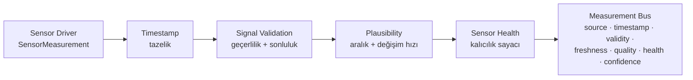

# 01 — SENSOR + NAVIGATION ARCHITECTURE

> Sivil mühendislik referans mimarisi — yazılım/güvenlik/simülasyon düzeyi.
> Uçuşa hazır donanım, kablolama, ESC/motor ayarı ya da kontrol kazancı içermez.
> Ana belge: [15 — Master System Architecture](../15-sistem-mimarisi.md).
> Diyagram ve tablolar `python -m simurg.architecture --update-all` ile üretilir.

## Sorumluluklar

* **Sensor Suite** tek kutu değildir: inertial (IMU A/B/C, manyetometre), GNSS
  (A, B/alternatif), alternatif navigasyon girdileri (Camera/VIO, TRN, MagNav,
  gök navigasyonu) ve araç sağlık telemetrisi (motor/ESC devri, eyleyici konum
  geri beslemesi, güç telemetrisi, sıcaklık) ayrı bloklardır.
* Her ham ölçüm aynı hattan geçer:

  Kod: `simurg/sensing/pipeline.py` (`SensorChannel`, `SensorPipeline`,
  `Measurement`). Ölçümü olmayan kanal **UNKNOWN**; bayat ölçüm **STALE**,
  akla yatkın olmayan **IMPLAUSIBLE**; geçersiz ölçümün güveni 0'dır.
  Simülasyonda hat salt gözlemcidir (RNG tüketmez, determinizm korunur) ve
  her kanal değişimi `sensor_health_changed` olayıdır.
* **STATE ESTIMATE ≠ INTEGRITY.** `NavigationSolution` bir konum taşır ama
  `integrity_ok`, koruma seviyesi ve güven ayrı alanlardır: araç bir konum
  hesaplayabilir fakat sistem ona güvenmeyebilir. < 2 kaynakta bütünlük
  doğrulanamaz; çözüm yokken ataletsel ilerletme PL'yi büyütür.
* Çıktılar: `VehicleState` (merkezi durum), `NavigationSolution`,
  `NavigationHealth` (`simurg/fdir/reports.py::navigation_fdir`).

## Arıza davranışı

| Durum | Davranış | Olay |
|---|---|---|
| Kaynak ölçümü yok | Kaynak kullanılamaz; kalanlarla füzyon | `sensor_health_changed`, `nav_source_unavailable` |
| Kaynak sapması | Ki-kare testi + leave-one-out dışlama | `nav_source_rejected` |
| < 2 tutarlı kaynak | Bütünlük yok → LOITER_HOLD kuralı | `nav_integrity_lost`, `contingency` |
| Sıçrayan ölçüm | Ölçüm hattında IMPLAUSIBLE | `sensor_health_changed` |

## Diyagram

```mermaid
flowchart LR
  classDef implemented fill:#d7f5dd,stroke:#1a7f37,color:#0b3d1a;
  classDef partial fill:#fff4c2,stroke:#9a6700,color:#3d2e00;
  classDef unvalidated fill:#ffe1c7,stroke:#bc4c00,color:#4d1f00;
  classDef planned fill:#eef0f3,stroke:#8c959f,color:#57606a,stroke-dasharray: 4 3;
  classDef gate fill:#ffd8d8,stroke:#cf222e,color:#5c0a0a,stroke-width:3px;
  classDef ext fill:#ffffff,stroke:#8c959f,color:#57606a;
  classDef stage fill:#f6f8fa,stroke:#57606a,color:#24292f;
  subgraph SEN["SENSOR SUITE"]
    direction TB
    subgraph SEN_INS["Inertial / heading"]
      SEN_IMU_A["IMU A"]:::planned
      SEN_IMU_B["IMU B"]:::planned
      SEN_IMU_C["IMU C"]:::planned
      SEN_MAG["Magnetometer"]:::planned
    end
    subgraph SEN_GNSS["GNSS"]
      SEN_GNSS_A["GNSS A"]:::implemented
      SEN_GNSS_B["GNSS B / Alternate Input"]:::planned
    end
    subgraph SEN_ALT["Alternatif navigasyon girdileri"]
      SEN_VIO["Camera / VIO"]:::implemented
      SEN_TRN["TRN"]:::implemented
      SEN_MAGNAV["MagNav"]:::implemented
      SEN_CELESTIAL["Celestial Navigation"]:::planned
    end
    subgraph SEN_VH["Araç sağlık telemetrisi"]
      SEN_RPM["Motor / ESC Telemetry"]:::implemented
      SEN_ACT_POS["Actuator Position Feedback"]:::implemented
      SEN_POWER_TLM["Power Telemetry"]:::partial
      SEN_TEMP["Temperature / Health Sensors"]:::planned
    end
    subgraph SEN_PIPE["Ölçüm hattı (driver → bus)"]
      SEN_DRIVER["Sensor Driver"]:::implemented
      SEN_TIMESTAMP["Timestamp"]:::implemented
      SEN_SIGNAL_VALID["Signal Validation"]:::implemented
      SEN_PLAUSIBILITY["Plausibility Check"]:::implemented
      SEN_HEALTH["Sensor Health"]:::implemented
      SEN_MEAS_BUS["Measurement Bus"]:::partial
    end
  end
  subgraph AIR["AIR DATA"]
    direction TB
    AIR_BARO_A["Barometer A"]:::implemented
    AIR_BARO_B["Barometer B"]:::planned
    AIR_PITOT["Pitot / Airspeed"]:::implemented
    AIR_ADC["Air Data Abstraction"]:::implemented
    AIR_ALT_FALLBACK["Altitude Fallback"]:::unvalidated
  end
  subgraph NAV["NAVIGATION"]
    direction TB
    subgraph NAV_INT["Bütünlük (integrity)"]
      NAV_INTEGRITY["Integrity Monitor"]:::implemented
      NAV_FD["Fault Detection"]:::implemented
      NAV_FE["Fault Exclusion"]:::implemented
      NAV_PL["Protection / Confidence Estimate"]:::implemented
    end
    NAV_SRC_MGR["Navigation Source Manager"]:::implemented
    NAV_MEAS_VALID["Measurement Validator"]:::implemented
    NAV_SUPERVISOR["Navigation Supervisor"]:::partial
    NAV_HEALTH["NavigationHealth"]:::implemented
  end
  subgraph EST["STATE ESTIMATION"]
    direction TB
    EST_INERTIAL["Inertial Propagation"]:::implemented
    EST_ESTIMATOR["State Estimator"]:::partial
    EST_ATTITUDE["Attitude Estimate"]:::planned
    EST_POSITION["Position Estimate"]:::implemented
    EST_VELOCITY["Velocity Estimate"]:::partial
    EST_SOLUTION["Navigation Solution"]:::implemented
    EST_VEHICLE_STATE["VehicleState"]:::implemented
  end
  TM_SENSOR_TS["Sensor Timestamp Manager<br/><i>TIME / SYNCHRONIZATION</i>"]:::ext
  BUS_MEAS["Measurement Bus<br/><i>DATA BUS (mantıksal)</i>"]:::ext
  FDIR_SENSOR["Sensor FDIR<br/><i>FDIR</i>"]:::ext
  BUS_EVENT["Event Bus<br/><i>DATA BUS (mantıksal)</i>"]:::ext
  FDIR_NAV["Navigation FDIR<br/><i>FDIR</i>"]:::ext
  BUS_STATE["State Bus<br/><i>DATA BUS (mantıksal)</i>"]:::ext
  FCC_C_MONITOR["Independent Monitor<br/><i>TRIPLEX FLIGHT COMPUTERS</i>"]:::ext
  ACT_FEEDBACK["Actuator Feedback<br/><i>ACTUATOR SYSTEM (simülasyon soyutlaması)</i>"]:::ext
  FDIR_MOTOR_MON["Motor Monitor (CUSUM)<br/><i>FDIR</i>"]:::ext
  FDIR_SURFACE_MON["Surface Monitor<br/><i>FDIR</i>"]:::ext
  EN_MANAGER["Energy Manager<br/><i>POWER / ENERGY</i>"]:::ext
  MD_CONTINGENCY["Contingency Manager<br/><i>MODE / CONTINGENCY MANAGEMENT</i>"]:::ext
  PF_SENSOR["Sensor Check<br/><i>PREFLIGHT SUPERVISOR</i>"]:::ext
  PF_NAV["Navigation Check<br/><i>PREFLIGHT SUPERVISOR</i>"]:::ext
  SUP_SYSTEM["System Supervisor<br/><i>SYSTEM SUPERVISION</i>"]:::ext
  TM_TIMING_MON["Timing Monitor<br/><i>TIME / SYNCHRONIZATION</i>"]:::ext
  FDR_NAV["Navigation Recorder<br/><i>FLIGHT DATA RECORDER</i>"]:::ext
  DT_SENSORS["Sensor Models<br/><i>DIGITAL TWIN</i>"]:::ext
  DT_NAVMODEL["Navigation Model<br/><i>DIGITAL TWIN</i>"]:::ext
  SEN_IMU_A --> SEN_DRIVER
  SEN_IMU_B --> SEN_DRIVER
  SEN_IMU_C --> SEN_DRIVER
  SEN_MAG --> SEN_DRIVER
  SEN_GNSS_A --> SEN_DRIVER
  SEN_GNSS_B --> SEN_DRIVER
  SEN_VIO --> SEN_DRIVER
  SEN_TRN --> SEN_DRIVER
  SEN_MAGNAV --> SEN_DRIVER
  SEN_CELESTIAL --> SEN_DRIVER
  SEN_RPM --> SEN_DRIVER
  SEN_ACT_POS --> SEN_DRIVER
  SEN_POWER_TLM --> SEN_DRIVER
  SEN_TEMP --> SEN_DRIVER
  AIR_BARO_A --> SEN_DRIVER
  AIR_BARO_B --> SEN_DRIVER
  AIR_PITOT --> SEN_DRIVER
  SEN_DRIVER --> SEN_TIMESTAMP
  TM_SENSOR_TS -.->|"zaman"| SEN_TIMESTAMP
  SEN_TIMESTAMP --> SEN_SIGNAL_VALID
  SEN_SIGNAL_VALID --> SEN_PLAUSIBILITY
  SEN_PLAUSIBILITY --> SEN_HEALTH
  SEN_HEALTH -->|"Measurement + meta veri"| SEN_MEAS_BUS
  SEN_MEAS_BUS --> BUS_MEAS
  SEN_HEALTH -.->|"kanal sağlıkları"| FDIR_SENSOR
  AIR_BARO_A --> AIR_ADC
  AIR_BARO_B --> AIR_ADC
  AIR_PITOT --> AIR_ADC
  AIR_ADC -.->|"baro yok"| AIR_ALT_FALLBACK
  AIR_ADC -->|"irtifa, hava hızı"| EST_VEHICLE_STATE
  BUS_MEAS -->|"konum ölçümleri"| NAV_SRC_MGR
  SEN_GNSS_A -->|"ham ölçüm (bugün)"| NAV_SRC_MGR
  SEN_VIO -->|"ham ölçüm (bugün)"| NAV_SRC_MGR
  SEN_TRN -->|"ham ölçüm (bugün)"| NAV_SRC_MGR
  SEN_MAGNAV -->|"ham ölçüm (bugün)"| NAV_SRC_MGR
  NAV_SRC_MGR --> NAV_MEAS_VALID
  NAV_MEAS_VALID -->|"doğrulanmış ölçümler"| EST_ESTIMATOR
  SEN_IMU_A -->|"IMU"| EST_ATTITUDE
  EST_ESTIMATOR --> EST_POSITION
  EST_INERTIAL -->|"kaynaksız ilerletme"| EST_POSITION
  EST_ATTITUDE --> EST_SOLUTION
  EST_POSITION --> EST_SOLUTION
  EST_VELOCITY --> EST_SOLUTION
  EST_ESTIMATOR -->|"füzyon + kovaryans"| NAV_INTEGRITY
  NAV_INTEGRITY --> NAV_FD
  NAV_FD --> NAV_FE
  NAV_FE --> NAV_PL
  NAV_FE -.->|"dışlanan kaynaklar"| NAV_SRC_MGR
  NAV_PL -->|"PL, güven, bütünlük"| EST_SOLUTION
  EST_SOLUTION --> NAV_SUPERVISOR
  EST_SOLUTION --> NAV_HEALTH
  NAV_SUPERVISOR -->|"nav olayları"| BUS_EVENT
  NAV_HEALTH -.->|"NavigationHealth"| FDIR_NAV
  EST_SOLUTION --> EST_VEHICLE_STATE
  EST_VEHICLE_STATE -->|"VehicleState"| BUS_STATE
  SEN_IMU_C -->|"IMU C"| FCC_C_MONITOR
  ACT_FEEDBACK -->|"devir"| SEN_RPM
  ACT_FEEDBACK -->|"konum"| SEN_ACT_POS
  SEN_RPM -->|"ölçülen devir"| FDIR_MOTOR_MON
  SEN_ACT_POS --> FDIR_SURFACE_MON
  EN_MANAGER -->|"güç telemetrisi"| SEN_POWER_TLM
  NAV_HEALTH -.->|"nav bütünlüğü"| MD_CONTINGENCY
  SEN_HEALTH -.-> PF_SENSOR
  NAV_SRC_MGR -.->|"kaynak sayısı"| PF_NAV
  NAV_HEALTH -.->|"nav bütünlüğü"| SUP_SYSTEM
  TM_TIMING_MON -.->|"füzyon epoku"| EST_ESTIMATOR
  NAV_SUPERVISOR --> FDR_NAV
  DT_SENSORS -->|"simüle ölçüm"| SEN_DRIVER
  DT_NAVMODEL --> SEN_GNSS_A
```

<!-- BEGIN GENERATED: view-sensor-navigation -->

<!-- END GENERATED: view-sensor-navigation -->

## Bileşen matrisi

<!-- BEGIN GENERATED: matrix-sensor-navigation -->
#### SENSOR SUITE

| Component | Responsibility | Inputs | Outputs | Health State | Failure Behaviour | Code Location | Implementation Status |
|---|---|---|---|---|---|---|---|
| **IMU A** `SEN_IMU_A` | Şerit A için bağımsız açısal hız/ivme | hareket | ham IMU | NOMINAL/DEGRADED/FAILED/UNKNOWN | Tek IMU arızası -> şerit karşılaştırması ile yalıtım (planlanan) Yedeklilik: triplex. | — | PLANNED — Simülasyonda tutum gerçek durumdan alınır (kusursuz kestirici varsayımı) |
| **IMU B** `SEN_IMU_B` | Şerit B için bağımsız açısal hız/ivme | hareket | ham IMU | NOMINAL/DEGRADED/FAILED/UNKNOWN | Tek IMU arızası -> şerit karşılaştırması ile yalıtım (planlanan) Yedeklilik: triplex. | — | PLANNED — Simülasyonda tutum gerçek durumdan alınır (kusursuz kestirici varsayımı) |
| **IMU C** `SEN_IMU_C` | Şerit C için bağımsız açısal hız/ivme | hareket | ham IMU | NOMINAL/DEGRADED/FAILED/UNKNOWN | Tek IMU arızası -> şerit karşılaştırması ile yalıtım (planlanan) Yedeklilik: triplex. | — | PLANNED — Simülasyonda tutum gerçek durumdan alınır (kusursuz kestirici varsayımı) |
| **Magnetometer** `SEN_MAG` | Manyetik yön gözlemi | manyetik alan | yön | NOMINAL/DEGRADED/FAILED/UNKNOWN | Bozulma -> yön kaynağı dışlanır (planlanan) | — | PLANNED |
| **GNSS A** `SEN_GNSS_A` | Mutlak konum | uydu sinyali (soyut) | konum + kovaryans | NOMINAL/DEGRADED/FAILED/UNKNOWN | Kayıp -> kaynak kullanılamaz; sapma -> RAIM dışlaması Yedeklilik: 4 bağımsız konum kaynağından biri. | `simurg/sim/sensors.py::SimulatedPositionProvider` | IMPLEMENTED |
| **GNSS B / Alternate Input** `SEN_GNSS_B` | İkinci GNSS alıcısı | uydu sinyali (soyut) | konum | NOMINAL/DEGRADED/FAILED/UNKNOWN | Planlanan | — | PLANNED |
| **Camera / VIO** `SEN_VIO` | Görsel-ataletsel göreli konum | kamera | konum + kovaryans | NOMINAL/DEGRADED/FAILED/UNKNOWN | Kayıp/sapma -> kaynak kullanılamaz / dışlanır | `simurg/sim/sensors.py::SimulatedPositionProvider` | IMPLEMENTED |
| **TRN** `SEN_TRN` | Arazi referanslı konum | yükseklik haritası | konum + kovaryans | NOMINAL/DEGRADED/FAILED/UNKNOWN | Kayıp/sapma -> kaynak kullanılamaz / dışlanır | `simurg/sim/sensors.py::SimulatedPositionProvider` | IMPLEMENTED |
| **MagNav** `SEN_MAGNAV` | Manyetik anomali haritası ile konum | manyetometre | konum + kovaryans | NOMINAL/DEGRADED/FAILED/UNKNOWN | Kayıp/sapma -> kaynak kullanılamaz / dışlanır | `simurg/sim/sensors.py::SimulatedPositionProvider` | IMPLEMENTED |
| **Celestial Navigation** `SEN_CELESTIAL` | Güneş/yıldız ile yön sınırlama | kamera | yön gözlemi | NOMINAL/DEGRADED/FAILED/UNKNOWN | Planlanan | — | PLANNED |
| **Motor / ESC Telemetry** `SEN_RPM` | Motor devri (ESC telemetrisinin yalnızca devir kısmı) | motor çıkışı | devir | NOMINAL/DEGRADED/FAILED/UNKNOWN | Geri dönüşü yok: kaybında motor FDIR kör -> sensör alanı FAILED | `simurg/sim/sensors.py::SensorModel` | IMPLEMENTED — Akım/sıcaklık modellenmez |
| **Actuator Position Feedback** `SEN_ACT_POS` | Elevon konum geri beslemesi | yüzey | ölçülen konum | NOMINAL/DEGRADED/FAILED/UNKNOWN | Takılı/devre dışı yüzey -> konum artığı -> FAILED | `simurg/sim/actuators.py::ActuatorState` | IMPLEMENTED |
| **Power Telemetry** `SEN_POWER_TLM` | Kaynak gücü, SoC, karşılanamayan güç | enerji modeli | PowerSplit, EnergyState | NOMINAL/DEGRADED/FAILED/UNKNOWN | Sonlu olmayan değer -> enerji alanı UNKNOWN | `simurg/power/energy_manager.py::PowerSplit` | PARTIAL — Model durumu doğrudan okunur; ölçüm gürültüsü yok |
| **Temperature / Health Sensors** `SEN_TEMP` | Motor/batarya/FC sıcaklığı | termal | sıcaklık | NOMINAL/DEGRADED/FAILED/UNKNOWN | Planlanan (termal model yok) | — | PLANNED |
| **Sensor Driver** `SEN_DRIVER` | Sensör okuma soyutlaması (ham ölçüm) | sensör modeli | SensorMeasurement | NOMINAL/DEGRADED/FAILED/UNKNOWN | Dropout -> valid=False, NaN değer | `simurg/sim/sensors.py::SensorModel` | IMPLEMENTED |
| **Timestamp** `SEN_TIMESTAMP` | Zaman damgası denetimi + tazelik | ham ölçüm | tazelik (s) | NOMINAL/DEGRADED/FAILED/UNKNOWN | Gelecek/bayat damga -> STALE, güven 0 | `simurg/sensing/pipeline.py::SensorChannel` | IMPLEMENTED |
| **Signal Validation** `SEN_SIGNAL_VALID` | Geçerlilik bayrağı + sonluluk | ölçüm | VALID/INVALID | NOMINAL/DEGRADED/FAILED/UNKNOWN | Geçersiz/NaN -> INVALID, kullanılamaz | `simurg/sensing/pipeline.py::SensorChannel` | IMPLEMENTED |
| **Plausibility Check** `SEN_PLAUSIBILITY` | Fiziksel aralık + değişim hızı sınırı | geçerli ölçüm | VALID/IMPLAUSIBLE | NOMINAL/DEGRADED/FAILED/UNKNOWN | Sıçrama/aralık dışı -> IMPLAUSIBLE | `simurg/sensing/pipeline.py::ChannelSpec` | IMPLEMENTED |
| **Sensor Health** `SEN_HEALTH` | Kalıcılık sayaçlı kanal sağlığı | doğrulama sonucu | NOMINAL/DEGRADED/FAILED/UNKNOWN | NOMINAL/DEGRADED/FAILED/UNKNOWN | Ölçümsüz kanal UNKNOWN; ardışık kötü ölçüm -> FAILED | `simurg/sensing/pipeline.py::SensorChannel` | IMPLEMENTED |
| **Measurement Bus** `SEN_MEAS_BUS` | Kaynak başına son ölçüm + meta veri | Measurement | son ölçümler, sağlık özeti | NOMINAL/DEGRADED/FAILED/UNKNOWN | Bayat kaynak -> check_freshness ile STALE | `simurg/sensing/pipeline.py::MeasurementBus` `simurg/sensing/pipeline.py::SensorPipeline` | PARTIAL — Gözlem amaçlı: navigasyon bugün ham ölçümü kullanır (PARTIAL entegrasyon) |

#### AIR DATA

| Component | Responsibility | Inputs | Outputs | Health State | Failure Behaviour | Code Location | Implementation Status |
|---|---|---|---|---|---|---|---|
| **Barometer A** `AIR_BARO_A` | Barometrik irtifa | statik basınç | irtifa | NOMINAL/DEGRADED/FAILED/UNKNOWN | Dropout -> ataletsel dikey entegrasyon geri dönüşü | `simurg/sim/sensors.py::SensorModel` | IMPLEMENTED |
| **Barometer B** `AIR_BARO_B` | İkinci barometre | statik basınç | irtifa | NOMINAL/DEGRADED/FAILED/UNKNOWN | Planlanan Yedeklilik: planlanan ikili. | — | PLANNED |
| **Pitot / Airspeed** `AIR_PITOT` | Hava hızı | dinamik basınç | hava hızı | NOMINAL/DEGRADED/FAILED/UNKNOWN | Dropout -> yer hızı kestirimi + SENSOR_DEGRADED olayı | `simurg/sim/sensors.py::SensorModel` | IMPLEMENTED |
| **Air Data Abstraction** `AIR_ADC` | Hava verisi seçimi ve açık geri dönüş politikası | baro, pitot | irtifa, hava hızı (+ bozulma bayrağı) | NOMINAL/DEGRADED/FAILED/UNKNOWN | Eski değer sessizce kullanılmaz; geri dönüş kaynağı + olay | `simurg/sim/airdata.py::AirDataSystem` | IMPLEMENTED |
| **Altitude Fallback** `AIR_ALT_FALLBACK` | Baro yokken ataletsel dikey hız entegrasyonu | son irtifa, dikey hız | kestirilmiş irtifa | NOMINAL/DEGRADED/FAILED/UNKNOWN | Uzun süreli kullanımda sürüklenme (sınırsız) | `simurg/sim/airdata.py::AirDataSystem` | UNVALIDATED — Kodda var; bu yolu çalıştıran senaryo/test yok |

#### NAVIGATION

| Component | Responsibility | Inputs | Outputs | Health State | Failure Behaviour | Code Location | Implementation Status |
|---|---|---|---|---|---|---|---|
| **Navigation Source Manager** `NAV_SRC_MGR` | Sağlayıcılardan ölçüm toplama, kullanılamayanları ayırma | konum ölçümleri | aday ölçümler, kullanılamayan kaynaklar | NOMINAL/DEGRADED/FAILED/UNKNOWN | Ölçüm yok/NaN -> kaynak kullanılamaz (NAV_SOURCE_UNAVAILABLE) Yedeklilik: 4 kaynak. | `simurg/nav/providers.py::NavigationSystem` | IMPLEMENTED |
| **Measurement Validator** `NAV_MEAS_VALID` | Geçerli ve sonlu ölçüm/kovaryans seçimi | aday ölçümler | doğrulanmış ölçümler | NOMINAL/DEGRADED/FAILED/UNKNOWN | Sonlu olmayan ölçüm füzyona girmez | `simurg/nav/providers.py::NavigationSystem` | IMPLEMENTED |
| **Integrity Monitor** `NAV_INTEGRITY` | Ki-kare tutarlılık testi | kaynaklar + çözüm | test istatistiği, eşik | NOMINAL/DEGRADED/FAILED/UNKNOWN | < 2 kaynak -> bütünlük DOĞRULANAMAZ (integrity_ok=False) | `simurg/nav/integrity.py::IntegrityMonitor` | IMPLEMENTED |
| **Fault Detection** `NAV_FD` | T > eşik tespiti | test istatistiği | arıza var/yok | NOMINAL/DEGRADED/FAILED/UNKNOWN | Tespit -> dışlama denemesi | `simurg/nav/integrity.py::test_statistic` | IMPLEMENTED |
| **Fault Exclusion** `NAV_FE` | Leave-one-out ile hatalı kaynağı dışlama | kaynak kümesi | dışlanan kaynaklar | NOMINAL/DEGRADED/FAILED/UNKNOWN | Dışlama sonrası tutarsızlık sürerse bütünlük kaybı | `simurg/nav/integrity.py::IntegrityMonitor` | IMPLEMENTED |
| **Protection / Confidence Estimate** `NAV_PL` | PL = k_md·sqrt(λmax(P)); güven = 1 - PL/AL | kovaryans | PL, güven | NOMINAL/DEGRADED/FAILED/UNKNOWN | PL > alarm limiti -> bütünlük yok | `simurg/nav/integrity.py::IntegrityMonitor` | IMPLEMENTED |
| **Navigation Supervisor** `NAV_SUPERVISOR` | Nav olayları ve bütünlük geçişleri | çözüm | nav olayları | NOMINAL/DEGRADED/FAILED/UNKNOWN | İlk çözümden önce bütünlük varsayılmaz | `simurg/sim/engine.py::SimulationEngine` | PARTIAL — Motor içinde (_navigation) |
| **NavigationHealth** `NAV_HEALTH` | Navigasyon alanı FDIR raporu | NavigationSolution | FdirReport(navigation) | NOMINAL/DEGRADED/FAILED/UNKNOWN | Çözüm yok -> UNKNOWN; bütünlük yok -> FAILED | `simurg/fdir/reports.py::navigation_fdir` | IMPLEMENTED |

#### STATE ESTIMATION

| Component | Responsibility | Inputs | Outputs | Health State | Failure Behaviour | Code Location | Implementation Status |
|---|---|---|---|---|---|---|---|
| **Inertial Propagation** `EST_INERTIAL` | Kaynak yokken son çözümü hızla ilerletme | son çözüm, hız | ilerletilmiş konum, büyüyen PL | NOMINAL/DEGRADED/FAILED/UNKNOWN | integrity_ok=False; PL zamanla büyür | `simurg/nav/providers.py::NavigationSystem` | IMPLEMENTED |
| **State Estimator** `EST_ESTIMATOR` | Ters kovaryans ağırlıklı konum füzyonu | doğrulanmış ölçümler | konum + kovaryans | NOMINAL/DEGRADED/FAILED/UNKNOWN | Kaynaksız -> ataletsel ilerletme | `simurg/nav/integrity.py::fuse` | PARTIAL — Yatay konum füzyonu; tam ESKF planlanan |
| **Attitude Estimate** `EST_ATTITUDE` | Tutum kestirimi | IMU | kuaterniyon | NOMINAL/DEGRADED/FAILED/UNKNOWN | Planlanan (IMU karşılaştırmalı) | — | PLANNED — Simülasyon gerçek tutumu kullanır |
| **Position Estimate** `EST_POSITION` | Yatay konum + koruma seviyesi | füzyon | konum | NOMINAL/DEGRADED/FAILED/UNKNOWN | Bütünlüksüz konum işaretlenir | `simurg/core/types.py::NavigationSolution` | IMPLEMENTED |
| **Velocity Estimate** `EST_VELOCITY` | Hız kestirimi | IMU/kaynaklar | hız | NOMINAL/DEGRADED/FAILED/UNKNOWN | Planlanan kestirici | `simurg/core/types.py::NavigationSolution` | PARTIAL — Simülasyonda gerçek hız kullanılır |
| **Navigation Solution** `EST_SOLUTION` | Bütünlük bilgili çözüm nesnesi | kestirim + bütünlük | NavigationSolution | NOMINAL/DEGRADED/FAILED/UNKNOWN | Bütünlük alanı ayrı: konum var ama güvenilmeyebilir (state != integrity) | `simurg/core/types.py::NavigationSolution` | IMPLEMENTED |
| **VehicleState** `EST_VEHICLE_STATE` | Merkezi durum (tek doğruluk kaynağı) | kestirim, enerji, mod | VehicleState | durumsuz (n/a) | Sonlu olmayan durum -> SimulationError (sessiz değil) | `simurg/core/types.py::VehicleState` | IMPLEMENTED |
<!-- END GENERATED: matrix-sensor-navigation -->
