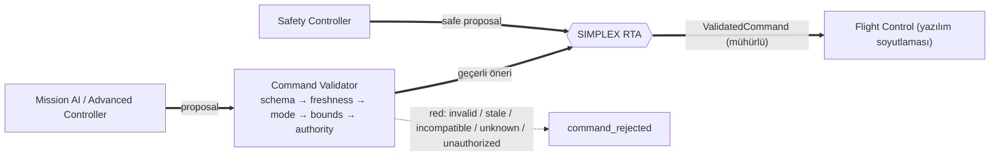

# 02 — GNC + RTA ARCHITECTURE

> Sivil mühendislik referans mimarisi — yazılım/güvenlik/simülasyon düzeyi.
> Uçuşa hazır donanım, kablolama, ESC/motor ayarı ya da kontrol kazancı içermez.
> Ana belge: [15 — Master System Architecture](../15-sistem-mimarisi.md).
> Diyagram ve tablolar `python -m simurg.architecture --update-all` ile üretilir.

## Yetki zinciri

* **Guidance** blokları (Mission, Waypoint, Loiter/Hold, Return, Transition,
  Trajectory Intent) yalnızca öneri üretir; eyleyici yetkileri yoktur.
* **Command Validator** (`simurg/safety/command_validator.py`) öneriyi
  `CommandProposal` zarfıyla alır ve beş aşamayı sırayla uygular; ilk
  başarısız aşama red sınıfını belirler. Öneri **kırpılmaz**. Reddedilen
  öneri RTA'ya ulaşmaz; o adımda RTA yalnızca güvenlik kontrolcüsünü doğrular.
* **Simplex RTA** girdileri (advanced, safety, vehicle state), denetim
  (envelope, constraint monitor, state predictor, predicted/current violation
  check), seçim (command selector, latch, recovery hysteresis) ve açıklama
  (reason generator, intervention recorder) olarak ayrıştırılmıştır. Sert
  ihlalde gelişmiş komut seçilemez ve kilit uçuş sonuna dek sürer.
* **Flight Control** kontrolcüleri (position, velocity, attitude, transition,
  safety) yazılım mimarisi soyutlamasıdır; kazançlar araştırma amaçlıdır ve
  gerçek uçuş için ayarlı DEĞİLDİR.

## Diyagram

```mermaid
flowchart LR
  classDef implemented fill:#d7f5dd,stroke:#1a7f37,color:#0b3d1a;
  classDef partial fill:#fff4c2,stroke:#9a6700,color:#3d2e00;
  classDef unvalidated fill:#ffe1c7,stroke:#bc4c00,color:#4d1f00;
  classDef planned fill:#eef0f3,stroke:#8c959f,color:#57606a,stroke-dasharray: 4 3;
  classDef gate fill:#ffd8d8,stroke:#cf222e,color:#5c0a0a,stroke-width:3px;
  classDef ext fill:#ffffff,stroke:#8c959f,color:#57606a;
  classDef stage fill:#f6f8fa,stroke:#57606a,color:#24292f;
  subgraph GUID["GUIDANCE"]
    direction TB
    G_MISSION["Mission Guidance"]:::implemented
    G_INTENT["Trajectory Intent"]:::planned
    G_WAYPOINT["Waypoint Guidance"]:::implemented
    G_LOITER["Loiter / Hold Guidance"]:::implemented
    G_RETURN["Return Guidance"]:::implemented
    G_TRANSITION["Transition Guidance"]:::implemented
  end
  subgraph CV["COMMAND VALIDATION"]
    direction TB
    CV_PROPOSAL["Proposal Envelope"]:::implemented
    CV_SCHEMA["Schema Validation"]:::implemented
    CV_FRESHNESS["Timestamp / Freshness"]:::implemented
    CV_MODE["Mode Compatibility"]:::implemented
    CV_BOUNDS["Command Bounds"]:::implemented
    CV_AUTHORITY["Authority Check"]:::implemented
    CV_VALIDATOR["Command Validator"]:::implemented
  end
  subgraph RTA["RUNTIME ASSURANCE (Simplex)"]
    direction TB
    subgraph RTA_IN["Girdiler"]
      RTA_IN_ADV["Advanced Command Input"]:::implemented
      RTA_IN_SAFE["Safety Controller Input"]:::implemented
      RTA_IN_STATE["Vehicle State Input"]:::implemented
    end
    subgraph RTA_CHK["Denetim"]
      RTA_ENVELOPE["Safety Envelope"]:::implemented
      RTA_CONSTRAINT["Constraint Monitor"]:::implemented
      RTA_PREDICTOR["State Predictor"]:::implemented
      RTA_PRED_CHECK["Predicted Violation Check"]:::implemented
      RTA_CUR_CHECK["Current Violation Check"]:::implemented
    end
    subgraph RTA_SEL["Seçim"]
      RTA_SELECTOR["Command Selector"]:::gate
      RTA_LATCH["Latch Manager"]:::implemented
      RTA_HYST["Recovery Hysteresis"]:::implemented
    end
    subgraph RTA_EXP["Açıklama"]
      RTA_REASON["Decision Reason Generator"]:::implemented
      RTA_RECORDER["Intervention Recorder"]:::implemented
      RTA_HEALTH["RTA Runtime Health"]:::planned
      RTA_SELFTEST["RTA Self-Test"]:::implemented
    end
  end
  subgraph CTRL["FLIGHT CONTROL (yazılım soyutlaması; kazanç içermez)"]
    direction TB
    C_MODE_SEL["Control Law Selector"]:::implemented
    C_POS["Position Control"]:::partial
    C_VEL["Velocity Control"]:::partial
    C_ATT["Attitude Control"]:::implemented
    C_TRANS["Transition Control"]:::implemented
    C_SAFETY["Safety Controller"]:::implemented
  end
  MC_MISSION_MGR["Mission Manager<br/><i>MISSION COMPUTER (yalnızca öneri; uçuş-kritik değil)</i>"]:::ext
  BUS_STATE["State Bus<br/><i>DATA BUS (mantıksal)</i>"]:::ext
  MC_PROPOSAL["CommandProposal Output<br/><i>MISSION COMPUTER (yalnızca öneri; uçuş-kritik değil)</i>"]:::ext
  MC_HEALTH["Mission Health<br/><i>MISSION COMPUTER (yalnızca öneri; uçuş-kritik değil)</i>"]:::ext
  MD_FSM["Flight Mode Machine<br/><i>MODE / CONTINGENCY MANAGEMENT</i>"]:::ext
  TM_CLOCK["System Clock<br/><i>TIME / SYNCHRONIZATION</i>"]:::ext
  FDR_CMD["Command Recorder<br/><i>FLIGHT DATA RECORDER</i>"]:::ext
  FDR_RTA["RTA Recorder<br/><i>FLIGHT DATA RECORDER</i>"]:::ext
  BUS_HEALTH["Health Bus<br/><i>DATA BUS (mantıksal)</i>"]:::ext
  CFG_SAFETY["Safety Configuration<br/><i>CONFIGURATION</i>"]:::ext
  BUS_COMMAND["Command Bus<br/><i>DATA BUS (mantıksal)</i>"]:::ext
  MD_CONTINGENCY["Contingency Manager<br/><i>MODE / CONTINGENCY MANAGEMENT</i>"]:::ext
  SUP_SYSTEM["System Supervisor<br/><i>SYSTEM SUPERVISION</i>"]:::ext
  AL_DEMAND["Control Demand<br/><i>CONTROL ALLOCATION</i>"]:::ext
  EN_AVAIL["Power Availability<br/><i>POWER / ENERGY</i>"]:::ext
  VH_CONTROL_AUTH["Control Authority Domain<br/><i>VEHICLE HEALTH</i>"]:::ext
  PF_RTA["RTA Check<br/><i>PREFLIGHT SUPERVISOR</i>"]:::ext
  MC_MISSION_MGR ==>|"aktif hedef"| G_WAYPOINT
  G_INTENT ==>|"niyet"| G_MISSION
  G_WAYPOINT ==>|"hedef"| G_MISSION
  BUS_STATE -->|"durum"| G_MISSION
  G_MISSION ==>|"Command"| MC_PROPOSAL
  G_LOITER ==>|"Command"| MC_PROPOSAL
  G_RETURN ==>|"Command"| MC_PROPOSAL
  MC_PROPOSAL ==>|"CommandProposal"| CV_PROPOSAL
  CV_VALIDATOR -.->|"red/kabul"| MC_HEALTH
  CV_PROPOSAL ==> CV_SCHEMA
  CV_SCHEMA ==> CV_FRESHNESS
  CV_FRESHNESS ==> CV_MODE
  CV_MODE ==> CV_BOUNDS
  CV_BOUNDS ==> CV_AUTHORITY
  CV_AUTHORITY ==> CV_VALIDATOR
  MD_FSM -.->|"aktif mod"| CV_MODE
  TM_CLOCK -.->|"şimdi"| CV_FRESHNESS
  CV_VALIDATOR ==>|"geçerli öneri"| RTA_IN_ADV
  CV_VALIDATOR -->|"command_rejected/accepted"| FDR_CMD
  C_SAFETY ==>|"güvenli öneri"| RTA_IN_SAFE
  BUS_STATE --> RTA_IN_STATE
  BUS_STATE -->|"durum"| C_SAFETY
  RTA_IN_STATE --> RTA_CUR_CHECK
  RTA_IN_STATE --> RTA_PREDICTOR
  RTA_IN_ADV -->|"öneri"| RTA_PREDICTOR
  RTA_PREDICTOR --> RTA_PRED_CHECK
  RTA_ENVELOPE --> RTA_CONSTRAINT
  RTA_CONSTRAINT -->|"yumuşak zarf"| RTA_PRED_CHECK
  RTA_CONSTRAINT -->|"sert zarf"| RTA_CUR_CHECK
  RTA_CUR_CHECK -.->|"sert ihlal"| RTA_LATCH
  RTA_PRED_CHECK -.->|"öngörülen ihlal"| RTA_SELECTOR
  RTA_LATCH -.->|"kilit"| RTA_SELECTOR
  RTA_HYST -.->|"geri dönüş izni"| RTA_SELECTOR
  RTA_IN_ADV ==>|"AC"| RTA_SELECTOR
  RTA_IN_SAFE ==>|"SC"| RTA_SELECTOR
  RTA_SELECTOR --> RTA_REASON
  RTA_REASON --> RTA_RECORDER
  RTA_RECORDER --> FDR_RTA
  RTA_HEALTH -.->|"RTA sağlığı"| BUS_HEALTH
  CFG_SAFETY -->|"zarflar"| RTA_ENVELOPE
  RTA_SELECTOR ==>|"ValidatedCommand"| BUS_COMMAND
  RTA_SELECTOR -.->|"RTA durumu"| MD_CONTINGENCY
  RTA_SELECTOR -.->|"RTA durumu"| SUP_SYSTEM
  BUS_COMMAND ==>|"ValidatedCommand"| C_MODE_SEL
  MD_FSM -.->|"aktif mod"| C_MODE_SEL
  G_TRANSITION ==>|"geçiş programı"| C_TRANS
  C_MODE_SEL ==> C_POS
  C_MODE_SEL ==> C_VEL
  C_MODE_SEL ==>|"yatış/yunuslama"| C_ATT
  C_MODE_SEL ==> C_TRANS
  C_POS ==>|"eğim"| C_ATT
  C_TRANS ==>|"tutum hedefi"| C_ATT
  C_ATT ==>|"moment"| AL_DEMAND
  C_VEL ==>|"itki"| AL_DEMAND
  EN_AVAIL -.->|"güç sınırı"| C_VEL
  C_ATT -.->|"controllable"| VH_CONTROL_AUTH
  MD_FSM -.->|"mod -> güdüm seçimi"| GUID
  RTA_SELFTEST -.->|"öz-test"| PF_RTA
```

<!-- BEGIN GENERATED: view-gnc-rta -->

<!-- END GENERATED: view-gnc-rta -->

## Bileşen matrisi

<!-- BEGIN GENERATED: matrix-gnc-rta -->
#### GUIDANCE

| Component | Responsibility | Inputs | Outputs | Health State | Failure Behaviour | Code Location | Implementation Status |
|---|---|---|---|---|---|---|---|
| **Mission Guidance** `G_MISSION` *(öneri)* | Ara noktaya rota + irtifa ÖNERİSİ (gelişmiş kontrolcü) | durum, hedef | Command önerisi | durumsuz (n/a) | Hatalı öneri -> doğrulayıcı / RTA tarafından engellenir | `simurg/control/guidance.py::MissionGuidance` | IMPLEMENTED |
| **Trajectory Intent** `G_INTENT` *(öneri)* | Yörünge niyeti (hedef dizisi + kısıtlar) | görev | niyet | durumsuz (n/a) | Planlanan | — | PLANNED |
| **Waypoint Guidance** `G_WAYPOINT` *(öneri)* | Ara nokta ilerleyişi ve aktif hedef | konum | aktif hedef | durumsuz (n/a) | Bütünlük yokken ilerleme durur (LOITER_HOLD) | `simurg/sim/mission.py::MissionManager` | IMPLEMENTED |
| **Loiter / Hold Guidance** `G_LOITER` *(öneri)* | Sabit yatışlı bekleme önerisi | durum | Command önerisi | durumsuz (n/a) | Hatalı öneri -> doğrulayıcı / RTA | `simurg/control/guidance.py::MissionGuidance` | IMPLEMENTED |
| **Return Guidance** `G_RETURN` *(öneri)* | Eve dönüş önerisi | konum, ev | Command önerisi | durumsuz (n/a) | Hatalı öneri -> doğrulayıcı / RTA | `simurg/control/guidance.py::MissionGuidance` | IMPLEMENTED |
| **Transition Guidance** `G_TRANSITION` | VTOL<->sabit kanat programı ve iptal mantığı | hız, yunuslama, irtifa, doyma | TransitionStatus | iptal gerekçesi | Ölçüt dışı -> geçiş iptali (TRANSITION_ABORTED) ve askıya dönüş | `simurg/control/transition.py::TransitionCoordinator` | IMPLEMENTED |

#### COMMAND VALIDATION

| Component | Responsibility | Inputs | Outputs | Health State | Failure Behaviour | Code Location | Implementation Status |
|---|---|---|---|---|---|---|---|
| **Proposal Envelope** `CV_PROPOSAL` | Öneri zarfı: içerik, kaynak, zaman, mod, tür | öneri | CommandProposal | durumsuz (n/a) | Zarf dışı (çıplak) komut eski yol: yalnızca şema+sınır | `simurg/safety/command_validator.py::CommandProposal` | IMPLEMENTED |
| **Schema Validation** `CV_SCHEMA` | Tip ve sonluluk | CommandProposal | geçerli/INVALID | durumsuz (n/a) | INVALID -> reddedilir, kırpılmaz | `simurg/safety/command_validator.py::CommandValidator` | IMPLEMENTED |
| **Timestamp / Freshness** `CV_FRESHNESS` | Gelecek/bayat zaman damgası | zaman damgası | geçerli/STALE | durumsuz (n/a) | STALE -> reddedilir (donmuş görev bilgisayarı) | `simurg/safety/command_validator.py::ProposalLimits` | IMPLEMENTED |
| **Mode Compatibility** `CV_MODE` | Öneri modu == aktif mod ve mod öneri kabul eder | mod | geçerli/INCOMPATIBLE | durumsuz (n/a) | INCOMPATIBLE -> reddedilir | `simurg/safety/command_validator.py::PROPOSAL_MODES` | IMPLEMENTED |
| **Command Bounds** `CV_BOUNDS` | Fiziksel akla yatkınlık (zarf DEĞİL) | komut | geçerli/INVALID | durumsuz (n/a) | Sınır dışı -> reddedilir, kırpılmaz | `simurg/safety/command_validator.py::ProposalLimits` | IMPLEMENTED |
| **Authority Check** `CV_AUTHORITY` | Kayıtlı öneri kaynağı + yetkili komut türü | kaynak, tür | geçerli/UNKNOWN/UNAUTHORIZED | durumsuz (n/a) | Bilinmeyen kaynak / eyleyici seviyesi komut -> reddedilir | `simurg/safety/command_validator.py::PROPOSAL_SOURCES` `simurg/safety/command_validator.py::ALLOWED_KINDS` | IMPLEMENTED |
| **Command Validator** `CV_VALIDATOR` | Aşamaları sırayla uygular; sınıf + aşama + gerekçe | CommandProposal | geçerli Command ya da ValidationResult(red) | durumsuz (n/a) | Red -> RTA o adımda yalnızca güvenlik kontrolcüsünü doğrular (gecersiz_oneri) | `simurg/safety/command_validator.py::CommandValidator` | IMPLEMENTED |

#### RUNTIME ASSURANCE (Simplex)

| Component | Responsibility | Inputs | Outputs | Health State | Failure Behaviour | Code Location | Implementation Status |
|---|---|---|---|---|---|---|---|
| **Advanced Command Input** `RTA_IN_ADV` | Doğrulanmış gelişmiş öneri girişi | doğrulayıcı | AC komutu | durumsuz (n/a) | Öneri yok -> güvenlik kontrolcüsü | `simurg/safety/rta.py::RuntimeAssurance` | IMPLEMENTED |
| **Safety Controller Input** `RTA_IN_SAFE` | Güvenli öneri girişi | güvenlik kontrolcüsü | SC komutu | durumsuz (n/a) | Her zaman mevcut olmalı (basit, durumsuz yasa) | `simurg/safety/rta.py::RuntimeAssurance` | IMPLEMENTED |
| **Vehicle State Input** `RTA_IN_STATE` | Zarf görünümü | VehicleState | EnvelopeState | durumsuz (n/a) | NaN -> gecersiz_durum ihlali (güvenli sayılmaz) | `simurg/safety/rta.py::EnvelopeState` | IMPLEMENTED |
| **Safety Envelope** `RTA_ENVELOPE` | Yumuşak/sert zarf tanımı | yapılandırma | zarflar | durumsuz (n/a) | Tutarsız zarf -> uçuş öncesi RTA kontrolü başarısız | `simurg/safety/rta.py::Envelope` | IMPLEMENTED |
| **Constraint Monitor** `RTA_CONSTRAINT` | İrtifa, hız, yatış, yunuslama, geofence kısıtları | durum | ihlal listesi, pay | durumsuz (n/a) | Sonlu olmayan değer -> ihlal | `simurg/safety/rta.py::Envelope` | IMPLEMENTED |
| **State Predictor** `RTA_PREDICTOR` | Öneri uygulanırsa ufuk sonundaki durum | durum, öneri | öngörülen durum | durumsuz (n/a) | Muhafazakâr (kötüleşme yönü) | `simurg/safety/rta.py::KinematicPredictor` | IMPLEMENTED |
| **Predicted Violation Check** `RTA_PRED_CHECK` | Öngörülen durum vs yumuşak zarf | öngörülen durum | öngörülen ihlaller | durumsuz (n/a) | İhlal -> SC | `simurg/safety/rta.py::RuntimeAssurance` | IMPLEMENTED |
| **Current Violation Check** `RTA_CUR_CHECK` | Mevcut durum vs sert zarf | durum | mevcut ihlaller | durumsuz (n/a) | İhlal -> SC + kilit | `simurg/safety/rta.py::RuntimeAssurance` | IMPLEMENTED |
| **Command Selector** `RTA_SELECTOR` *(geçit)* | NİHAİ GÜVENLİK KAPISI: tek ValidatedCommand üreticisi | AC, SC, karar | ValidatedCommand (mühürlü) | durumsuz (n/a) | Kilitliyken AC seçilemez; sert ihlalde AC yetkisi yok | `simurg/safety/rta.py::ValidatedCommand` | IMPLEMENTED |
| **Latch Manager** `RTA_LATCH` | Sert ihlalde uçuş sonuna dek SC'ye kilit | sert ihlal | kilit | kilitli/serbest | Kilit yalnızca yerde reset() | `simurg/safety/rta.py::RuntimeAssurance` | IMPLEMENTED |
| **Recovery Hysteresis** `RTA_HYST` | AC'ye dönüş için ardışık güvenli çevrim | zarf payı | geri dönüş izni | durumsuz (n/a) | Titreşimli anahtarlama önlenir | `simurg/safety/rta.py::RuntimeAssurance` | IMPLEMENTED |
| **Decision Reason Generator** `RTA_REASON` | Açıklanabilir gerekçe | ihlaller | SafetyDecision | durumsuz (n/a) | Gerekçesiz karar olay şemasında yasak (testli) | `simurg/safety/rta.py::SafetyDecision` | IMPLEMENTED |
| **Intervention Recorder** `RTA_RECORDER` | Müdahale/geri dönüş/kilit olayları | SafetyDecision | rta_* olayları | durumsuz (n/a) | Olay kaybı yok (senkron olay yolu) | `simurg/sim/engine.py::SimulationEngine` | IMPLEMENTED |
| **RTA Runtime Health** `RTA_HEALTH` | RTA'nın kendi çalışma/zamanlama sağlığı | çevrim | RTA sağlığı | NOMINAL/DEGRADED/FAILED/UNKNOWN | Planlanan (bekçi köpeği) | — | PLANNED |
| **RTA Self-Test** `RTA_SELFTEST` | Uçuş öncesi: sert ihlalde SC seçiliyor mu | zarflar | geçti/kaldı | durumsuz (n/a) | Başarısız -> ARMED yok | `simurg/sim/preflight.py::PreflightSupervisor` | IMPLEMENTED |

#### FLIGHT CONTROL (yazılım soyutlaması; kazanç içermez)

| Component | Responsibility | Inputs | Outputs | Health State | Failure Behaviour | Code Location | Implementation Status |
|---|---|---|---|---|---|---|---|
| **Control Law Selector** `C_MODE_SEL` | Moda göre kontrol yasası seçimi | mod, doğrulanmış komut | aktif yasa | durumsuz (n/a) | Sabit kanat yasası doğrulanmış komutsuz çalışmaz (SafetyInvariantError) | `simurg/sim/vehicle_control.py::VehicleController` | IMPLEMENTED |
| **Position Control** `C_POS` | Askıda yatay konum tutma -> eğim isteği | konum, hedef | eğim | durumsuz (n/a) | Doyma -> saturation_fraction raporu | `simurg/control/flight_controller.py::FlightController` | PARTIAL |
| **Velocity Control** `C_VEL` | Hava hızı / dikey hız -> itki isteği | hız hatası, güç sınırı | itki isteği | durumsuz (n/a) | Güç açığında itki ölçeklenir | `simurg/control/flight_controller.py::FlightController` | PARTIAL |
| **Attitude Control** `C_ATT` | Tutum hatası -> moment isteği | tutum hedefi | moment isteği | kontrol kaybı zamanlayıcısı | Kalıcı tutum hatası / otorite açığı -> controllable=False -> PARAŞÜT kuralı | `simurg/control/flight_controller.py::FlightController` | IMPLEMENTED — Araştırma soyutlaması; kazançlar uçuş için ayarlı değildir |
| **Transition Control** `C_TRANS` | Geçişte yunuslama programı + dikey itki | TransitionStatus | tutum hedefi + itki | durumsuz (n/a) | İptal -> askıya dönüş | `simurg/sim/vehicle_control.py::VehicleController` | IMPLEMENTED |
| **Safety Controller** `C_SAFETY` | Basit, doğrulanabilir güvenli öneri (kanat düz, irtifa, geofence) | durum, geofence | güvenli Command | durumsuz (n/a) | Tekil yasa: SPOF adayı (bkz. denetim) | `simurg/control/guidance.py::SafetyController` | IMPLEMENTED |
<!-- END GENERATED: matrix-gnc-rta -->
