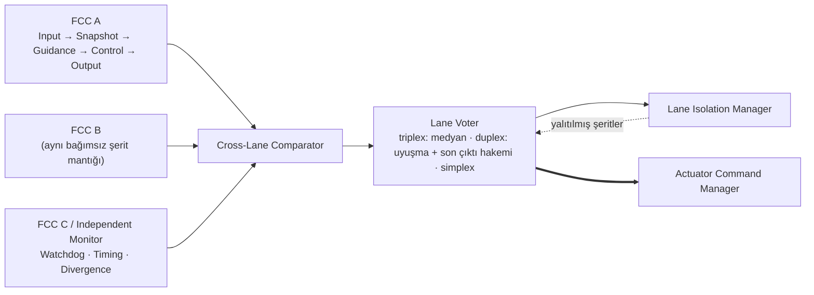
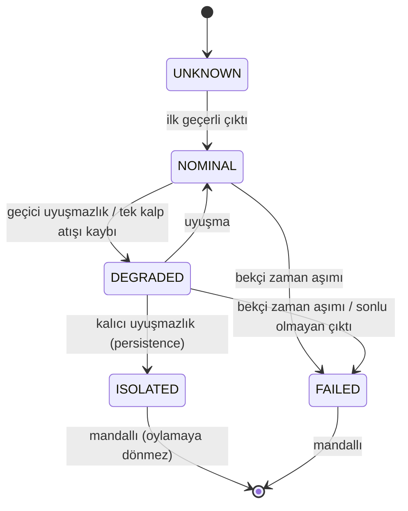

# 03 — TRIPLEX FCC ARCHITECTURE

> Sivil mühendislik referans mimarisi — yazılım/güvenlik/simülasyon düzeyi.
> Uçuşa hazır donanım, kablolama, ESC/motor ayarı ya da kontrol kazancı içermez.
> Ana belge: [15 — Master System Architecture](../15-sistem-mimarisi.md).
> Diyagram ve tablolar `python -m simurg.architecture --update-all` ile üretilir.

## Şerit yapısı

## Şerit durumları

* Kod: `simurg/fdir/lanes.py` (`TriplexVoter`, `LaneState`) ve
  `simurg/sim/triplex.py` (`TriplexFlightComputer`, arıza hedefi `fcc:A|B|C`).
* Tek şerit arızası çıktıyı bozmaz: üçlüde medyan sapan şeridi maskeler;
  kalıcı sapma ISOLATED, kalp atışı kaybı FAILED olur ve ikili moda geçilir.
  Hiç şerit kalmazsa çıktı yoktur → `controllable=False` → PARAŞÜT kuralı.
* **Dürüst sınırlama:** simülasyonda şeritler aynı hesabın kopyasıdır; farklı
  mimarili uygulamalar, bağımsız monitör (IMU C), zamanlama izleme ve saat
  tutarlılığı PLANNED'dır.
* Zamanlama: tüm şeritler aynı sabit tick'te (`TICK_ORDER`, 8. adım) çalışır;
  sensör füzyonu zaman damgası/tazelik denetimli ölçüm hattından beslenir.

## Diyagram

```mermaid
flowchart LR
  classDef implemented fill:#d7f5dd,stroke:#1a7f37,color:#0b3d1a;
  classDef partial fill:#fff4c2,stroke:#9a6700,color:#3d2e00;
  classDef unvalidated fill:#ffe1c7,stroke:#bc4c00,color:#4d1f00;
  classDef planned fill:#eef0f3,stroke:#8c959f,color:#57606a,stroke-dasharray: 4 3;
  classDef gate fill:#ffd8d8,stroke:#cf222e,color:#5c0a0a,stroke-width:3px;
  classDef ext fill:#ffffff,stroke:#8c959f,color:#57606a;
  classDef stage fill:#f6f8fa,stroke:#57606a,color:#24292f;
  subgraph FCC["TRIPLEX FLIGHT COMPUTERS"]
    direction TB
    subgraph FCC_A["FCC A"]
      FCC_A_INPUT["Input Manager"]:::partial
      FCC_A_SNAP["State Snapshot"]:::partial
      FCC_A_GUID["Guidance"]:::partial
      FCC_A_CTRL["Control"]:::partial
      FCC_A_HMON["Health Monitor"]:::partial
      FCC_A_OUT["Output Proposal"]:::partial
    end
    subgraph FCC_B["FCC B"]
      FCC_B_INPUT["Input Manager"]:::planned
      FCC_B_SNAP["State Snapshot"]:::planned
      FCC_B_GUID["Guidance"]:::planned
      FCC_B_CTRL["Control"]:::planned
      FCC_B_HMON["Health Monitor"]:::planned
      FCC_B_OUT["Output Proposal"]:::partial
    end
    subgraph FCC_C["FCC C / Independent Monitor"]
      FCC_C_MONITOR["Independent Monitor"]:::planned
      FCC_C_TIMING["Timing Monitor"]:::planned
      FCC_C_WATCHDOG["Watchdog"]:::implemented
      FCC_C_DIVERGENCE["Divergence Detection"]:::implemented
      FCC_C_OUT["Output Proposal (C)"]:::partial
    end
    subgraph FCC_X["Cross-lane"]
      FCC_COMPARATOR["Cross-Lane Comparator"]:::implemented
      FCC_VOTER["Lane Voter"]:::implemented
      FCC_ISOLATION["Lane Isolation Manager"]:::implemented
    end
  end
  AL_LIMITER["Command Limiter<br/><i>CONTROL ALLOCATION</i>"]:::ext
  BUS_STATE["State Bus<br/><i>DATA BUS (mantıksal)</i>"]:::ext
  SEN_IMU_C["IMU C<br/><i>SENSOR SUITE</i>"]:::ext
  FDIR_FCC["FCC FDIR<br/><i>FDIR</i>"]:::ext
  TM_TIMING_MON["Timing Monitor<br/><i>TIME / SYNCHRONIZATION</i>"]:::ext
  ACT_CMD_MGR["Actuator Command Manager<br/><i>ACTUATOR SYSTEM (simülasyon soyutlaması)</i>"]:::ext
  PF_FCC["FCC Lane Check<br/><i>PREFLIGHT SUPERVISOR</i>"]:::ext
  FDR_FCC["FCC Lane Recorder<br/><i>FLIGHT DATA RECORDER</i>"]:::ext
  DT_FCCMODEL["FCC Lane Model<br/><i>DIGITAL TWIN</i>"]:::ext
  AL_LIMITER ==>|"şerit önerisi"| FCC_A_OUT
  FCC_A_OUT ==> FCC_COMPARATOR
  AL_LIMITER ==>|"şerit önerisi"| FCC_B_OUT
  FCC_B_OUT ==> FCC_COMPARATOR
  AL_LIMITER ==>|"şerit önerisi"| FCC_C_OUT
  FCC_C_OUT ==> FCC_COMPARATOR
  FCC_A_INPUT --> FCC_A_SNAP
  FCC_A_SNAP --> FCC_A_GUID
  FCC_A_GUID ==> FCC_A_CTRL
  FCC_A_CTRL ==> FCC_A_OUT
  FCC_A_HMON -.->|"kalp atışı"| FCC_C_WATCHDOG
  BUS_STATE --> FCC_A_INPUT
  FCC_B_INPUT --> FCC_B_SNAP
  FCC_B_SNAP --> FCC_B_GUID
  FCC_B_GUID ==> FCC_B_CTRL
  FCC_B_CTRL ==> FCC_B_OUT
  FCC_B_HMON -.->|"kalp atışı"| FCC_C_WATCHDOG
  BUS_STATE --> FCC_B_INPUT
  FCC_C_MONITOR -.->|"bağımsız gözlem"| FCC_COMPARATOR
  SEN_IMU_C -->|"IMU C"| FCC_C_MONITOR
  FCC_C_WATCHDOG -.->|"zaman aşımı"| FCC_ISOLATION
  FCC_C_TIMING -.->|"zamanlama"| FCC_ISOLATION
  FCC_COMPARATOR -.->|"fark"| FCC_C_DIVERGENCE
  FCC_C_DIVERGENCE -.->|"kalıcı ayrışma"| FCC_ISOLATION
  FCC_COMPARATOR ==> FCC_VOTER
  FCC_ISOLATION -.->|"yalıtılmış şeritler"| FCC_VOTER
  FCC_ISOLATION -.->|"şerit durumları"| FDIR_FCC
  TM_TIMING_MON -.-> FCC_C_TIMING
  FCC_VOTER ==>|"oylanmış komut"| ACT_CMD_MGR
  FCC_C_WATCHDOG -.->|"kalp atışları"| PF_FCC
  FCC_ISOLATION -->|"şerit olayları"| FDR_FCC
  DT_FCCMODEL -.->|"şerit arızaları"| FCC_VOTER
```

<!-- BEGIN GENERATED: view-triplex-fcc -->

<!-- END GENERATED: view-triplex-fcc -->

## Bileşen matrisi

<!-- BEGIN GENERATED: matrix-triplex-fcc -->
#### TRIPLEX FLIGHT COMPUTERS

| Component | Responsibility | Inputs | Outputs | Health State | Failure Behaviour | Code Location | Implementation Status |
|---|---|---|---|---|---|---|---|
| **Input Manager** `FCC_A_INPUT` | Girdi toplama ve tazelik | şerit içi | şerit içi | NOMINAL/DEGRADED/ISOLATED/FAILED/UNKNOWN | Şerit hatası -> çıktı uyuşmazlığı ya da kalp atışı kaybı -> yalıtım Yedeklilik: triplex. | `simurg/sim/engine.py::SimulationEngine` | PARTIAL — Simülasyonda tek hesap A şeridinde koşar; B/C onun kopyasını önerir |
| **State Snapshot** `FCC_A_SNAP` | Çevrim başı tutarlı durum görüntüsü | şerit içi | şerit içi | NOMINAL/DEGRADED/ISOLATED/FAILED/UNKNOWN | Şerit hatası -> çıktı uyuşmazlığı ya da kalp atışı kaybı -> yalıtım Yedeklilik: triplex. | `simurg/sim/engine.py::SimulationEngine` | PARTIAL — Simülasyonda tek hesap A şeridinde koşar; B/C onun kopyasını önerir |
| **Guidance** `FCC_A_GUID` | Şerit içi güdüm (GUIDANCE işlevleri) | şerit içi | şerit içi | NOMINAL/DEGRADED/ISOLATED/FAILED/UNKNOWN | Şerit hatası -> çıktı uyuşmazlığı ya da kalp atışı kaybı -> yalıtım Yedeklilik: triplex. | `simurg/sim/engine.py::SimulationEngine` | PARTIAL — Simülasyonda tek hesap A şeridinde koşar; B/C onun kopyasını önerir |
| **Control** `FCC_A_CTRL` | Şerit içi kontrol + dağıtım (FLIGHT CONTROL + ALLOCATION) | şerit içi | şerit içi | NOMINAL/DEGRADED/ISOLATED/FAILED/UNKNOWN | Şerit hatası -> çıktı uyuşmazlığı ya da kalp atışı kaybı -> yalıtım Yedeklilik: triplex. | `simurg/sim/engine.py::SimulationEngine` | PARTIAL — Simülasyonda tek hesap A şeridinde koşar; B/C onun kopyasını önerir |
| **Health Monitor** `FCC_A_HMON` | Şeridin öz-sağlığı ve kalp atışı | şerit içi | şerit içi | NOMINAL/DEGRADED/ISOLATED/FAILED/UNKNOWN | Şerit hatası -> çıktı uyuşmazlığı ya da kalp atışı kaybı -> yalıtım Yedeklilik: triplex. | `simurg/sim/engine.py::SimulationEngine` | PARTIAL — Simülasyonda tek hesap A şeridinde koşar; B/C onun kopyasını önerir |
| **Output Proposal** `FCC_A_OUT` | Şeridin eyleyici komutu önerisi | şerit kontrolü | LaneOutput | NOMINAL/DEGRADED/ISOLATED/FAILED/UNKNOWN | Sapma -> ISOLATED; kalp atışı yok -> FAILED Yedeklilik: triplex. | `simurg/sim/triplex.py::TriplexFlightComputer` | PARTIAL — Simülasyonda aynı hesabın kopyası + şerit arızası enjeksiyonu |
| **Input Manager** `FCC_B_INPUT` | Girdi toplama ve tazelik | şerit içi | şerit içi | NOMINAL/DEGRADED/ISOLATED/FAILED/UNKNOWN | Şerit hatası -> çıktı uyuşmazlığı ya da kalp atışı kaybı -> yalıtım Yedeklilik: triplex. | — | PLANNED — Farklı mimarili bağımsız uygulama planlanan |
| **State Snapshot** `FCC_B_SNAP` | Çevrim başı tutarlı durum görüntüsü | şerit içi | şerit içi | NOMINAL/DEGRADED/ISOLATED/FAILED/UNKNOWN | Şerit hatası -> çıktı uyuşmazlığı ya da kalp atışı kaybı -> yalıtım Yedeklilik: triplex. | — | PLANNED — Farklı mimarili bağımsız uygulama planlanan |
| **Guidance** `FCC_B_GUID` | Şerit içi güdüm (GUIDANCE işlevleri) | şerit içi | şerit içi | NOMINAL/DEGRADED/ISOLATED/FAILED/UNKNOWN | Şerit hatası -> çıktı uyuşmazlığı ya da kalp atışı kaybı -> yalıtım Yedeklilik: triplex. | — | PLANNED — Farklı mimarili bağımsız uygulama planlanan |
| **Control** `FCC_B_CTRL` | Şerit içi kontrol + dağıtım (FLIGHT CONTROL + ALLOCATION) | şerit içi | şerit içi | NOMINAL/DEGRADED/ISOLATED/FAILED/UNKNOWN | Şerit hatası -> çıktı uyuşmazlığı ya da kalp atışı kaybı -> yalıtım Yedeklilik: triplex. | — | PLANNED — Farklı mimarili bağımsız uygulama planlanan |
| **Health Monitor** `FCC_B_HMON` | Şeridin öz-sağlığı ve kalp atışı | şerit içi | şerit içi | NOMINAL/DEGRADED/ISOLATED/FAILED/UNKNOWN | Şerit hatası -> çıktı uyuşmazlığı ya da kalp atışı kaybı -> yalıtım Yedeklilik: triplex. | — | PLANNED — Farklı mimarili bağımsız uygulama planlanan |
| **Output Proposal** `FCC_B_OUT` | Şeridin eyleyici komutu önerisi | şerit kontrolü | LaneOutput | NOMINAL/DEGRADED/ISOLATED/FAILED/UNKNOWN | Sapma -> ISOLATED; kalp atışı yok -> FAILED Yedeklilik: triplex. | `simurg/sim/triplex.py::TriplexFlightComputer` | PARTIAL — Simülasyonda aynı hesabın kopyası + şerit arızası enjeksiyonu |
| **Independent Monitor** `FCC_C_MONITOR` | Bağımsız durumla çıktıları karşılaştırma | IMU C, şerit çıktıları | uyuşmazlık | NOMINAL/DEGRADED/ISOLATED/FAILED/UNKNOWN | Planlanan (bugün C şeridi de kopya önerir) | — | PLANNED |
| **Timing Monitor** `FCC_C_TIMING` | Şerit çevrim süreleri ve son tarihler | çizelge | zamanlama ihlali | NOMINAL/DEGRADED/ISOLATED/FAILED/UNKNOWN | Planlanan | — | PLANNED |
| **Watchdog** `FCC_C_WATCHDOG` | Kalp atışı zaman aşımı | kalp atışları | şerit canlı mı | NOMINAL/DEGRADED/ISOLATED/FAILED/UNKNOWN | Zaman aşımı -> FAILED (mandallı) | `simurg/fdir/lanes.py::TriplexVoter` | IMPLEMENTED |
| **Divergence Detection** `FCC_C_DIVERGENCE` | Ardışık uyuşmazlık sayacı | fark vektörü | ayrışan şerit | NOMINAL/DEGRADED/ISOLATED/FAILED/UNKNOWN | Kalıcı ayrışma -> ISOLATED | `simurg/fdir/lanes.py::TriplexVoter` | IMPLEMENTED |
| **Output Proposal (C)** `FCC_C_OUT` | Üçüncü çıktı (oylamada hakem) | şerit C | LaneOutput | NOMINAL/DEGRADED/ISOLATED/FAILED/UNKNOWN | Sapma -> ISOLATED Yedeklilik: triplex. | `simurg/sim/triplex.py::TriplexFlightComputer` | PARTIAL — Simülasyonda kopya |
| **Cross-Lane Comparator** `FCC_COMPARATOR` | Şerit çıktılarını medyana göre karşılaştırma | A/B/C çıktıları | fark vektörü | NOMINAL/DEGRADED/ISOLATED/FAILED/UNKNOWN | Tek şerit sapması medyanla maskelenir | `simurg/fdir/lanes.py::TriplexVoter` | IMPLEMENTED |
| **Lane Voter** `FCC_VOTER` | Üçlüde medyan, ikilide uyuşma + son çıktı hakemi, tekli | çıktılar, durumlar | oylanmış eyleyici komutu | NOMINAL/DEGRADED/ISOLATED/FAILED/UNKNOWN | Şerit yok -> çıktı yok -> controllable=False -> PARAŞÜT kuralı Yedeklilik: triplex. | `simurg/fdir/lanes.py::TriplexVoter` | IMPLEMENTED |
| **Lane Isolation Manager** `FCC_ISOLATION` | NOMINAL/DEGRADED/ISOLATED/FAILED/UNKNOWN durumları | karşılaştırma, bekçi | şerit durumları + olay | NOMINAL/DEGRADED/ISOLATED/FAILED/UNKNOWN | ISOLATED/FAILED mandallı: oylayıcıya nominal dönmez | `simurg/fdir/lanes.py::LaneState` | IMPLEMENTED |
<!-- END GENERATED: matrix-triplex-fcc -->
