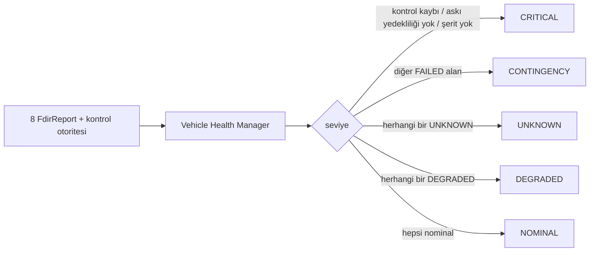
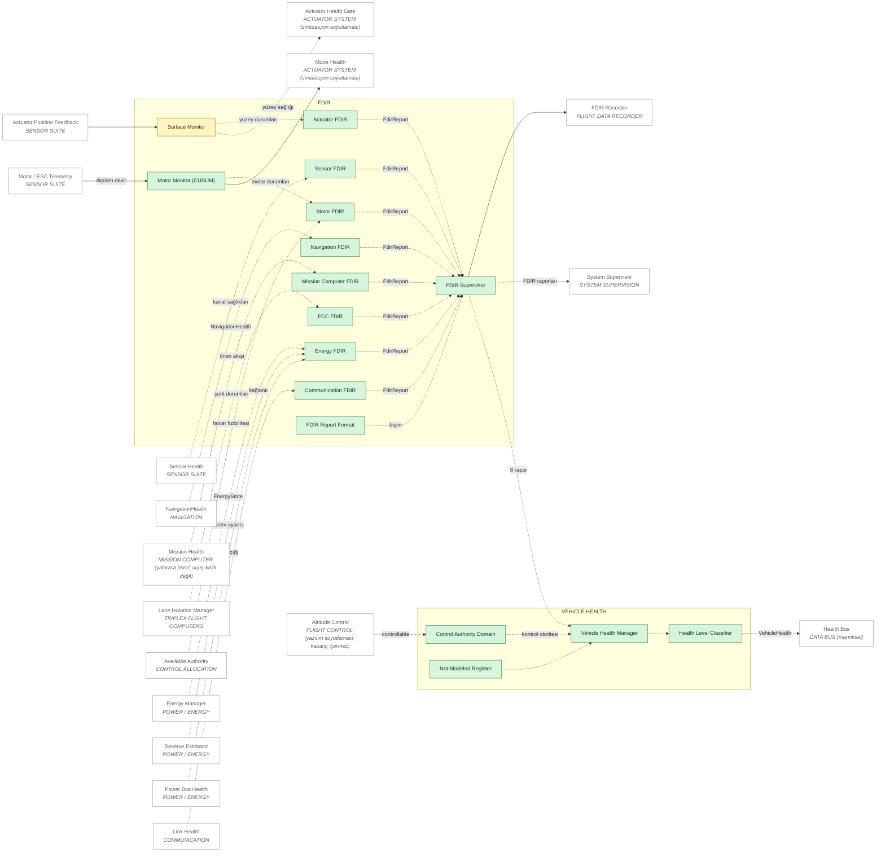

# 04 — FDIR + VEHICLE HEALTH ARCHITECTURE

> Sivil mühendislik referans mimarisi — yazılım/güvenlik/simülasyon düzeyi.
> Uçuşa hazır donanım, kablolama, ESC/motor ayarı ya da kontrol kazancı içermez.
> Ana belge: [15 — Master System Architecture](../15-sistem-mimarisi.md).
> Diyagram ve tablolar `python -m simurg.architecture --update-all` ile üretilir.

## FDIR omurgası

FDIR Supervisor altındaki sekiz alan FDIR'i (`simurg/fdir/reports.py`) aynı
standart raporu üretir:

| Alan | fault_detected | fault_isolated | fault_class | confidence | health_state | recommended_degradation |
|---|---|---|---|---|---|---|
| Sensor | kanal geçersiz/bayat | kanallar | sensor_loss / sensor_degradation | 0..1 | N/D/F/U | geri dönüş kaynağı |
| Navigation | kaynak kaybı / bütünlük | kaynaklar | nav_source_loss / nav_integrity_loss | güven | N/D/F/U | loiter_hold |
| FCC | şerit sapması / kaybı | şeritler | lane_divergence / lane_loss | 0..1 | N/D/F/U | ikili mod / acil iniş / paraşüt |
| Motor | devir artığı | motorlar | motor_degradation / motor_loss | 0..1 | N/D/F/U | dağıtımdan çıkar |
| Actuator | konum artığı | yüzeyler | actuator_loss | 0..1 | N/D/F | dağıtımdan çıkar |
| Energy | açık / rezerv / bozunum | bara, rezerv | power_shortfall / energy_degradation | 0..1 | N/D/F/U | eve dönüş |
| Communication | C2 yok | link:c2 | link_loss | 1 | N/F | bağlantı kaybı zamanlayıcısı |
| Mission Computer | geçersiz öneri | görev bilgisayarı | proposal_invalid | 0..1 | N/D/F/U | güvenlik kontrolcüsü |

## Vehicle Health Manager

Önem sırası: CRITICAL > CONTINGENCY > UNKNOWN > DEGRADED > NOMINAL. Çıktı
`VehicleHealth(level, reasons[], domains, fdir_reports)`; değişimler
`vehicle_health_changed` olayıyla kaydedilir. **UNKNOWN hiçbir zaman NOMINAL
değildir** (`test_system_supervision.test_unknown_is_never_nominal`).

## Diyagram

<!-- BEGIN GENERATED: view-fdir-health -->

<!-- END GENERATED: view-fdir-health -->

## Bileşen matrisi

<!-- BEGIN GENERATED: matrix-fdir-health -->
#### FDIR

| Component | Responsibility | Inputs | Outputs | Health State | Failure Behaviour | Code Location | Implementation Status |
|---|---|---|---|---|---|---|---|
| **FDIR Supervisor** `FDIR_SUP` | Sekiz alan FDIR'ini çalıştırma, raporları birleştirme | alan girdileri | 8 FdirReport | NOMINAL/DEGRADED/FAILED/UNKNOWN | Bilgisi olmayan alan UNKNOWN raporlar | `simurg/fdir/vehicle_health.py::VehicleHealthModel` | IMPLEMENTED |
| **Sensor FDIR** `FDIR_SENSOR` | Tespit, yalıtım, sınıf, güven, sağlık, önerilen bozulma | Kanal sağlıkları | FdirReport | NOMINAL/DEGRADED/FAILED/UNKNOWN | Gözlenmeyen durum -> UNKNOWN (NOMINAL değil) | `simurg/fdir/reports.py::sensor_fdir` | IMPLEMENTED |
| **Navigation FDIR** `FDIR_NAV` | Tespit, yalıtım, sınıf, güven, sağlık, önerilen bozulma | NavigationSolution | FdirReport | NOMINAL/DEGRADED/FAILED/UNKNOWN | Gözlenmeyen durum -> UNKNOWN (NOMINAL değil) | `simurg/fdir/reports.py::navigation_fdir` | IMPLEMENTED |
| **FCC FDIR** `FDIR_FCC` | Tespit, yalıtım, sınıf, güven, sağlık, önerilen bozulma | Şerit durumları | FdirReport | NOMINAL/DEGRADED/FAILED/UNKNOWN | Gözlenmeyen durum -> UNKNOWN (NOMINAL değil) | `simurg/fdir/reports.py::fcc_fdir` | IMPLEMENTED |
| **Motor FDIR** `FDIR_MOTOR` | Tespit, yalıtım, sınıf, güven, sağlık, önerilen bozulma | Motor durumları + hover fizibilitesi | FdirReport | NOMINAL/DEGRADED/FAILED/UNKNOWN | Gözlenmeyen durum -> UNKNOWN (NOMINAL değil) | `simurg/fdir/reports.py::motor_fdir` | IMPLEMENTED |
| **Actuator FDIR** `FDIR_ACTUATOR` | Tespit, yalıtım, sınıf, güven, sağlık, önerilen bozulma | Yüzey durumları | FdirReport | NOMINAL/DEGRADED/FAILED/UNKNOWN | Gözlenmeyen durum -> UNKNOWN (NOMINAL değil) | `simurg/fdir/reports.py::actuator_fdir` | IMPLEMENTED |
| **Energy FDIR** `FDIR_ENERGY` | Tespit, yalıtım, sınıf, güven, sağlık, önerilen bozulma | EnergyState, rezerv, güç açığı | FdirReport | NOMINAL/DEGRADED/FAILED/UNKNOWN | Gözlenmeyen durum -> UNKNOWN (NOMINAL değil) | `simurg/fdir/reports.py::energy_fdir` | IMPLEMENTED |
| **Communication FDIR** `FDIR_COMM` | Tespit, yalıtım, sınıf, güven, sağlık, önerilen bozulma | Bağlantı durumu | FdirReport | NOMINAL/DEGRADED/FAILED/UNKNOWN | Gözlenmeyen durum -> UNKNOWN (NOMINAL değil) | `simurg/fdir/reports.py::communication_fdir` | IMPLEMENTED |
| **Mission Computer FDIR** `FDIR_MC` | Tespit, yalıtım, sınıf, güven, sağlık, önerilen bozulma | Öneri akışı geçerliliği | FdirReport | NOMINAL/DEGRADED/FAILED/UNKNOWN | Gözlenmeyen durum -> UNKNOWN (NOMINAL değil) | `simurg/fdir/reports.py::mission_computer_fdir` | IMPLEMENTED |
| **Motor Monitor (CUSUM)** `FDIR_MOTOR_MON` | Devir artığı CUSUM + verim EMA | beklenen/ölçülen devir | ComponentHealth | NOMINAL/DEGRADED/FAILED/UNKNOWN | Sabit kısmi hasar DEGRADED kalır; FAILED mandallı | `simurg/fdir/monitor.py::MotorHealthMonitor` | IMPLEMENTED |
| **Surface Monitor** `FDIR_SURFACE_MON` | Komut-konum artığı kalıcılığı | beklenen/ölçülen konum | ComponentHealth | NOMINAL/FAILED | Kalıcı artık -> FAILED | `simurg/fdir/monitor.py::SurfaceMonitor` | PARTIAL — Yüzey verim kaybı konumdan gözlenemez |
| **FDIR Report Format** `FDIR_REPORT` | Standart rapor: tespit/yalıtım/sınıf/güven/sağlık/öneri | - | FdirReport | durumsuz (n/a) | n/a | `simurg/fdir/reports.py::FdirReport` | IMPLEMENTED |

#### VEHICLE HEALTH

| Component | Responsibility | Inputs | Outputs | Health State | Failure Behaviour | Code Location | Implementation Status |
|---|---|---|---|---|---|---|---|
| **Vehicle Health Manager** `VH_MANAGER` | Alan raporlarını araç seviyesine birleştirme | 8 FdirReport + kontrol otoritesi | VehicleHealth | NOMINAL/DEGRADED/CONTINGENCY/CRITICAL/UNKNOWN | UNKNOWN asla NOMINAL değil; değişim VEHICLE_HEALTH_CHANGED olayı | `simurg/fdir/vehicle_health.py::VehicleHealthModel` | IMPLEMENTED |
| **Health Level Classifier** `VH_LEVEL` | CRITICAL > CONTINGENCY > UNKNOWN > DEGRADED > NOMINAL | alan durumları | seviye + reasons[] | durumsuz (n/a) | n/a (saf fonksiyon) | `simurg/fdir/vehicle_health.py::classify` | IMPLEMENTED |
| **Control Authority Domain** `VH_CONTROL_AUTH` | Kontrol edilebilirlik + askı otoritesi | controllable, hover marjı | kontrol alanı sağlığı | NOMINAL/DEGRADED/FAILED/UNKNOWN | Kontrol kaybı -> CRITICAL | `simurg/fdir/vehicle_health.py::VehicleHealthModel` | IMPLEMENTED |
| **Not-Modeled Register** `VH_NOT_MODELED` | Modellenmeyen alanların açık listesi (termal, IMU) | - | not_modeled | durumsuz (n/a) | 'Modellenmedi' != 'sağlıklı' ayrımı korunur | `simurg/fdir/vehicle_health.py::NOT_MODELED` | IMPLEMENTED |
<!-- END GENERATED: matrix-fdir-health -->
