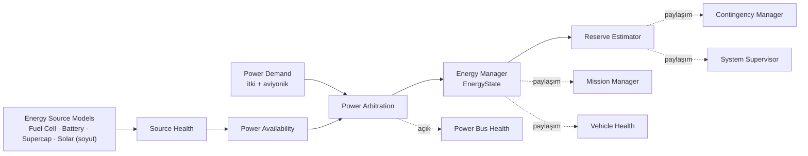
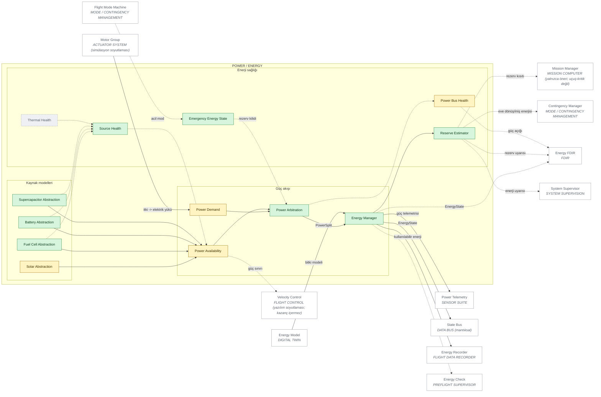

# 05 — POWER ARCHITECTURE

> Sivil mühendislik referans mimarisi — yazılım/güvenlik/simülasyon düzeyi.
> Uçuşa hazır donanım, kablolama, ESC/motor ayarı ya da kontrol kazancı içermez.
> Ana belge: [15 — Master System Architecture](../15-sistem-mimarisi.md).
> Diyagram ve tablolar `python -m simurg.architecture --update-all` ile üretilir.

## Güç akışı

* Kaynaklar **soyutlamadır**; fiziksel hidrojen sistemi kurulumu, yakıt
  hücresi ya da batarya donanım ayarı kapsam dışıdır.
* Enerji sağlığı: kalıcı (> 0,5 s) güç açığı → FAILED (CONTINGENCY);
  rezerv uyarısı / kaynak bozunumu → DEGRADED; sonlu olmayan kestirim → UNKNOWN.
* Emergency Energy State: rezerv yalnızca acil modlarda kullanıma açılır.
* Termal sağlık PLANNED.

## Diyagram

<!-- BEGIN GENERATED: view-power -->

<!-- END GENERATED: view-power -->

## Bileşen matrisi

<!-- BEGIN GENERATED: matrix-power -->
#### POWER / ENERGY

| Component | Responsibility | Inputs | Outputs | Health State | Failure Behaviour | Code Location | Implementation Status |
|---|---|---|---|---|---|---|---|
| **Fuel Cell Abstraction** `EN_FC` | PEM gücü, eğim sınırı, H2 tüketimi (soyut) | hedef güç | FC gücü | NOMINAL/DEGRADED/FAILED/UNKNOWN | Bozunum -> güç ölçeği düşer Yedeklilik: hibrit kaynak. | `simurg/power/energy_manager.py::fc_efficiency` | IMPLEMENTED — Fiziksel hidrojen sistemi kurulumu kapsam dışı |
| **Battery Abstraction** `EN_BATT` | SoC, deşarj sınırı | güç | SoC | NOMINAL/DEGRADED/FAILED/UNKNOWN | Kapasite kaybı kalıcı; rezerv uyarısı Yedeklilik: hibrit kaynak. | `simurg/power/energy_manager.py::EnergyManager` | IMPLEMENTED |
| **Supercapacitor Abstraction** `EN_SC` | Tepe güç tamponu | güç | SoC | NOMINAL/DEGRADED/FAILED/UNKNOWN | Bara akım sınırında tükenir Yedeklilik: hibrit kaynak. | `simurg/power/energy_manager.py::EnergyManager` | IMPLEMENTED |
| **Solar Abstraction** `EN_SOLAR` | Güneş katkısı | güneş girdisi | güç | NOMINAL/DEGRADED/FAILED/UNKNOWN | Yok sayılır (0 W) | `simurg/power/energy_manager.py::EnergyManager` | PARTIAL — Birim testli; simülasyon motorunda 0 W |
| **Source Health** `EN_SRC_HEALTH` | Kaynak bozunum özeti | ölçekler | health 0..1 | NOMINAL/DEGRADED/FAILED/UNKNOWN | < 1 -> DEGRADED | `simurg/power/energy_manager.py::EnergyManager` | IMPLEMENTED |
| **Power Availability** `EN_AVAIL` | Kaynak başına anlık güç sınırı | SoC, ölçekler | kullanılabilir güç | durumsuz (n/a) | Talep > kullanılabilir -> karşılanamayan güç | `simurg/power/energy_manager.py::EnergyManager` | PARTIAL |
| **Power Demand** `EN_DEMAND` | İtki + aviyonik elektrik yükü | itki, hız | anlık talep | durumsuz (n/a) | n/a | `simurg/sim/propulsion.py::PropulsionModel` | PARTIAL — İleri tahmin planlanan |
| **Power Arbitration** `EN_ARBITRATION` | Frekans ayrıştırmalı kaynak paylaşımı | talep, sınırlar | PowerSplit | durumsuz (n/a) | Açık > 0,5 s -> güç alanı FAILED; itki ölçeklenir | `simurg/power/energy_manager.py::EnergyManager` | IMPLEMENTED |
| **Energy Manager** `EN_MANAGER` | Hibrit enerji yönetimi, EnergyState | talep | EnergyState | NOMINAL/DEGRADED/FAILED/UNKNOWN | Sonlu olmayan kestirim -> UNKNOWN | `simurg/power/energy_manager.py::EnergyManager` | IMPLEMENTED |
| **Reserve Estimator** `EN_RESERVE` | Eve dönüş/iniş enerjisi ve uyarı histerezisi | kullanılabilir enerji, mesafe | ReserveAssessment | bilinmeyen enerji -> uyarı | Uyarı -> görev iptali + RETURN | `simurg/power/reserve.py::ReserveMonitor` | IMPLEMENTED |
| **Power Bus Health** `EN_BUS_HEALTH` | Karşılanamayan güç, itki güç faktörü | PowerSplit | bara sağlığı | NOMINAL/DEGRADED/FAILED/UNKNOWN | Kalıcı açık -> FAILED | `simurg/sim/engine.py::SimulationEngine` | PARTIAL — Güç dengesi düzeyinde; gerilim modellenmez |
| **Thermal Health** `EN_THERMAL` | Batarya/FC sıcaklığı | güç | sıcaklık | NOMINAL/DEGRADED/FAILED/UNKNOWN | Planlanan | — | PLANNED |
| **Emergency Energy State** `EN_EMERGENCY` | Acil modlarda rezervin kullanıma açılması | mod | rezerv kilidi | durumsuz (n/a) | Rezerv yalnızca acil durumda | `simurg/power/energy_manager.py::EnergyManager` | IMPLEMENTED |
<!-- END GENERATED: matrix-power -->
