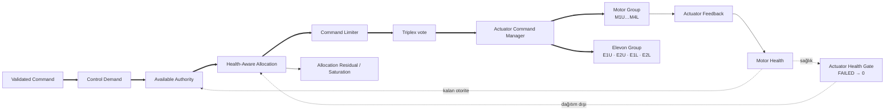
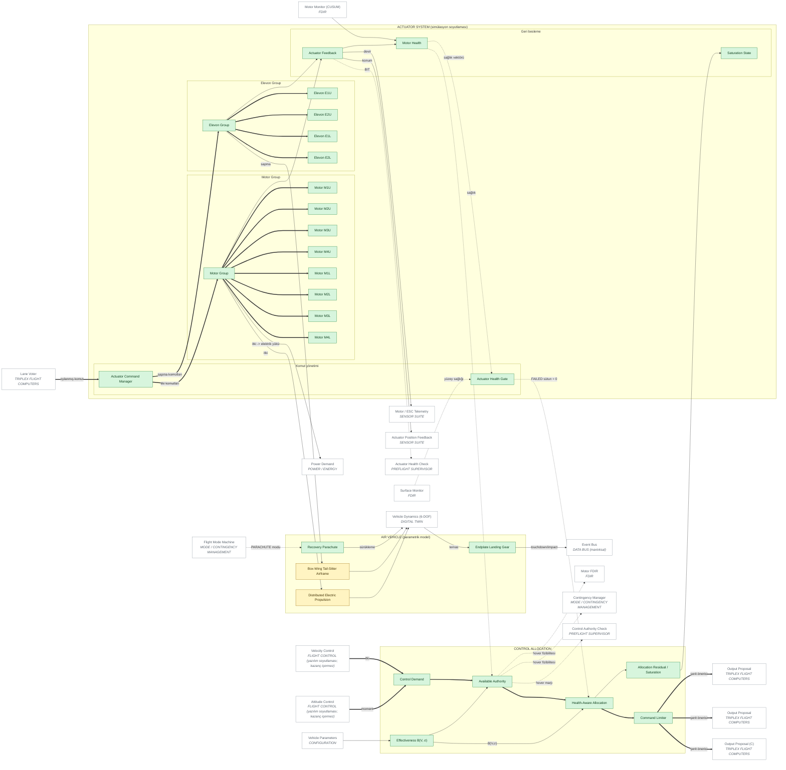

# 06 — ACTUATOR / CONTROL ALLOCATION ARCHITECTURE

> Sivil mühendislik referans mimarisi — yazılım/güvenlik/simülasyon düzeyi.
> Uçuşa hazır donanım, kablolama, ESC/motor ayarı ya da kontrol kazancı içermez.
> Ana belge: [15 — Master System Architecture](../15-sistem-mimarisi.md).
> Diyagram ve tablolar `python -m simurg.architecture --update-all` ile üretilir.

## Zincir

* **FAILED eyleyici nominal dağıtıma alınmaz:** dağıtıcı FAILED sütunu 0'da
  sabitler (`test_system_of_systems.test_failed_actuator_receives_no_nominal_allocation`);
  çıkarma `actuator_excluded` olayıyla kaydedilir ve
  `ReplaySession.why_actuator_removed()` ile açıklanır.
* Geri beslemeler: actuator feedback, motor health, saturation state,
  allocation residual, remaining control authority (hover marjı).
* Eyleyiciler **simülasyon soyutlamasıdır**: gerçek motor sürme protokolü,
  ESC firmware ayarı ya da uçuşa hazır eyleyici ayarı içermez.

## Diyagram

<!-- BEGIN GENERATED: view-allocation-actuators -->

<!-- END GENERATED: view-allocation-actuators -->

## Bileşen matrisi

<!-- BEGIN GENERATED: matrix-allocation-actuators -->
#### CONTROL ALLOCATION

| Component | Responsibility | Inputs | Outputs | Health State | Failure Behaviour | Code Location | Implementation Status |
|---|---|---|---|---|---|---|---|
| **Control Demand** `AL_DEMAND` | İtki + moment isteği vektörü | kontrol yasaları | v_des | durumsuz (n/a) | Sonlu olmayan istek -> SimulationError | `simurg/control/effectiveness.py::body_to_alloc` | IMPLEMENTED |
| **Effectiveness B(V, σ)** `AL_EFFECTIVENESS` | Rejime bağlı etkinlik matrisi | hız, σ, yapılandırma | ControlRegime | durumsuz (n/a) | İç motorlar seyirde katlı (B sütunu 0) | `simurg/control/effectiveness.py::ScheduledEffectiveness` | IMPLEMENTED |
| **Available Authority** `AL_AUTHORITY` | Askı marjı (itki/ağırlık) ve kalan otorite | sağlık vektörü | hover marjı | bilinmeyen eyleyici havada = çalışmıyor | Marj < eşik -> hover_feasible=False -> acil iniş kuralı | `simurg/sim/health.py::HealthSupervisor` | IMPLEMENTED |
| **Health-Aware Allocation** `AL_ALLOCATOR` | Sağlık ağırlıklı RPI dağıtımı | v_des, sağlık, rejim | eyleyici komutu, doyma, artık | durumsuz (n/a) | Doyma -> artık (allocation residual) raporlanır | `simurg/control/allocation.py::ControlAllocator` | IMPLEMENTED |
| **Command Limiter** `AL_LIMITER` | Eyleyici sınırlarına kırpma | dağıtım çıktısı | sınırlı komut | durumsuz (n/a) | Sınır dışı komut eyleyiciye gitmez | `simurg/control/allocation.py::ControlAllocator` | IMPLEMENTED |
| **Allocation Residual / Saturation** `AL_RESIDUAL` | İstenen - elde edilen; doyma oranı | dağıtım | artık, doyma | durumsuz (n/a) | Kalıcı otorite açığı -> kontrol kaybı zamanlayıcısı | `simurg/control/allocation.py::AllocationResult` | IMPLEMENTED |

#### ACTUATOR SYSTEM (simülasyon soyutlaması)

| Component | Responsibility | Inputs | Outputs | Health State | Failure Behaviour | Code Location | Implementation Status |
|---|---|---|---|---|---|---|---|
| **Actuator Command Manager** `ACT_CMD_MGR` | Oylanmış komutun zaman damgasıyla dağıtımı | oylanmış komut | ActuatorCommand | durumsuz (n/a) | Çıktı yoksa son oylanmış komut tutulur + kontrol kaybı bayrağı | `simurg/sim/actuators.py::ActuatorCommand` | IMPLEMENTED |
| **Actuator Health Gate** `ACT_HEALTH_GATE` | FAILED eyleyici nominal dağıtıma ALINMAZ (komut 0) | sağlık vektörü | kapılı dağıtım | durumsuz (n/a) | ACTUATOR_EXCLUDED olayı + yeni hover marjı | `simurg/control/allocation.py::ControlAllocator` | IMPLEMENTED — Simülasyonda dağıtıcı içinde (oylama öncesi) uygulanır |
| **Motor Group** `ACT_MOTOR_GROUP` | 8 motor DEP (iç 4'ü seyirde katlanır) | itki komutları | itkiler | NOMINAL/DEGRADED/FAILED/UNKNOWN | Tek motor kaybı tolere; aynı uçta iki motor -> hover yok -> süzülerek acil iniş Yedeklilik: 8 motor; herhangi tek motor kaybı askıda tolere. | `simurg/sim/actuators.py::ActuatorModel` | IMPLEMENTED |
| **Motor M1U** `ACT_M1U` | Motor + pervane (gecikme, tepki, doyma) | normalize itki | itki, devir | NOMINAL/DEGRADED/STUCK/OFFLINE | Verim kaybı -> DEGRADED; devir yok -> FAILED -> dağıtım dışı Yedeklilik: motor grubu. | `simurg/sim/actuators.py::ActuatorModel` | IMPLEMENTED |
| **Motor M2U** `ACT_M2U` | Motor + pervane (gecikme, tepki, doyma) | normalize itki | itki, devir | NOMINAL/DEGRADED/STUCK/OFFLINE | Verim kaybı -> DEGRADED; devir yok -> FAILED -> dağıtım dışı Yedeklilik: motor grubu. | `simurg/sim/actuators.py::ActuatorModel` | IMPLEMENTED |
| **Motor M3U** `ACT_M3U` | Motor + pervane (gecikme, tepki, doyma) | normalize itki | itki, devir | NOMINAL/DEGRADED/STUCK/OFFLINE | Verim kaybı -> DEGRADED; devir yok -> FAILED -> dağıtım dışı Yedeklilik: motor grubu. | `simurg/sim/actuators.py::ActuatorModel` | IMPLEMENTED |
| **Motor M4U** `ACT_M4U` | Motor + pervane (gecikme, tepki, doyma) | normalize itki | itki, devir | NOMINAL/DEGRADED/STUCK/OFFLINE | Verim kaybı -> DEGRADED; devir yok -> FAILED -> dağıtım dışı Yedeklilik: motor grubu. | `simurg/sim/actuators.py::ActuatorModel` | IMPLEMENTED |
| **Motor M1L** `ACT_M1L` | Motor + pervane (gecikme, tepki, doyma) | normalize itki | itki, devir | NOMINAL/DEGRADED/STUCK/OFFLINE | Verim kaybı -> DEGRADED; devir yok -> FAILED -> dağıtım dışı Yedeklilik: motor grubu. | `simurg/sim/actuators.py::ActuatorModel` | IMPLEMENTED |
| **Motor M2L** `ACT_M2L` | Motor + pervane (gecikme, tepki, doyma) | normalize itki | itki, devir | NOMINAL/DEGRADED/STUCK/OFFLINE | Verim kaybı -> DEGRADED; devir yok -> FAILED -> dağıtım dışı Yedeklilik: motor grubu. | `simurg/sim/actuators.py::ActuatorModel` | IMPLEMENTED |
| **Motor M3L** `ACT_M3L` | Motor + pervane (gecikme, tepki, doyma) | normalize itki | itki, devir | NOMINAL/DEGRADED/STUCK/OFFLINE | Verim kaybı -> DEGRADED; devir yok -> FAILED -> dağıtım dışı Yedeklilik: motor grubu. | `simurg/sim/actuators.py::ActuatorModel` | IMPLEMENTED |
| **Motor M4L** `ACT_M4L` | Motor + pervane (gecikme, tepki, doyma) | normalize itki | itki, devir | NOMINAL/DEGRADED/STUCK/OFFLINE | Verim kaybı -> DEGRADED; devir yok -> FAILED -> dağıtım dışı Yedeklilik: motor grubu. | `simurg/sim/actuators.py::ActuatorModel` | IMPLEMENTED |
| **Elevon Group** `ACT_ELEVON_GROUP` | 4 elevon (kutu kanat) | sapma komutları | sapmalar | NOMINAL/DEGRADED/FAILED/UNKNOWN | Tek yüzey kaybı -> DEGRADED; tümü -> FAILED (itki diferansiyeli) Yedeklilik: 4 yüzey. | `simurg/sim/actuators.py::ActuatorModel` | IMPLEMENTED |
| **Elevon E1U** `ACT_E1U` | Kontrol yüzeyi (soyutlama) | normalize sapma | sapma, konum | NOMINAL/DEGRADED/STUCK/OFFLINE | Takılı/devre dışı -> konum artığı -> FAILED -> dağıtım dışı Yedeklilik: elevon grubu. | `simurg/sim/actuators.py::ActuatorModel` | IMPLEMENTED |
| **Elevon E2U** `ACT_E2U` | Kontrol yüzeyi (soyutlama) | normalize sapma | sapma, konum | NOMINAL/DEGRADED/STUCK/OFFLINE | Takılı/devre dışı -> konum artığı -> FAILED -> dağıtım dışı Yedeklilik: elevon grubu. | `simurg/sim/actuators.py::ActuatorModel` | IMPLEMENTED |
| **Elevon E1L** `ACT_E1L` | Kontrol yüzeyi (soyutlama) | normalize sapma | sapma, konum | NOMINAL/DEGRADED/STUCK/OFFLINE | Takılı/devre dışı -> konum artığı -> FAILED -> dağıtım dışı Yedeklilik: elevon grubu. | `simurg/sim/actuators.py::ActuatorModel` | IMPLEMENTED |
| **Elevon E2L** `ACT_E2L` | Kontrol yüzeyi (soyutlama) | normalize sapma | sapma, konum | NOMINAL/DEGRADED/STUCK/OFFLINE | Takılı/devre dışı -> konum artığı -> FAILED -> dağıtım dışı Yedeklilik: elevon grubu. | `simurg/sim/actuators.py::ActuatorModel` | IMPLEMENTED |
| **Actuator Feedback** `ACT_FEEDBACK` | Çıkış, beklenen çıkış, konum | eyleyici modeli | ActuatorState | durumsuz (n/a) | Geri besleme yok -> ilgili FDIR UNKNOWN | `simurg/sim/actuators.py::ActuatorState` | IMPLEMENTED |
| **Motor Health** `ACT_MOTOR_HEALTH` | Motor başına sağlık + verim kestirimi | devir artığı | sağlık vektörü (motor) | NOMINAL/DEGRADED/FAILED/UNKNOWN | Gözlenmemiş motor havada UNKNOWN | `simurg/fdir/monitor.py::MotorHealthMonitor` | IMPLEMENTED |
| **Saturation State** `ACT_SATURATION` | Doyma oranı | dağıtım | saturation_fraction | durumsuz (n/a) | Kalıcı doyma geçiş iptali ölçütüne girer | `simurg/sim/vehicle_control.py::VehicleController` | IMPLEMENTED |

#### AIR VEHICLE (parametrik model)

| Component | Responsibility | Inputs | Outputs | Health State | Failure Behaviour | Code Location | Implementation Status |
|---|---|---|---|---|---|---|---|
| **Box-Wing Tail-Sitter Airframe** `AV_AIRFRAME` | Kutu kanat, kuyruksuz, uç levhaları | - | kütle/atalet/geometri | durumsuz (n/a) | Yapısal arıza modellenmez | `simurg/core/config.py::VehicleConfig` | PARTIAL — Parametrik; yapısal model yok |
| **Distributed Electric Propulsion** `AV_DEP` | 8 motor yerleşimi ve itki ekseni | - | motor geometrisi | durumsuz (n/a) | Motor arızası eyleyici modelinde Yedeklilik: 8 motor. | `simurg/core/config.py::VehicleConfig` | PARTIAL |
| **Recovery Parachute** `AV_PARACHUTE` | Son çare kurtarma (sürükleme modeli) | PARACHUTE modu | sürükleme kuvveti | durumsuz (n/a) | Açılma gecikmesi 1 s; açılmama modellenmez | `simurg/sim/engine.py::SimulationEngine` | IMPLEMENTED |
| **Endplate Landing Gear** `AV_LANDING` | Uç levhaları ile dikey iniş / temas sınıflandırma | temas hızı, tutum | Touchdown | durumsuz (n/a) | Sert temas -> IMPACT olayı | `simurg/sim/ground.py::classify_touchdown` | IMPLEMENTED |
<!-- END GENERATED: matrix-allocation-actuators -->
