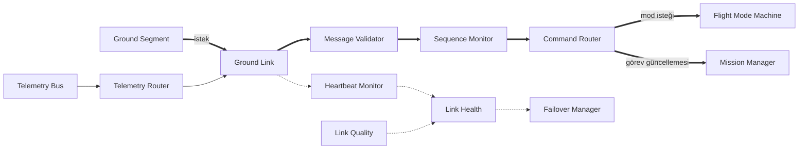
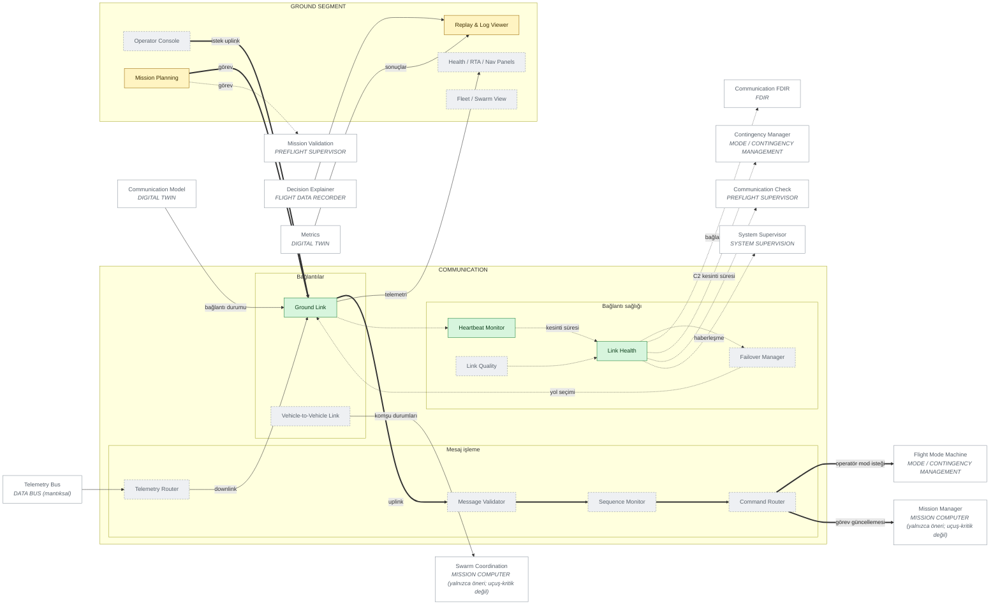

# 07 — COMMUNICATION ARCHITECTURE

> Sivil mühendislik referans mimarisi — yazılım/güvenlik/simülasyon düzeyi.
> Uçuşa hazır donanım, kablolama, ESC/motor ayarı ya da kontrol kazancı içermez.
> Ana belge: [15 — Master System Architecture](../15-sistem-mimarisi.md).
> Diyagram ve tablolar `python -m simurg.architecture --update-all` ile üretilir.

## Mesaj yolu

* Yer segmenti yalnızca İSTEK gönderir; mod değişimi Flight Mode Machine'in
  koruma koşullarına tabidir.
* Bugün modellenen: C2 var/yok + kesinti süresi (`simurg/sim/link.py`) ve
  haberleşme FDIR'i. Mesaj doğrulama, sıra izleme, bağlantı kalitesi ve
  failover PLANNED'dır.
* Kapsam dışı: gerçek radyo frekansları, şifreleme anahtarları, saldırı,
  karıştırma (jamming) ya da kaçınma (evasion) teknikleri.

## Diyagram

<!-- BEGIN GENERATED: view-communication -->

<!-- END GENERATED: view-communication -->

## Bileşen matrisi

<!-- BEGIN GENERATED: matrix-communication -->
#### GROUND SEGMENT

| Component | Responsibility | Inputs | Outputs | Health State | Failure Behaviour | Code Location | Implementation Status |
|---|---|---|---|---|---|---|---|
| **Operator Console** `GCS_OPERATOR` | Operatör görünümü ve komut girişi (yalnızca istek) | telemetri, olaylar | görev/mod isteği | NOMINAL/DEGRADED/FAILED/UNKNOWN | Konsol yok -> araç son geçerli görevde kalır; bağlantı kaybı kuralı işler | — | PLANNED |
| **Mission Planning** `GCS_MISSION_PLAN` | Görev ve geofence tanımı | operatör | görev profili | durumsuz (n/a) | Geçersiz görev uçuş öncesi denetimde reddedilir | `simurg/sim/scenario.py::MissionProfile` | PARTIAL — Senaryo dosyasıyla tanımlanır |
| **Health / RTA / Nav Panels** `GCS_HEALTH_VIEW` | Sağlık, RTA, nav bütünlüğü, enerji görünümü | telemetri | operatör uyarıları | durumsuz (n/a) | Görünüm yok -> karar araç üzerinde kalır | — | PLANNED |
| **Replay & Log Viewer** `GCS_REPLAY` | Kaydın zaman çizelgesi ve açıklaması | simurg.sim-log | zaman çizelgesi | durumsuz (n/a) | Bilinmeyen şema reddedilir | `simurg/sim/__main__.py::main` | PARTIAL — CLI: python -m simurg.sim replay |
| **Fleet / Swarm View** `GCS_FLEET` | Çoklu araç görünümü | telemetri | görünüm | durumsuz (n/a) | n/a | — | PLANNED |

#### COMMUNICATION

| Component | Responsibility | Inputs | Outputs | Health State | Failure Behaviour | Code Location | Implementation Status |
|---|---|---|---|---|---|---|---|
| **Ground Link** `CO_GROUND` | Yer bağlantısı soyutlaması (C2 var/yok) | uplink/downlink | mesajlar, bağlantı durumu | NOMINAL/DEGRADED/FAILED/UNKNOWN | Kayıp -> LINK_LOST olayı, 30 s sonra RETURN kuralı | `simurg/sim/link.py::LinkModel` | IMPLEMENTED |
| **Vehicle-to-Vehicle Link** `CO_V2V` | Araçlar arası mesajlaşma soyutlaması | mesajlar | komşu durumları | NOMINAL/DEGRADED/FAILED/UNKNOWN | Kayıp -> sürü koordinasyonu öneri üretmez | — | PLANNED |
| **Message Validator** `CO_MSG_VALID` | Şema/aralık denetimi | uplink | geçerli mesaj | NOMINAL/DEGRADED/FAILED/UNKNOWN | Geçersiz mesaj düşürülür ve olay üretilir | — | PLANNED |
| **Sequence Monitor** `CO_SEQ` | Sıra numarası / tekrar / kayıp denetimi | mesajlar | sıra durumu | NOMINAL/DEGRADED/FAILED/UNKNOWN | Tekrar/eski mesaj reddedilir | — | PLANNED |
| **Command Router** `CO_CMD_ROUTER` | Doğrulanmış yer isteklerini hedefe yönlendirme | geçerli mesaj | mod/görev isteği | NOMINAL/DEGRADED/FAILED/UNKNOWN | Yönlendirilemeyen istek uygulanmaz | — | PLANNED |
| **Telemetry Router** `CO_TLM_ROUTER` | Telemetrinin bağlantılara yönlendirilmesi | telemetri yolu | downlink | NOMINAL/DEGRADED/FAILED/UNKNOWN | Telemetri düşer; araç davranışı etkilenmez | — | PLANNED |
| **Heartbeat Monitor** `CO_HEARTBEAT` | Bağlantı yaşam sinyali ve kesinti süresi | bağlantı | kesinti süresi | NOMINAL/DEGRADED/FAILED/UNKNOWN | Kalp atışı yok -> kesinti zamanlayıcısı başlar | `simurg/sim/link.py::LinkModel` | IMPLEMENTED |
| **Link Quality** `CO_LINK_QUALITY` | Gecikme/kayıp ölçümü | bağlantı | kalite metriği | NOMINAL/DEGRADED/FAILED/UNKNOWN | Ölçüm yok -> kalite UNKNOWN | — | PLANNED |
| **Link Health** `CO_LINK_HEALTH` | C2 var/yok + kesinti süresi -> haberleşme FDIR | kalp atışı | bağlantı sağlığı | NOMINAL/DEGRADED/FAILED/UNKNOWN | C2 yok -> FAILED (iyimser varsayım yok) | `simurg/fdir/reports.py::communication_fdir` | IMPLEMENTED |
| **Failover Manager** `CO_FAILOVER` | Yedek bağlantıya geçiş | bağlantı sağlığı | yol seçimi | NOMINAL/DEGRADED/FAILED/UNKNOWN | Yedek yok -> bağlantı kaybı kuralı Yedeklilik: planlanan çift bağlantı. | — | PLANNED |
<!-- END GENERATED: matrix-communication -->
