# 08 — FAILURE / CONTINGENCY FLOW

> Sivil mühendislik referans mimarisi — yazılım/güvenlik/simülasyon düzeyi.
> Uçuşa hazır donanım, kablolama, ESC/motor ayarı ya da kontrol kazancı içermez.
> Ana belge: [15 — Master System Architecture](../15-sistem-mimarisi.md).
> Diyagram ve tablolar `python -m simurg.architecture --update-all` ile üretilir.

## Arıza zincirleri

Her zincir `FAULT → DETECTION → ISOLATION → DEGRADATION → CONTINGENCY →
EVENT / RECORD` aşamalarını gösterir; olay listesi adı geçen kütüphane
senaryosunda `tests/test_architecture.py` ile doğrulanır.

<!-- BEGIN GENERATED: failure-chains -->
**Sensor loss** — senaryo `nav_source_loss`: Kalan 3 kaynakla bütünlük korunur; görev tamamlanır

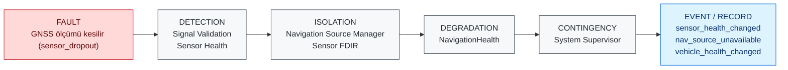

**Navigation loss** — senaryo `nav_integrity_loss`: LOITER_HOLD; bütünlük dönünce görev sürer

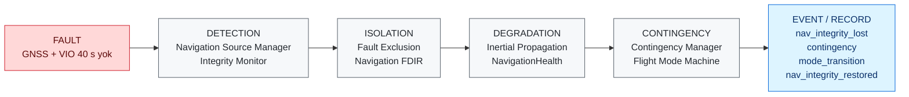

**FCC lane disagreement** — senaryo `fcc_lane_divergence`: B yalıtılır; A + C ile ikili mod; görev tamamlanır

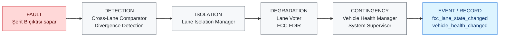

**FCC lane loss** — senaryo `fcc_lane_loss`: A FAILED; ikili mod; görev tamamlanır

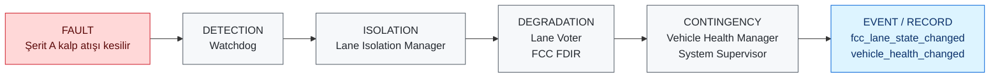

**Motor degradation** — senaryo `single_actuator_degradation`: Sağlık ağırlıklı dağıtım; görev tamamlanır

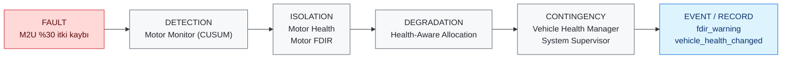

**Actuator failure** — senaryo `hover_capability_loss`: Hover yok -> EMERGENCY_LAND (süzülerek)

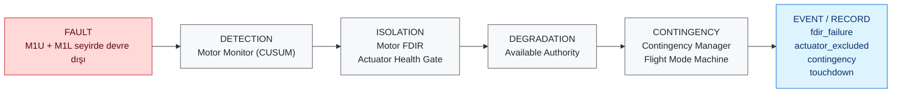

**Power degradation** — senaryo `energy_reserve_warning`: Görev iptali -> RETURN

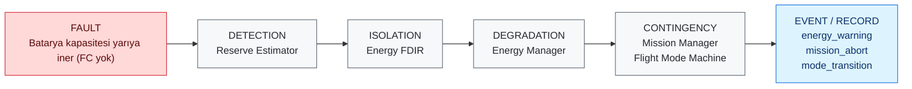

**Communication loss** — senaryo `communication_loss`: 30 s sonra RETURN

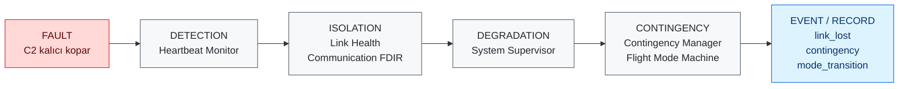

**Mission computer failure** — senaryo `mission_computer_failure`: Bayat öneri RTA'ya ulaşmaz; güvenlik kontrolcüsü; akış düzelince görev sürer

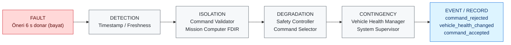

**RTA intervention** — senaryo `rta_intervention`: SC devralır; histerezis sonrası AC'ye dönüş; görev tamamlanır

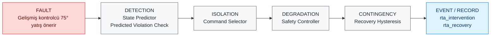
<!-- END GENERATED: failure-chains -->

## Contingency Manager

Girdiler: Vehicle Health, Navigation Integrity, Energy Status, Control
Authority, Communication Health, RTA State. Çıktı (`ContingencyDecision`):
**Recommended Safe Mode, Reason, Priority, Timestamp** + karar anındaki
girdi görüntüsü. Mod değişimi yalnızca Flight Mode Machine üzerinden
(koruma koşullarıyla) yapılır. Kural tablosu docs/08 §3 ile eşleşir; araç
sağlığı seviyesi ve RTA kilidi bugün kayıtlı girdidir, kural tetikleyicisi değil.

## Sistem durumu

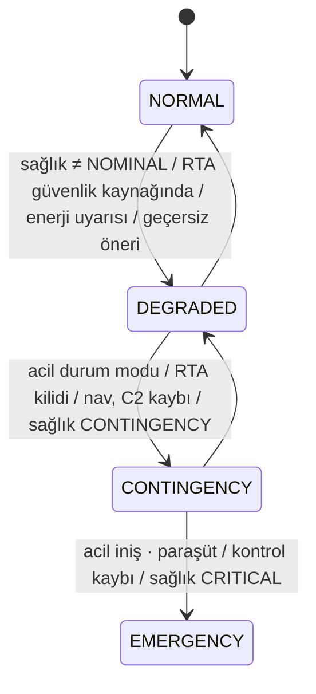

System Supervisor yalnızca değerlendirir; **eyleyici sürmez, mod değiştirmez**.

## Diyagram

<!-- BEGIN GENERATED: view-mode-supervision -->
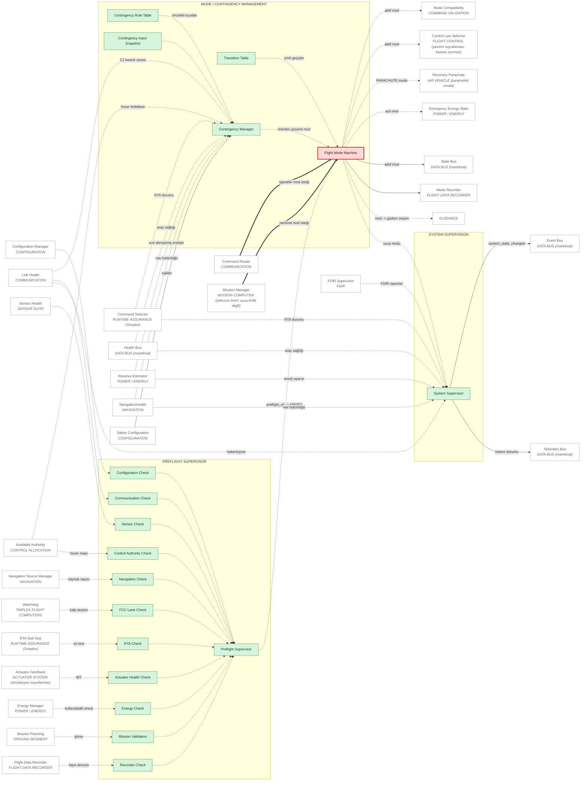
<!-- END GENERATED: view-mode-supervision -->

## Bileşen matrisi

<!-- BEGIN GENERATED: matrix-mode-supervision -->
#### MODE / CONTINGENCY MANAGEMENT

| Component | Responsibility | Inputs | Outputs | Health State | Failure Behaviour | Code Location | Implementation Status |
|---|---|---|---|---|---|---|---|
| **Flight Mode Machine** `MD_FSM` *(geçit)* | 13 mod; mod DEĞİŞİMİNİN TEK YOLU (yetki geçidi) | mod istekleri, bağlam | aktif mod, TransitionRecord | durumsuz (n/a) | Tablo dışı / koruması sağlanmayan istek reddedilir + MODE_REJECTED | `simurg/modes/flight_modes.py::FlightModeMachine` | IMPLEMENTED |
| **Transition Table** `MD_TABLE` | Geçiş + koruma koşulları (tek kaynak) | - | izinli geçişler | durumsuz (n/a) | PARACHUTE havada terminal | `simurg/modes/flight_modes.py::TRANSITIONS` | IMPLEMENTED |
| **Contingency Manager** `MD_CONTINGENCY` | Önerilen güvenli mod + gerekçe + öncelik + zaman | araç sağlığı, nav bütünlüğü, enerji, kontrol otoritesi, haberleşme, RTA | ContingencyDecision | durumsuz (n/a) | İstek FSM korumasına tabidir; reddedilirse alt kurala inilmez | `simurg/modes/flight_modes.py::ContingencyManager` | IMPLEMENTED — Sağlık seviyesi ve RTA kilidi kayıtlı girdi; kural tetikleyicisi değil |
| **Contingency Rule Table** `MD_RULES` | Öncelikli kurallar (docs/08 §3) | - | kurallar | durumsuz (n/a) | n/a | `simurg/modes/flight_modes.py::CONTINGENCY_RULES` | IMPLEMENTED |
| **Contingency Input Snapshot** `MD_INPUTS` | Kararla birlikte kaydedilen girdiler | Context | inputs | durumsuz (n/a) | n/a | `simurg/modes/flight_modes.py::CONTINGENCY_INPUTS` | IMPLEMENTED |

#### PREFLIGHT SUPERVISOR

| Component | Responsibility | Inputs | Outputs | Health State | Failure Behaviour | Code Location | Implementation Status |
|---|---|---|---|---|---|---|---|
| **Preflight Supervisor** `PRE_SUPERVISOR` | 11 kontrol; kritik başarısızlıkta ARMED yok | kontrol sonuçları | PreflightReport, preflight_ok | geçti/kaldı | Bilinmeyen durum geçmiş sayılmaz; PREFLIGHT_FAILED + kalkış yok | `simurg/sim/preflight.py::PreflightSupervisor` | IMPLEMENTED |
| **Configuration Check** `PF_CONFIG` | Uçuş öncesi: Configuration Check | ilgili alt sistem durumu | PreflightCheck | geçti/kaldı + gerekçe | Kritik: başarısızsa ARMED yok | `simurg/sim/preflight.py::CHECK_NAMES` | IMPLEMENTED |
| **Sensor Check** `PF_SENSOR` | Uçuş öncesi: Sensor Check | ilgili alt sistem durumu | PreflightCheck | geçti/kaldı + gerekçe | Kritik: başarısızsa ARMED yok | `simurg/sim/preflight.py::CHECK_NAMES` | IMPLEMENTED |
| **Navigation Check** `PF_NAV` | Uçuş öncesi: Navigation Check | ilgili alt sistem durumu | PreflightCheck | geçti/kaldı + gerekçe | Kritik: başarısızsa ARMED yok | `simurg/sim/preflight.py::CHECK_NAMES` | IMPLEMENTED |
| **FCC Lane Check** `PF_FCC` | Uçuş öncesi: FCC Lane Check | ilgili alt sistem durumu | PreflightCheck | geçti/kaldı + gerekçe | Kritik: başarısızsa ARMED yok | `simurg/sim/preflight.py::CHECK_NAMES` | IMPLEMENTED |
| **RTA Check** `PF_RTA` | Uçuş öncesi: RTA Check | ilgili alt sistem durumu | PreflightCheck | geçti/kaldı + gerekçe | Kritik: başarısızsa ARMED yok | `simurg/sim/preflight.py::CHECK_NAMES` | IMPLEMENTED |
| **Control Authority Check** `PF_CTRL` | Uçuş öncesi: Control Authority Check | ilgili alt sistem durumu | PreflightCheck | geçti/kaldı + gerekçe | Kritik: başarısızsa ARMED yok | `simurg/sim/preflight.py::CHECK_NAMES` | IMPLEMENTED |
| **Actuator Health Check** `PF_ACT` | Uçuş öncesi: Actuator Health Check | ilgili alt sistem durumu | PreflightCheck | geçti/kaldı + gerekçe | Kritik: başarısızsa ARMED yok | `simurg/sim/preflight.py::CHECK_NAMES` | IMPLEMENTED |
| **Energy Check** `PF_ENERGY` | Uçuş öncesi: Energy Check | ilgili alt sistem durumu | PreflightCheck | geçti/kaldı + gerekçe | Kritik: başarısızsa ARMED yok | `simurg/sim/preflight.py::CHECK_NAMES` | IMPLEMENTED |
| **Communication Check** `PF_COMM` | Uçuş öncesi: Communication Check | ilgili alt sistem durumu | PreflightCheck | geçti/kaldı + gerekçe | Kritik: başarısızsa ARMED yok | `simurg/sim/preflight.py::CHECK_NAMES` | IMPLEMENTED |
| **Mission Validation** `PF_MISSION` | Uçuş öncesi: Mission Validation | ilgili alt sistem durumu | PreflightCheck | geçti/kaldı + gerekçe | Kritik: başarısızsa ARMED yok | `simurg/sim/preflight.py::CHECK_NAMES` | IMPLEMENTED |
| **Recorder Check** `PF_REC` | Uçuş öncesi: Recorder Check | ilgili alt sistem durumu | PreflightCheck | geçti/kaldı + gerekçe | Kritik: başarısızsa ARMED yok | `simurg/sim/preflight.py::CHECK_NAMES` | IMPLEMENTED |

#### SYSTEM SUPERVISION

| Component | Responsibility | Inputs | Outputs | Health State | Failure Behaviour | Code Location | Implementation Status |
|---|---|---|---|---|---|---|---|
| **System Supervisor** `SUP_SYSTEM` | NORMAL/DEGRADED/CONTINGENCY/EMERGENCY; EYLEYİCİ SÜRMEZ | araç sağlığı, RTA, mod, nav, enerji, haberleşme, kontrol otoritesi, FDIR | SystemAssessment | sistem durumu | Yalnızca değerlendirir; değişim SYSTEM_STATE_CHANGED | `simurg/sim/supervisor.py::SystemSupervisor` | IMPLEMENTED |
<!-- END GENERATED: matrix-mode-supervision -->
