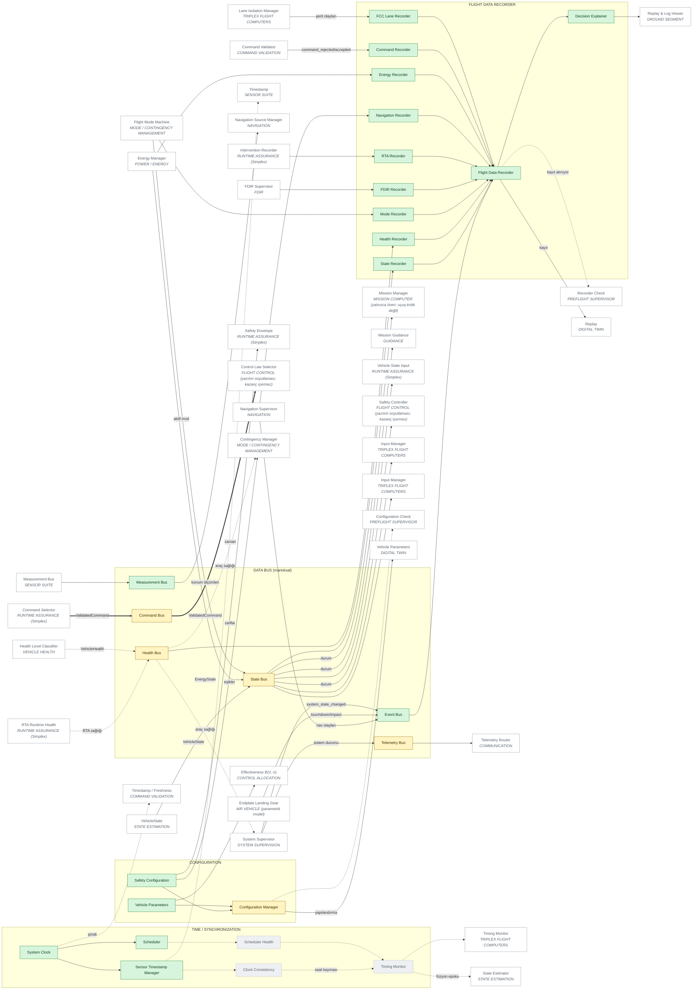

# 09 — TIME / DATA BUS / CONFIGURATION / FLIGHT DATA RECORDER

> Sivil mühendislik referans mimarisi — yazılım/güvenlik/simülasyon düzeyi.
> Uçuşa hazır donanım, kablolama, ESC/motor ayarı ya da kontrol kazancı içermez.
> Ana belge: [15 — Master System Architecture](../15-sistem-mimarisi.md).
> Diyagram ve tablolar `python -m simurg.architecture --update-all` ile üretilir.

* **Zaman:** sabit adımlı monoton simülasyon saati ve 14 adımlı tick sırası
  (`TICK_ORDER`); sensör zaman damgası + tazelik denetimi. Saat tutarlılığı,
  zamanlayıcı sağlığı ve şerit zamanlama izleme PLANNED.
* **Mantıksal veri yolları:** State, Measurement, Health, Command, Event,
  Telemetry. Event Bus senkron ve sıra numaralıdır (determinizm).
* **Yapılandırma:** güvenlik-kritik parametreler değişmezdir (frozen
  dataclass, testli); uçuş sırasında kontrolsüz değişiklik yapılamaz.
* **Flight Data Recorder:** kayıpsız olay kaydı + periyodik görüntü,
  sürümlü şema (`simurg.sim-log` v1). Mantıksal kanallar: state, health,
  mode, fdir, rta, navigation, energy, command, fcc, sensors, system, faults
  (`RECORDER_CHANNELS`; her olay türü bir kanala eşlidir — testli).

## Açıklanabilirlik soruları

| Soru | API |
|---|---|
| Why did RTA intervene? | `ReplaySession.why_rta_intervened()` |
| Why was Lane B isolated? | `ReplaySession.why_lane_isolated("B")` |
| Why did navigation become degraded? | `ReplaySession.why_nav_degraded()` |
| Why did mode change to RETURN? | `ReplaySession.why_mode("RETURN")` |
| Why was an actuator removed from allocation? | `ReplaySession.why_actuator_removed("M1U")` |
| Why was a command rejected? | `ReplaySession.why_command_rejected()` |

## Diyagram

<!-- BEGIN GENERATED: view-infrastructure -->

<!-- END GENERATED: view-infrastructure -->

## Bileşen matrisi

<!-- BEGIN GENERATED: matrix-infrastructure -->
#### TIME / SYNCHRONIZATION

| Component | Responsibility | Inputs | Outputs | Health State | Failure Behaviour | Code Location | Implementation Status |
|---|---|---|---|---|---|---|---|
| **System Clock** `TM_CLOCK` | Monoton simülasyon zamanı (sabit adım) | - | t | durumsuz (n/a) | Geri giden zaman yok (testli) | `simurg/sim/engine.py::SimulationEngine` | IMPLEMENTED |
| **Sensor Timestamp Manager** `TM_SENSOR_TS` | Ölçümlere zaman damgası + tazelik | ölçümler | zaman damgalı ölçümler | durumsuz (n/a) | Gelecek/bayat damga -> STALE | `simurg/core/types.py::SensorMeasurement` `simurg/sensing/pipeline.py::SensorChannel` | IMPLEMENTED |
| **Clock Consistency** `TM_CONSISTENCY` | Şerit/sensör saat tutarlılığı | zaman damgaları | saat kayması | NOMINAL/DEGRADED/FAILED/UNKNOWN | Planlanan | — | PLANNED |
| **Scheduler** `TM_SCHEDULER` | Sabit 14 adımlı tick sırası | - | TICK_ORDER | durumsuz (n/a) | Sıra sabit ve testli | `simurg/sim/engine.py::TICK_ORDER` | IMPLEMENTED |
| **Scheduler Health** `TM_SCHED_HEALTH` | Çevrim süresi/son tarih izleme | çizelge | zamanlama ihlali | NOMINAL/DEGRADED/FAILED/UNKNOWN | Planlanan (simülasyon gerçek zamanlı değil) | — | PLANNED |
| **Timing Monitor** `TM_TIMING_MON` | Şerit ve füzyon zamanlama izleme | zaman damgaları | zamanlama sağlığı | NOMINAL/DEGRADED/FAILED/UNKNOWN | Planlanan | — | PLANNED |

#### DATA BUS (mantıksal)

| Component | Responsibility | Inputs | Outputs | Health State | Failure Behaviour | Code Location | Implementation Status |
|---|---|---|---|---|---|---|---|
| **State Bus** `BUS_STATE` | VehicleState / NavigationSolution dağıtımı | yayıncılar | aboneler | durumsuz (n/a) | n/a | `simurg/core/types.py::VehicleState` | PARTIAL — Mantıksal kanal; süreç içi nesne geçişi |
| **Measurement Bus** `BUS_MEAS` | Doğrulanmış ölçümler | yayıncılar | aboneler | durumsuz (n/a) | n/a | `simurg/sensing/pipeline.py::MeasurementBus` | IMPLEMENTED |
| **Health Bus** `BUS_HEALTH` | FdirReport / VehicleHealth | yayıncılar | aboneler | durumsuz (n/a) | n/a | `simurg/fdir/vehicle_health.py::VehicleHealth` | PARTIAL — Mantıksal kanal; süreç içi nesne geçişi |
| **Command Bus** `BUS_COMMAND` | ValidatedCommand -> kontrol | yayıncılar | aboneler | durumsuz (n/a) | n/a | `simurg/sim/vehicle_control.py::ControlInputs` | PARTIAL — Mantıksal kanal; süreç içi nesne geçişi |
| **Event Bus** `BUS_EVENT` | Senkron, sıralı olay yayını | yayıncılar | aboneler | durumsuz (n/a) | Senkron: abone hatası yutulmaz, yukarı fırlatılır | `simurg/core/events.py::EventBus` | IMPLEMENTED |
| **Telemetry Bus** `BUS_TLM` | Telemetri ve özet durum | yayıncılar | aboneler | durumsuz (n/a) | n/a | `simurg/sim/recorder.py::SimulationRecorder` | PARTIAL — Mantıksal kanal; süreç içi nesne geçişi |

#### CONFIGURATION

| Component | Responsibility | Inputs | Outputs | Health State | Failure Behaviour | Code Location | Implementation Status |
|---|---|---|---|---|---|---|---|
| **Configuration Manager** `CFG_MANAGER` | Değişmez (frozen) yapılandırmaların sağlanması | senaryo | yapılandırmalar | geçersiz -> ConfigurationError | Uçuşta güvenlik parametresi değiştirilemez (frozen, testli) | `simurg/core/config.py::VehicleConfig` | PARTIAL — Dağıtık dataclass'lar |
| **Safety Configuration** `CFG_SAFETY` | Güvenlik eşikleri | - | SafetyConfig | durumsuz (n/a) | Tutarsızlık -> uçuş öncesi RTA kontrolü | `simurg/core/config.py::SafetyConfig` | IMPLEMENTED |
| **Vehicle Parameters** `CFG_VEHICLE` | Kütle, atalet, eyleyiciler | - | VehicleConfig | durumsuz (n/a) | Geçersiz -> ConfigurationError | `simurg/core/config.py::VehicleConfig` | IMPLEMENTED |

#### FLIGHT DATA RECORDER

| Component | Responsibility | Inputs | Outputs | Health State | Failure Behaviour | Code Location | Implementation Status |
|---|---|---|---|---|---|---|---|
| **Flight Data Recorder** `FDR_CORE` | Kayıpsız olay + periyodik görüntü; sürümlü şema | olay yolu, durum | simurg.sim-log v1 | durumsuz (n/a) | Bilinmeyen şema reddedilir; uçuş öncesi kayıt kontrolü | `simurg/sim/recorder.py::SimulationRecorder` | IMPLEMENTED |
| **State Recorder** `FDR_STATE` | Mantıksal kayıt kanalı: state | kayıt | kanal geçmişi | durumsuz (n/a) | Kanal tek kaydın görünümüdür (sıra korunur) | `simurg/sim/recorder.py::RECORDER_CHANNELS` | IMPLEMENTED |
| **Health Recorder** `FDR_HEALTH` | Mantıksal kayıt kanalı: health | kayıt | kanal geçmişi | durumsuz (n/a) | Kanal tek kaydın görünümüdür (sıra korunur) | `simurg/sim/recorder.py::RECORDER_CHANNELS` | IMPLEMENTED |
| **Mode Recorder** `FDR_MODE` | Mantıksal kayıt kanalı: mode | kayıt | kanal geçmişi | durumsuz (n/a) | Kanal tek kaydın görünümüdür (sıra korunur) | `simurg/sim/recorder.py::RECORDER_CHANNELS` | IMPLEMENTED |
| **FDIR Recorder** `FDR_FDIR` | Mantıksal kayıt kanalı: fdir | kayıt | kanal geçmişi | durumsuz (n/a) | Kanal tek kaydın görünümüdür (sıra korunur) | `simurg/sim/recorder.py::RECORDER_CHANNELS` | IMPLEMENTED |
| **RTA Recorder** `FDR_RTA` | Mantıksal kayıt kanalı: rta | kayıt | kanal geçmişi | durumsuz (n/a) | Kanal tek kaydın görünümüdür (sıra korunur) | `simurg/sim/recorder.py::RECORDER_CHANNELS` | IMPLEMENTED |
| **Navigation Recorder** `FDR_NAV` | Mantıksal kayıt kanalı: navigation | kayıt | kanal geçmişi | durumsuz (n/a) | Kanal tek kaydın görünümüdür (sıra korunur) | `simurg/sim/recorder.py::RECORDER_CHANNELS` | IMPLEMENTED |
| **Energy Recorder** `FDR_ENERGY` | Mantıksal kayıt kanalı: energy | kayıt | kanal geçmişi | durumsuz (n/a) | Kanal tek kaydın görünümüdür (sıra korunur) | `simurg/sim/recorder.py::RECORDER_CHANNELS` | IMPLEMENTED |
| **Command Recorder** `FDR_CMD` | Mantıksal kayıt kanalı: command | kayıt | kanal geçmişi | durumsuz (n/a) | Kanal tek kaydın görünümüdür (sıra korunur) | `simurg/sim/recorder.py::RECORDER_CHANNELS` | IMPLEMENTED |
| **FCC Lane Recorder** `FDR_FCC` | Mantıksal kayıt kanalı: fcc | kayıt | kanal geçmişi | durumsuz (n/a) | Kanal tek kaydın görünümüdür (sıra korunur) | `simurg/sim/recorder.py::RECORDER_CHANNELS` | IMPLEMENTED |
| **Decision Explainer** `FDR_EXPLAIN` | Neden RTA? neden şerit B? neden RETURN? neden dağıtım dışı? | kayıt | why_* yanıtları | durumsuz (n/a) | Gerekçesiz güvenlik olayı test tarafından reddedilir | `simurg/sim/replay.py::ReplaySession` | IMPLEMENTED |
<!-- END GENERATED: matrix-infrastructure -->
