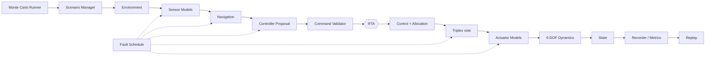
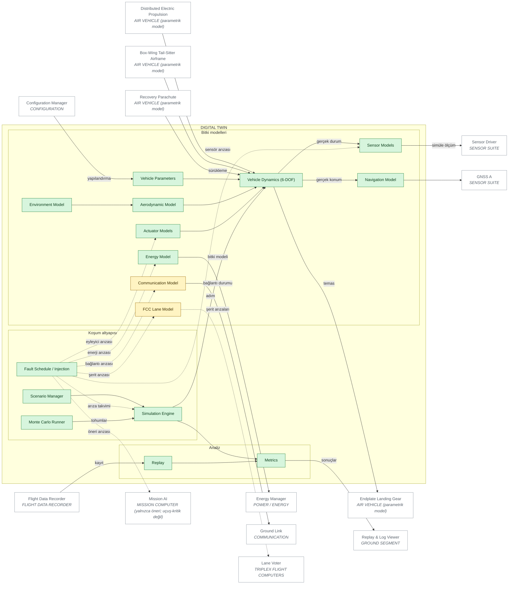

# 10 — DIGITAL TWIN ARCHITECTURE

> Sivil mühendislik referans mimarisi — yazılım/güvenlik/simülasyon düzeyi.
> Uçuşa hazır donanım, kablolama, ESC/motor ayarı ya da kontrol kazancı içermez.
> Ana belge: [15 — Master System Architecture](../15-sistem-mimarisi.md).
> Diyagram ve tablolar `python -m simurg.architecture --update-all` ile üretilir.

## Koşum zinciri (korunan)

Dijital ikiz aynı güvenlik mimarisini (validator, RTA, FDIR, Vehicle Health,
mod/acil durum, sistem denetimi) simülasyonda koşturur.

## Desteklenen yazılım arıza enjeksiyonu

| Arıza | FaultKind | Örnek senaryo |
|---|---|---|
| sensor unavailable | `sensor_dropout` | `nav_source_loss` |
| navigation degraded | `sensor_bias`, `sensor_noise` | `combined_degraded` |
| motor degraded | `actuator_degraded` | `single_actuator_degradation` |
| actuator unavailable | `actuator_offline`, `actuator_stuck` | `hover_capability_loss` |
| communication lost | `link_loss` | `communication_loss` |
| energy degraded | `energy_fc_degraded`, `energy_battery_fade`, `energy_power_limit` | `energy_reserve_warning` |
| FCC lane unavailable / divergent | `fcc_lane_unavailable`, `fcc_lane_divergence` | `fcc_lane_loss`, `fcc_lane_divergence` |
| mission computer failure | `controller_fault` (`mode: stale`) | `mission_computer_failure` |

> **Simülasyon gerçek fiziksel uçuşa elverişliliğin (flightworthiness)
> kanıtı değildir.** Aero katsayıları sentetiktir, eyleyici/sensör modelleri
> basitleştirilmiştir ve şeritler kopya hesaptır (docs/14 §12).

## Diyagram

<!-- BEGIN GENERATED: view-digital-twin -->

<!-- END GENERATED: view-digital-twin -->

## Bileşen matrisi

<!-- BEGIN GENERATED: matrix-digital-twin -->
#### DIGITAL TWIN

| Component | Responsibility | Inputs | Outputs | Health State | Failure Behaviour | Code Location | Implementation Status |
|---|---|---|---|---|---|---|---|
| **Scenario Manager** `DT_SCENARIO` | Scenario Manager (simülasyon; uçuşa elverişlilik kanıtı değildir) | senaryo/yapılandırma | simülasyon çıktısı | durumsuz (n/a) | Geçersiz senaryo hiç koşturulmaz | `simurg/sim/scenarios.py::SCENARIOS` | IMPLEMENTED |
| **Simulation Engine** `DT_ENGINE` | Simulation Engine (simülasyon; uçuşa elverişlilik kanıtı değildir) | senaryo/yapılandırma | simülasyon çıktısı | durumsuz (n/a) | Sayısal hata -> sim_failed + SimulationError | `simurg/sim/engine.py::SimulationEngine` | IMPLEMENTED |
| **Fault Schedule / Injection** `DT_FAULTS` | Fault Schedule / Injection (simülasyon; uçuşa elverişlilik kanıtı değildir) | senaryo/yapılandırma | simülasyon çıktısı | durumsuz (n/a) | Geçersiz arıza hedefi senaryoyu reddeder | `simurg/sim/faults.py::FaultInjector` | IMPLEMENTED |
| **Monte Carlo Runner** `DT_MC` | Monte Carlo Runner (simülasyon; uçuşa elverişlilik kanıtı değildir) | senaryo/yapılandırma | simülasyon çıktısı | durumsuz (n/a) | Tohumla yeniden üretilebilir | `simurg/sim/montecarlo.py::MonteCarloRunner` | IMPLEMENTED |
| **Environment Model** `DT_ENV` | Environment Model (simülasyon; uçuşa elverişlilik kanıtı değildir) | senaryo/yapılandırma | simülasyon çıktısı | durumsuz (n/a) | n/a | `simurg/sim/environment.py::ConstantEnvironment` | IMPLEMENTED |
| **Vehicle Parameters** `DT_PARAMS` | Vehicle Parameters (simülasyon; uçuşa elverişlilik kanıtı değildir) | senaryo/yapılandırma | simülasyon çıktısı | durumsuz (n/a) | n/a | `simurg/core/config.py::VehicleConfig` | IMPLEMENTED |
| **Sensor Models** `DT_SENSORS` | Sensor Models (simülasyon; uçuşa elverişlilik kanıtı değildir) | senaryo/yapılandırma | simülasyon çıktısı | durumsuz (n/a) | n/a | `simurg/sim/sensors.py::SensorModel` | IMPLEMENTED |
| **Navigation Model** `DT_NAVMODEL` | Navigation Model (simülasyon; uçuşa elverişlilik kanıtı değildir) | senaryo/yapılandırma | simülasyon çıktısı | durumsuz (n/a) | n/a | `simurg/sim/sensors.py::SimulatedPositionProvider` | IMPLEMENTED |
| **Energy Model** `DT_ENERGY` | Energy Model (simülasyon; uçuşa elverişlilik kanıtı değildir) | senaryo/yapılandırma | simülasyon çıktısı | durumsuz (n/a) | n/a | `simurg/power/energy_manager.py::EnergyManager` | IMPLEMENTED |
| **Actuator Models** `DT_ACTUATORS` | Actuator Models (simülasyon; uçuşa elverişlilik kanıtı değildir) | senaryo/yapılandırma | simülasyon çıktısı | durumsuz (n/a) | n/a | `simurg/sim/actuators.py::ActuatorModel` | IMPLEMENTED |
| **Communication Model** `DT_COMMS` | Communication Model (simülasyon; uçuşa elverişlilik kanıtı değildir) | senaryo/yapılandırma | simülasyon çıktısı | durumsuz (n/a) | Yalnızca var/yok | `simurg/sim/link.py::LinkModel` | PARTIAL |
| **FCC Lane Model** `DT_FCCMODEL` | FCC Lane Model (simülasyon; uçuşa elverişlilik kanıtı değildir) | senaryo/yapılandırma | simülasyon çıktısı | durumsuz (n/a) | Şeritler kopya; ortak mod hatası gösterilemez | `simurg/sim/triplex.py::TriplexFlightComputer` | PARTIAL |
| **Aerodynamic Model** `DT_AERO` | Aerodynamic Model (simülasyon; uçuşa elverişlilik kanıtı değildir) | senaryo/yapılandırma | simülasyon çıktısı | durumsuz (n/a) | Sentetik katsayılar | `simurg/aero/model.py::AnalyticAeroModel` `simurg/aero/model.py::TableAeroModel` | IMPLEMENTED |
| **Vehicle Dynamics (6-DOF)** `DT_DYN` | Vehicle Dynamics (6-DOF) (simülasyon; uçuşa elverişlilik kanıtı değildir) | senaryo/yapılandırma | simülasyon çıktısı | durumsuz (n/a) | Sonlu olmayan durum -> SimulationError | `simurg/sim/dynamics.py::RigidBodyDynamics` | IMPLEMENTED |
| **Metrics** `DT_METRICS` | Metrics (simülasyon; uçuşa elverişlilik kanıtı değildir) | senaryo/yapılandırma | simülasyon çıktısı | durumsuz (n/a) | n/a | `simurg/sim/metrics.py::compute_metrics` | IMPLEMENTED |
| **Replay** `DT_REPLAY` | Replay (simülasyon; uçuşa elverişlilik kanıtı değildir) | senaryo/yapılandırma | simülasyon çıktısı | durumsuz (n/a) | n/a | `simurg/sim/replay.py::ReplaySession` | IMPLEMENTED |
<!-- END GENERATED: matrix-digital-twin -->
