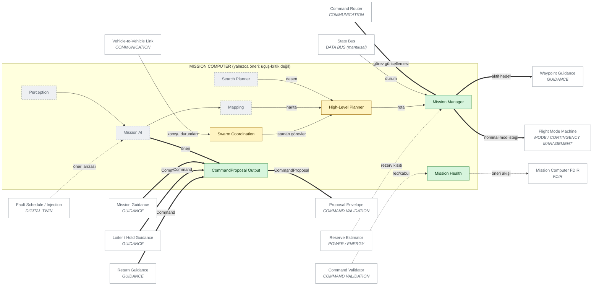

# 11 — MISSION COMPUTER (öneri katmanı)

> Sivil mühendislik referans mimarisi — yazılım/güvenlik/simülasyon düzeyi.
> Uçuşa hazır donanım, kablolama, ESC/motor ayarı ya da kontrol kazancı içermez.
> Ana belge: [15 — Master System Architecture](../15-sistem-mimarisi.md).
> Diyagram ve tablolar `python -m simurg.architecture --update-all` ile üretilir.

Görev bilgisayarı **uçuş-kritik değildir**. Mission Manager, High-Level
Planner, Search Planner, Perception, Mission AI, Mapping, Swarm Coordination
ve Mission Health bloklarının tek çıkışı `CommandProposal`'dır (ve Flight
Mode Machine'e mod İSTEĞİ). AI → eyleyici doğrudan yolu yoktur; bu,
mimari kayıtta yetki yolu taramasıyla (`test_architecture`) ve kodda içe
aktarma taramasıyla (`test_safety_invariants`) zorlanır.

Görev bilgisayarı sağlığı öneri akışından gözlenir: geçersiz/bayat öneri →
DEGRADED; 3 s'den uzun sürerse FAILED → araç sağlığı CONTINGENCY. Bu sürede
RTA yalnızca güvenlik kontrolcüsünü doğrular (`mission_computer_failure`
senaryosu).

Kapsam: arama-kurtarma, afet gözlemi, çevre izleme, altyapı denetimi.
Hedef takibi, insan/araç takibi ya da yük bırakma yoktur.

## Diyagram

<!-- BEGIN GENERATED: view-mission-computer -->

<!-- END GENERATED: view-mission-computer -->

## Bileşen matrisi

<!-- BEGIN GENERATED: matrix-mission-computer -->
#### MISSION COMPUTER (yalnızca öneri; uçuş-kritik değil)

| Component | Responsibility | Inputs | Outputs | Health State | Failure Behaviour | Code Location | Implementation Status |
|---|---|---|---|---|---|---|---|
| **Mission Manager** `MC_MISSION_MGR` *(öneri)* | Görev ilerleyişi; nominal mod İSTEĞİ (FSM'e) | durum, enerji rezervi, nav bütünlüğü | mod isteği, hedef | durumsuz (n/a) | Arıza/hatalı çıktı -> öneri doğrulayıcıda reddedilir; uçuş güvenliği RTA + güvenlik kontrolcüsünde | `simurg/sim/mission.py::MissionManager` | IMPLEMENTED |
| **High-Level Planner** `MC_PLANNER` *(öneri)* | Görev hedeflerinden ara nokta rotası | görev | ara noktalar | durumsuz (n/a) | Arıza/hatalı çıktı -> öneri doğrulayıcıda reddedilir; uçuş güvenliği RTA + güvenlik kontrolcüsünde | `simurg/sim/scenario.py::MissionProfile` | PARTIAL — Rota senaryoda sabit; planlayıcı yok |
| **Search Planner** `MC_SEARCH` *(öneri)* | Arama-tarama deseni (şerit/spiral) | arama alanı | ara noktalar | durumsuz (n/a) | Arıza/hatalı çıktı -> öneri doğrulayıcıda reddedilir; uçuş güvenliği RTA + güvenlik kontrolcüsünde | — | PLANNED |
| **Perception** `MC_PERCEPTION` *(öneri)* | Gözlem verisinden olay çıkarımı (sivil gözlem) | kamera | algı olayları | NOMINAL/DEGRADED/FAILED/UNKNOWN | Arıza/hatalı çıktı -> öneri doğrulayıcıda reddedilir; uçuş güvenliği RTA + güvenlik kontrolcüsünde | — | PLANNED |
| **Mission AI** `MC_AI` *(öneri)* | YZ çıkarımı -> yalnızca öneri | algı, durum | öneri | NOMINAL/DEGRADED/FAILED/UNKNOWN | Arıza/hatalı çıktı -> öneri doğrulayıcıda reddedilir; uçuş güvenliği RTA + güvenlik kontrolcüsünde | — | PLANNED |
| **Mapping** `MC_MAPPING` *(öneri)* | Görev haritası | algı + konum | harita | durumsuz (n/a) | Arıza/hatalı çıktı -> öneri doğrulayıcıda reddedilir; uçuş güvenliği RTA + güvenlik kontrolcüsünde | — | PLANNED |
| **Swarm Coordination** `MC_SWARM` *(öneri)* | Enerji farkındalıklı görev dağıtımı (CBBA referansı) | ajanlar, görevler | görev ataması | durumsuz (n/a) | Arıza/hatalı çıktı -> öneri doğrulayıcıda reddedilir; uçuş güvenliği RTA + güvenlik kontrolcüsünde | `simurg/swarm/auction.py::allocate` | PARTIAL — Simülasyon motoruna bağlı değil |
| **CommandProposal Output** `MC_PROPOSAL` *(öneri)* | Tek çıkış: zaman damgalı, kaynaklı öneri zarfı | güdüm çıktısı | CommandProposal | durumsuz (n/a) | Bayat/geçersiz zarf doğrulayıcıda reddedilir | `simurg/safety/command_validator.py::CommandProposal` | IMPLEMENTED |
| **Mission Health** `MC_HEALTH` *(öneri)* | Görev bilgisayarı sağlığı (öneri akışı geçerliliği) | doğrulayıcı sonuçları | görev bilg. sağlığı | NOMINAL/DEGRADED/FAILED/UNKNOWN | Kalıcı geçersiz öneri (>3 s) -> FAILED -> CONTINGENCY | `simurg/fdir/reports.py::mission_computer_fdir` | IMPLEMENTED |
<!-- END GENERATED: matrix-mission-computer -->
